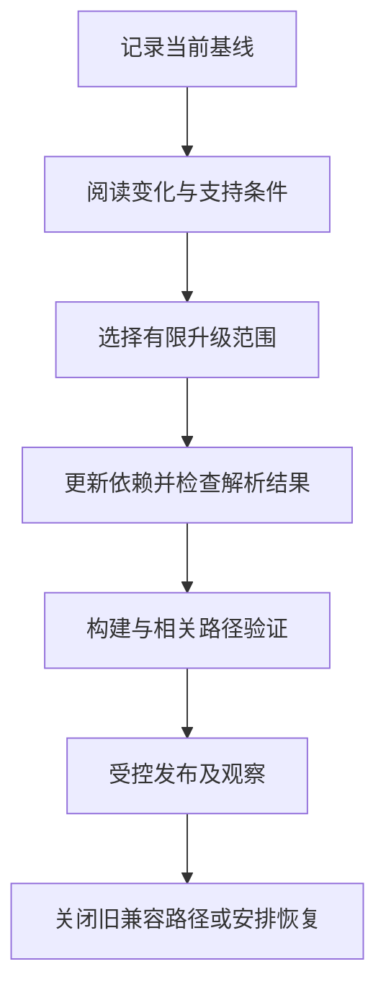

# 依赖升级、弃用与兼容

> 本文面向维护依赖、公开接口和数据迁移的开发者。读完能区分多种兼容关系，设计新旧版本并存窗口，并用可复核证据决定升级、弃用与移除。

## 升级改变一组相互依赖的条件

**升级**（upgrade）可以改变库、框架、运行时、操作系统、数据库或外部服务契约。版本号是识别入口，实际影响取决于 API、行为、数据和运行条件。

虚构的报表系统升级导出库。函数名没有改变，但日期默认格式、空值表现和排序方式改变；开发环境构建成功，用户导入旧模板却失败。源码兼容不足以说明业务兼容，必须检查真正被依赖的行为。

**兼容性**（compatibility）是一种有方向、有范围的关系。新程序能读旧数据，不代表旧程序能读新数据；新服务接受旧客户端，不代表新客户端能调用旧服务。“兼容”应明确双方版本、操作和前提。

| 兼容维度 | 需要核对的关系 | 典型遗漏 |
| --- | --- | --- |
| 源码与类型 | 旧调用能否编译或检查 | 名称保留但参数语义变化 |
| 协议与 API | 请求、响应、错误与顺序 | 新增枚举导致旧客户端失败 |
| 行为 | 默认值、排序、时间和边界 | 修复旧行为后影响依赖者 |
| 数据 | 格式、字段、编码和约束 | 旧程序无法读取新写入 |
| 运行环境 | 运行时、平台及扩展支持 | 本地可运行，生产缺少能力 |
| 运维接口 | 参数、指标、配置和工具 | 业务正常，监控或备份失效 |

表格可以作为影响分析入口，具体检查强度仍取决于变更风险。低影响补丁无需重新验证整个组织的所有系统，但关键路径和已知变化不能省略。

## 版本约定提供线索，不提供全部证明

SemVer 以声明的公共 API 为前提，描述主、次、修订版本及弃用标识的变化规则。版本 0、预发布和普通稳定版本的承诺不同。[SemVer 2.0.0](https://semver.org/)

遵守约定的补丁通常降低兼容风险，但不能代替发布说明和项目验证。供应方可能修复被使用方依赖的旧行为，也可能存在未发现回归。外部服务还可能独立更新，不能只看本地包版本。

**传递依赖**（transitive dependency）由直接依赖引入。升级一个框架可能改变多个底层库；只查看顶层版本会遗漏影响。应核对声明、锁文件、解析结果与制品，阅读关键依赖的变更说明。

升级工具自动生成的变更也需要审查：版本范围是否扩大，安装脚本是否变化，许可与运行条件是否改变，锁文件是否引入意外的新版本。供应链侧核验见 [软件供应链](/software/security/supply-chain)，基础机制见 [依赖与锁文件](/software/toolchain/dependencies-lockfiles)。

## 从当前基线出发做升级

先记录当前源码、锁文件、构建工具、制品、配置和迁移状态，确认核心路径可验证。若升级前已有失败，应区分旧问题和升级引入的问题，避免误判因果。

可以把基础设施版本、依赖升级和业务功能分开组织，使回归易于归因；存在必须一起改变的契约时，应说明关联。一次升级所有组件可能节省表面操作，却扩大不确定性和恢复范围。

验证应包括变化涉及的行为与重要旧路径。导出库升级可以核对代表性文件内容、日期、编码、空值和读取方；数据库升级需要核对查询、扩展、管理工具和恢复；运行时升级还可能影响资源、并发和性能。

比较结果时说明口径。输出文件字节不同可能来自元数据时间，业务数据仍相同；排序改变可能是合法行为，也可能破坏外部模板。应按契约分类差异，而不是一律忽略或一律判失败。

## 数据升级与程序升级不是同一步

PostgreSQL 官方文档明确指出主版本内部存储格式可能变化，升级方式包括逻辑导出恢复、专用升级工具或复制等，并要求阅读迁移说明和验证客户端。[PostgreSQL 升级](https://www.postgresql.org/docs/current/upgrading.html)

该事实说明不能把数据库替换为新二进制当作通用升级方法；具体版本组合、扩展和工具约束应查对应文档。本文没有执行数据库升级，也没有提供可直接套用的生产命令。

应用数据结构常用**扩展—迁移—收缩**方式建立兼容窗口：先增加可兼容结构，再迁移数据与调用方，最后删除旧结构。例如字段从单一名称拆为两个部分，先保留旧字段和新字段，定义写入权威与映射，再确认消费者迁移，最后移除。

兼容窗口必须说明哪些新旧组合允许存在。多个程序版本共同写入时，可能出现旧字段更新而新字段未更新；双写失败也可能分化。需要确定写入责任、补齐机制和校验。仅增加可空字段，不保证所有旧代码都能处理。

数据迁移还需考虑历史异常、重跑、进度记录和中断恢复。校验不只数行数，应检查关键字段、关系、不变量和业务汇总。破坏性操作前的恢复方案必须按允许条件验证；备份文件存在不等于已证明可恢复。

## 弃用让使用方有明确迁移路径

**弃用**（deprecation）声明某能力不宜继续采用，并准备在明确条件下移除。它通常仍保留一段使用期，不能与“已经删除”混淆。应提供替代方式、影响范围、时间或版本条件以及迁移帮助。

Kubernetes 的官方政策分别讨论 API、命令行、行为和指标，并区分服务 API 版本与存储版本的兼容。这说明同一产品中的不同对象也可能有不同移除规则，不能从一个 API 的承诺推断全部接口。[Kubernetes 弃用政策](https://kubernetes.io/docs/reference/deprecation-policy/)

| 阶段 | 需要完成的工作 | 可核对依据 |
| --- | --- | --- |
| 宣布弃用 | 标记旧能力、替代方式和期限 | 文档、警告与变更说明 |
| 识别使用 | 找到消费者与调用范围 | 配置、代码、日志及使用方确认 |
| 迁移 | 支持新旧共存并处理差异 | 迁移记录与兼容用例 |
| 评估移除 | 核对剩余使用和支持义务 | 覆盖说明、未迁移清单与决定 |
| 移除 | 删除实现和旧配置，更新观察 | 实际版本与发布后检查 |

运行日志没有出现旧调用，只能说明被观察时间内没有记录；季节性任务、离线客户端和未接入观察的入口仍可能存在。期限应依据实际使用周期与承诺，不能把某个产品的期限复制给所有项目。

## 恢复方向需要单独验证

升级失败后的选择可能是回滚程序、回滚配置、恢复数据或前向修复。新程序写入新格式后，旧程序可能无法运行，直接回滚制品会扩大故障。应事先定义停止条件、允许旧新组合和恢复动作。

小批量发布与观察能降低部分风险，但不能覆盖所有数据状态。对低频入口，可以在发布前构造代表性用例；对不可逆数据变化，应采用分阶段方案并保留校验与处理记录。发布基线关系见 [标签、版本与配置基线](/software/collaboration/tags-versions-baselines)。

## 升级维护的边界

常见失败包括只改版本号、跳过中间重大变化说明、忽略传递依赖、把测试环境成功当作全范围成功，以及删除旧接口后才寻找消费者。长期不升级也会累积支持和兼容成本，应定期了解支持期限与项目约束。

升级节奏应按风险、支持义务和恢复能力安排。自动化可以降低重复操作，仍需要真实差异、契约和运行证据。清楚说明兼容方向及尚未验证条件，比一句“升级无影响”更有用。

## 实例：枚举新增为何影响旧客户端

服务增加“处理中”状态，响应结构没有删除字段，却可能让只接受成功与失败的旧客户端解析报错。应核对客户端如何处理未知值，明确旧版本允许的响应及迁移方案。必要时按契约版本提供不同表示，而不能只依据字段数量宣布兼容。

升级用例可以覆盖旧客户端读取新服务，以及新客户端读取旧服务的允许组合。若某组合不受支持，应在发布和运行安排中排除它。兼容矩阵因此是部署约束的一部分，需要与实际版本并存情况核对。

## 参考资料

<Refs>

- [SemVer 2.0.0](https://semver.org/)、[Kubernetes Deprecation Policy](https://kubernetes.io/docs/reference/deprecation-policy/)、[PostgreSQL：Upgrading a Cluster](https://www.postgresql.org/docs/current/upgrading.html)；访问日期：2026-10-03。
- [语言、框架与依赖](/software/guide/languages-frameworks-dependencies)：认识依赖的作用。
- [ORM 与迁移](/software/data/orm-migrations)、[验收与回归](/software/quality/acceptance-regression)：验证结构与行为变化。
- [停用、数据迁移与可持续性](/software/maintenance/retirement-sustainability)：能力整体退出。

</Refs>
