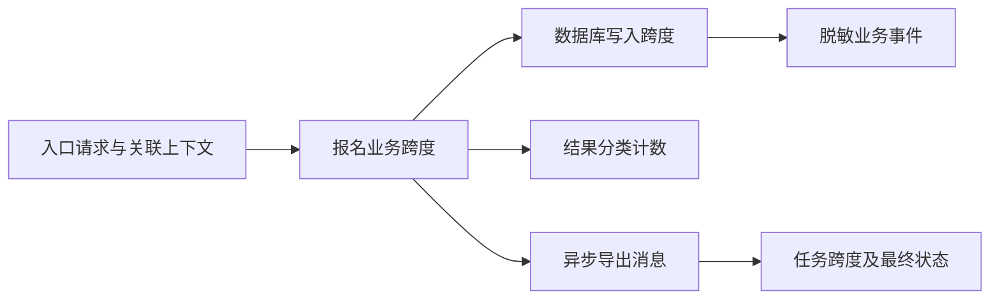

# 应用指标、日志与追踪埋点

> 面向为应用增加运行证据的开发者和维护者。读完能按业务问题设计指标、日志与追踪，控制基数和敏感数据，并验证信号在故障时仍然有解释力。

## 从需要回答的问题开始

**可观测性**是根据系统输出理解内部状态的能力。**埋点**是有目的地记录事件、耗时与状态。把框架自动日志接入平台只是起点；如果没有定义好事件，维护者仍无法判断报名是否按规则完成。

**指标**汇总数量、耗时和状态，适合发现趋势与告警；**日志**记录离散事件及上下文，适合解释一次操作；**追踪**把一次工作跨组件的活动连起来。OpenTelemetry 用不同信号表达这些信息。[Signals](https://opentelemetry.io/docs/concepts/signals/) 它提供采集与传递能力，不是业务规则判定器，也不自动成为长期存储平台。

先列排障问题：失败从何时开始，影响哪些旅程和版本，在哪一段等待，数据是否正确，重试是否重复。根据问题决定信号，优于把所有请求体和函数调用全部记录。云平台与采集后端的机制见[既有可观测性主文](/cloud/native/observability)，本文聚焦应用语义。

| 问题 | 主要信号 | 必要上下文 |
| --- | --- | --- |
| 报名系统错误增加了吗 | 请求与结果计数 | 路由、结果类、版本和环境 |
| 哪一段变慢 | 耗时分布与追踪 | 阶段、依赖和调用关系 |
| 一次请求为何重复 | 业务事件日志 | 操作标识与幂等结果 |
| 是否出现超额 | 一致性检查指标与对账 | 规则、检查窗口和差异类型 |
| 发布后表现如何 | 版本指标与事件标记 | 制品、配置和开关变更 |

## 指标要有正确类型与维度

**计数器**（counter）累计事件数量，通常随事件增加并可能随进程重启归零；**仪表值**（gauge）表示可增可减的当前状态；**直方图**（histogram）记录观测分布。Prometheus 官方说明不同类型及标签成本。[Instrumentation](https://prometheus.io/docs/practices/instrumentation/) 请求速率应按计数变化计算，排队长度不应被当累计请求数。

**基数**是维度组合形成的不同时间序列数量。路由、结果与版本是有限维度；用户标识、报名标识和完整 URL 可能随使用无限增长。把每个用户作为指标标签，会使存储与查询成本迅速增加，也可能泄露身份信息。需要定位单次请求的高基数信息宜放在受控日志或追踪，而非默认指标标签。

| 指标设计 | 建议语义 | 要避免 |
| --- | --- | --- |
| 操作计数 | 按旅程和结果分类累计 | 一个重试既算首次又算最终而无说明 |
| 延迟分布 | 写清起点、终点与超时 | 只记录成功或平均耗时 |
| 进行中工作 | 当前请求或任务数量 | 混入已完成任务不清理 |
| 队列状态 | 长度及最老工作等待时间 | 只看长度忽略处理停滞 |
| 数据约束 | 检查次数、差异数量与类型 | 对象标识作为无限标签 |

直方图桶边界应围绕用户目标与观察范围设计。多个实例的分位数不能简单平均；正确聚合需要与后端指标类型和精度相符。错误、取消、拒绝和超时的统计要有一致分类，不能在不同组件分别叫“成功”而互相矛盾。

## 日志记录事件和决定

**结构化日志**以字段表示时间、事件、级别与上下文。报名申请可记录“已接受”“因满额拒绝”“重复请求返回既有结果”等业务事件；不宜只写“执行到这里”。每项记录应支持一个调查问题，并包含服务、环境、版本与关联标识。

OWASP 的日志指导强调事件目的、输入安全、敏感信息和访问控制。[Logging](https://cheatsheetseries.owasp.org/cheatsheets/Logging_Cheat_Sheet.html) 凭据、会话令牌、完整名单及个人资料不应默认进入日志。脱敏应在输出前尽量完成，并核验错误分支；调试模式也需要保留相同边界。

日志级别不是事故严重性。一个预期满额拒绝不必每次触发高等级错误；重复的大量栈日志可能淹没最有价值的第一条失败。采样、限速与聚合需要避免丢掉唯一的错误类型，保留对数据缺失的说明。

## 追踪连接跨边界的因果

**跨度**（span）表示一次有时间范围的活动，**追踪标识**连接相关跨度；父子关系表达调用或工作衍生关系。**上下文传播**将这些关联信息跨 HTTP、消息或其他边界传递。[Context propagation](https://opentelemetry.io/docs/concepts/context-propagation/) 自动 HTTP 埋点不保证自定义队列和后台任务也连续，需要显式核验。

图中的指标负责总体，事件负责决定，追踪负责等待与关联。异步工作不必永远保持一棵同步父子树，应按 SDK 和协议语义表达链接。追踪上下文来自外部时需要验证信任边界；不能把用户权限放入可任意伪造的追踪头。

**附带上下文**（baggage）可传递额外键值，但可能经过多层服务或被日志记录。OpenTelemetry 提醒不要放入凭据和个人数据，并评估对外传播。[传播安全](https://opentelemetry.io/docs/concepts/context-propagation/) 技术关联标识也不应成为永久用户跟踪标识。

## 采样与观测故障有自己的边界

**采样**只保存部分追踪，控制采集与存储开销。头部采样在较早阶段决定，尾部采样可以结合后续结果，机制与代价不同。[Sampling](https://opentelemetry.io/docs/concepts/sampling/) 没有某次追踪可能是没采集、丢失或没传播，不能证明请求未发生。

追踪样本通常不宜直接作为完整错误率分母，尤其采样倾向保留慢请求或错误时；稳定业务计数需独立计算。采集组件也需要自我观测，记录发送失败、丢弃、队列积压与资源消耗。遥测出口失效时，应有界缓冲或降级，避免业务无限等待。

## 埋点要像功能一样验收

以下为未执行方案。使用合成账号完成一次成功报名、满额拒绝、重复请求、数据库超时与异步导出。检查结果分类计数是否只按定义增加，日志能否定位版本与操作，追踪是否跨数据库和任务边界连续，敏感值是否未输出；再停用遥测出口，检查业务不会无限阻塞。

| 验收项 | 成功证据 | 局限 |
| --- | --- | --- |
| 指标语义 | 已知操作与计数一致 | 小样本不证明长期准确 |
| 日志关联 | 一次请求能找到业务决定 | 未采集字段不能事后补回 |
| 追踪传播 | 所需边界可关联与解释 | 样本不是全部流量 |
| 数据保护 | 正常与错误路径无秘密 | 后续新字段仍需审查 |
| 失效行为 | 观测故障不扩大业务阻塞 | 真正生产规模需另查容量 |

埋点命名与字段应版本化。改分类时，历史图表和告警口径可能变化；版本与配置标识能帮助解释曲线变化。删除旧字段前确认看板、手册和自动规则不再依赖。

## 埋点开销也要纳入运行边界

增加同步日志、序列化大对象或逐条远程发送，会消耗 CPU、内存、连接和网络。埋点验收应在代表性负载下比较开启前后，并记录采样、缓冲和保留配置；本文未执行这种对照，也不提供通用开销百分比。业务代码应避免为无用诊断字段执行昂贵计算。

观测数据的删除与访问同样需要边界。业务表已删除某条记录，不意味着日志、追踪和备份中的关联信息也自动消失；需要按数据类别制定保留和清理。团队变化或平台迁移时，应验证维护者仍能读到必要证据，而不扩大秘密和个人数据的访问。观测能力只有在正常和异常路径都可解释且可持续时，才能支持值守。

## 常见失败模式

| 失败模式 | 后果 | 改进 |
| --- | --- | --- |
| 把业务码混在 HTTP 成功 | 数据错误被掩盖 | 结果分类及终态对账 |
| 无限维度作为标签 | 成本和查询资源失控 | 有限聚合，单次细节进入日志 |
| 全量请求体入日志 | 泄露秘密与个人资料 | 字段白名单和输出前脱敏 |
| 自动埋点等同全链 | 队列、任务关联断裂 | 合成旅程核验实际传播 |
| 观测出口阻塞业务 | 排障系统扩大事故 | 有界队列与明确降级 |

## 参考资料

<Refs>

- [OpenTelemetry：Signals](https://opentelemetry.io/docs/concepts/signals/) · [Context propagation](https://opentelemetry.io/docs/concepts/context-propagation/) · [Sampling](https://opentelemetry.io/docs/concepts/sampling/)（访问日期 2026-10-03）
- [Prometheus：Instrumentation](https://prometheus.io/docs/practices/instrumentation/)（访问日期 2026-10-03）— 指标类型与维度成本
- [OWASP：Logging Cheat Sheet](https://cheatsheetseries.owasp.org/cheatsheets/Logging_Cheat_Sheet.html)（访问日期 2026-10-03）
- 站内相关：[SLO 与值守](/software/operations/slo-health-oncall) · [故障响应](/software/operations/incident-response) · [调试与缺陷](/software/quality/debugging-defects) · [云原生可观测性](/cloud/native/observability)

</Refs>
