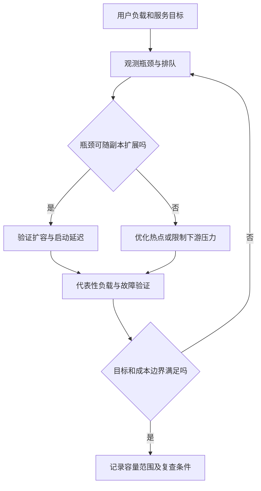

# 性能分析、容量、弹性与成本

> 面向分析应用瓶颈、规划峰值与控制成本的开发者和维护者。读完能把用户目标、资源证据与费用口径连接起来，判断扩容何时有效，并验证优化有没有牺牲正确性与可靠性。

## 容量是给定条件下满足目标的能力

**容量**是在特定负载、数据和环境下能够持续满足目标的工作量。**性能分析**寻找耗时和资源消耗的原因。资源使用率高不必然表示用户体验差，使用率低也不证明没有瓶颈：请求可能等待锁、连接、网络或下游配额。

**弹性**是根据需求变化调整资源的能力；它有检测、决策、取得资源、启动和就绪的时间。**扩展性**描述资源增加时处理能力怎样变化。增加副本不能保证吞吐线性增加，共享数据库、全局锁与外部依赖常限制整体收益。

报名系统应保护主路径并区分负载：活动读取可受缓存影响，报名写入受事务和容量约束影响，管理员导出可能占用较多内存、连接与存储。用户规模、数据规模和并发程度分别变化，不能用一个“用户数”概括所有压力。

## 从端到端耗时拆分原因

**剖析**（profiling）记录 CPU、分配或其他执行活动，帮助定位代码成本；追踪展示跨组件等待；数据库计划与锁证据展示存储路径；指标展示总体变化。先建立可重现条件，再根据瓶颈选择工具，不要看到一个慢请求就直接更换实例规格。

| 现象 | 候选原因 | 能区分的证据 |
| --- | --- | --- |
| CPU 高且吞吐不再增长 | 计算热点、序列化、过多任务 | 剖析与工作量分布 |
| CPU 低但延迟高 | 锁、连接池或外部等待 | 追踪、队列和数据库等待 |
| 内存逐步增长 | 泄漏、无界缓存或大导出 | 长期曲线与分配、堆证据 |
| 副本增加却错误更多 | 下游连接或配额饱和 | 各层并发、连接与拒绝 |
| 流量下降仍很慢 | 队列积压、重试或资源未释放 | 最老任务等待与重试计数 |

一次优化应有假设、对照、结果和局限。相同制品、数据及负载下只改一个关键条件，才能较清楚解释因果；无法保持条件时，要记录差异而不是宣称单一因素带来全部收益。

## 排队与过载会放大延迟

工作到达速度长期超过完成速度，队列会增长；增加等待不创造处理能力。**有界队列**限制待处理工作，**限流**约束进入速率，**负载卸除**在过载时拒绝部分工作以保护仍可完成的任务。拒绝需要清晰分类和客户端行为，否则大量立即重试会再次放大压力。

**背压**让上游感知下游处理能力并限制提交。它适合可控制的调用链，但不能假设所有外部客户端都遵守。超时、重试次数、退避和随机分散需要共同设计；一个失败请求产生多个重试时，实际下游工作量会高于用户操作量。



当数据已经出现超额或重复，性能优化不得跳过事务与约束以换取更快响应。错误地更快处理请求，不是容量提升。

## 自动伸缩需要可用的控制信号

**水平自动伸缩**根据指标调节副本数量。Kubernetes HPA 是周期运行的控制环，依赖配置指标及相应指标接口；CPU 利用率目标还涉及资源请求值。[HPA 文档](https://kubernetes.io/docs/concepts/workloads/autoscaling/horizontal-pod-autoscale/) 它不会提前知道活动何时开始，也不会保证云配额、节点或数据库容量足够。

| 伸缩信号 | 适合条件 | 常见盲区 |
| --- | --- | --- |
| CPU | 工作与计算消耗相关 | I/O 等待和锁竞争 |
| 进行中请求 | 并发与资源使用相关 | 单次任务成本差异 |
| 队列长度与年龄 | 异步工作可积压 | 长度相同可能等待差异很大 |
| 已知活动时间 | 峰值可预测 | 预测错误及实例准备失败 |
| 多信号与手动保护 | 需求复杂、风险较高 | 配置复杂且需实际验证 |

伸缩上下限、稳定窗口和就绪规则共同影响效果。扩得过慢会在峰值前积压，缩得过快会造成频繁启动与长尾；扩容上限既约束费用，也保护下游。数据库每实例连接池与最大副本应联合预算，避免各自看似合理但总数越界。

短时尖峰可以提前预热、准备资源或控制入口，不宜仅依赖故障后自动伸缩。关键状态不要只存在单实例内存；副本变化与滚动发布都应检查会话、任务和幂等行为。

## 成本按业务单位解释

**单位成本**将明确范围内费用除以对应业务或技术工作量。FinOps Foundation 的 Unit Economics 指导强调成本与价值的连接及口径定义。[Unit Economics](https://www.finops.org/framework/capabilities/unit-economics/) 对报名系统，可以观察每次按规则完成报名、每次导出或每千次有效读取的成本，但需避免将不同旅程强行合成同一单位。

```text
单位成本 = 同一时间窗口内纳入范围的费用 / 对应有效完成量
```

这是计算定义，不是实际报价。费用范围可以包括计算、数据库、存储、网络、观测和共享平台分摊；分母要排除还是包含重试、拒绝，应明确。成功量下降会使单位成本上升，可能来自故障而非计费变化；总费用下降也可能是服务拒绝了更多用户。

| 优化动作 | 潜在收益 | 必须验证的代价 |
| --- | --- | --- |
| 缓存公开活动 | 减少重复读取 | 更新一致性与缓存击穿 |
| 优化查询或索引 | 降低存储等待 | 写入成本、空间与计划变化 |
| 异步且限并发导出 | 隔离高成本任务 | 完成时间、重试和结果持久性 |
| 调整资源规格 | 改善热点能力 | 实际负载收益及费用口径 |
| 减少观测冗余 | 控制存储与传输 | 排障和 SLO 证据不能丢失 |

成本治理细节复用[FinOps 主文](/cloud/architecture/finops)，本文只解释应用单位与验证。价格、优惠和计费地区随时间变化，应在真正选型时查官方报价，不使用本文作为价格估算。

## 验证容量而非猜测容量

以下为未执行方案。记录当前版本、环境与数据量；用正常混合旅程建立基线；在独立环境逐步增加到达率；同时观察延迟、错误、约束、连接和资源；改变一个候选优化；重跑相同条件并观察卸载后恢复。k6 的负载模型说明封闭与开放调度的不同。[模型机制](https://grafana.com/docs/k6/latest/using-k6/scenarios/concepts/open-vs-closed/) 系统变慢时发生器也降低到达量，会掩盖真实过载，需要明确实际发送和完成量。

容量结论要带安全余量的依据与未知项，而不是从一次峰值成功直接取最大值。数据增长、缓存命中变化、故障期间少一个副本和下游降额都可能改变边界；应按最重要风险验证。负载测试不能替代持续运行观察，持续观察也不能代替受控压力定位。

## 用量估算只作为验证起点

可先把一次旅程拆成请求、数据库操作、导出字节和外部调用，估算峰值放大路径。例如“每次报名平均触发两次数据库操作”只能是待测假设，缓存、重试和事务竞争可能改变实际数量。测量时同时记录首次操作与重试，才能解释用户量没有增加而依赖量上升。

资源预算应按总实例数计算：单实例连接上限乘最大副本，会形成潜在总连接需求；每个并发导出的峰值内存乘任务并发，可帮助发现无界运行风险。这些粗算忽略共享、释放与分布，只用于筛查明显越界，不能代替剖析和负载测试。预算与实际结果不同，应更新模型及原因，不能只扩大配额掩盖未知消耗。

## 常见失败模式

| 失败模式 | 后果 | 改进 |
| --- | --- | --- |
| CPU 低就认为有余量 | 忽略锁与下游等待 | 看端到端延迟和排队 |
| 应用扩容无限制 | 下游饱和、费用上升 | 总连接与限额联合预算 |
| 只比较平均耗时 | 长尾和失败被掩盖 | 分布、超时与终态一起报告 |
| 总账单下降即优化成功 | 完成量与可靠性可能下降 | 单位成本与服务目标并看 |
| 一次实验外推所有规模 | 数据和流量分布变了 | 记录验证范围并触发复查 |

## 参考资料

<Refs>

- [Kubernetes：Horizontal Pod Autoscaling](https://kubernetes.io/docs/concepts/workloads/autoscaling/horizontal-pod-autoscale/)（访问日期 2026-10-03）— 控制环与指标依赖
- [Grafana k6：Open and closed models](https://grafana.com/docs/k6/latest/using-k6/scenarios/concepts/open-vs-closed/)（访问日期 2026-10-03）
- [FinOps Foundation：Unit Economics](https://www.finops.org/framework/capabilities/unit-economics/)（访问日期 2026-10-03）— 单位定义与成本价值口径
- 站内相关：[负载与可靠性测试](/software/quality/performance-reliability-tests) · [应用埋点](/software/operations/application-observability) · [Kubernetes](/cloud/native/kubernetes) · [FinOps](/cloud/architecture/finops)

</Refs>
