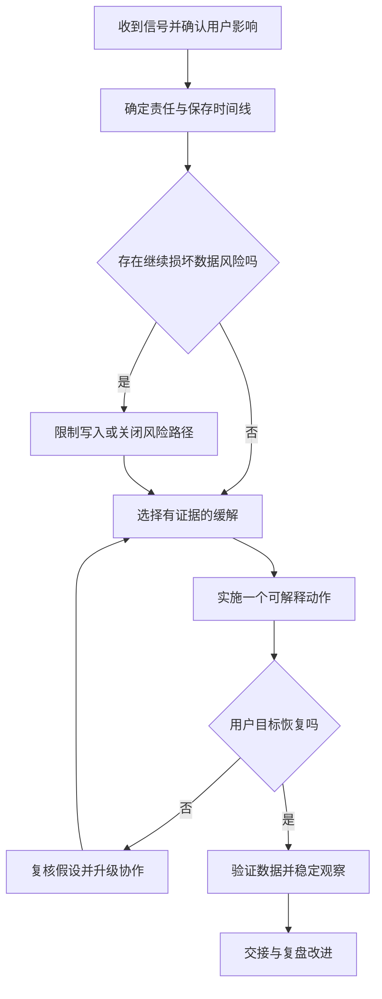

# 故障响应、手册与复盘

> 面向应用维护者、值守人员与故障协调者。读完能把用户影响、恢复动作和原因调查分别组织，编写可执行手册，并让复盘落实为能够验证的改进。

## 先确认影响，再组织恢复

**故障事件**是服务表现异常、业务目标受损或需要协调处理的运行事件。单条错误日志可能是信号，尚未构成确定故障；请求全失败、数据越权或持续超额则需要迅速评估影响。**故障响应**包括识别、限制影响、恢复、验证、交接和后续改进。

**缓解**限制当前影响，例如关闭有风险功能、限制导出任务或恢复已知兼容版本；**根因修复**解决导致错误的机制。二者可能不同。重启服务后正常不能证明内存泄漏已修复；回退后错误消失也不能独立证明是哪一行代码导致。

Google SRE 的事件管理指导强调明确责任、统一协调、实时记录和清楚交接。[Managing Incidents](https://sre.google/sre-book/managing-incidents/) 小团队可以由一人兼任多个角色，但哪些角色正在由谁承担应清楚，避免多人各自修改同一系统。

| 角色 | 主要任务 | 要避免 |
| --- | --- | --- |
| 事件协调 | 掌握影响、安排任务和恢复优先级 | 同时深陷全部技术细节 |
| 操作执行 | 按约定实施变更并观察 | 未登记的独立救火 |
| 状态记录 | 维护时间线、决定和证据 | 把猜测写成确定根因 |
| 沟通与交接 | 向相关角色说明影响和进展 | 承诺没有证据的恢复时间 |

本文说明工程沟通内容，不执行对外消息。真实事件应按组织既有授权渠道发送。

## 决策围绕风险，而非最快操作

确认哪些旅程、用户和环境受影响，异常从何时开始，是否仍在扩大，是否有数据风险。查询近期发布、开关和配置变化，保留版本标识与观察窗口。时间上的关联是调查线索，不能直接等同因果。

数据风险优先级往往高于短暂可用性。停止受影响写入可能有业务代价，应由具备权限与责任的人决定并记录；盲目保持“可访问”却继续写坏数据，会扩大恢复难度。安全事件还可能需要证据保全和专门响应流程，不能只当普通性能故障处理。

## 手册连接判断、动作与验证

**运行手册**（runbook）针对明确症状给出调查与操作路径。它应包含适用环境、输入证据、必要权限、前置条件、动作影响、验证与停止条件。单独一条“重启服务”缺少因果与边界，难以安全交接。

**操作手册**不是万能脚本。不同故障可能有相同表面症状；执行前必须确认条件，例如旧制品兼容当前数据，数据库连接问题不是入口故障。危险或不可逆动作应明确后果，不能藏在复制命令里。

| 手册字段 | 示例内容 | 验证方法 |
| --- | --- | --- |
| 触发症状 | 有效报名持续系统失败 | 核对指标口径与数据缺失 |
| 范围 | 指定环境和服务，当前版本 | 比较实际运行信息 |
| 先查证据 | 入口、应用、数据库和近期变更 | 关联同一时间窗口 |
| 可用缓解 | 有兼容证据时回退或关闭新路径 | 核对旧制品及数据条件 |
| 结果判断 | 报名终态、错误与延迟恢复 | 合成旅程和真实指标 |
| 停止或升级 | 数据损坏、影响扩大或条件不符 | 交给相应责任角色 |

手册宜放在服务故障时仍能访问的位置，提供脱敏观察入口，不把秘密写在正文。自动化动作应有版本与审计；手册更新应由陌生维护者演练，而不是仅由编写者确认自己能理解。

## 一个报名故障的处置演练

以下为未执行的虚构方案。症状是新发布后报名请求超时增多，而列表正常。首先确认这不是监测数据缺失，检查请求量、业务分类和数据库连接等待。记录候选版本、放量比例与最近配置；禁止多个执行者同时更改连接池、实例与限流。

若数据库等待增加，先检查锁、连接占用和长时间导出，而不是立即扩应用副本。更多副本可能创建更多连接，扩大下游饱和。若与新导出路径有关且开关能安全停止新任务，可以先关闭并验证队列、报名表现与已有任务状态；关闭开关不会取消已发生的写入或文件生成。

若选择回退，先确认旧程序能够读取当前结构及状态；登记旧制品和配置；受控恢复；验证报名、取消与权限拒绝；再检查超时期间是否有“提交成功但响应丢失”的请求。恢复后应进行重复与计数对账，不能因错误率下降就宣布数据没有问题。

每次操作记录发起时间、执行者、对象、理由、预期、实际结果和回退方法。动作无效也要保留，避免接手者重复已经证明无效的尝试。等待中的任务、临时限流、暂停写入和临时权限都应出现在交接。

## 复盘寻找可改善的系统条件

**复盘**（postmortem）整理事件影响、时间线、原因及改进。Google SRE 的无责复盘关注系统条件，帮助人员准确披露决策背景。[Postmortem Culture](https://sre.google/sre-book/postmortem-culture/) 无责不意味着无责任记录，而是避免用个人性格替代可检验机制。

原因可以包括触发变更、潜在设计缺陷、检测缺口、恢复障碍和协作问题。一个配置错误可能是触发因素，但默认值危险、环境校验缺失、权限过大和手册失效共同决定影响。不要将复杂事件只缩成一句“操作失误”，也不要为了复杂而添加无证据原因。

| 改进类型 | 好的任务表达 | 验证完成的方法 |
| --- | --- | --- |
| 防止发生 | 增加容量变更的兼容校验 | 非法组合被阻断 |
| 更早发现 | 增加报名终态与响应不一致检查 | 注入偏差时能发现 |
| 限制影响 | 限制导出并发和下游连接 | 混合负载下核心旅程保持目标 |
| 加快恢复 | 保存旧制品并完善兼容清单 | 接管者实际完成演练 |
| 改善协作 | 明确事件角色与交接格式 | 多人演练无并行冲突动作 |

任务应有责任、优先级、期限和验证条件。“加强意识”“持续关注”没有可检查成果；每条行动都设最高优先级也不能反映资源取舍。完成代码不等于改进已经验证，应关联实际检查和效果。

## 响应能力需要定期维护

值守安排、权限、平台和依赖变化后，手册可能失效。Google SRE 的值守实践提醒响应需要训练和可持续负担。[Being On-Call](https://sre.google/sre-book/being-on-call/) 小系统可先演练一个最重要旅程，逐步覆盖观测断链、依赖超时、版本恢复和数据对账。

**恢复时间度量**需要定义起点和终点，例如从用户影响开始到核心旅程恢复，或从收到告警到缓解完成。平均数会隐藏长尾和不同事件类型；缺少起始证据时应记录估计范围，不编造精确分钟。首次恢复、数据对账完成和永久修复完成也不是同一时间点。

## 交接明确尚未恢复的部分

核心报名恢复时，管理员导出、历史错误数据或监测出口可能仍有问题。状态说明应列出哪些旅程已经验证、哪些受到限制、有哪些临时措施，以及何时再次复查。不要用整体“已恢复”让接手者误认为全部目标达成。

交接还应区分可重试操作与需要再次批准的动作：重复查询通常影响低，重新执行数据修复或补偿可能产生新副作用。登记正在运行的恢复任务、批次和操作标识，避免换班后重复执行。最终结束事件前，把应急配置、临时权限、暂停任务和尚未闭合的风险关联到后续责任，防止它们成为无人维护的新常态。

## 常见失败模式

| 失败模式 | 后果 | 改进 |
| --- | --- | --- |
| 多人同时改变系统 | 因果混乱且相互覆盖 | 统一操作协调与记录 |
| 无法恢复就反复重启 | 原因被遮蔽，压力增加 | 有界尝试与明确升级 |
| 回退后立即结案 | 错误数据和临时措施遗留 | 稳定观察、对账与交接 |
| 手册依赖故障系统 | 最需要时无法取得 | 独立可访问的记录 |
| 复盘只有原因没有任务 | 同类故障重复 | 可验证改进与跟踪 |

## 参考资料

<Refs>

- [Google SRE：Managing Incidents](https://sre.google/sre-book/managing-incidents/)（访问日期 2026-10-03）— 责任、状态记录与交接
- [Google SRE：Postmortem Culture](https://sre.google/sre-book/postmortem-culture/)（访问日期 2026-10-03）— 系统原因与改进
- [Google SRE：Being On-Call](https://sre.google/sre-book/being-on-call/)（访问日期 2026-10-03）
- 站内相关：[SLO 与值守](/software/operations/slo-health-oncall) · [调试与缺陷](/software/quality/debugging-defects) · [发布与回滚](/software/delivery/release-rollback) · [恢复与对账](/software/operations/recovery-reconciliation)

</Refs>
