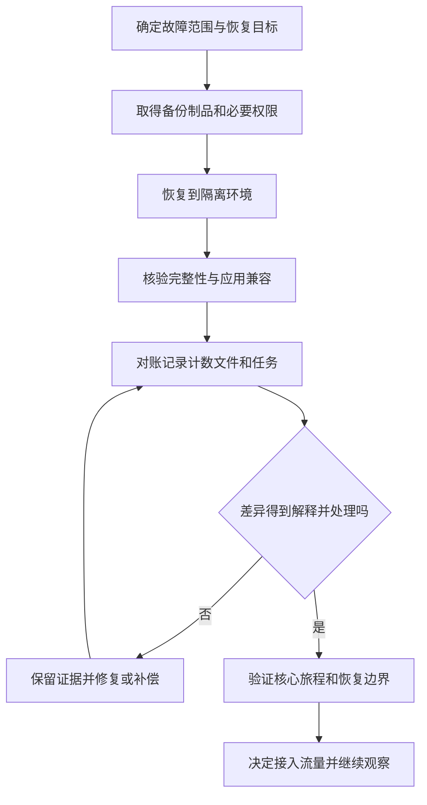

# 恢复演练与数据对账

> 面向负责应用恢复、备份验证和数据一致性的开发者与维护者。读完能区分备份成功、技术恢复和业务恢复，设计隔离演练，并核对恢复后是否丢失、重复或错配了业务状态。

## 恢复的终点是业务可以正确继续

**恢复演练**在受控条件下验证恢复步骤、权限、资源和数据是否足以支撑目标。**数据对账**比较不同记录或派生状态是否满足约定关系，找出缺失、重复和不一致。数据库能启动、页面能打开，只是恢复中的部分证据。

**恢复时间目标**（Recovery Time Objective，RTO）规定相关系统资源可以不可用多久；**恢复点目标**（Recovery Point Objective，RPO）规定需要恢复到哪个历史数据点，表达可容忍的数据损失边界。NIST SP 800-34 Rev.1 将两者与业务影响和恢复优先级连接。[§3.2.1](https://nvlpubs.nist.gov/nistpubs/Legacy/SP/nistspecialpublication800-34r1.pdf) 目标来自业务要求，不能因云平台有备份按钮就宣称实现。

项目需要另行定义测量起止：从用户影响、发现故障还是发起恢复开始计时，恢复结束是数据库可读、核心旅程恢复还是全部对账完成。若只测文件下载和数据库导入，应称该阶段耗时，不能当完整业务恢复时间。RPO 也不等于备份计划间隔，归档滞后、损坏、权限与错误传播都影响实际可恢复点。

## 备份、复制和回滚解决不同问题

**备份**保存某个历史状态以便恢复；**复制**把变化传给另一个运行副本；**程序回滚**恢复应用版本。复制可能同步误删和错误写入，不能替代历史备份；回滚程序通常不撤销已写的数据；备份存在也不证明可以读出和恢复。

PostgreSQL 的逻辑备份可以生成内部一致的数据库快照，但单库导出不自动包含全部集群级角色和表空间，多个库的快照也不自动同步。[SQL Dump](https://www.postgresql.org/docs/current/backup-dump.html) 连续归档恢复需要基础备份及足够连续的 WAL，逻辑导出不能直接充当 WAL 重放的基础。[PITR](https://www.postgresql.org/docs/current/continuous-archiving.html) 恢复方法应按实际版本与部署方式设计。

| 机制 | 适合解决 | 不能独立保证 |
| --- | --- | --- |
| 逻辑备份 | 数据迁移、选定逻辑对象恢复 | 全系统一致及很短恢复时间 |
| 基础备份与 WAL | 数据库历史时间点恢复 | 外部文件和任务同步恢复 |
| 运行副本 | 部分实例故障的连续服务 | 误操作与逻辑损坏可撤销 |
| 旧应用制品 | 限制错误程序继续影响 | 当前数据兼容与副作用撤销 |
| 业务补偿 | 修正已知范围的业务效果 | 等同原操作的严格逆过程 |

## 恢复清单要覆盖数据以外的依赖

报名系统除数据库外，还可能有导出对象、任务队列、身份配置、秘密引用、域名和发布制品。数据库恢复到昨天，任务队列却保留今天的消息，可能重复执行；数据库记录存在而结果文件缺失，管理员仍不能完成工作；密钥无法取得，备份可能无法解密。

**一致性边界**规定哪些对象需要共同恢复或共同核对。不能随意假设跨数据库、对象存储和队列具有同一快照。恢复设计应记录各自时间点及业务标识，用对账与补偿处理偏差，必要时暂停受影响写入。



恢复到隔离环境可以防止验证过程覆盖仍在使用的生产数据。连接、身份与外发任务也需隔离，不能只换一个数据库名就认为没有业务副作用。

## 演练从真实取得路径开始

以下为未执行的教学方案。选择一份已有备份记录，登记对象、生成时间、软件版本、加密方式和校验摘要；由具备正常恢复权限的维护者取得备份与制品；在隔离资源恢复；记录每个阶段实际开始和结束；验证模式、约束、角色及应用启动，再完成关键旅程与对账。

| 演练项 | 应观察的证据 | 失败后判断 |
| --- | --- | --- |
| 取得与解密 | 数据完整、凭据可用、来源明确 | 权限与密钥是不是单点 |
| 数据导入或重放 | 过程完成且无遗漏错误 | 备份、归档链与版本是否兼容 |
| 应用接入 | 制品能读取当前结构 | 是否需要匹配旧制品或迁移 |
| 核心旅程 | 报名、取消、拒绝和查询正常 | 区分入口、业务与数据故障 |
| 业务对账 | 差异可解释、残余风险登记 | 是否需要补偿或人工判断 |
| 时间与数据范围 | 实测阶段及实际恢复点 | 是否支持当前目标结论 |

演练应使用代表性数据量，至少能暴露主要取得、导入和检查成本。小型合成库恢复成功可以证明步骤初步可用，不能直接证明生产大库满足 RTO。应急人员、网络、配额和外部依赖都可能使实际时间增加。

## 对账检查业务关系，而不只检查行数

**不变量**是业务始终需要成立的关系。报名系统可检查：有效记录不超过容量，同一活动用户无重复有效记录，缓存计数与有效明细一致；取消状态不重复释放名额；导出任务结果与记录关联完整。总行数相同仍可能一行缺失、另一行重复，所以还要比较标识与关键属性。

以下为未执行的 PostgreSQL 风格 SQL，假定示例表结构。生产使用前应核对字段、隔离级别、索引、权限与扫描成本；不要直接把示例当作自动修复脚本。

```sql
BEGIN ISOLATION LEVEL REPEATABLE READ;

-- 查找有效报名超过容量的活动
SELECT a.id, a.capacity, count(r.id) AS active_count
FROM activities a
LEFT JOIN registrations r
  ON r.activity_id = a.id AND r.status = 'active'
GROUP BY a.id, a.capacity
HAVING count(r.id) > a.capacity;

-- 查找同一活动用户的重复有效记录
SELECT activity_id, user_id, count(*)
FROM registrations
WHERE status = 'active'
GROUP BY activity_id, user_id
HAVING count(*) > 1;

ROLLBACK;
```

事务中的一致快照帮助避免两次查询看到不同时间的数据；具体隔离行为见 PostgreSQL 文档。[Transaction Isolation](https://www.postgresql.org/docs/current/transaction-iso.html) 它不让数据库与对象存储自动共享快照，也不阻止业务数据在查询之后继续改变。大规模对账要考虑只读副本滞后、长事务与资源成本。

## 差异处理需要审计与幂等

先将差异分成可解释时间差、恢复点之外合法写入、重复、缺失、错误派生状态和无法判定。选择权威依据时，应确认哪份记录真正表示已承诺业务结果；不能默认“数据库最新值”总正确，也不能把客户端截图当唯一来源。

**补偿**按业务规则修正效果，Microsoft 的补偿事务模式说明它不一定恢复原始状态，而且补偿本身可能失败。[补偿事务](https://learn.microsoft.com/en-us/azure/architecture/patterns/compensating-transaction) 修复任务需要稳定操作标识、重试安全、范围限制和结果记录。删除重复记录前先判断是否已有任务和文件引用，避免产生新的孤立状态。

若必须历史恢复，明确哪些故障后合法报名会不在恢复点内，并设计核对与重建方式。恢复后旧队列和重试请求仍可能到来，应核对幂等记录与任务版本，防止把已处理操作再次执行。上线恢复与数据修复分别取得证据，不能以某项完成替代另一项。

## 对账结果也需要完整性说明

“没有发现差异”需要说明扫描范围、时间点、规则和排除条件。分页扫描过程中数据继续变化，可能漏掉或重复检查记录；只读副本滞后会形成暂时差异；字段规范化和排序不同也会使摘要不同。应记录稳定检查窗口或快照条件，并把可解释时间差与真实业务错误分别统计。

内容摘要适合检查备份文件是否取得一致，不自动证明每个业务对象语义正确。抽样可以发现部分风险，但不能写成全量一致；全量行数一致也不等同标识与属性一致。修复后应重新检查受影响关系及关联任务，保留修复前后差异、执行批次和剩余未判定项，使恢复决定能被独立复核。

## 常见失败模式与维护边界

| 失败模式 | 后果 | 改进 |
| --- | --- | --- |
| 只看备份任务绿色 | 文件损坏或无法解密仍未知 | 实际取得、恢复和业务验证 |
| 把副本当历史备份 | 错误同步到全部副本 | 保留独立历史恢复能力 |
| RPO 等于计划频率 | 忽略归档滞后与失败 | 观察可恢复点和完整链条 |
| 对账只比较总数 | 缺失与重复互相抵消 | 标识、状态与不变量检查 |
| 修复直接覆盖生产 | 丢合法数据且证据消失 | 隔离恢复、差异分析与受控修复 |
| 演练后不维护 | 权限、版本和路径逐步失效 | 变更后复查关键恢复条件 |

灾备拓扑、跨区域与保护等级复用[可靠性与灾备主文](/cloud/architecture/reliability-dr)。本文聚焦应用恢复闭环；仅在实际演练且记录完整范围后，才能声称某个环境在该条件下达到目标。

## 参考资料

<Refs>

- [NIST SP 800-34 Rev.1](https://nvlpubs.nist.gov/nistpubs/Legacy/SP/nistspecialpublication800-34r1.pdf)（访问日期 2026-10-03）— §3.2.1 恢复目标与测试演练框架；不引申为本项目合规认证
- [PostgreSQL 18：SQL Dump](https://www.postgresql.org/docs/current/backup-dump.html) · [Continuous Archiving and PITR](https://www.postgresql.org/docs/current/continuous-archiving.html) · [Transaction Isolation](https://www.postgresql.org/docs/current/transaction-iso.html)（访问日期 2026-10-03）
- [Microsoft：Compensating Transaction](https://learn.microsoft.com/en-us/azure/architecture/patterns/compensating-transaction)（访问日期 2026-10-03）
- 站内相关：[发布与回滚](/software/delivery/release-rollback) · [故障响应](/software/operations/incident-response) · [测试用例](/software/quality/test-cases) · [可靠性与灾备](/cloud/architecture/reliability-dr)

</Refs>
