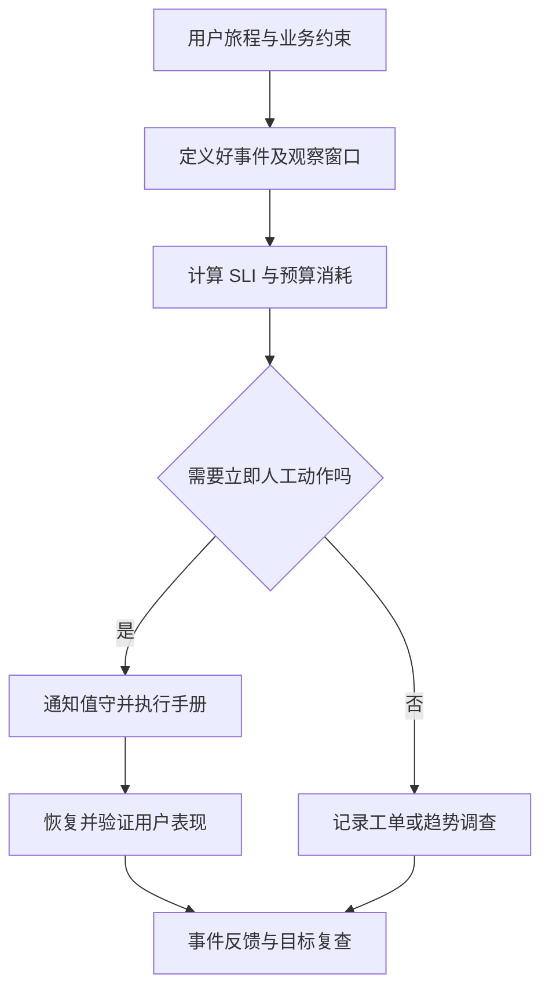

# SLO、健康检查与值守

> 面向应用维护者、运维人员和交付负责人。读完能从用户旅程定义服务目标，区分探针、业务指标与告警，并为需要人工处理的异常建立可交接的责任。

## 服务目标从用户能否完成工作出发

**服务等级指标**（Service Level Indicator，SLI）是度量服务表现的方法，例如有效请求中按规则完成的比例。**服务等级目标**（Service Level Objective，SLO）规定指标在某个窗口应达到的水平。**服务等级协议**（SLA）是与相关方约定的服务及后果，不能把内部 SLO 自动当成对外合同承诺。

Google SRE 的实施指导从用户需求和可测指标建立目标。[实施 SLO](https://sre.google/workbook/implementing-slos/) 报名系统应关注能否查活动、按规则报名、取消和取得管理结果。实例在线与 HTTP 200 不等于业务完成；响应成功但记录重复，仍然违反目标。

**好事件**是满足定义的事件，**有效事件**是纳入评估的事件集合。请求型 SLI 常写为好事件数除以有效事件数。满额拒绝是符合规则的业务结果，是否计入“成功”需明确定义；非法输入、未授权调用、客户端取消和重试也应有一致口径，不能为了提高数字随意从分母删除。

| 旅程 | 候选指标 | 重要边界 |
| --- | --- | --- |
| 查看活动 | 有效访问中正确并及时返回的比例 | 浏览器、入口与后端范围写清 |
| 报名 | 按规则取得明确终态的比例 | 区分满额拒绝和系统错误 |
| 取消 | 完成状态变化且不重复释放名额 | 响应与终态需一致 |
| 管理员导出 | 任务在约定条件下完成的比例 | 异步任务窗口与规模不同 |
| 数据正确性 | 容量、唯一性和明细一致 | 不能仅靠在线率观察 |

这些是待协商指标，不给出通用百分比。目标应兼顾用户后果、维护能力和成本，先让指标真实可测，再正式约定。

## 错误预算连接变更与可靠性

**错误预算**是目标允许的未达标空间。请求型目标为 `S` 时，预算比例为 `1-S`，但实际可用预算依赖窗口内事件数量和定义。时间型可用性与请求型成功率不是同一口径；低流量系统用少数请求计算高精度目标可能很不稳定。

错误预算可以支持决定：当故障持续消耗预算时，优先恢复和改进可靠性；在预算充足且风险可控时推进变更。它不是允许泄漏数据或违反安全规则的额度，越权、数据损坏等硬约束仍可独立阻断发布。

**预算燃烧率**比较当前错误消耗速度与按目标均匀消耗的速度。Google SRE 讨论多窗口与多燃烧率告警，兼顾快速严重故障和持续较慢恶化。[SLO 告警](https://sre.google/workbook/alerting-on-slos/) 本文不照搬书中的阈值；真实窗口应依据流量、影响和响应能力验证，低流量尤其需要额外处理。

告警应有行动含义。CPU 偏高但用户目标正常，可能先进入容量调查；报名全部失败则可能需要立即响应，即使 CPU 很低。

## 健康检查是控制信号

Kubernetes 区分启动、就绪和存活探针：启动检查保护启动阶段；就绪失败使实例不适合接收流量；存活失败可能触发容器重启。[探针机制](https://kubernetes.io/docs/tasks/configure-pod-container/configure-liveness-readiness-startup-probes/) 平台的具体处理应核对实际版本与配置，不能假设所有托管系统相同。

**健康检查**通常回答局部条件，例如进程响应、初始化完成或依赖可用。**合成检查**按设定频率从受控位置执行模拟用户旅程。真实用户指标则来自实际使用。三者互补：探针可自动隔离实例，合成检查可发现无流量时的入口故障，真实指标反映使用表现。

| 检查类型 | 适合回答 | 不宜承担 |
| --- | --- | --- |
| 存活 | 进程是否陷入不可自愈状态 | 所有外部依赖暂时故障就重启 |
| 就绪 | 当前是否可安全接收新请求 | 完整业务验收与长期 SLO |
| 启动 | 初始化是否在允许范围完成 | 允许无限启动等待 |
| 合成旅程 | 从指定入口能否完成关键操作 | 代表所有用户、地区和数据 |
| 用户 SLI | 真实使用中目标是否满足 | 独立定位全部根因 |

把数据库故障加入所有实例存活判断，可能让所有副本一起重启，反而增加连接压力。就绪检查也需要考虑降级能力与故障范围，避免一个共享依赖短暂失败使整个服务无入口。探针应轻量、有界，并限制访问与敏感信息输出。

## 值守把信号交给能够行动的人

**值守**安排具备权限和准备的人在约定时间响应事件。Google SRE 的值守章节强调可行动的告警、准备与可持续安排。[值守指导](https://sre.google/sre-book/being-on-call/) 小团队不必复制大型组织轮班，但要明确哪些时间有人响应、无法响应时怎样升级，以及用户会面对什么服务边界。

每条紧急告警应包含用户影响、服务与环境、时间、版本、观察入口和手册。责任应指向当前角色或排班，避免依赖离职人员或单台电脑；权限取得和双人协作等要求应在演练中验证，而非故障时才发现无法操作。

| 值守准备 | 要落实的内容 | 验证方法 |
| --- | --- | --- |
| 响应范围 | 工作时间、服务和严重性 | 按典型事件核对责任 |
| 升级路径 | 当前值守无法处理时找谁 | 用演练验证联系与交接 |
| 权限 | 看指标、查日志、限制影响、恢复 | 在隔离环境实际操作 |
| 手册 | 判断条件、动作、检查与停止 | 陌生维护者按文档完成任务 |
| 交接 | 当前异常、变更、风险和临时措施 | 明确接收方确认责任 |

## 建立应用级最小闭环

以下为未执行方案。先选择报名这一条关键旅程，定义有效请求、规则拒绝、系统错误和延迟；埋点并用合成数据验证统计；建立看板关联版本；为持续系统失败设置可行动告警；手册先核对入口、数据库与近期发布，再根据兼容证据关闭新功能或回退。

合成报名需要独立活动和测试标识，不能消耗真实活动名额或污染业务指标。删除合成记录也应安全有界。观测出口失效时应有“数据缺失”状态，不能将没有数据解释为没有错误；业务故障和监测故障需要分别调查。

目标复查应依据实际事件、用户需求和代价。降低目标不是修复故障的替代动作；提高目标也不能仅改文档而无架构、人员和验证投入。历史窗口表现满足，不保证下一窗口也满足。

## 延迟目标与正确性目标分别记录

及时响应与正确完成是两条约束。系统可能很快返回满额拒绝，但记录事实上仍有名额；也可能写入正确，却在响应前超时。建议分别记录响应是否在约定时间内、结果是否符合规则，以及终态能否被用户明确取得。异步导出则可把提交响应和任务完成分开度量，避免用快速接受任务掩盖长期不完成。

指标覆盖不到的正确性约束，可以由周期对账与事件审计补充，并说明发现延迟。发现一条越权或容量违规时，处理优先级不应依大量正常请求稀释后的平均比例决定。对低流量旅程，单个失败的业务后果可能很大，需要结合事件级响应和合成检查，而非强行套用高流量统计。

## 常见失败模式与边界

| 失败模式 | 后果 | 修正 |
| --- | --- | --- |
| 所有 200 都算成功 | 业务错误和数据不一致漏掉 | 定义好事件与终态证据 |
| 空数据显示绿色 | 观测断链被当正常 | 单独检测数据缺失 |
| 一个告警通知所有人 | 无人确定谁行动 | 当前责任与升级路径 |
| 所有依赖故障触发重启 | 重启风暴扩大故障 | 区分探针作用和降级能力 |
| 值守只留联系人 | 有人接电话但无权限或手册 | 实际演练并明确服务边界 |

底层观测平台见[云原生可观测性](/cloud/native/observability)，跨区域可靠性设计见[可靠性与灾备](/cloud/architecture/reliability-dr)。本文关注应用目标与响应闭环，不推定已具备任何可用性等级。

## 参考资料

<Refs>

- [Google SRE：Implementing SLOs](https://sre.google/workbook/implementing-slos/) · [Alerting on SLOs](https://sre.google/workbook/alerting-on-slos/)（访问日期 2026-10-03）
- [Google SRE：Being On-Call](https://sre.google/sre-book/being-on-call/)（访问日期 2026-10-03）
- [Kubernetes：Configure Probes](https://kubernetes.io/docs/tasks/configure-pod-container/configure-liveness-readiness-startup-probes/)（访问日期 2026-10-03）
- 站内相关：[应用埋点](/software/operations/application-observability) · [故障响应](/software/operations/incident-response) · [发布与回滚](/software/delivery/release-rollback) · [云原生可观测性](/cloud/native/observability)

</Refs>
