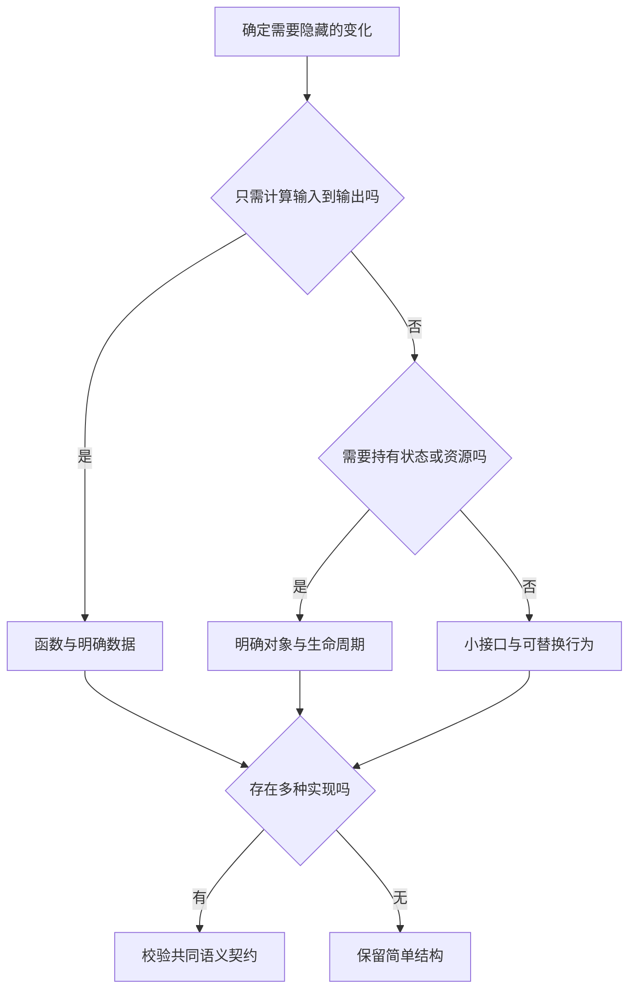

# 抽象、接口与编程范式

> 面向准备设计模块、审查接口或跨语言理解代码的读者。读完能判断哪些细节应该隐藏，为什么方法签名相同仍可能无法替换，并按状态与变化选择函数、对象或组合方式。

## 抽象要保留调用者需要的事实

**抽象**是在特定目的下保留必要信息、隐藏实现细节的表达方式。报名操作的调用者需要知道能否报名、是否已有记录以及失败时怎么办；通常不需要知道数据库驱动如何组装语句。但容量约束是否在共同写入边界成立，直接影响正确性，不能作为“内部细节”从契约中删掉。

**封装**把状态和操作放在受控边界内，并限制对内部细节的直接访问；**接口**描述边界上可使用的能力与约定。一个接口可以是函数参数、对象方法、语言接口类型，也可以是网络 API。语言的 `interface` 只是表达接口的一种工具，并不自动生成完整的业务协议。

抽象减少的是调用者必须掌握的信息。若所有调用者仍需判断具体实现类型、拼接底层查询或读取内部字段，接口就没有有效隔离变化。反过来，若接口把超时、部分成功、资源限制等事实全部抹平，调用者也无法作出安全决策。设计应在隐藏实现与保留语义之间取得平衡。

## 类型兼容与行为兼容是两道检查

**多态**是让同一种调用形式适用于不同实现。接口检查可以确认某个类型具有所需方法，但不能证明它们按照相同含义工作。`save()` 返回成功后，是仅写入内存、写入本地文件，还是已经完成持久化？如果调用者假定持久化，第一种实现即使签名相同，也不满足替换条件。

不同语言的接口规则不应混为一谈。

| 语言机制 | 官方规则的核心 | 不能由此推导的结论 |
| --- | --- | --- |
| TypeScript 结构类型 | 兼容性主要根据成员及其类型判断 | 字段相同就有同一业务含义；运行时输入已校验 |
| Go 普通值接口 | 对仅包含方法要求的接口，方法集决定满足关系；无需在类型上列出接口名 | 任意同名方法都匹配；值与指针的方法集完全相同 |
| Rust trait | 定义共享行为，可用 trait bound 约束泛型 | 所有 trait 都等价于其他语言的接口或类继承 |

TypeScript 文档还明确说明其类型系统为实用性允许某些无法在编译期证明安全的行为。因此“类型检查通过”是特定规则下的证据，不能当作行为证明。[TypeScript 类型兼容](https://www.typescriptlang.org/docs/handbook/type-compatibility.html)

Go 的普通值接口适合表达较小的能力集合；Go 规范中值类型与指针类型具有不同的方法集。包含类型项的接口可用于泛型约束，其满足关系还涉及类型集合，不能仅按方法集判断，本篇不展开这部分规范。Rust 的 trait 既可以表达共享方法，也可以作为泛型的行为约束。这里比较的是规则的入口，具体约束、调度方式与成本还要结合语言和使用方式检查。[Go 语言规范](https://go.dev/ref/spec#Interface_types) · [Rust trait](https://doc.rust-lang.org/book/ch10-02-traits.html)

### 替换实现前，补齐语义契约

以下 TypeScript 是接口示意，未执行，也没有提供存储实现：

```typescript
type ReserveResult =
  | { kind: "created"; registrationId: string }
  | { kind: "already-registered"; registrationId: string }
  | { kind: "full" };

interface RegistrationStore {
  reserve(eventId: string, userId: string): Promise<ReserveResult>;
}
```

签名用 `Promise` 表示稍后得到成功或失败结果的对象，并表达参数和几种正常业务结果。工程契约还必须补充：同一活动与用户重复调用不能创建第二条有效记录；成功结果与容量约束共同成立；未知基础设施失败不能伪装成满额；调用超时可能意味着结果未知，不能默认未写入。

| 契约维度 | 实现者必须回答 | 替换时如何检查 |
| --- | --- | --- |
| 前置条件 | 标识是否已校验，活动是否存在 | 相同无效输入是否有一致结果 |
| 后置条件 | 返回 `created` 后什么状态成立 | 读取记录并核对容量约束 |
| 重复调用 | 相同业务键是否复用已有结果 | 连续及并发重复调用 |
| 失败语义 | 哪些结果已知，哪些结果未知 | 写入前、写入后响应前等故障点 |
| 可观察性 | 如何关联请求与保存结果 | 调用记录能否关联实际状态 |

内存实现可以用于局部逻辑测试，但多进程并发、持久化与故障恢复不能靠同一组内存测试证明。接口降低替换成本，同时也建立验证义务；存储约束可继续阅读[数据库与数据模型](/cloud/data/database)。

## 范式是组织程序的方式

**编程范式**描述如何分解问题、表达状态和组合行为。多数工程会混合使用多种方式，不宜把“用了类”或“用了 `map`”当作整个系统属于某个范式的证据。

**命令式**代码描述依次执行哪些操作、怎样改变状态。循环统计和顺序导出容易直接表达，但中间变量与退出路径需要仔细维护。过程式组织把相关步骤放进函数，是命令式程序常见的分解方式。

**面向对象**把状态与相关行为组织在对象中。对象可以维护不变量，例如禁止随意把某个计数改为负数；这依赖实际封装和方法设计，公开所有可写字段并不会产生这种保证。对象边界适合有身份与生命周期的实体，也可能用于无状态策略，不能简单等同于“现实中的名词都建一个类”。

**函数式**风格偏向以输入到输出的函数组合表达计算，减少可变共享状态。**纯函数**的输出只由输入决定，且没有对外可观察的副作用，便于重复调用与局部推理。读数据库、读取当前时间、写日志或发送通知都需要讨论副作用，不能只因函数短就称为纯函数。[Python 函数式编程 HOWTO](https://docs.python.org/3/howto/functional.html)

**声明式**表达想得到的结果或约束，将执行步骤交给实现，例如 SQL 描述需要的数据集合。使用者仍需理解数据模型、执行资源和语义边界。声明式表达不意味着没有成本，也不意味着所有实现能采用相同的执行策略。

一项业务可以同时采用这些方式：对象持有活动状态，纯函数计算局部规则，命令式流程组织读取与写入，SQL 查询名单。选择依据是哪里需要状态、哪里需要可独立验证的计算，而不是坚持一种风格覆盖所有代码。

## 组合与继承的不同代价

**继承**在支持它的语言中建立类型或实现关系；**组合**让一个对象持有并委托另一个对象，把功能通过协作拼起来。继承可以复用已有行为，但子类型需要维持调用者依赖的约定。若子类型加强输入限制、改变失败含义或破坏原有不变量，调用者就可能在合法输入下出错。

组合允许分别替换策略和资源，更容易把“名单排序方式”与“导出文件格式”分开。代价是需要明确的委托与接口，不能为了避免两行重复而增加多层无意义对象。这里的工程建议是：先列变化原因，再决定复用单位；稳定的类型关系可使用继承，独立变化的能力可优先考虑组合。

**泛型**以类型参数表达一组相似操作，让复用仍保留类型约束。例如集合不必为每一种元素重新实现遍历。泛型不能自动消除业务差异：报名记录与活动记录即使结构相似，也未必适合相同权限与删除规则。动态调度、泛型实例化和优化策略还取决于语言实现，不能由“抽象层多一层”直接推断某个固定性能代价。



图中的选择不对应强制架构：同一模块里可能既有纯计算，也有持有连接的对象。先确定边界，再决定表达形式，能避免从框架提供什么类反推业务该长什么样。

## 从变化中判断抽象是否值得

| 情况 | 可考虑的选择 | 审查时关注的代价 |
| --- | --- | --- |
| 规则输入明确，无外部状态 | 函数或不可变数据转换 | 避免隐式读取时间与配置 |
| 多个实现有稳定共同能力 | 小接口或 trait | 共同契约能否覆盖失败与边界 |
| 多个变化方向互相独立 | 组合策略与资源 | 委托层是否增加理解成本 |
| 一次性操作，暂无重复需求 | 保持直接结构 | 不为假想扩展建立万能框架 |
| 高频路径抽象可能影响性能 | 保留可测量的替换点 | 用真实工作负载证明影响 |

常见失败是把字段名相同当作领域相同，或建立“通用管理器”承接所有业务。前者让相似对象误用规则，后者让任何修改都触及一个大接口。另一个失败是测试替身永远返回成功，生产实现却会超时或部分失败；此时抽象隐藏了关键差异，应该修订契约与测试，而不是继续增加实现分支。

抽象的验收可以观察一个具体变化：替换存储、增加一种导出格式或调整容量规则，需要修改哪些调用者？若改动总是越过既定边界，可能需要重划职责；若层层转发只增加定位成本，则可以减少抽象。更完整的架构决策见[设计原则、模式与重构](/software/architecture/principles-patterns)。

## 参考资料

<Refs>

- [TypeScript：Type Compatibility](https://www.typescriptlang.org/docs/handbook/type-compatibility.html)——结构类型与类型检查的安全边界（访问日期 2026-10-03）
- [Go：Language Specification，Interface types 与 Method sets](https://go.dev/ref/spec#Interface_types)——接口实现与方法集规则（访问日期 2026-10-03）
- [Go：Effective Go，Interfaces](https://go.dev/doc/effective_go#interfaces)——通过能力接口组织可替换实现；语言规则以规范为准（访问日期 2026-10-03）
- [Rust：Defining Shared Behavior with Traits](https://doc.rust-lang.org/book/ch10-02-traits.html)——共享行为与 trait bound（访问日期 2026-10-03）
- [Python：Functional Programming HOWTO](https://docs.python.org/3/howto/functional.html)——多范式、函数式风格及副作用（访问日期 2026-10-03）
- 站内相关：[语言、框架、运行时与依赖](/software/guide/languages-frameworks-dependencies) · [函数、作用域与模块](/software/programming/functions-modules) · [语言、运行时与工程选型](/software/programming/languages-runtimes) · [模块边界、依赖与接口](/software/architecture/modules-interfaces) · [设计原则、模式与重构](/software/architecture/principles-patterns)

</Refs>
