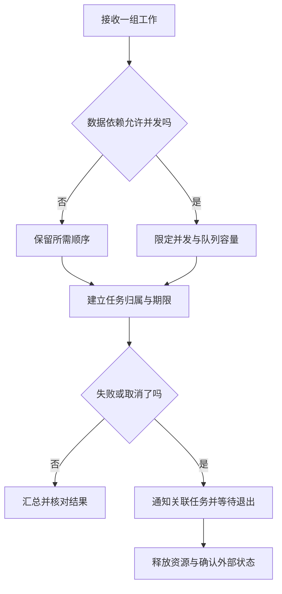

# 异步、并发同步与取消

> 面向已理解函数、希望审查请求并发与后台任务的读者。读完能区分异步、并发与并行，找出检查和更新之间的竞争，并为任务建立限流、期限、取消与清理的完整边界。

## 三个概念分别回答不同问题

**异步**描述操作发起后，完成结果可以在稍后取得；调用者不必一直占用当前执行流程等待。**并发**描述多项工作在同一时间段内推进，可以交错执行。**并行**描述多项工作在同一时刻执行，通常涉及多个执行单元。异步程序可以按顺序等待，并发程序也可以在单个线程中交错执行。

这里的“同步”还有两种常见含义：同步调用等待本次操作完成，再执行后续步骤；并发同步则通过锁、消息或其他协议协调任务访问共享状态。讨论方案时应说明是哪一种，不能把“同步请求”和“给共享变量加锁”混为同一概念。

**I/O**是与文件、网络等外部资源的输入输出。等待 I/O 时让出执行机会，其他任务可以继续推进；耗时计算却仍需要处理器执行。把函数标成 `async` 不会让同步计算自动移到别的处理器，也不会把阻塞文件接口自动变为异步接口。

JavaScript 的一个执行代理通过任务队列和执行栈组织工作，同一代理的一段同步执行不会被另一个任务任意插入。异步等待让后续部分在另一个执行时机继续，但长时间同步计算仍会妨碍其他工作。工作线程等机制能够提供不同执行代理，不能因普通回调单线程执行就推断整个宿主只有一个线程。[MDN 执行模型](https://developer.mozilla.org/en-US/docs/Web/JavaScript/Reference/Execution_model)

Node.js 官方文档把 worker threads 主要定位为执行 CPU 密集的 JavaScript 工作；其内置异步 I/O 通常更适合等待型任务。是否拆到线程还要计算任务传递、数据复制、内存和线程池维护的代价，不能仅凭函数“看起来慢”决定。[Node.js worker_threads](https://nodejs.org/api/worker_threads.html)

## 等待语法不等于任务调度

**协程**是可以在特定位置暂停、恢复的执行单元；**任务**通常是由调度机制管理的协程执行。Python 调用 `async def` 定义的函数得到协程对象，并不因普通调用就把整个函数自动执行完。通过 `await` 或任务调度等方式，它才进入执行流程。JavaScript 调用异步函数则会执行其开始部分，返回表示稍后成功或失败结果的 **Promise**，并在需要等待时安排后续执行；两者不能只按相似语法类比。[Python 任务文档](https://docs.python.org/3/library/asyncio-task.html) · [JavaScript async function](https://developer.mozilla.org/en-US/docs/Web/JavaScript/Reference/Statements/async_function)

下列 Python 代码是两种组织方式的示意，未执行；两段分别位于异步函数内部，假定所在模块已导入 `asyncio`，两个读取函数都是正确使用异步接口的独立操作。`TaskGroup` 需要 Python 3.11 或之后版本，下方第二个 Python 示例沿用这一前提：

```python
# 顺序：读取 B 在读取 A 完成之后才开始
a = await read_a()
b = await read_b()

# 并发：任务组管理两个已调度的任务
async with asyncio.TaskGroup() as group:
    task_a = group.create_task(read_a())
    task_b = group.create_task(read_b())
a, b = task_a.result(), task_b.result()
```

只有任务独立时才适合这样组合。若第二项需要第一项返回的身份或版本，就存在数据依赖，应保留顺序或重新设计阶段。并发也不保证总时间等于两项耗时的最大值：排队、连接池、共享带宽和处理器竞争都可能增加耗时。

JavaScript `Promise.all` 聚合多个结果，在其中一项拒绝时可以提前拒绝整体结果，但不会由此自动停止已经发起的其他工作。Python `TaskGroup` 则为关联任务建立共同退出边界，某项非取消异常会触发其余任务的取消，并等待任务结束后传播错误。这是不同 API 的失败语义，不能用“全部并发执行”概括。[MDN Promise.all](https://developer.mozilla.org/en-US/docs/Web/JavaScript/Reference/Global_Objects/Promise/all)

## 单线程交错仍可能产生竞争

**竞争条件**是结果依赖多个操作的交错时序，某些允许的时序会破坏约束。它比共享内存中的数据竞争更宽泛，单线程异步任务也可能发生。

假设活动容量为 10，已有 9 条有效报名。下面是未执行的交错推演，两个请求对应不同用户：

| 次序 | 请求 A | 请求 B | 共同状态 |
| --- | --- | --- | --- |
| 1 | 读取人数 9 | 尚未读取 | 9 条记录 |
| 2 | 等待后续 I/O | 读取人数 9 | 9 条记录 |
| 3 | 判断还有位置，插入 | 等待后续 I/O | 10 条记录 |
| 4 | 返回成功 | 根据先前的 9 插入 | 11 条记录 |

每个局部判断都使用“人数小于容量”，共同约束却被破坏。原因是检查与插入没有在所有竞争者共享的边界上形成不可分割的操作。若两个请求对应同一用户，还会产生重复记录的风险。

**互斥锁**让同一时刻只有一个参与者进入受保护的关键区；**原子操作**是在所讨论的并发模型中不可分割的操作；它们不能仅靠名字判断覆盖范围。Python `asyncio.Lock` 服务于相应异步任务，不是线程安全原语。当前进程的锁也不能协调另一台机器上的服务实例。持久化容量与去重约束通常需要事务、约束或其他共同写入协议，具体机制见[数据库与数据模型](/cloud/data/database)。

锁还可能引入死锁：多个任务按不同顺序取得资源，彼此等待而无法继续。缩小关键区、统一锁顺序、减少持锁期间的外部等待，都有助于理解退出路径；期限只能让等待失败，不能自动证明系统没有死锁。消息传递可以把状态集中到明确的所有者，也仍需要处理队列容量、失败和结果确认。

## 并发度与等待队列要分别约束

**信号量**用有限许可限制某段工作的同时进入数量；**背压**让下游承载能力反过来限制上游生产。二者解决的是容量管理，不会自动修复业务竞争。

以下是对少量已知读取任务的 Python 示意代码，未执行；`4` 只是展示有限许可，不是性能推荐值。`fetch_summary` 假定是支持取消的异步只读接口：

```python
async def load_summaries(ids):
    limit = asyncio.Semaphore(4)

    async def load_one(item_id):
        async with limit:
            return await fetch_summary(item_id)

    async with asyncio.TaskGroup() as group:
        tasks = [group.create_task(load_one(i)) for i in ids]
    return [task.result() for task in tasks]
```

它限制同时进行的读取，却为每个标识建立一个任务，并在结束后保留全部结果。若输入无限或极大，仍可能消耗大量内存。此时可以使用固定数量消费者和有界队列，或者按批次处理。Python `asyncio.Queue` 在正数 `maxsize` 达到上限时，让 `put` 等待空位；默认无界配置不会提供同样的容量限制。[Python 同步原语](https://docs.python.org/3/library/asyncio-sync.html) · [Python 队列](https://docs.python.org/3/library/asyncio-queue.html)

| 工作特征 | 可优先考虑的机制 | 主要验证边界 |
| --- | --- | --- |
| 少量独立 I/O | 异步任务组合 | 失败后其他任务怎样退出 |
| 大量持续输入 | 有界队列与固定消费者 | 队列满时等待、拒绝还是丢弃 |
| 重计算影响响应 | 工作线程、进程或独立任务服务 | 传递成本、隔离与实际吞吐 |
| 同进程共享可变状态 | 对应模型的锁或状态所有者 | 所有访问者是否遵循协议 |
| 多实例共享业务数据 | 共同数据边界的事务或约束 | 并发下容量、去重与结果未知 |

并发度应从连接池、下游限制与工作负载测量得出。吞吐提高的同时，尾部延迟、内存占用或下游错误可能恶化，因此不要把任务数越多视为优化完成。

## 取消是协议，期限是预算

**取消**是要求工作停止的协议，通常需要执行方在合适位置响应。Python 任务取消在下一次可处理的时机引发 `CancelledError`，代码应通过清理路径释放资源，显式捕获后通常继续传播。吞掉取消会破坏任务组和超时机制的预期。没有让出执行机会的长计算，也可能迟迟无法处理取消。

Web 的 `AbortController` 通过信号通知支持它的接口，例如停止 fetch 或响应体消费；它不是任意函数的强制终止器。停止客户端等待也不保证服务端写入被撤销。保存已完成但响应被中止时，结果仍可能存在，恢复需要查询或幂等协议。[MDN AbortController](https://developer.mozilla.org/en-US/docs/Web/API/AbortController)

**超时**限制等待时长，**截止期限**限定整个工作最晚应在何时结束。若每层都重新获得完整超时预算，多个步骤累加可能远超调用者允许的总时间。工程建议是传播剩余预算，同时给资源清理留出明确边界；如果清理也需要异步等待，应设计其再次被取消时的处理，而不是假定 `finally` 中的任何工作必然完成。



**结构化并发**把子任务的寿命限制在可管理的父级工作范围内，让创建、等待、失败和取消有明确归属。Python `TaskGroup` 是一种具体机制。必须持续执行的后台任务不应偷偷脱离请求，它需要独立的调度、状态与停机协议。

## 验收要覆盖时序与停机

| 风险 | 应安排的验证 | 可审计结果 |
| --- | --- | --- |
| 业务竞争 | 在读取与写入之间制造交错 | 不超额、不重复，结果可解释 |
| 任务失去归属 | 一项失败后检查其余任务 | 全部结束或明确交由后台管理 |
| 无界积压 | 下游变慢，持续送入工作 | 队列、内存与拒绝策略受控 |
| 取消不释放资源 | 等待中、持锁中、中途读取时取消 | 许可归还、锁释放、连接退出 |
| 超时后结果未知 | 保存后响应前断开 | 能查询真实状态并安全恢复 |
| 停机丢失工作 | 停止接单、排空或取消任务 | 每项工作有明确终态 |

本文没有执行这些测试。并发正确性应同时观察结果与资源，不要只检查“接口没有报错”；性能验证则需要注明负载、测量区间与环境，见[性能、负载与可靠性测试](/software/quality/performance-reliability-tests)。

## 参考资料

<Refs>

- [Python：Coroutines and tasks](https://docs.python.org/3/library/asyncio-task.html)——协程、任务组、取消与超时（访问日期 2026-10-03）
- [Python：Synchronization Primitives](https://docs.python.org/3/library/asyncio-sync.html) · [Queues](https://docs.python.org/3/library/asyncio-queue.html)——锁、信号量的模型边界与有界队列（访问日期 2026-10-03）
- [MDN：JavaScript execution model](https://developer.mozilla.org/en-US/docs/Web/JavaScript/Reference/Execution_model)——代理、执行栈与任务队列（访问日期 2026-10-03）
- [MDN：async function](https://developer.mozilla.org/en-US/docs/Web/JavaScript/Reference/Statements/async_function) · [Promise.all](https://developer.mozilla.org/en-US/docs/Web/JavaScript/Reference/Global_Objects/Promise/all)——异步函数与结果聚合的失败语义（访问日期 2026-10-03）
- [MDN：AbortController](https://developer.mozilla.org/en-US/docs/Web/API/AbortController)——支持取消信号的 Web 操作（访问日期 2026-10-03）
- [Node.js：Worker threads](https://nodejs.org/api/worker_threads.html)——并行执行与 CPU、I/O 工作的差异（访问日期 2026-10-03）
- 站内相关：[在本地运行项目](/software/guide/running-locally) · [操作系统、进程线程与内存](/software/foundations/operating-systems-processes-memory) · [函数、作用域与模块](/software/programming/functions-modules) · [错误、异常与资源管理](/software/programming/errors-resource-management) · [消息、任务、调度与幂等](/software/backend/messages-jobs-idempotency)

</Refs>
