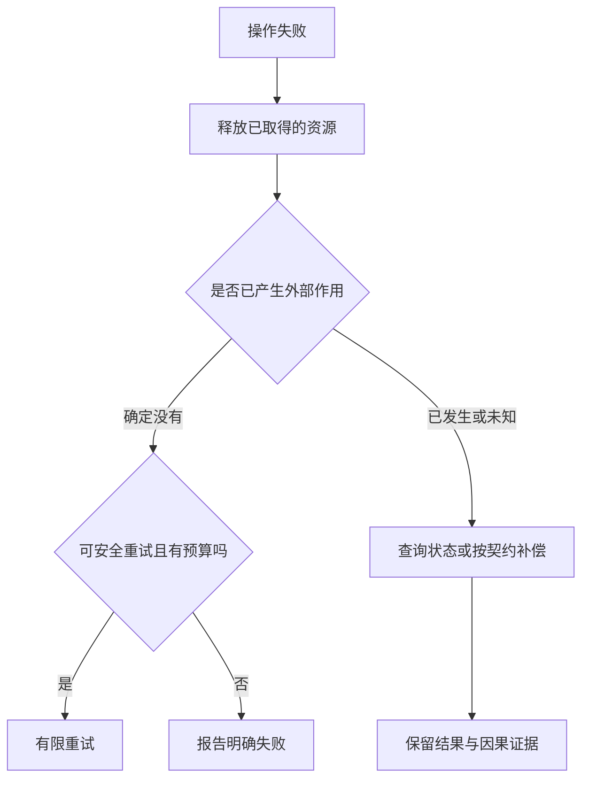

# 错误、异常与资源管理

> 面向需要审查失败路径、处理文件和连接的开发者及代码接管者。读完能选择错误的表达与处理边界，沿正常返回、异常和取消检查资源释放，并区分清理资源、回滚状态与恢复业务。

## 错误不只有“程序崩溃”一种结果

**错误**是实际结果不符合某项约定；**异常**是一些语言用于报告并传播异常情况的控制流机制。语法错误、类型检查错误、业务拒绝与运行时异常位于不同阶段，不能靠一个包住全部代码的异常处理器解决。

活动满额是系统允许出现的业务状态，可以作为明确结果返回；缺少必需配置可能使服务无法安全启动；数据库超时则可能发生在写入之前，也可能发生在写入完成但响应未到达之后。它们都可能让一次操作失败，处理方法却不同。下面的分类是工程判断框架，并非语言规定的统一异常层级。

| 情况 | 调用者需要知道什么 | 常见处理方向 |
| --- | --- | --- |
| 输入不符合约定 | 哪个字段需要修正 | 拒绝输入，提供有限且可操作的信息 |
| 业务条件不成立 | 当前状态与可用替代动作 | 返回明确业务结果，如满额或已报名 |
| 外部资源暂不可用 | 能否重试、是否已产生作用 | 保留原因，按安全条件决定重试 |
| 内部不变量被破坏 | 继续执行是否可信 | 停止相关操作，记录诊断上下文 |
| 用户取消或期限到达 | 哪些操作已停止、哪些结果未知 | 传播取消，释放资源并核对外部状态 |

错误的“可恢复性”与处理位置有关。文件不存在，对读取必需配置的启动程序可能致命，对读取可选缓存的模块则可以回退。底层通常提供原因，上层结合业务目的决定恢复方式，不能仅凭异常类名就认定总是重试或总是退出。

## 错误值与异常怎样传播

**错误值**把成功和失败放入函数返回协议，调用者显式判断。例如 Rust 的 `Result<T, E>` 有 `Ok` 与 `Err` 两种分支；`?` 可传播失败，而 `unwrap` 在 `Err` 时会触发 panic，使当前线程离开正常执行路径，按配置展开或直接中止。显式返回让失败进入类型契约，仍需审查调用者是否忽略、丢弃或错误映射了它。[Rust 可恢复错误](https://doc.rust-lang.org/book/ch09-02-recoverable-errors-with-result.html)

异常通常跳过当前操作的剩余正常步骤，沿调用链寻找匹配的处理器。Python 的 `try`/`except` 只处理约定范围内的异常，未匹配的异常继续向外传播。处理器顺序也有影响：先捕获较宽泛的基类，可能使后面的特定处理器无法生效。[Python 错误与异常](https://docs.python.org/3/tutorial/errors.html)

两种方式都需要回答同一个问题：哪个边界有足够上下文决定下一步？容量计算函数不应该擅自重试数据库，请求入口也不应该把所有存储错误映射为“活动满额”。编辑建议是在能够采取明确动作的地方处理，在其余位置保留原因并传播。转换错误类型时应保留因果链；对外响应不必暴露堆栈、路径或敏感字段，内部诊断却需要能够关联原始故障。

**吞掉错误**是捕获或接收失败后，既不恢复也不报告，却继续返回貌似成功的结果。它会把故障推迟到下一处，并丢失最有价值的上下文。相反，每一层都重复记录同一堆栈，也会让监控误以为发生了多次独立故障。应约定主要记录边界和关联标识。

## 资源需要明确归属与退出动作

**资源**包括文件句柄、网络连接、锁、临时文件以及从连接池借出的连接。它们可能受操作系统或外部系统限制，不能仅靠“对象已不再使用”判断资源已经释放。**资源归属**说明谁负责创建、持有、转移与关闭；借用资源的函数不应在没有契约的情况下关闭调用者仍要使用的对象。

垃圾回收管理内存中的对象，不等价于及时关闭文件或归还连接。Python 数据模型明确建议显式释放外部资源，不依赖对象失去引用后的即时终结。释放连接到池中，也不意味着整个连接池已经关闭；释放锁不意味着先前写入已回滚。

常见语言提供不同清理机制。

| 机制 | 正常用途 | 需要核对的边界 |
| --- | --- | --- |
| Python `with` | 由上下文管理器封装进入与退出 | 进入成功后的退出；进入失败需自行处理已获取资源 |
| `try`/`finally` | 为正常与异常离开安排清理 | 清理本身失败，或清理中返回掩盖原始结果 |
| Go `defer` | 注册函数返回时执行的操作 | 参数在注册时求值；作用范围是函数返回 |
| Rust `Drop` | 在值被销毁时执行资源释放 | 所有权转移、作用域与 panic 中止方式 |

**RAII**（Resource Acquisition Is Initialization，资源获取即初始化）通常指把资源生命周期绑定到拥有它的对象生命周期，使初始化与销毁对应。Rust 的 `Drop` 展示了这种管理方式的一种表达。它能减少遗漏出口，但不能保证程序被强制终止或选择直接中止时仍执行清理；Rust 的 panic 展开与 abort 就具有不同边界。[Rust Drop](https://doc.rust-lang.org/book/ch15-03-drop.html) · [Rust panic](https://doc.rust-lang.org/book/ch09-01-unrecoverable-errors-with-panic.html)

## 用结构覆盖所有可控出口

下面是 Python 示意代码，未执行，假定输入是可转换为整数的文本文件；它只展示资源与错误边界，不是完整配置方案。

```python
def load_capacity(path):
    with open(path, "r", encoding="utf-8") as stream:
        text = stream.read()
    try:
        capacity = int(text.strip())
    except ValueError as cause:
        raise ValueError("容量配置不是整数") from cause
    if capacity < 0:
        raise ValueError("容量配置不能为负数")
    return capacity
```

文件关闭在解析前完成；读取失败会传播，转换失败则增加领域上下文并保留原因。若 `open` 失败，并没有成功进入文件管理上下文，后面的块不会执行。Python 规范保证在 `__enter__` 正常返回后调用 `__exit__`；自定义管理器若在进入时先取得一部分资源再失败，应负责清理这部分资源。`__exit__` 还可以选择抑制异常，因此审查自定义上下文管理器时，应看它是否意外把失败变成成功。[Python 复合语句规范](https://docs.python.org/3/reference/compound_stmts.html#the-with-statement)

Go 的 `defer` 在所属函数返回时执行，延迟调用的参数在注册时就求值，多个延迟调用按后进先出执行。若在很长的循环里不断打开文件并注册 `defer`，资源可能一直保留到整个函数结束；把单次工作拆入一个明确的小函数，可以使释放时间贴近本次任务完成。这是 Go 的规则，不应把它解释为所有语言中的“离开任意代码块就清理”。[Go defer](https://go.dev/blog/defer-panic-and-recover)

`finally` 中的 `return` 或新的错误还可能覆盖本应传播的异常。清理过程宜尽量简单；若关闭或提交结果本身需要向调用者报告，就应设计显式的完成步骤，并约定同时发生主错误与清理错误时如何保留两者，而不是任意丢弃一个。

## 清理不等于回滚，超时不等于未发生

写入了一条报名后，发送通知失败。关闭连接只能释放资源，不能自动删除报名。**回滚**撤销某个事务范围内尚未完成的改变；**补偿**用另一个业务动作修正已生效的结果。是否应删除报名、重新发送通知或保留待处理状态，属于业务设计，而不是异常语法能够决定的问题。

重试之前必须确认：失败可能短暂消失吗，重复执行是否安全，结果是否已经发生，是否还有时间和资源预算。容量不足和权限拒绝通常不应以相同输入无休止重试。网络超时需要考虑结果未知；幂等键、结果查询与明确状态能帮助恢复，但细节由[消息、任务、调度与幂等](/software/backend/messages-jobs-idempotency)和[分布式一致性与部分失败](/software/architecture/distributed-failure)展开。



这张图把资源退出与业务恢复分开。实际代码中清理动作可能再次失败；图中的“释放”表示需要执行与记录的职责，并不承诺所有外部系统必然配合。

## 用失败注入检查退出路径

以下是应建立的验收项目，未在本篇执行。

| 注入位置 | 应观察的结果 | 常见错误 |
| --- | --- | --- |
| 获取资源之前 | 没有不存在资源的关闭操作 | 使用尚未初始化的句柄 |
| 取得第一项资源之后 | 第一项也能释放 | 第二项获取失败泄漏第一项 |
| 主操作中途 | 原因保留，资源退出 | 捕获后返回空集合冒充成功 |
| 保存完成、返回之前 | 结果未知有恢复入口 | 盲目重试造成重复作用 |
| 清理过程中 | 主错误与清理错误可追踪 | 新异常完全掩盖原始原因 |
| 取消或提前返回 | 任务结束且资源归还 | 后台工作继续持有连接 |

还应观察重复失败后资源数量是否持续上升。单次正常完成只能证明一条出口；取消、循环内失败与部分获取失败往往更容易暴露泄漏。强制终止不能靠进程内 `finally` 保证业务完成，持久化与恢复协议应独立设计。

## 参考资料

<Refs>

- [Python：Errors and Exceptions](https://docs.python.org/3/tutorial/errors.html)——异常传播、匹配与因果链（访问日期 2026-10-03）
- [Python：Compound statements](https://docs.python.org/3/reference/compound_stmts.html#the-with-statement)——`finally`、上下文进入与退出的精确语义（访问日期 2026-10-03）
- [Python：Data model](https://docs.python.org/3/reference/datamodel.html)——垃圾回收与外部资源显式关闭的边界（访问日期 2026-10-03）
- [Go：Defer, Panic, and Recover](https://go.dev/blog/defer-panic-and-recover)——`defer` 参数求值、执行顺序与函数退出；历史文章中的语言机制（访问日期 2026-10-03）
- [Rust：Recoverable Errors with Result](https://doc.rust-lang.org/book/ch09-02-recoverable-errors-with-result.html)——错误值与传播（访问日期 2026-10-03）
- [Rust：Running Code on Cleanup with Drop](https://doc.rust-lang.org/book/ch15-03-drop.html) · [Unrecoverable Errors with panic!](https://doc.rust-lang.org/book/ch09-01-unrecoverable-errors-with-panic.html)——销毁清理与展开、中止边界（访问日期 2026-10-03）
- 站内相关：[定位问题与修复](/software/guide/diagnosis-repair) · [函数、作用域与模块](/software/programming/functions-modules) · [异步、并发同步与取消](/software/programming/async-concurrency) · [调试、日志与缺陷管理](/software/quality/debugging-defects) · [分布式一致性与部分失败](/software/architecture/distributed-failure)

</Refs>
