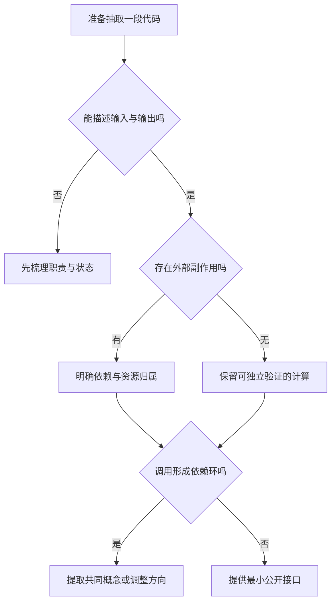

# 函数、作用域与模块

> 面向能读简单分支、准备拆分程序或接手代码的读者。读完能说明一个函数依赖什么、为什么某个名字在这里可见，并判断模块拆分是否真正减少共享状态和依赖混乱。

## 函数建立可以描述的调用边界

**函数**是一段可以调用的程序行为，通常通过参数接收输入，通过返回值或错误报告结果。**形参**是定义中使用的名字，**实参**是调用时提供的值。函数名应帮助调用者理解用途，但真实契约还包括允许的输入、输出、失败方式以及对外部状态的影响。

“传进人数，返回是否可报名”与“读取数据库并写入报名”是不同契约。后者有**副作用**，即改变函数返回值之外可观察的状态，例如文件、共享对象或远程数据。副作用不是错误，但隐藏副作用会让审查者无法判断重试、缓存或重复调用是否安全。

调用通常建立本次执行的局部环境，使参数与局部变量有独立的绑定。递归是函数直接或间接调用自身；每次调用需要保存继续执行所需的状态，因此必须有终止条件，还要考虑运行时的调用深度与资源限制。源码中用了递归，不代表实现一定会做尾调用优化；深目录遍历等任务可以采用显式工作栈，相关结构见[树、图与依赖关系](/software/algorithms/trees-graphs)。

### 返回值不能解释全部行为

下面是 Python 示意代码，未执行：

```python
def add_label(labels, label):
    labels.append(label)
    return len(labels)

def replaced_labels(labels):
    labels = ["replacement"]
    return labels
```

第一个函数修改调用者也可能持有的列表；第二个只让局部名字绑定到新列表。Python 参数传递不意味着把对象递归复制，也不意味着函数可以直接重新绑定调用者的变量名。调用者若需要隔离，应明确谁负责复制，或者把函数设计为返回新值。[Python 控制流与函数教程](https://docs.python.org/3/tutorial/controlflow.html)

接口评审可把下列内容写成一张契约表，而不是只看函数签名。

| 契约项 | 应说明的问题 | 报名系统中的局部例子 |
| --- | --- | --- |
| 输入 | 格式、单位、允许范围 | 人数是整数还是文本；是否允许零 |
| 输出 | 正常结果及其含义 | “已报名”与“本次新增”能否区分 |
| 失败 | 可预期失败还是程序错误 | 满额返回业务结果；存储不可用另行报告 |
| 副作用 | 改变哪些状态、由谁持有 | 是否写入记录、是否发送通知 |
| 时间 | 是否阻塞、是否允许取消 | 导出名单是否占用当前请求 |
| 重复调用 | 是否可安全重复 | 重试是否新增第二条报名 |

## 作用域决定名字解析，寿命决定状态保留

**作用域**是代码中一个名字可以被解析的范围；**命名空间**是名字与对象的关联集合。它们与**生命周期**不同：名字可能只在函数中可见，对象却被返回值或闭包引用而继续存在。

许多语言使用**词法作用域**，按照函数定义在源码中的嵌套关系寻找名字，而不是按照“谁在运行时调用了它”寻找。局部名字与外层同名时会产生**遮蔽**，使读者误以为操作了外部配置，实际改变了本次调用的局部值。局部状态通常更容易推理，前提是依赖通过参数或明确对象传入，不能一面使用局部变量，一面隐式读取大量全局配置。

具体作用域规则必须按语言核对。JavaScript 的 `let` 和 `const` 有块级作用域；Python 的普通 `if`、`for` 语句不因此建立一个独立的函数式局部作用域。在 Python 函数块内出现名称绑定时，该名字通常被视为局部名字，即使赋值在某个较晚的分支中，前面的读取也可能引发 `UnboundLocalError`。`global`、`nonlocal` 可以改变绑定目标，但不应作为修复所有状态设计问题的捷径。[Python 执行模型](https://docs.python.org/3/reference/executionmodel.html)

**闭包**由函数及其所引用的词法环境组合而成，可让回调在外层函数返回后仍访问所需状态。闭包常用于定制行为和保存局部状态，不应理解为“定义时自动复制了所有值”。若多个回调引用同一个可变绑定，它们可能看到后来更新的值；若闭包被长时间保存，它引用的大对象也可能继续被保留。[MDN 闭包](https://developer.mozilla.org/en-US/docs/Web/JavaScript/Guide/Closures)

以下 JavaScript 示意代码未执行，展示闭包保存状态的边界：

```javascript
function makeCounter() {
  let count = 0;
  return {
    increment() { count += 1; },
    value() { return count; }
  };
}
const counterA = makeCounter();
const counterB = makeCounter();
```

两个工厂调用建立不同的局部环境，同一返回对象内的方法则共享各自的 `count`。这种计数只属于当前内存实例，不能当作多个服务实例共同维护的报名总量，也不会自动持久化。闭包隐藏了直接访问入口，仍需要讨论其行为是否满足共享与恢复需求。

### 默认参数也可能携带状态

Python 默认参数在函数定义时求值，使用可变列表作默认值，可能让多次调用意外共享同一个列表。工程建议是以 `None` 等哨兵表示“未提供”，在函数内部为每次调用新建容器；这是 Python 的具体规则，不能照搬为所有语言默认参数的行为。

这一问题说明，读函数不能只看函数体：还应读定义时执行的表达式、装饰器、闭包引用和模块级初始化。若某个函数看似无输入却不断返回不同结果，先检查隐藏的时间、随机数、缓存和共享对象，而不是仅靠增加日志解释现象。

## 模块不是简单的文件分类

**模块**组织一组可引用的定义，并提供命名、导出与依赖边界。模块与文件常有关联，但并非所有语言都是一个文件一个模块；一个包也可能由多个文件组成。目录层级帮助定位，真正的耦合仍取决于代码导入谁、公开什么、初始化时执行什么。

Python 模块首次正常导入时会执行顶层语句；在通常的同一解释器导入流程中，已加载模块会被缓存并复用。重复导入不应被当作“重新初始化”的手段。顶层连接数据库、写文件或读取必须存在的环境配置，会让仅为测试而导入某个函数的操作也触发外部行为。将资源创建放入显式初始化入口，更容易控制失败与清理。[Python 模块教程](https://docs.python.org/3/tutorial/modules.html)

JavaScript 模块的导入绑定是活动绑定，导出方更新可被导入方观察；导入方不能把它当作自己可随意重新赋值的局部变量。循环导入并非必然失败，但若初始化阶段读取了尚未初始化的绑定，就可能报错。因此“编译找得到文件”与“初始化顺序安全”是两种检查。模块装载机制还依赖宿主和构建配置，不可把浏览器的路径解析直接当成 Node.js 的规则。[MDN 模块](https://developer.mozilla.org/en-US/docs/Web/JavaScript/Guide/Modules)

## 按变化与依赖方向拆分

将一个长文件拆成十个短文件，可能只把混乱分散。更有用的判断是：调用者是否只需要知道稳定的行为，内部实现变化能否留在模块内。以下图给出拆分前的决策顺序，属于工程建议。



例如容量规则可以接收容量与当前人数，返回可解释的判断；数据库访问负责读取和写入；请求入口负责身份与错误映射。这里不是推荐固定分层架构，而是把不同原因的变化隔开。容量规则调整不应要求修改数据库驱动；数据库替换也不应重新定义“是否满额”。跨模块事务与完整接口设计见[模块边界、依赖与接口](/software/architecture/modules-interfaces)。

| 情况 | 可优先考虑的组织方式 | 代价与边界 |
| --- | --- | --- |
| 多处使用同一纯计算 | 小函数与明确参数 | 先确认规则相同，避免只因代码相似而强行复用 |
| 一组行为共享长期状态 | 明确状态持有者或工厂 | 必须定义实例数量、重置与并发边界 |
| 外部系统可能替换 | 公开业务能力，隐藏驱动细节 | 增加接口成本，不能隐去真实失败语义 |
| 一次性短脚本 | 简单函数和少量模块 | 不必为假想扩展建立复杂层级 |
| 模块互相导入 | 调整职责或提取共同契约 | 不能只靠延迟导入掩盖持续的设计循环 |

## 失败时先找到隐藏的依赖

| 现象 | 常见原因 | 核对动作 |
| --- | --- | --- |
| 单独调用正常，批量调用串数据 | 可变默认参数或共享容器 | 追踪对象身份及创建位置 |
| 函数返回后状态仍占内存 | 回调、缓存或闭包仍持有引用 | 检查注册与解除注册的生命周期 |
| 导入一个工具函数就连外部资源 | 模块顶层副作用 | 将装载与初始化分别审查 |
| 调换导入顺序出现错误 | 循环依赖与初始化读取 | 画出依赖环，检查访问时机 |
| 测试必须修改全局配置 | 依赖没有通过接口显式传入 | 明确配置归属与调用边界 |
| 同名变量结果与预期不同 | 遮蔽或名称解析规则误解 | 按语言规则定位实际绑定 |

模块结构也需要验收：除了正常调用，还应检查重复调用、独立导入、失败初始化与资源关闭。正文示例未运行，不代表这些条件已在某个项目中得到验证。

## 参考资料

<Refs>

- [Python：Execution model](https://docs.python.org/3/reference/executionmodel.html)——名称绑定、作用域与名称解析（访问日期 2026-10-03）
- [Python：More Control Flow Tools](https://docs.python.org/3/tutorial/controlflow.html)——函数参数、对象引用与默认值求值规则（访问日期 2026-10-03）
- [Python：Modules](https://docs.python.org/3/tutorial/modules.html)——模块执行、导入复用与组织方式（访问日期 2026-10-03）
- [MDN：Closures](https://developer.mozilla.org/en-US/docs/Web/JavaScript/Guide/Closures)——词法环境、共享绑定与闭包（访问日期 2026-10-03）
- [MDN：JavaScript modules](https://developer.mozilla.org/en-US/docs/Web/JavaScript/Guide/Modules)——活动绑定与循环导入的初始化边界（访问日期 2026-10-03）
- 站内相关：[语言、框架、运行时与依赖](/software/guide/languages-frameworks-dependencies) · [变量、类型与控制流](/software/programming/types-control-flow) · [抽象、接口与编程范式](/software/programming/abstraction-paradigms) · [工程目录与配置](/software/toolchain/project-structure) · [模块边界、依赖与接口](/software/architecture/modules-interfaces)

</Refs>
