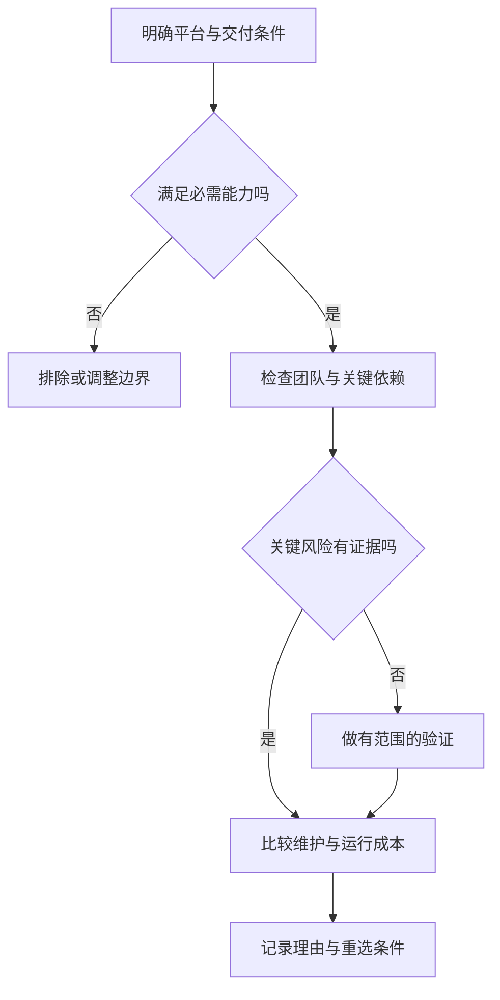

# 语言、运行时与工程选型

> 面向需要确定技术栈、接管跨语言项目或评估 AI 提议的读者。读完能把语言、运行时、库与框架放在不同层次比较，依据部署与工作负载筛选候选，并写出可以复核的选择理由。

## 选择的不是一个语言名字

**编程语言**规定表达式、类型、控制流与其他语义；**语言实现**把这些规则落实为编译器、解释器等软件；**运行时**提供程序执行所需的能力，可能包含虚拟机、内存管理、调度与标准库。**库**提供被程序调用的能力，**框架**通常还规定某部分程序的组织和执行入口。

这些词有不同粒度，选型记录应写明范围。“JavaScript 还是 Node.js”不是同层候选，前者是语言，后者是一个运行环境。“Python 还是某个 Web 框架”也缺少对称性：框架仍依赖语言实现、部署环境和相关库。更完整的候选是语言、实现、关键框架和交付方式的组合。

同一份语言代码也会受宿主约束。浏览器提供页面与 Web 接口，Node.js 提供自己的系统能力，二者不因为都执行 JavaScript 就具有相同权限、模块装载或资源访问方式。语法支持也不代表某个宿主 API 存在。机制链见[从源码到运行中的程序](/software/foundations/source-to-runtime)，本篇重点讨论这些差异如何进入决策。

## 四种机制差异会形成工程后果

### 静态检查与实际执行

TypeScript 在 JavaScript 之上提供类型检查；其类型注解通常被处理掉，不成为运行时自动校验。源码可以经过编译输出 JavaScript，也可能由相应工具处理类型语法后执行。是否执行类型检查，应查项目实际流程，不能因为工具成功加载 `.ts` 就推断所有类型错误已被排除。[TypeScript 基础](https://www.typescriptlang.org/docs/handbook/2/basic-types.html)

静态检查可以减少某些调用与结构错误，但强度还依赖配置、第三方类型描述和代码中是否绕过检查。动态类型语言可以通过显式校验、静态分析与测试提高可信度，静态类型语言也仍需要权限、状态和接口契约验收。选型应比较目标错误能在哪个阶段被发现，而不是把“有类型”当作总体质量排名。

### 编译产物与执行环境

JVM（Java 虚拟机）规范定义抽象机器及 `class` 文件格式，运行时具体采用何种内存布局、垃圾回收或指令优化，由实现决定。字节码的通用格式有助于平台间交付，却不保证任何产物都能在任意 JVM 上运行：目标版本、库、原生扩展与系统接口仍需匹配。[JVM 规范](https://docs.oracle.com/javase/specs/jvms/se25/html/jvms-2.html)

Go 的常用实现提前编译为原生机器码，但程序仍包含负责垃圾回收、并发与栈管理的运行时支持。原生可执行文件不等于“没有运行时”，也不等于完全没有平台依赖。交付需要核对操作系统、处理器架构、所链接的库和运行时资源。[Go FAQ](https://go.dev/doc/faq)

因此，部署难度不应按“编译型/解释型”二分。真正要盘点的是运行环境可否取得、依赖是否齐全、产物是否对应目标平台，以及问题发生后能否定位到源码与版本。

### 内存与资源管理

垃圾回收通过运行时回收不再需要的对象，减少手工释放内存的负担，但仍会产生分配与回收的资源成本。具体停顿和吞吐要在所选实现与实际负载下测量，不能为所有垃圾回收语言设定统一延迟结论。文件、连接和锁仍需要显式的生命周期设计。

Rust 通过编译器检查的所有权规则组织内存管理，资源释放可与值的生命周期关联。它把一些问题提前为编译错误，代价包括学习所有权、借用与接口表达。不能据此断言程序绝无资源泄漏、业务竞争或安全缺陷；外部接口与底层不安全实现仍需审查。[Rust 所有权](https://doc.rust-lang.org/book/ch04-01-what-is-ownership.html)

资源受限的设备、延迟敏感路径与普通管理服务对这些成本的容忍度不同。应把最大内存、响应目标和故障恢复写成约束，再检查某个实现是否满足，避免从某种机制直接推导“适合所有高性能系统”。

### 并发模型与实现差异

异步 I/O、线程、进程与语言级任务有不同调度和共享方式。传统带 GIL（全局解释器锁）的 CPython 构建限制同一时刻执行 Python 字节码的线程数量，但线程仍可用于等待型并发，部分扩展也有不同执行边界。官方还提供可禁用 GIL 的自由线程构建，因此不能把这一实现条件写成“Python 永远不能并行”的语言定律。[Python threading](https://docs.python.org/3/library/threading.html)

Node.js 可以借助异步接口组织等待，也可用 worker threads 执行并行计算。Go 的运行时管理语言级并发活动。无论采用哪种机制，多实例容量与重复报名都需要共同数据边界上的约束，语言的调度模型不会自动替业务完成它。选型应检查所需库能否配合取消、期限、背压与错误传播，见[异步、并发同步与取消](/software/programming/async-concurrency)。

## 以同一层次比较典型组合

下面是机制入口和审查重点，不是推荐排名，也没有性能测试结论。

| 典型组合 | 可使用的工程特征 | 选择前必须核对 |
| --- | --- | --- |
| JavaScript / TypeScript 与浏览器或 Node.js | 共享语言知识，使用对应宿主接口；可引入静态检查 | 客户端与服务端安全边界、模块配置、检查是否执行 |
| Python 与 CPython、项目虚拟环境 | 库组合与自动化；按项目隔离安装环境 | 解释器、原生扩展、并发模型与部署复现 |
| Java 与 JVM 实现 | 规范化字节码与运行时生态 | 目标字节码、实际 JVM、内存与原生依赖 |
| Go 与其构建工具及运行时 | 原生交付与语言级并发支持 | 平台、外部链接、调度与资源预算 |
| Rust 与目标工具链 | 所有权检查与原生资源控制 | 团队理解成本、目标平台、依赖及不安全边界 |

Node.js 同时支持 CommonJS 与 ECMAScript 模块，文件扩展名和 `package.json` 等配置参与装载判断；把两个体系混用会产生互操作与解析问题。这里不提供跨版本统一捷径，应以项目实际运行时文档核对。Python 虚拟环境隔离项目的安装包集合，但不能替代操作系统沙箱，也不能独自保证依赖版本可复现。[Node.js 模块文档](https://nodejs.org/api/modules.html) · [Python Packaging 环境指南](https://packaging.python.org/en/latest/guides/installing-using-pip-and-virtual-environments/)

## 先排除不满足硬约束的组合

**硬约束**是任何候选必须满足的条件，例如必须运行的目标平台、必须调用的设备接口、可取得的运维环境。**偏好**是候选满足必要条件后再比较的因素，例如语法熟悉、代码长度或已有模板。两者混在一起，会让易写的原型掩盖不能部署的事实。

对于虚构的小型活动报名系统，可以先列：浏览器列表与详情、报名取消、管理员名单导出、容量与去重、权限控制、无支付与多租户。浏览器界面与服务端可以使用不同语言；统一语言能减少一部分学习与数据表达成本，却不会消除 HTTP、授权与持久化边界。

若已有团队熟悉某个运行时，并且关键能力有成熟依赖，沿用它是可考虑的维护成本因素。这里的“熟悉”是假设条件，应通过代码审查、调试和交付能力核对，不能把 AI 能生成某语言代码当作团队已经能维护它。若只有一个导出计算明显耗时，先测量它，再讨论是否分离计算，不能凭推测重写整个服务。

## 用小而完整的验证消除关键不确定性

选型验证应针对可能改变决策的风险，不是制作一个“Hello World”后宣称可生产。可以选取一段从输入到持久化再到输出的纵向流程，包含正常、拒绝与故障路径；以下是验证计划，未执行。

| 不确定性 | 验证任务 | 应保存的证据 |
| --- | --- | --- |
| 关键依赖能否用 | 在目标平台调用必需接口 | 版本、配置、失败与许可条件 |
| 容量规则是否可靠 | 竞争与重复提交 | 状态、结果与共同写入约束 |
| 是否便于维护 | 修改规则并审查调用点 | 变更范围、检查与诊断方式 |
| 资源是否满足目标 | 代表性负载下测量 | 输入分布、环境、延迟与内存 |
| 交付能否复现 | 在干净目标环境构建运行 | 清单、锁文件、工具链与产物 |
| 故障后是否可恢复 | 超时、重启、取消与回退 | 结果未知的恢复入口与操作记录 |

性能比较必须固定算法、输入、并发、资源与测量方式，区分启动、预热和持续运行。微基准中的一次计算速度不能直接代表含数据库与网络等待的整个请求。结论应写为“该组合在此负载与环境下满足目标”，并说明范围，不能扩展成语言的绝对速度排名。

## 记录选择，也记录重新选择的条件

一份简短选型记录至少包括问题、硬约束、候选组合、被排除的原因、验证证据与剩余风险。例如“沿用现有运行时，因为关键流程可实现且维护者可审查；导出计算尚待负载验证”比“某语言最适合后端”更可复核。没有实际实验时应写“待验证”，不能以公开基准替代本项目证据。

重选条件可以是必需接口不再支持、依赖无法继续维护、目标平台变化，或测量确认原方案无法在合理成本内满足目标。迁移还包括接口兼容、数据语义、观测与回退，不应只计算重写源码的工作量。运行时升级与替换的具体实践见[依赖升级、弃用与兼容](/software/maintenance/upgrades-compatibility)。

常见失败是只比较语法，忽略交付环境；把某个实现的限制写成所有语言的限制；用通用榜单替代实际负载；以及为未来规模引入当前团队无法维护的复杂度。语言是工程能力的一部分，选择完成的证据是系统可以被验证、交付和维护。

## 参考资料

<Refs>

- [TypeScript：The Basics](https://www.typescriptlang.org/docs/handbook/2/basic-types.html)——静态检查、类型擦除与检查配置（访问日期 2026-10-03）
- [Node.js：Differences between Node.js and the Browser](https://nodejs.org/en/learn/getting-started/differences-between-nodejs-and-the-browser) · [Modules](https://nodejs.org/api/modules.html)——宿主与模块体系差异（访问日期 2026-10-03）
- [Python：threading](https://docs.python.org/3/library/threading.html)——CPython GIL 与自由线程构建的实现边界（访问日期 2026-10-03）
- [Python Packaging：Install packages in a virtual environment](https://packaging.python.org/en/latest/guides/installing-using-pip-and-virtual-environments/)——项目安装环境隔离（访问日期 2026-10-03）
- [Java Virtual Machine Specification：Introduction](https://docs.oracle.com/javase/specs/jvms/se25/html/jvms-1.html) · [The Structure of the JVM](https://docs.oracle.com/javase/specs/jvms/se25/html/jvms-2.html)——抽象机器、字节码及实现自由度；引用 SE 25 规范，未核验所有 JVM 实现（访问日期 2026-10-03）
- [Go：FAQ](https://go.dev/doc/faq)——原生编译与运行时支持的关系（访问日期 2026-10-03）
- [Rust：What Is Ownership?](https://doc.rust-lang.org/book/ch04-01-what-is-ownership.html)——编译器检查的所有权与资源生命周期（访问日期 2026-10-03）
- 站内相关：[语言、框架、运行时与依赖](/software/guide/languages-frameworks-dependencies) · [抽象、接口与编程范式](/software/programming/abstraction-paradigms) · [依赖与锁文件](/software/toolchain/dependencies-lockfiles) · [构建工具链与制品](/software/toolchain/build-artifacts) · [架构决策与验证](/software/architecture/architecture-decisions)

</Refs>
