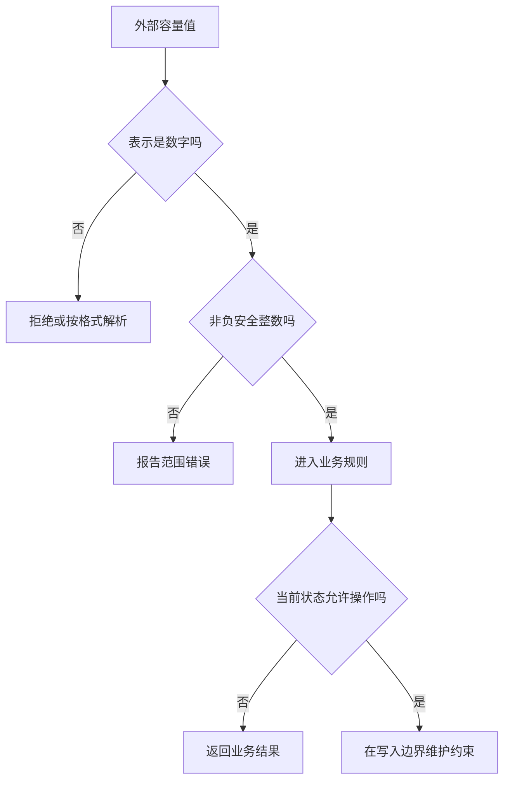

# 变量、类型与控制流

> 面向刚开始读代码、需要审查 AI 生成逻辑的读者。读完能追踪值如何变化，判断类型检查与输入校验的边界，并用分支、循环和不变量解释一个程序为什么正确或为什么出错。

## 先追踪值，再追踪名字

**值**是程序处理的数据，如人数 `30`、标题字符串或一个报名记录。**变量**是程序用来引用值或存储状态的具名入口；具体机制由语言决定，不能把所有变量都理解为“固定大小的盒子”。Python 的名字绑定到对象，对象具有身份、类型和值；C 等语言还需要讨论存储位置、大小与指针。本文用 Python 和 JavaScript 系列说明常见问题，示例语言不构成项目技术栈要求。

**赋值**建立或改变绑定，**修改**改变对象内部状态，二者可能产生不同影响。下面是 Python 示意代码，未执行：

```python
first = ["entry-a"]
second = first
second.append("entry-b")
second = []
```

前两行让两个名字引用同一列表，这种多个入口指向同一对象的关系叫**别名**。`append` 修改共享列表，因此通过 `first` 也能观察到新增元素；最后一行只让 `second` 改为引用新列表。判断代码的影响，应问“改的是绑定还是被引用的对象”，再找还有谁持有该对象。[Python 数据模型](https://docs.python.org/3/reference/datamodel.html)

JavaScript 的 `const` 限制重新赋值，不能由此推断对象内部不可变。`const event = { capacity: 30 }` 之后仍可修改 `event.capacity`。复制也有层级：新建一个外层对象，并不自动复制它引用的所有子对象。工程中若把“修改前快照”用于比较或撤销，就必须明确复制范围，不能仅凭一个赋值符号认定状态已隔离。[JavaScript 语法与类型](https://developer.mozilla.org/en-US/docs/Web/JavaScript/Guide/Grammar_and_types)

## 类型约束回答什么

**类型**描述可取的值以及允许的操作。整数计数适合加减，字符串适合文本处理；把容量表示为任意文本，会把解析失败推迟到比较或计算时。类型还可以表达领域含义：活动标识和用户标识即使都是字符串，也不应该随意互换。

**静态类型检查**在执行前分析代码是否符合类型规则；**动态类型检查**在运行时根据实际值决定操作是否成立。类型推断是工具从表达式推导类型，推断成功并不表示语言变为动态类型。动态类型语言同样有类型，静态类型语言也可能保留运行时检查。它们都不能仅凭类型规则证明“只有管理员可以导出名单”。

TypeScript 是一个有代表性的边界：类型注解和 `as` 类型断言不会为外部数据自动增加运行时校验。断言是在告诉检查器“按这个类型理解”，并没有把字符串转换成数字，也不会检查网络响应是否有必填字段。`any` 允许绕过大量检查，`unknown` 则要求使用前先确认值的形态。拿到配置、表单或网络响应后，应通过校验把未知数据转换为受信任的内部表示。[TypeScript 常用类型](https://www.typescriptlang.org/docs/handbook/2/everyday-types.html)

类型是否足够，要看错误发生在哪一层。

| 要排除的问题 | 可用约束 | 仍需补充的证据 |
| --- | --- | --- |
| 给计数函数传入对象 | 参数类型与静态检查 | 实际构建确实执行了检查 |
| 外部容量字段是 `"30"` | 运行时解析与格式校验 | 接受什么文本格式、失败如何报告 |
| 容量为负数或小数 | 范围与整数校验 | 业务允许的上下限 |
| 两个标识传反 | 专门类型或具名参数 | 数据来自正确业务对象 |
| 报名数超过容量 | 状态规则和写入约束 | 并发提交时规则仍成立 |

## 转换、相等与缺失值会改变分支

**类型转换**生成另一种表示；隐式转换由语言在运算中自动完成，显式转换由代码主动请求。JavaScript 的 `==` 会执行特定的类型转换，`===` 不进行这种转换。编辑建议是在普通业务比较中优先明确输入表示，再使用严格比较；若确实需要宽松比较，应写明理由与边界。[JavaScript 相等比较](https://developer.mozilla.org/en-US/docs/Web/JavaScript/Guide/Equality_comparisons_and_sameness)

相等也不等于同一对象。两个 JavaScript 对象即使字段相同，通常也不会因 `===` 而相等；它比较的是对象身份。业务上的“同一次报名”应由活动标识、用户标识或请求标识等规则定义，不能依赖对象是否恰好来自同一内存引用。

还要区分“字段缺失”“值为空”“数值为零”。`if (capacity)` 把判断交给语言的真假值规则，可能把合法的零容量与缺失字段混在一起。若零表示暂不开放，应该明确检查缺失，再检查范围。空字符串、`null`、`undefined`、`None` 在不同语言和接口里含义不同，应在数据边界约定，而不是散落在各处分支里猜测。

数值类型也有表示边界。JavaScript `number` 的安全整数有有限范围，`Number.isSafeInteger` 不接受字符串、非整数或非安全范围内的值。Python 整数的表示规则不同，因此跨语言接口不能仅凭两边都叫“整数”就假定范围相同。容量这样的计数通常宜使用有明确范围的整数；精度与测量问题见[工程数学与度量基础](/software/foundations/engineering-math-measurement)。

## 用校验建立后续代码的前提

下例选择“只接受已解码的数字”，不自动接纳文本数字。这是示意代码，未执行；如果表单提供文本，应在前一层使用另一个有明确格式规则的解析函数。

```typescript
function checkedCapacity(input: unknown): number {
  if (typeof input !== "number") {
    throw new TypeError("容量必须是数字");
  }
  if (!Number.isSafeInteger(input) || input < 0) {
    throw new RangeError("容量必须是非负安全整数");
  }
  return input;
}
```

第一处分支使 TypeScript 在后续路径中把输入**收窄**为数字，即根据已成立的条件获得更具体的类型；第二处分支建立更强的业务前提。返回类型仍只是 `number`，因此“非负整数”的约束还需靠函数约定、专门类型或更严格的封装维持。这里使用异常表达失败，其他错误表示方式见[错误、异常与资源管理](/software/programming/errors-resource-management)。



图中每一道判断建立下一层的前提。格式正确不能替代权限检查，权限允许不能替代容量约束；只有这些层次组合起来，报名行为才有可解释的依据。

## 控制流是状态如何变化的路径

**控制流**规定执行次序，包括顺序执行、条件分支、循环和提前返回。阅读长函数时，可先标出所有出口，再为每个出口写出“什么输入与状态会到这里”。这种方法比只阅读正常路径更容易发现错误后仍执行写入、提前返回跳过清理等问题。

分支条件的先后顺序有业务后果。活动已满且用户已有报名时，是返回“已报名”，还是“满额”？两种次序都能写成合法代码，但验收期望可能不同。应先明确状态规则，再安排条件顺序。短路求值也应谨慎使用：在许多语言中，逻辑与会在前项为假时跳过后项，但返回值和可接受操作数因语言不同，不能把带有写入副作用的表达式藏在条件中。

循环需要两个判断：每次迭代必须保持什么，以及最终为什么停止。**循环不变量**是在进入循环及每次迭代边界都成立的条件。例如逐项检查导出记录时，处理完前 `k` 项后，“已输出条数等于其中符合条件的条数”。再用剩余项数不断减少说明终止。若终止条件依赖网络返回或外部状态，则还需要超时、最大尝试次数或取消机制，不能假定外部世界必然满足条件。

Python `range` 的终点不包含在范围内。遍历 `range(n)` 对应 `0` 到 `n-1`，这是边界错误的常见来源。修改正在遍历的集合还会使后续访问难以推断；可以先选出目标，再执行改变，或按语言和容器文档使用支持该操作的迭代方式。[Python 控制流教程](https://docs.python.org/3/tutorial/controlflow.html)

## 让验收覆盖路径与状态

以下是针对计数与分支逻辑的编辑建议，不是已执行的测试结果。

| 现象或风险 | 应检查的样本 | 判断依据 |
| --- | --- | --- |
| 类型正确但容量无效 | 负数、小数、零、上限与上限外 | 明确区分表示范围与业务范围 |
| 缺失值走入正常路径 | 字段缺失、空文本、显式空值 | 每种输入有约定结果 |
| 修改一个记录影响另一个 | 两个变量引用同一嵌套对象 | 找到共享对象与修改位置 |
| 边界漏掉一项 | 空集合、一项、最后一项 | 迭代范围与输出数量对应 |
| 条件单独正确、组合错误 | 已报名且满额等重叠状态 | 优先级符合业务规则 |
| 单次正确、并发超额 | 两次操作读取同一剩余容量 | 约束覆盖共同写入边界 |

变量与类型让局部程序更容易推理，仍不能把多请求中的检查和更新自动变成不可分割操作。并发同步见[异步、并发同步与取消](/software/programming/async-concurrency)，业务状态的完整设计见[业务逻辑、规则与状态机](/software/backend/business-state-machines)。

## 参考资料

<Refs>

- [Python：Data model](https://docs.python.org/3/reference/datamodel.html)——对象、身份、类型与可变性（访问日期 2026-10-03）
- [Python：More Control Flow Tools](https://docs.python.org/3/tutorial/controlflow.html)——分支、循环与范围边界（访问日期 2026-10-03）
- [MDN：Grammar and types](https://developer.mozilla.org/en-US/docs/Web/JavaScript/Guide/Grammar_and_types)——声明、`const` 与对象修改（访问日期 2026-10-03）
- [MDN：Equality comparisons and sameness](https://developer.mozilla.org/en-US/docs/Web/JavaScript/Guide/Equality_comparisons_and_sameness)——转换、相等与对象身份（访问日期 2026-10-03）
- [MDN：Number.isSafeInteger](https://developer.mozilla.org/en-US/docs/Web/JavaScript/Reference/Global_Objects/Number/isSafeInteger)——数值安全整数的范围与检查（访问日期 2026-10-03）
- [TypeScript：Everyday Types](https://www.typescriptlang.org/docs/handbook/2/everyday-types.html) · [Narrowing](https://www.typescriptlang.org/docs/handbook/2/narrowing.html)——类型断言不做运行时校验、控制流收窄（访问日期 2026-10-03）
- 站内相关：[语言、框架、运行时与依赖](/software/guide/languages-frameworks-dependencies) · [从源码到运行中的程序](/software/foundations/source-to-runtime) · [函数、作用域与模块](/software/programming/functions-modules) · [静态检查、类型与审查](/software/quality/static-analysis)

</Refs>
