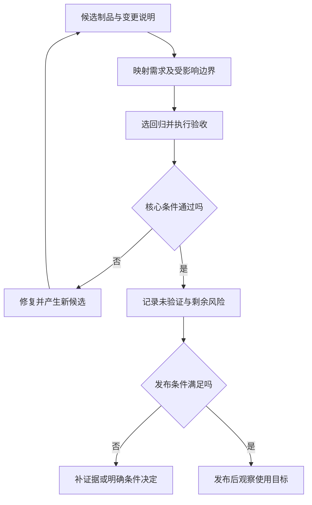

# 验收、回归与质量度量

> 面向验收者、测试人员与发布负责人。读完能连接需求、候选制品和真实证据，选择受影响的回归范围，并识别覆盖率与通过率何时会误导决定。

## 验收是基于约定的使用判断

**验收**由约定角色判断交付结果是否达到已同意的条件。它需要明确对象、范围、标准和证据，不能以演示气氛或开发者口头“已完成”代替。NASA 区分对规格符合性的验证和对预期使用目的的确认。[产品实现指导](https://www.nasa.gov/reference/5-0-product-realization/) 软件验收通常需要同时考虑这两类问题。

虚构报名系统的候选版本应该让普通账号在开放活动报名、满额时取得清楚拒绝、取消后看到正确状态，管理员得到权限允许的名单。页面能打开只证明某个入口可达；核心数据规则、角色拒绝、导出内容与恢复操作需要独立证据。

验收对象应是将发布的**制品**，即由源码构建得到的可交付文件、包或镜像。源码提交、制品内容摘要、配置和数据库结构共同决定运行行为。验收后重新构建或手工修改文件，会产生新的对象，旧记录不能自动沿用。

## 回归范围沿影响关系推导

**回归测试**检查改动是否破坏原本满足要求的行为。回归不是每次机械重跑全部操作，也不是只复查改动页面。共用校验、身份组件、数据库字段、依赖版本、入口配置都会跨功能影响；范围应依据变化原因及调用关系判断。

| 变更类型 | 优先回归范围 | 原因 |
| --- | --- | --- |
| 文案与视觉 | 对应页面、布局和可访问性 | 关注表达与交互，不推定数据变化 |
| 容量规则 | 报名、取消、重试及并发 | 同一计数关系影响多个操作 |
| 身份与权限 | 各角色、对象和直接接口请求 | 页面限制不能替代服务端授权 |
| 数据库迁移 | 新旧制品读写、约束与恢复 | 数据结构影响兼容和回退 |
| 依赖或运行时升级 | 构建、启动、关键旅程与异常 | 可能改变解析与运行行为 |
| DNS 或入口 | 实际域名、TLS、路由和缓存 | 应用不变仍可能无法使用 |

**冒烟测试**是快速检查关键路径是否基本可用的少量用例。它适合发现严重部署错误，不等于完成全部验收。对风险未知的大范围变更，可以扩大回归；对明确低风险局部变更，可以选择更小但足以覆盖影响的证据，并说明依据。

一次功能验收通过和整个版本可发布是不同判断。后者还要核对配置、数据变更、监测、恢复和责任安排。

## 一个可追踪的验收包

以下是未执行的教学方案。为每条核心规则设置稳定标识，例如容量、重复、权限、导出；关联需求文本、实现差异和测试记录。验收前确认标准已经协商，而不是在发现失败后临时解释“其实这个不重要”。准备合成账号与活动，保留数据初态和入口条件。

| 项目 | 要记录的内容 | 为什么必要 |
| --- | --- | --- |
| 验收对象 | 提交、制品摘要与配置指纹 | 防止对象被重新构建或替换 |
| 执行环境 | 入口、依赖、数据库结构与数据 | 解释结果适用条件 |
| 核心规则 | 标识、场景与明确预期 | 确保检查基于约定 |
| 执行证据 | 实际结果、时间、操作者及位置 | 支持独立复核 |
| 缺口 | 未执行、受阻、失败与剩余风险 | 避免把未知误写成通过 |
| 决定 | 接受、拒绝或带条件接受 | 连接风险与责任 |

证据可以是测试报告、脱敏请求、状态查询和实际角色执行记录。截图展示一个瞬间，不能独立证明数据库唯一性；自动测试展示选定条件，不能替代对管理流程可理解性的确认。互补材料应关联同一候选版本。

**带条件接受**明确哪些非阻断问题可以在指定条件下交付，并保留影响、责任和期限。若核心数据约束失败或越权风险未解决，不能仅用“总体通过率较高”放行。决定者需要理解剩余风险，不能被表格中的绿色状态替代。

## 指标必须解释分母与用途

**代码覆盖率**记录测试执行到的代码范围，例如行或分支。Google 的指导将它视为间接指标，并说明高覆盖率不保证有效测试。[覆盖率实践](https://testing.googleblog.com/2020/08/code-coverage-best-practices.html) 执行了容量判断，不代表检查了最终计数；运行所有分支，也可能没有覆盖真实并发时序。

**测试通过率**需要说明分母是否包括未执行、跳过、受阻和重试。只在已执行用例中计算通过率可能掩盖关键用例无法运行；重试后成功不能抹掉首次失败。对一个核心越权用例而言，其他大量文案用例通过并不能稀释它的后果。

| 指标 | 适合的用途 | 常见误用 |
| --- | --- | --- |
| 需求证据覆盖 | 发现规则未关联检查 | 把所有需求同权计数 |
| 代码覆盖率 | 定位未执行分支和变化 | 用统一百分比证明正确 |
| 缺陷逃逸 | 分析发布后发现的遗漏 | 忽略观察时间与用户规模 |
| 不稳定测试比例 | 维护反馈可信度 | 重试成功就删除失败记录 |
| 修复周期 | 发现等待与交接瓶颈 | 用速度鼓励表面关闭问题 |
| 用户服务指标 | 检查实际使用表现 | 把基础设施在线等同业务成功 |

质量指标适合观察趋势与调查原因，不宜直接排名个人。缺陷多可能说明测试更深入，缺陷少可能说明未被发现；样本和口径改变应记录。新版本使用量增加时，缺陷数量上升并不自动等于质量下降，需要结合失败率、影响与发现能力。

## 运行证据补充发布前结论

**服务等级目标**（SLO）定义用户可感知服务表现的目标。Google SRE 的实施指导强调从用户目标与可测指标建立 SLO。[实施 SLO](https://sre.google/workbook/implementing-slos/) 工程上，报名成功、拒绝是否符合规则、延迟和数据正确性应分别观察；只看 HTTP 200 会漏掉业务错误。

发布后应关联版本、功能开关与事件，对比目标窗口内的实际表现。运行指标异常是调查信号，需要判断负载、环境、依赖或代码变化；不能仅因与发布时间接近就确认根因。发现遗漏后补充能够揭示该风险的回归，再复查检查层次和验收条件。

## 可用性验收需要观察真实角色的理解

一项功能按规格完成，使用者仍可能误解其结果。报名超时后只显示“失败”，而后台已经成功，会引导用户反复提交；管理员看到导出按钮变灰，却不知道任务是否还在进行，可能重复创建任务。验收应让代表角色完成旅程，并解释他们怎样理解状态、采取下一步操作及恢复异常。

这类确认可以记录任务是否完成、需要哪些帮助、误解发生在哪个环节，以及界面和规则的改进决定。少量观察用于发现问题，不能当作全体用户满意率或未经设计的统计研究。发现表达问题后，回归应同时检查显示与业务终态，避免仅改文案却让状态更加矛盾。角色样本、使用条件和结论范围应与技术证据一并保存。

## 常见失败模式与边界

| 失败模式 | 影响 | 修正 |
| --- | --- | --- |
| 验收源码，发布另一个制品 | 证据无法支持线上对象 | 晋级同一不可变制品 |
| 只验正常场景 | 拒绝与恢复路径遗漏 | 状态、角色、边界与终态检查 |
| 测试数量作为质量目标 | 容易增加低价值用例 | 按风险与失效发现能力评估 |
| 改需求时不改判定 | 旧测试持续误报或错误放行 | 版本化标准并评估证据失效 |
| 把验收通过等同永久可靠 | 环境和使用条件变化 | 保留 SLO、事件与维护反馈 |

验收结论始终有范围。没有执行的压力、恢复、安全或兼容检查必须写为未验证；审查过计划不能写成演练完成；工具报绿也不能替代使用目标的确认。

## 参考资料

<Refs>

- [NASA：Product Realization](https://www.nasa.gov/reference/5-0-product-realization/)（访问日期 2026-10-03）— 验证、确认与证据
- [Google Testing Blog：Code Coverage Best Practices](https://testing.googleblog.com/2020/08/code-coverage-best-practices.html)（访问日期 2026-10-03）— 覆盖率的限制
- [Google SRE：Implementing SLOs](https://sre.google/workbook/implementing-slos/)（访问日期 2026-10-03）— 用户目标与运行度量
- 站内相关：[验收标准](/software/requirements/acceptance-criteria) · [质量策略](/software/quality/quality-strategy) · [构建与 CI](/software/delivery/build-ci) · [发布与回滚](/software/delivery/release-rollback)

</Refs>
