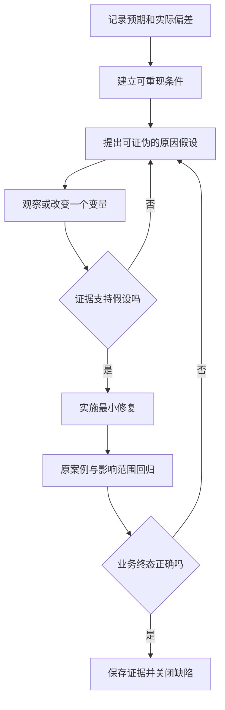

# 调试、日志与缺陷管理

> 面向定位错误和维护问题记录的开发者、测试人员。读完能用证据缩小原因范围，把一个现象整理成可重现的缺陷，并验证修复没有扩大影响。

## 从现象到可检验的假设

**调试**是观察程序并验证原因假设的过程。**缺陷**是实际行为与约定行为之间可定位的偏差；它可以来自代码，也可以来自配置、数据、依赖或需求矛盾。用户说“报名失败”是现象，尚不足以断言数据库有问题。

先明确预期：用户身份是什么，活动是否开放，剩余名额怎样计算，操作是否重复。随后记录实际：请求时间、路径、业务码、关联标识、页面状态和最终数据。若预期规则有争议，先标记需求待澄清；直接改实现可能使另一组合理用例失败。

**最小可重现案例**只保留触发偏差必要的条件。删除无关步骤有助于找到因果，但不能把真实竞态、权限或数据形态同时删掉。例如生产中两个事务竞争才超额，改成一次串行申请后不再失败，并没有证明原问题不存在。

| 已知现象 | 初始假设 | 能区分原因的证据 |
| --- | --- | --- |
| 页面提示超时，名单出现报名 | 写入完成但响应丢失 | 提交事件、请求关联与终态 |
| 普通账号偶尔能导出 | 缓存或身份边界错误 | 身份、对象、缓存键与授权事件 |
| 部分活动显示负名额 | 取消重试重复更新 | 操作序列与记录、计数对照 |
| 新版本无法连接数据库 | 配置、网络或驱动差异 | 配置指纹、连接错误和依赖版本 |

表中都是待验证假设。证据要能排除备选解释，不能只收集支持最初判断的截图。

## 控制变量与因果定位

排查时每次改变一个有明确目的的变量，并比较变化前后的行为。随机同时重启、升级、清缓存和改配置，可能恢复服务，却失去原因信息。线上事件首先要限制影响，完整原因可以在恢复后继续调查；把恢复动作和原因结论分开记录。



**二分定位**逐步缩小发生错误的版本或代码范围。使用历史版本比较前，应固定数据与环境，并注意数据库结构和依赖可能不支持旧版本。某个旧提交能编译，不代表可安全连接当前数据。版本定位得到的是关联线索，仍需解释那次变更怎样造成偏差。

## 断点和日志承担不同任务

**断点**让程序在指定位置暂停，查看调用栈和变量；逐步执行适合理解局部控制流。Python `pdb` 提供断点、单步、继续与堆栈检查等命令。[pdb 官方文档](https://docs.python.org/3/library/pdb.html) 其他语言调试器有各自规则，不应复制命令后假设行为相同。

暂停程序会改变时序，并可能掩盖或制造并发问题；线上暂停也可能延长锁持有时间、引发超时。对竞态更合适的证据往往是时间线、线程或任务状态、事务记录与受控重现。调试器展示一个局部变量，不保证另一线程没有随后修改它。

**日志**记录特定事件和上下文，可以跨时间观察运行过程。结构化日志把字段分开保存，方便按请求或对象关联。OWASP 建议记录与安全分析有关的事件，同时防止敏感信息泄漏和日志注入。[日志指导](https://cheatsheetseries.owasp.org/cheatsheets/Logging_Cheat_Sheet.html) 日志需要目的、保留策略与访问控制，不能默认把完整请求体、令牌或名单写入。

| 场景 | 更合适的观察 | 注意事项 |
| --- | --- | --- |
| 规则分支结果错误 | 本地断点、局部变量与测试 | 使用合成数据，避免改变多个变量 |
| 跨组件响应不一致 | 请求关联、结构化事件与追踪 | 统一版本和时间口径 |
| 并发终态错误 | 事务与操作时间线 | 断点可能改变时序 |
| 内存持续上涨 | 资源曲线、分配与堆分析 | 快照可能暂停或占用大量资源 |
| 生产影响仍在扩大 | 入口指标和恢复证据 | 优先止损，保留必要现场 |

## 一份能交接的缺陷记录

以下是未执行的虚构记录模板。标题描述“取消重试导致名额重复释放”，优于“报名功能有问题”；前置描述候选制品、活动容量、已有报名与操作身份；步骤包括首次取消完成、响应丢失、相同操作重试；预期是仅释放一次，实际结果必须填真实观察。

```text
规则：同一有效报名取消至多释放一个名额
被测对象：提交与制品摘要，环境和配置指纹
重现条件：合成活动、账号、操作序列、关联标识
预期：记录为取消，容量计数与有效明细一致
实际：待执行后填写，不以预期充当结果
影响：可能允许超额；范围与发生条件待核查
证据：脱敏请求、状态快照、时间线及回归记录
```

**严重程度**描述后果，例如数据泄漏或核心业务不可用；**优先级**描述处理顺序，结合影响、发生范围、期限和可用缓解措施。它们相关但不相同。一个低频数据损坏问题可能比一个高频文案问题更值得阻断发布；一个已有安全缓解的问题仍需保留原始严重程度。

缺陷生命周期可包括新建、确认、修复中、待验证、关闭、重新打开。无法重现不能直接等于不存在；重复缺陷应关联原记录，保留不同环境的证据；不修复应记录决定、替代措施与剩余风险。工程流程的价值是交接信息，不是增加状态数量。

## 修复必须重新证明行为

先写能够暴露偏差的用例，再实施最小修复，避免只检查“代码改了”。若修复取消幂等性，原重试案例应通过，还需检查首次取消、重复取消、取消与报名并发、失败事务和权限拒绝。数据库计数修改可能影响所有查询路径，回归范围应按数据与依赖关系推导。

**回归测试**检查改动有没有破坏既有行为。修复证据要绑定新版本、环境与原缺陷，说明关键终态是否一致；重试通过或异常消失不足以证明业务正确。需要迁移历史错误数据时，修复代码与修复数据是不同动作，应分别验证范围、备份和对账。

Google SRE 的无责复盘原则关注系统条件与改进。[复盘文化](https://sre.google/sre-book/postmortem-culture/) 对日常缺陷也可采用相同思路：为什么审查、测试与监测未及时发现，哪项可执行改进能减少同类问题。避免以“开发者粗心”代替机制解释，也避免因强调无责而删除具体决策记录。

## 区分观测事实、解释与决定

排查记录宜分三层写：事实是“此关联请求在提交后失去响应，数据中存在有效报名”；解释是“可能是响应链路中断”；决定是“暂不再次创建报名，先查询已有结果”。这能防止把工作假设在多次转述后变成确定根因。每条原因判断最好说明支持证据、仍可成立的其他解释和下一项检查。

证据也可能失真：客户端与服务端时钟不同，日志异步写入可能乱序，同一业务操作可能有多个请求标识，采样可能只保留部分链路。因此时间线应标明来源和精度，用稳定业务标识关联，而非仅按秒排序。日志中没有事件，只有在确认采集完整且事件确应生成时，才可作为否定证据；否则应记录为证据缺失。

## 常见失败模式与边界

| 失败模式 | 后果 | 修正动作 |
| --- | --- | --- |
| 先改代码再找证据 | 难以确定偏差原因和修复效果 | 保存现象，建立原失败用例 |
| 日志越多越好 | 成本上升、敏感数据泄漏 | 事件有目的，字段限量并脱敏 |
| 重启恢复就关闭缺陷 | 根因继续触发 | 分开服务恢复与原因修复 |
| 只有开发者口头确认 | 测试人员无法独立验证 | 记录版本、步骤和实际结果 |
| 修复逻辑却忽略错误数据 | 新请求正常，旧状态仍损坏 | 独立数据修复与业务对账 |

复杂偶发问题可能无法立即稳定重现。此时应保留结论置信度、证据缺口与下一步观测，采用明确范围的缓解措施。无法证明根因时，不应把一个合理猜测写成确定事实。

## 参考资料

<Refs>

- [Python：pdb](https://docs.python.org/3/library/pdb.html)（访问日期 2026-10-03）— 断点、执行与堆栈检查
- [OWASP：Logging Cheat Sheet](https://cheatsheetseries.owasp.org/cheatsheets/Logging_Cheat_Sheet.html)（访问日期 2026-10-03）— 事件、敏感信息与日志注入
- [Google SRE：Postmortem Culture](https://sre.google/sre-book/postmortem-culture/)（访问日期 2026-10-03）— 系统改进与复盘
- 站内相关：[测试用例](/software/quality/test-cases) · [验收与回归](/software/quality/acceptance-regression) · [应用埋点](/software/operations/application-observability) · [故障响应](/software/operations/incident-response)

</Refs>
