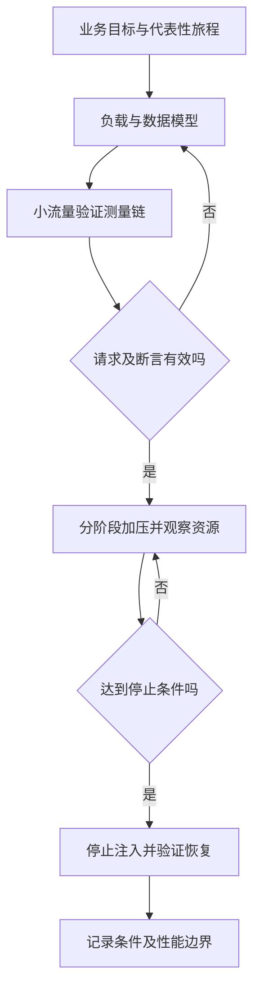

# 性能、负载与可靠性测试

> 面向需要验证响应速度、承载能力与故障行为的开发者。读完能设计代表性负载，识别测量偏差，并把性能结论限制在真实测过的版本、环境与条件内。

## 性能结论必须带条件

**性能测试**在指定负载和环境下度量响应、吞吐与资源消耗；**负载测试**检查预期工作量下的行为；**压力测试**探索超出预期后的饱和与退化；**持续负载测试**观察较长运行中的泄漏和累积；**可靠性测试**检查错误、故障和恢复时是否仍满足约束。它们可以结合，但一次短时压测不能证明长期可靠性。

**吞吐量**是单位时间完成的工作量，**延迟**是一次工作从起点到终点的耗时，**并发量**是同一时刻正在处理的工作数量。三者互相影响，不能用并发用户数直接替代每秒请求数。用户会思考、等待、重试，一条旅程也可能发出多个请求。

对报名系统，测试对象至少分开列表读取、报名写入、取消和导出。不同路径消耗不同资源：导出可能占内存和数据库时间，报名可能受到锁竞争约束。平均延迟会掩盖长尾；只统计成功请求会隐藏超时。结论应同时报告成功、失败、拒绝、超时和未发出的工作。

## 工作负载模型决定看见的压力

**封闭负载模型**让固定数量的虚拟用户完成上一轮后再开始下一轮；**开放负载模型**按到达节奏产生新工作，独立于前一轮是否结束。k6 官方文档解释，封闭模型在系统变慢时也会降低到达率，可能低估原本持续到来的压力。[负载模型](https://grafana.com/docs/k6/latest/using-k6/scenarios/concepts/open-vs-closed/)

| 想回答的问题 | 更合适的模型 | 需要核验 |
| --- | --- | --- |
| 固定一批用户反复操作 | 封闭模型 | 等待与思考时间是否代表使用 |
| 活动开始时持续到来的报名 | 开放模型 | 发生器能否维持目标到达率 |
| 真实旅程混合读写 | 显式比例与状态模型 | 数据容量与重试是否改变比例 |
| 饱和后能否恢复 | 阶段负载与故障注入 | 排队、超时和卸载后恢复时间 |

**协调遗漏**描述发生器因为等待慢响应而漏掉原应到来的工作。选择开放模型减少这类偏差，但发生器资源不足、虚拟用户不足或网络限制仍会丢工作。报告要区分目标到达率、实际发送、系统接收与完成，不能只看服务器成功吞吐。

## 测量链也需要验证

**分位数**表示一定比例样本不超过某值，例如 p95 是约 95% 样本所在的耗时上界位置。不同路径、地区和时间窗口混合计算可能掩盖差异；各实例 p95 的平均也不等于整体 p95。选择统计方式应说明样本、直方图精度和聚合方法。

压测之前运行小流量检查，确认身份、请求、数据和断言真的有效。无效令牌大量得到快速拒绝，会产生“延迟很好”的假象；只读缓存命中也不能代表数据库写入能力。发生器和目标服务应分别观测 CPU、内存、网络及连接，避免把客户端瓶颈误认为服务极限。

停止条件需提前定义，包括错误扩大、数据约束破坏、依赖饱和和发生器不足。对生产进行测试必须有授权与可控范围；本文案例使用独立环境，不提供未授权生产压测做法。

## 一个可审查的测试方案

以下为未执行的教学设计，不是实测基准。准备候选制品、独立数据库、合成账号、固定活动和代表性记录量；明确列表、报名、取消、导出混合比例；规定正常拒绝与系统错误的分类；记录环境资源、数据库配置和依赖版本。目标值应由业务使用要求与资源预算决定，不从工具示例复制。

| 阶段 | 目的 | 必须检查的证据 |
| --- | --- | --- |
| 小流量 | 证明脚本工作正确 | 响应与数据库终态一致 |
| 常态负载 | 验证预期使用条件 | 延迟分布、错误率与资源 |
| 突发负载 | 观察活动开始时积压 | 到达率、排队、拒绝和超时 |
| 较长运行 | 发现累积与泄漏 | 内存、连接、队列和磁盘趋势 |
| 卸载与恢复 | 验证系统不持续失效 | 队列排空、延迟回落和数据对账 |

k6 的阈值机制可把指标条件变成测试成功与失败判断。[Thresholds](https://grafana.com/docs/k6/latest/using-k6/thresholds/) 工程上应同时定义业务断言，例如不超额、不重复、权限拒绝；性能阈值通过但数据错仍应失败。阈值在运行前确定，避免看完结果后下调标准。

## 故障测试检查约束和恢复

Google SRE 的可靠性测试章节讨论测试系统和故障行为。[可靠性测试](https://sre.google/sre-book/testing-reliability/) 本文据此建议，注入故障要有具体假设：数据库响应变慢时，应用应有界等待并限制重试；一个实例退出时，进行中的请求可能失败，但重试不应重复写入；观测出口失效时，遥测不能无限阻塞业务。

**故障注入**人为制造依赖延迟、断连、实例退出或资源不足以观察系统响应。它的价值在于证明预期防护及发现缺口，而不是让系统“坏得越多越好”。一次只注入能解释的条件，并设影响范围、观察方法、停止机制和恢复动作。关键数据操作应检查故障后的终态，而非只检查服务恢复访问。

例如在报名事务提交后中断响应，验证重试仍返回可解释结果、有效记录只有一条。数据库不可达时，检查限流与错误提示、连接池等待、重试次数；恢复后确认没有无限重试风暴和积压重复执行。这些是待验证方案，不能据此宣称系统已满足高可用要求。

## 区分预热、稳定与退化阶段

程序启动、连接池建立、缓存填充和即时编译等过程可能使初期表现不同。若目标是常态容量，可单独登记预热阶段，再报告稳定阶段；若目标包含冷启动或突发活动，初期耗时本身就是需验证的结果，不能随意删掉。对任何排除样本都说明理由，避免事后移除慢请求来满足阈值。

稳定也不是“曲线看起来平”：要确认负载到达、完成量与资源趋势足以支持判断，排队是否持续增长，重试是否掩盖错误。为了比较优化，应保持数据分布与路径比例，并检查缓存命中、依赖延迟和发生器能力。不能保持的条件写入局限，重复实验用于估计波动而非挑选最好的一次。最终报告应同时保留业务断言失败和测量链异常，后者可能使性能结论无效。

## 结果如何支持容量决定

测试报告至少写明源码与制品标识、日期、环境、数据规模、负载模型、运行阶段、指标口径、实际结果、异常和局限。硬件升级、索引变化、真实数据分布改变后，旧结果需要重新评估。小样本读请求的结果不能外推到大量并发写入，单区域结果不能外推到跨区域链路。

| 失败模式 | 表面结论 | 实际风险 |
| --- | --- | --- |
| 只测成功样本 | 速度达标 | 失败请求已被排除 |
| 发生器达到瓶颈 | 服务还能撑 | 未发出工作没有施加压力 |
| 请求全部命中缓存 | 数据库能力充足 | 关键写入和冷路径没验证 |
| 同时改变多个参数 | 优化有效 | 无法解释因果及回退 |
| 只看故障注入瞬间 | 能自动恢复 | 队列和数据可能长期不一致 |

应用容量和成本优化见[性能、容量与成本](/software/operations/capacity-performance-cost)，灾备拓扑与恢复目标见[可靠性与灾备](/cloud/architecture/reliability-dr)。本文提供验证方法，不能单独证明跨区域容灾或任意负载下的服务承诺。

## 参考资料

<Refs>

- [Grafana k6：Open and closed models](https://grafana.com/docs/k6/latest/using-k6/scenarios/concepts/open-vs-closed/)（访问日期 2026-10-03）— 调度模型与协调遗漏
- [Grafana k6：Thresholds](https://grafana.com/docs/k6/latest/using-k6/thresholds/)（访问日期 2026-10-03）— 指标条件与执行判断
- [Google SRE：Testing for Reliability](https://sre.google/sre-book/testing-reliability/)（访问日期 2026-10-03）— 可靠性与故障行为测试
- 站内相关：[测试用例](/software/quality/test-cases) · [SLO 与值守](/software/operations/slo-health-oncall) · [容量与成本](/software/operations/capacity-performance-cost) · [恢复与对账](/software/operations/recovery-reconciliation)

</Refs>
