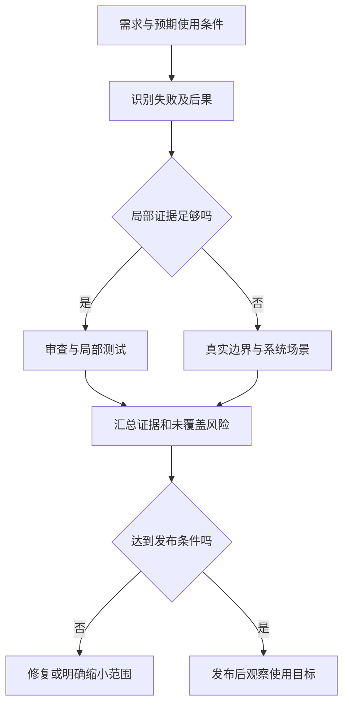

# 质量模型与验证策略

> 面向开发者、测试人员和交付负责人。读完能把“质量好”拆成可检查的目标，按失败后果安排证据，并解释哪些结论可以由测试支持、哪些仍需要验收与运行观察。

## 质量是对使用目标的约束

**质量模型**是组织产品质量属性的分类框架，用来避免只关注功能是否存在。ISO/IEC 25010:2023 的公开摘要说明，产品质量模型用于需求、设计、测试、度量和验收，包含九类特性。本文只引用公开用途，不把未查阅的标准全文细项作为已核验内容。[ISO 官方摘要](https://www.iso.org/standard/78176.html)

对虚构活动报名系统，质量问题包括：最后一个名额不能同时分配给两名报名者，普通账号不能读取管理员名单，网络超时后重试不能产生重复报名，管理员在约定数据规模下能够导出，维护者能够恢复错误发布。它们分别涉及正确性、安全、可靠性、性能和可维护性，不能压缩成一个“测试通过率”。

**验证**（verification）判断实现是否符合约定规格；**确认**（validation）判断产品在预期使用条件下是否解决目标问题。NASA 明确区分两类活动。[产品实现指导](https://www.nasa.gov/reference/5-0-product-realization/) 例如接口返回约定状态码是验证；管理员能否理解拒绝原因、完成实际报名管理是确认。需求本身不合理时，更多符合需求的测试不会使产品变得有用。

## 从失败后果倒推策略

**验证策略**规定要检查什么、在哪一层检查、何时检查，以及什么证据足以支撑决定。它与测试工具选型不同：先有“超额报名必须阻断”的风险，再选择能观察数据库终态的并发集成测试，而不是先安装浏览器工具后把所有风险都改成页面点击。

风险评估需要同时看发生可能性、影响和可发现性。没有可靠历史数据时，应把概率写成定性判断及依据，不使用看似精确的分数掩盖未知。影响范围包括数据损坏、越权、业务中断、恢复代价和用户困惑；难以自动发现的错误通常需要额外观测或人工抽查。

| 失败风险 | 为什么重要 | 优先证据 | 仍需补充的范围 |
| --- | --- | --- | --- |
| 容量竞争导致超额 | 数据终态违反核心规则 | 真实事务下的竞争测试、约束检查 | 线上突发负载与依赖故障 |
| 对象级越权 | 响应正常但泄露数据 | 不同身份访问同一对象的负向测试 | 目标环境身份与入口配置 |
| 导出耗尽资源 | 次要任务影响报名主路径 | 代表性数据量和并发混合负载 | 长时间运行与容量变化 |
| 发布无法恢复 | 一个错误版本扩大故障 | 兼容性检查和回退演练 | 恢复后数据对账 |

该表是案例推导的建议，实际项目应保留风险来源、责任人和调整原因。低风险展示文本可以通过审查和局部检查完成；数据库迁移、身份规则和并发写入需要更强证据。所有改动使用同一套检查，既可能浪费时间，也可能对重要风险检查不足。

图中“足够”针对一个明确风险判断，不表示单元测试通过后可以跳过所有集成检查。系统边界变化，例如身份提供者或数据库版本变化，应重新判断旧证据的适用性。

## 证据要形成互补，而非重复计数

静态检查不运行程序，可以发现类型矛盾、可疑模式和规则违反；动态测试执行程序，在选定输入、状态和环境下观察结果；审查能讨论业务意图、接口边界和恢复方案；验收关注使用目的；运行监测揭示真实负载与持续表现。每种方式都有盲区，也都有不同的反馈成本。

Google 的测试文章强调反馈速度、可靠性和定位能力，建议用较小范围测试承担能够在局部发现的问题，并保留关键端到端场景。[测试反馈原则](https://testing.googleblog.com/2015/04/just-say-no-to-more-end-to-end-tests.html) 本文据此建议：规则判断靠近业务逻辑，存储约束靠近真实数据库，接口兼容靠近消费者与提供者，用户旅程穿过真实入口。不采用固定测试比例作为普遍合格标准。

**测试替身**是代替真实依赖的可控实现。替身能稳定制造超时，却不能证明真实服务使用相同协议或真实数据库具有同样的锁行为。每次使用替身，应记录被替代的能力与另在哪里验证真实边界。重复运行同一替身测试增加通过次数，不增加边界证据。

证据链可以用需求标识连接规则、测试、构建、制品和验收记录。结论至少包含被测版本、环境、数据、检查方法、实际结果与局限。只写“所有测试绿了”无法回答哪项权限规则已覆盖，也不能证明目标环境接入正确。

## 建立小项目可执行的质量计划

以下为未执行的教学方案。先由需求负责人和开发者共同列出报名、取消、名单查询、导出四条旅程，明确容量与权限不变量；再对每条旅程列出正常、拒绝和恢复路径。把需求变化视为策略输入，而非只在上线前加一轮“全面测试”。

随后划分反馈时机：提交前运行快速规则检查；合并前验证真实数据库和接口变化；候选制品进入验收环境后验证入口、配置和关键旅程；发布后观察服务目标。慢检查可以分开调度，但其结果必须绑定即将发布的同一版本，不能拿昨天另一个提交的通过记录代替。

| 决策时机 | 要回答的问题 | 建议留下的记录 |
| --- | --- | --- |
| 需求评审 | 规则是否清楚且可验证 | 例子、异常规则、风险和未决问题 |
| 变更审查 | 哪些行为与依赖会变化 | 差异、测试选择和遗漏解释 |
| 候选版本验收 | 当前制品在目标条件下可用吗 | 制品摘要、环境指纹、结果与缺陷 |
| 发布决定 | 剩余风险是否可接受 | 阻断项、条件批准及决定者 |
| 运行复查 | 用户目标是否持续满足 | 服务指标、事件与改进任务 |

**发布门槛**是进入目标环境必须满足的条件。可规定越权、核心数据不变量失败、恢复路径未知属于阻断项；轻微视觉问题可以有明确期限和责任人。例外决定应说明影响及补救，不把失败改写成通过。需求未确认时，状态应保持待确认。

## 检查策略自身是否有效

质量计划也需要证据。可选取一项曾遗漏的风险，检查现有方法能否发现：例如将容量比较故意改错，在隔离分支观察相关用例是否失败；或让权限判断返回允许，检查负向场景能否暴露偏差。这类**变异检查**通过有控制地改变实现，检验测试的发现能力；本文没有执行，也不建议把所有变异存活都直接判定为生产缺陷。

如果错误实现仍通过，先读断言及测试条件：是否仅执行代码，没有检查结果；是否替身跳过了真实边界；是否用例未进入目标分支。随后在恰当层次修正，避免只追加更多相同用例。反过来，一个故意改变的实现若并不改变约定行为，测试不失败可能合理。策略评审应关注有意义风险的发现能力，而非仅追求工具分数。

## 失败模式与策略演进

| 失败模式 | 常见表现 | 修正依据 |
| --- | --- | --- |
| 用工具数量代表质量 | 工具齐全，核心规则仍漏测 | 检查风险到证据的对应关系 |
| 所有检查依赖一个共享环境 | 一个登录故障让全部用例失效 | 拆分边界并隔离测试数据 |
| 测试只复述代码 | 同一错误同时进入实现和预期 | 由需求、状态模型独立设计断言 |
| 只记录通过项 | 发布者误认为未知风险不存在 | 同时记录失败、受阻和未执行 |
| 合并后不再关注质量 | 环境与数据变化产生新故障 | 将运行事件反馈到风险和回归 |

质量计划也需要维护。一次遗漏的缺陷应补上能够发现同类问题的检查；一个长期无效的慢测试应修复、移到合适层次或移除。变更规模、系统依赖、数据敏感性提高时，重新评估策略；小系统不需要复制大型平台全部流程，但必须保留规则、证据和责任的连接。

## 参考资料

<Refs>

- [ISO/IEC 25010:2023 官方摘要](https://www.iso.org/standard/78176.html)（访问日期 2026-10-03）— 仅核验模型用途与公开摘要
- [NASA：Product Realization](https://www.nasa.gov/reference/5-0-product-realization/)（访问日期 2026-10-03）— 验证与确认的目标
- [Google Testing Blog：Just Say No to More End-to-End Tests](https://testing.googleblog.com/2015/04/just-say-no-to-more-end-to-end-tests.html)（访问日期 2026-10-03）— 反馈速度、稳定性与定位
- 站内相关：[验收标准](/software/requirements/acceptance-criteria) · [测试层次](/software/quality/test-levels) · [验收与回归](/software/quality/acceptance-regression) · [SLO 与值守](/software/operations/slo-health-oncall)

</Refs>
