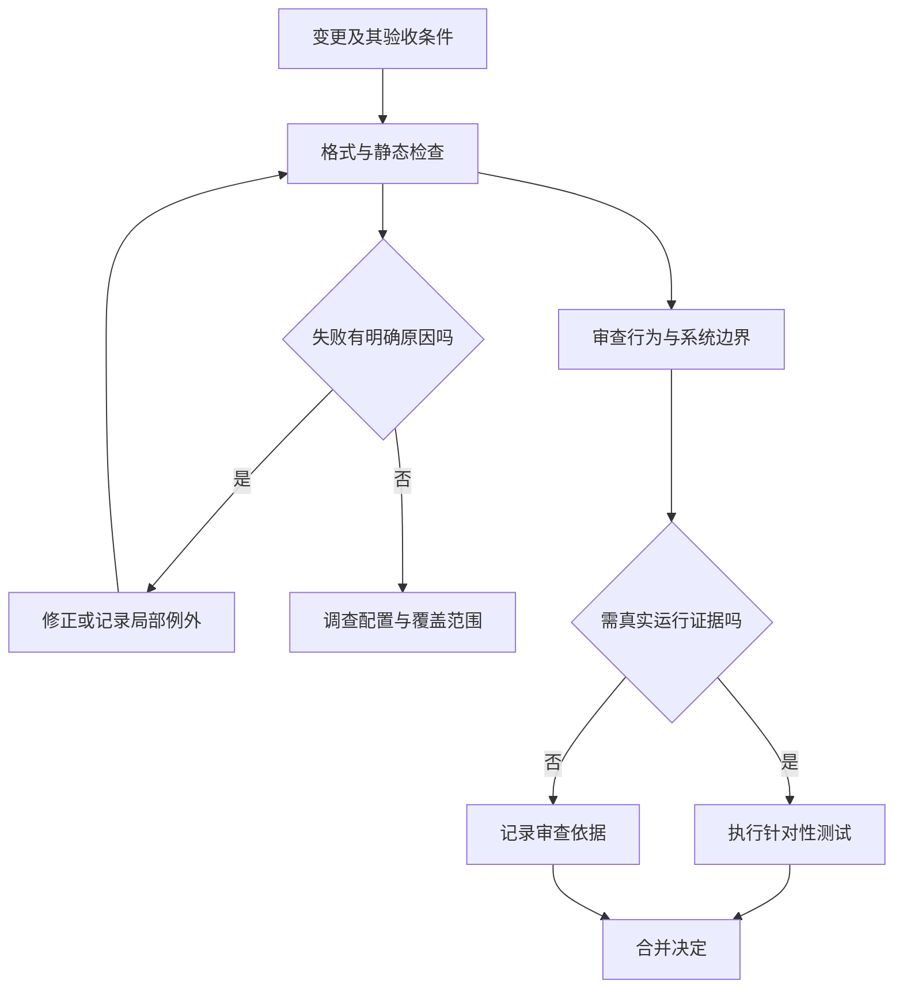

# 静态检查、类型与审查

> 面向希望建立变更检查流程的开发者与审查者。读完能区分格式、规则、类型与人工审查的证明范围，设置有解释力的门槛，并识别“检查全绿”仍会遗漏的问题。

## 静态检查在执行前发现矛盾

**静态分析**在不实际运行被分析程序的情况下，根据源码、类型、依赖和规则推断问题。格式化统一空格、换行等呈现；**规则检查**（lint）发现可疑写法与约定违反；类型检查判断表达式与声明是否一致；安全分析寻找特定危险数据流或模式。工具之间可以重叠，但合格条件不同。

ESLint 的核心概念区分解析器、规则、配置、插件与共享配置。[ESLint 文档](https://eslint.org/docs/latest/use/core-concepts/) 对项目的影响是：规则集及配置同样属于工程输入，启用某个工具名称不代表启用了所有检查。文件是否被忽略、规则是否关闭、解析是否失败，都影响结果。

**类型**约束值的形状与允许操作。TypeScript 的控制流分析可根据判断缩小联合类型范围，并使用判别联合和 `never` 检查部分穷尽性。[Narrowing 文档](https://www.typescriptlang.org/docs/handbook/2/narrowing.html) 编译器基于声明与规则推导，不能自动保证网络响应、数据库字段或外部 JSON 的真实内容符合声明。

| 检查方式 | 能提供的证据 | 不能单独证明 |
| --- | --- | --- |
| 格式化 | 代码呈现遵循统一规则 | 业务逻辑和安全正确 |
| lint | 已配置模式规则未发现问题 | 未配置规则及真实运行行为 |
| 类型检查 | 静态约束下表达式一致 | 外部输入合法、权限与事务正确 |
| 安全扫描 | 所建模规则下的风险线索 | 没有未知漏洞和部署风险 |
| 人工审查 | 对意图、设计和边界的判断 | 所有时序、输入与环境都验证 |

## 类型边界要连接运行验证

虚构报名系统的活动状态可以写成带判别字段的联合：草稿允许编辑，开放允许报名，关闭拒绝报名。相比任意字符串，类型能使代码显式处理状态；新增状态时，穷尽性检查能提示旧分支需要评估。但如果通过强制断言把外部字符串写成合法状态，静态保护就在边界被绕过。

以下为未执行的 TypeScript 教学片段，展示状态分支结构，不包含完整运行输入解析或业务授权。

```ts
type Activity =
  | { kind: 'draft' }
  | { kind: 'open'; remaining: number }
  | { kind: 'closed' }

function canEnroll(a: Activity): boolean {
  switch (a.kind) {
    case 'draft': return false
    case 'open': return a.remaining > 0
    case 'closed': return false
    default: {
      const impossible: never = a
      return impossible
    }
  }
}
```

这段逻辑不能防止两个事务同时读取相同 `remaining`，也不能证明数字是整数或非负。输入边界应做实际解析和校验，数据库应维护相应约束；类型、运行校验和真实事务测试共同承担不同风险。

**误报**是工具报告实际上不构成目标风险的问题；**漏报**是存在目标问题但工具没有发现。消除误报需要理解规则与场景，不能用全局关闭规则的方式掩盖具体例外。例外宜限制到最小范围，写明原因、验证方式和复查条件；动态生成代码、平台兼容分支可能合理例外，但不宜默认豁免整个目录。

## 审查围绕行为和因果

**代码审查**由他人检查变更意图、实现、测试和维护影响。格式问题交给自动工具，可以让审查注意力放在容量不变量、授权位置、迁移兼容和失败恢复。审查者应看到需求与验收条件，不能只看差异中的单行代码。



审查问题宜围绕“为什么”：为什么这条授权在服务端；为什么超时允许重试；为什么这个错误要中断事务；为什么旧制品仍能读取新数据。无法回答的问题比命名偏好更影响风险。安全敏感变更应寻找具备对应领域知识的审查者，而不是用多人点赞替代技术判断。

## 把门槛放在可信执行链上

本地检查方便快速反馈，但提交者可以漏跑、改变配置或只检查部分文件。CI 应从被审查版本读取配置，在干净环境执行必要检查，保留工具版本、范围、结果和运行标识。检查成功须对应将合并的版本，旧提交成功不会自动覆盖随后补上的代码。

| 规则类型 | 门槛建议 | 依据与边界 |
| --- | --- | --- |
| 机械格式 | 自动修正并要求一致 | 降低噪声，不赋予质量分数 |
| 确定类型错误 | 在项目规定范围内阻断 | 外部数据仍需运行校验 |
| 高置信安全风险 | 阻断并要求说明 | 复核适用路径与缓解措施 |
| 历史大量警告 | 记录基线，先防新增 | 不能永久放弃历史高风险项 |
| 有条件例外 | 限范围、有责任和期限 | 关联实际证据并定期复查 |

扫描基线是区分既有问题与新增问题的记录。基线被随意刷新会把新缺陷变成历史问题；工具升级也可能改变报告口径，应独立评估。报告数量下降不一定表示风险下降，可能只是排除文件增加或规则关闭。

工作流本身也需要审查。GitHub 的安全指导提醒，受信任权限的工作流检出不可信 PR 代码，会引入凭据和写权限风险。[工作流安全](https://docs.github.com/en/actions/reference/security/secure-use) 因此质量检查不宜自动拥有发布密钥；测试外部贡献代码与部署受信任制品要明确权限边界。

## 一次变更的检查包

以下是未执行的工程建议：将“普通账号不得导出名单”的改动组织为需求、服务端授权、类型收紧、负向测试和入口验证五部分。静态检查确认角色参数没有错误传递；审查确认名单读取前有授权且不信任前端标记；运行测试用普通合成账号直接调用接口；目标环境核验身份来源和代理头配置。

审查记录应说明改动影响哪些入口、哪些共用函数、是否改变响应与数据结构、哪些风险没有验证。若 AI 生成代码或测试，仍按同一规则检查；生成工具无法为业务意图或外部事实作最终确认。每个“自动修复”都是变更，尤其类型断言、忽略指令和依赖升级，不应因工具生成而跳过评审。

## 类型声明本身也属于信任边界

TypeScript 的类型断言不会执行运行检查，也不会改变值的真实形状；官方文档明确它在编译时被移除。[类型断言](https://www.typescriptlang.org/docs/handbook/2/everyday-types.html#type-assertions) 因此 `JSON.parse(...) as Activity` 只告诉检查器按声明相信，不能证明输入合法。自定义类型守卫同样需要正确实现，错误返回 `true` 会把未经检查的值带入受信任范围。

更稳妥的入口设计是：先把外部值视为未知，检查对象结构、字段类型、数值范围与业务枚举；解析成功后得到内部类型，失败时返回明确的拒绝。即使形状合法，还要检查用户是否有权限和当前状态是否允许操作。模式校验、授权、事务约束是不同边界，不能用一个“类型正确”结论代替。生成类型或外部声明升级后，应重新检查真实接口与运行数据是否仍匹配。

## 常见失败模式

| 失败模式 | 为什么危险 | 更有效的做法 |
| --- | --- | --- |
| 用 `any` 或断言清除错误 | 取消检查而非修复边界 | 校验外部输入，保持真实类型 |
| 全局关闭噪声规则 | 同类真问题一起被隐藏 | 最小例外与规则配置评估 |
| 只审查修改行 | 共用函数改变影响其他路径 | 阅读调用者、约束和回归范围 |
| 检查未覆盖生成或脚本目录 | 交付关键路径可能漏查 | 明确覆盖清单与例外理由 |
| 通过数等同安全证明 | 工具模型与环境均有限 | 多层证据及剩余风险记录 |

静态分析适合高频、确定、快速反馈；复杂并发、运行权限、外部输入和数据恢复仍需要实证。审查与工具的组合应让错误更早暴露，同时保留对证据边界的清楚说明。

## 参考资料

<Refs>

- [TypeScript：Narrowing](https://www.typescriptlang.org/docs/handbook/2/narrowing.html)（访问日期 2026-10-03）— 控制流缩小、判别联合与穷尽性
- [TypeScript：Everyday Types / Type Assertions](https://www.typescriptlang.org/docs/handbook/2/everyday-types.html#type-assertions)（访问日期 2026-10-03）— 断言不提供运行校验
- [ESLint：Core Concepts](https://eslint.org/docs/latest/use/core-concepts/)（访问日期 2026-10-03）— 配置、规则与插件
- [GitHub Actions：Secure use reference](https://docs.github.com/en/actions/reference/security/secure-use)（访问日期 2026-10-03）— 不可信代码与工作流权限
- 站内相关：[PR 协作](/software/collaboration/pull-request-workflow) · [测试层次](/software/quality/test-levels) · [构建与 CI](/software/delivery/build-ci) · [AI 编程责任](/software/guide/ai-coding-responsibility)

</Refs>
