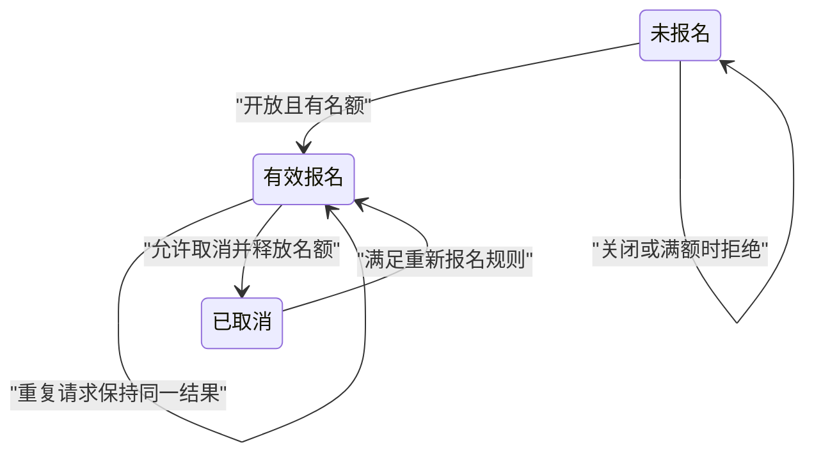

# 测试用例、边界、状态与数据

> 面向设计测试与验收场景的开发者和测试人员。读完能从规则推导输入边界、状态转换与数据组合，并让检查结果回答业务是否正确，而非仅回答程序是否跑完。

## 用例是一项有条件的判断

**测试用例**描述前置条件、操作、预期结果和判断方法。它不是一串点击步骤：同样点击“报名”，在开放活动、已截止活动和已满活动下应产生不同结果。预期必须来自需求和约束，不能仅复制当前实现返回的内容。

一个有效用例需要**测试判定依据**（test oracle），即决定实际结果是否正确的方法。例如“有效记录数不超过容量”可以由独立查询验证；“请求返回成功”只能判断响应表面，不能判断计数和记录是否同步。前置条件应包括角色、活动状态、已有数据、时间与依赖条件，否则失败无法重现。

**等价类**把按当前规则应产生相同行为的输入分组，以代表样本降低检查成本；**边界值**关注规则发生变化的位置。容量为正整数时，零、最小有效值、允许上限及越界值有不同意义；若上限未定义，应先澄清需求。整数、浮点字符串、空值和超长文本并不自动属于同一类。

## 边界不只存在于输入框

报名截止时间涉及时区、比较符号、服务器时钟和客户端提示。验证“截止时刻是否允许”前，应明确规则是小于还是小于等于，时间以哪个系统为准。页面显示还可报名，不证明服务端应该接受；用户本地时钟不应承担最终授权判断。

| 维度 | 可推导的样本 | 要观察的结果 |
| --- | --- | --- |
| 数量 | 零、剩余一位、正好满额、超限申请 | 拒绝理由和最终有效数量 |
| 时间 | 截止前、相等、截止后，不同时区表示 | 服务端决策与一致提示 |
| 身份 | 未登录、普通用户、管理员、被撤销角色 | 请求级拒绝与数据不泄露 |
| 数据 | 空、非法格式、合法最短与最长、Unicode | 接受、拒绝及规范化规则 |
| 依赖 | 成功、超时、部分完成后断连 | 可重试性与副作用终态 |

安全用例尤其需要对象边界：普通用户 A 能访问自己的报名，不代表不能改请求标识取得 B 的报名。OWASP WSTG 提供认证、授权和输入等安全测试组织入口。[公开指南](https://owasp.org/projects/web-security-testing-guide) 本文不宣称执行了完整安全测试，也不把这张功能矩阵视为安全认证。

## 状态模型揭示遗漏

**状态转换测试**把系统视为状态及允许操作的组合。活动可以是草稿、开放、关闭；报名可以是未报名、有效、取消。先明确一个操作在当前状态是否合法，再检查后续状态和副作用。将所有对象压成“成功/失败”会遗漏取消后再报名、活动关闭后取消是否允许等问题。

图是案例约定，重新报名和取消规则必须由真实项目确认。需要覆盖合法转换、禁止转换和重复操作；还应检查管理员修改容量与现有记录之间的关系。减少容量到已报名人数以下，究竟拒绝还是允许保留已有报名，不能由测试人员凭感觉决定。

**不变量**是操作之间必须始终成立的约束，例如有效数量不为负、每个活动同一用户最多一条有效报名、有效计数与明细一致。Hypothesis 的状态测试支持生成操作序列，并在步骤后检查不变量。[状态测试文档](https://hypothesis.readthedocs.io/en/latest/stateful.html) 它扩大探索范围，但模型若写错，生成更多序列仍会依据错误模型判断。

## 并发与失败需要检查终态

并发错误常发生在两个单独合法操作相互交错时。顺序测试“先查剩余名额，再写入”可能全部通过；两个事务同时看到剩余一位时，终态可能超额。PostgreSQL 文档说明不同事务隔离级别的可见性和并发异常范围。[事务隔离](https://www.postgresql.org/docs/current/transaction-iso.html) 用例应依据实际数据库、隔离级别、锁与重试机制设计，不能把替身或其他数据库结果当作通用证明。

教学方案如下，本文未执行：准备容量为一的独立活动。若两个事务都能完成无锁读取，可在读取后等待同一同步点，再继续写入，以构造同时看到一个余位的竞争；等待事务结束后，检查各请求结果与明细、计数。同步点的位置要依据被测实现选择，不能为制造竞争改变实际事务语义。

若实现使用 `SELECT FOR UPDATE` 等行锁，第一个事务可能持锁，第二个读取正在等锁；此时让第一个事务等待“两个读取都完成”的屏障，会人为卡住测试。应在进入加锁关键区前协调请求启动，再观察锁等待、事务结束与最终记录，并设置有界超时、失败证据保留和事务清理。若使用可串行化隔离而发生序列化失败，还需验证应用是否以有界重试正确完成，不把数据库保护性失败当成系统彻底不可用。

网络超时更需要区分“没有完成”和“完成但响应丢失”。在提交后制造断连，再按相同幂等标识重试，应检查重复记录、返回结果及名额。如果接口没有幂等约定，应先设计约定；测试不能凭空为每种重试赋予安全性。

## 数据组织决定可复现性

**测试夹具**（fixture）是用例所需的环境和初始数据。好夹具只提供本用例必要条件，名称与规模能表达意图；一个巨大共享数据库会让用例依赖未知历史。合成账号和虚构活动足以覆盖大部分机制，无需复制真实个人资料。

| 数据策略 | 适用场景 | 代价与边界 |
| --- | --- | --- |
| 每个用例独立创建 | 规则、权限、状态转换 | 创建成本增加，换取清晰隔离 |
| 每次运行独立命名空间 | 多用例真实集成与并发 | 清理和失败保留需共同设计 |
| 固定代表数据集 | 导出与规模回归 | 版本化数据，避免隐含依赖 |
| 属性生成数据 | 编码、组合、序列探索 | 保存种子和最小失败样本 |
| 脱敏历史样本 | 确需复现公开允许的形态 | 脱敏不能只删姓名，还需防重识别 |

数据清理应区分成功与失败。失败后保留最小可定位证据，避免立即删除唯一线索；保留时间和访问范围需要约定。清理按运行标识执行，不能用“删除全部活动”在共享环境中破坏其他工作。

## 从矩阵到可审查记录

先列关键规则，再选最少能够区分失败原因的组合。全组合增长很快，成对组合可以帮助探索参数交互，但不能替代已知高风险三方关系，例如角色、对象归属和活动状态。有明确风险的组合应显式保留，不能因为抽样策略没有选中而忽略。

| 用例标识 | 前置与动作 | 预期判断 | 执行状态 |
| --- | --- | --- | --- |
| CAP-LAST | 剩余一位，两用户竞争 | 最多一条有效记录，响应与终态一致 | 教学示例，未执行 |
| DUP-RETRY | 提交后断连，同标识重试 | 不重复占名额，结果可解释 | 教学示例，未执行 |
| AUTH-OTHER | 普通账号查询他人对象 | 拒绝且无敏感字段 | 教学示例，未执行 |
| CANCEL-TWICE | 同一报名取消两次 | 不重复释放名额 | 教学示例，未执行 |

执行记录应连接需求标识、版本、环境、数据、实际结果和证据。受阻、未执行、失败和通过是不同状态；“预期正确”不能填入实际结果。需求改变后重新审查判定依据，防止旧测试把正确的新行为误报为失败。

## 让属性与关系补充具体例子

**属性测试**检验一类输入都应满足的关系，例如任意合法容量和操作序列下，有效计数不为负且不超过约定上限。生成器应遵循需求中的输入范围，同时保留非法输入的独立拒绝检查；若只生成已经规范化的文本，可能遗漏入口对原始 Unicode、空白或编码的处理。

还可以检查结果之间的关系：相同请求标识重试应指向同一业务操作；合法取消一次后再次取消，不应再次改变名额；在不改变过滤条件时，仅改变列表分页大小，不应改变全量对象集合。这些关系必须得到业务确认，不能把“顺序无关”等便利假设施加在本就有顺序语义的操作上。属性与固定例子互补，失败时保存原输入、缩小后的输入及生成种子。

## 常见失败模式

| 失败模式 | 如何发现 | 改进 |
| --- | --- | --- |
| 预期从实现自动复制 | 改同一错误后测试仍通过 | 独立阅读规则并检查终态 |
| 只测合法输入 | 拒绝路径没有用例 | 按等价类和状态补负向样本 |
| 并发实际顺序执行 | 时间线没有操作重叠 | 显式同步点与事务证据 |
| 时间边界依赖当前时间 | 次日或换时区失败 | 注入时钟并写明比较规则 |
| 随机失败无法重现 | 种子、数据和序列缺失 | 保存最小失败样本 |

用例质量体现在能够揭示错误并支持判断。表格行数、输入样本数量和执行次数都需要回到规则与风险解释。

## 参考资料

<Refs>

- [Hypothesis：Stateful tests](https://hypothesis.readthedocs.io/en/latest/stateful.html)（访问日期 2026-10-03）— 操作序列和不变量
- [OWASP：Web Security Testing Guide](https://owasp.org/projects/web-security-testing-guide)（访问日期 2026-10-03）— 安全测试公开入口
- [PostgreSQL 18：Transaction Isolation](https://www.postgresql.org/docs/current/transaction-iso.html)（访问日期 2026-10-03）— 隔离与并发异常
- 站内相关：[验收标准](/software/requirements/acceptance-criteria) · [测试层次](/software/quality/test-levels) · [缺陷管理](/software/quality/debugging-defects) · [恢复与对账](/software/operations/recovery-reconciliation)

</Refs>
