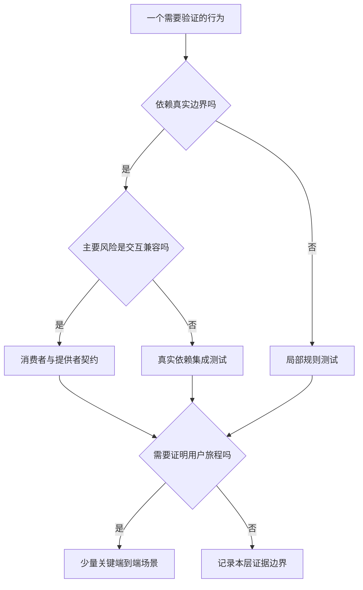

# 单元、集成、契约与端到端测试

> 面向开发者与测试人员。读完能按被验证的边界选择测试层次，判断替身遗漏了什么，并把一次用户操作分解为相互补充的检查。

## 测试层次描述观察范围

**单元测试**验证一个较小逻辑单元，在可控条件下检查输入、输出与必要副作用；“单元”不必等同一个函数，也可以是内聚的业务组件。**集成测试**验证多个组件或真实依赖组合后的行为，特别是接口、序列化、事务和连接配置。**端到端测试**（End-to-End，E2E）穿过选定的完整用户旅程，验证入口到结果的整体路径。范围要写清，名称本身不能证明覆盖了外部身份系统或异步任务。

**契约测试**检查消费者与提供者交互的约定，例如请求字段、响应结构、状态与消息格式。Pact 将集成契约测试与仅验证提供者符合某份接口规范区分：后者单独不能证明消费者按正确方式调用，或提供者满足消费者期望。[Pact 定义](https://docs.pact.io/) 契约通过也不能证明数据库正确、权限可靠或两个服务的真实网络可达。

报名系统的一次提交可能依次经过页面校验、HTTP 接口、身份授权、事务写入和结果展示。页面成功点击不能精确定位容量问题；局部容量函数通过不能证明并发事务不会超额。选择层次的目的，是让错误在最小但足够真实的范围内被发现。

| 层次 | 适合验证 | 不足以证明 |
| --- | --- | --- |
| 单元 | 规则分支、转换、异常处理 | 真实存储与网络兼容 |
| 集成 | SQL 约束、事务竞争、序列化与依赖行为 | 整条用户旅程及入口配置 |
| 契约 | 消费者实际需要的交互兼容 | 系统业务终态与性能 |
| 端到端 | 登录后报名、权限拒绝、管理员导出旅程 | 所有边界、所有时序与长期可靠性 |

## 替身控制变量，也削弱真实性

**桩**（stub）返回预设响应；**模拟对象**（mock）通常还检查约定交互；**假实现**（fake）提供简化但可运行的依赖，例如内存存储。不同工具用词可能不同，工程记录应描述真实行为。依赖替身让测试制造超时与错误方便、速度快，却会把真实依赖的复杂行为排除在外。

例如内存数组可以测试“重复用户不添加记录”，但不具有数据库唯一约束、事务隔离和连接池行为。若并发报名问题来自先查询再写入的竞态，内存替身通过可能只证明替身顺序执行正常。需要在隔离测试数据库中制造两个真正重叠的事务，检查最终有效数量和各请求结果。

选择替身时问三件事：本用例要隔离哪个变量；被替代的约定由谁维护；真实兼容在哪里另行检查。如果替身由实现代码自动生成，可能把同一错误写入预期；关键协议与业务结果应从独立规格、消费者需求或公开规范推导。



图中的层次可以同时需要。契约与集成不是二选一的产品排名，而是对不同失败原因的检查。

## 一条规则怎样分层证明

下面是未执行的教学设计，使用虚构活动和合成账号。需求为“有效报名不超过容量，同一账号重复申请不增加记录”。先测试纯规则：容量为零、还有名额、已经满额、输入非法等；这些用例应检查拒绝理由，而不仅检查函数没有抛异常。

集成层创建容量为一的独立活动，安排两名不同合成用户竞争。并发是否真正重叠应有同步点或数据库事务证据，不能把两个顺序调用称为并发。断言包括：有效记录最多一条，剩余名额不为负；成功与拒绝结果和实际数据相符；事务失败不留下半条状态。再以同一用户重复与并发重试检查唯一性。

契约层让页面或客户端测试生成其实际依赖的响应约定，例如拒绝响应具有稳定业务错误码、成功响应具有报名标识。提供者验证这些交互，评估删除字段或改变类型的影响。允许额外字段还是严格匹配，应依消费者解析方式定义，不能为了“兼容”无限接受任意结构。

端到端层从公开入口使用真实浏览器完成登录、报名、查看状态、取消与管理员查询；至少保留普通账号访问管理入口被拒绝的旅程。Playwright 建议测试用户可见行为、按用例隔离存储与数据。[浏览器测试实践](https://playwright.dev/docs/best-practices) 选可访问名称定位按钮，比依赖脆弱 DOM 层级更接近用户意图，但不能因此省略页面以外的数据断言。

```text
准备：候选制品 + 独立活动 + 合成账号 + 已知容量
动作：发起报名，制造一次相同请求重试
检查：页面结果、接口业务码、有效记录、名额与审计事件
收尾：按本次运行标识清理数据；保留失败证据
```

这段是检查思路，不是可直接运行的测试脚本。真实工程需补齐框架、数据库和同步控制，并记录执行结果。

## 稳定性来自控制条件

**不稳定测试**是同一版本在相同预期条件下出现不一致结果的测试。原因可能是产品竞态，也可能是共享数据、时间、随机输入、网络依赖或测试等待错误。失败不能一律归为测试问题，也不能默认多跑一次通过就算修复。

| 条件 | 控制方式 | 保留的真实性 |
| --- | --- | --- |
| 时间 | 注入时钟，指定时区和边界时刻 | 另查真实系统时钟及过期机制 |
| 数据 | 每次运行独立命名空间与清理 | 使用代表性约束和规模 |
| 异步完成 | 等待可观察状态或有界条件 | 不用任意固定睡眠掩盖竞态 |
| 外部服务 | 局部用替身，边界用受控真实环境 | 明确哪些失败仍由生产观察承担 |
| 随机生成 | 保存种子及最小失败样本 | 可重放失败，同时探索新输入 |

Google 的反馈原则强调速度、可靠性和失败定位。[测试层次与反馈](https://testing.googleblog.com/2015/04/just-say-no-to-more-end-to-end-tests.html) 因此不应为了堆积端到端通过数，把能够局部检出的分支全部改成跨系统场景；也不能照搬某个测试比例，削弱真实数据库或权限边界。

## 契约还需要连接实际部署版本

消费者与提供者独立发布时，需要知道验证的是哪一对版本。Pact Broker 的 `can-i-deploy` 根据已登记版本及验证关系检查部署兼容性，而不是仅看某份最新契约存在。[部署兼容检查](https://docs.pact.io/pact_broker/can_i_deploy) 使用这类机制的前提是登记真实版本、环境与验证结果；遗漏消费者或错误登记环境，仍会留下盲区。

教学上可以建立一个版本矩阵：旧页面配旧服务、旧页面配新服务、新页面配旧服务，以及计划上线的组合。无需永远支持全部组合，但滚动发布、浏览器缓存和异步任务可能使某些旧组合继续存在。发布前应明确保留时间和接口兼容范围，移除旧字段前确认剩余消费者已迁移。契约证明交互满足约定，真实入口、数据库和用户旅程仍需相应检查。

## 失败定位与维护边界

测试失败后先保存版本、数据、请求关联和实际断言，随后区分规则错误、边界兼容、目标环境和测试条件。若所有端到端测试都在登录步骤失败，应先检查共同依赖；这不能说明后续功能全部坏了，也不能说明它们正常。

| 失败模式 | 后果 | 改进 |
| --- | --- | --- |
| 只断言状态码 | 响应成功但数据不一致 | 检查终态与关键副作用 |
| 每层重复完整旅程 | 慢且失败原因混杂 | 每层承担特定风险 |
| 用例共享登录和活动数据 | 次序改变导致级联失败 | 用例隔离，必要时显式建场景 |
| 重试直到通过 | 产品竞态被隐藏 | 记录重试，调查首次失败 |
| 契约生成后无人验证提供者 | 文件存在却没有兼容证据 | 将双方版本与验证结果连接 |

层次设计在单体、小服务和分布式系统中会不同。关键不在工具标签，而在能否明确证明“哪个版本、哪条规则、哪个真实边界”以及没有证明什么。

## 参考资料

<Refs>

- [Google Testing Blog：测试反馈与层次](https://testing.googleblog.com/2015/04/just-say-no-to-more-end-to-end-tests.html)（访问日期 2026-10-03）
- [Pact：Introduction](https://docs.pact.io/)（访问日期 2026-10-03）— 集成契约与提供者规范验证的区别
- [Pact：Can I Deploy](https://docs.pact.io/pact_broker/can_i_deploy)（访问日期 2026-10-03）— 版本、验证关系与部署判断
- [Playwright：Best Practices](https://playwright.dev/docs/best-practices)（访问日期 2026-10-03）— 用户可见行为、隔离与定位
- 站内相关：[质量策略](/software/quality/quality-strategy) · [用例与数据](/software/quality/test-cases) · [验收与回归](/software/quality/acceptance-regression) · [构建与 CI](/software/delivery/build-ci)

</Refs>
