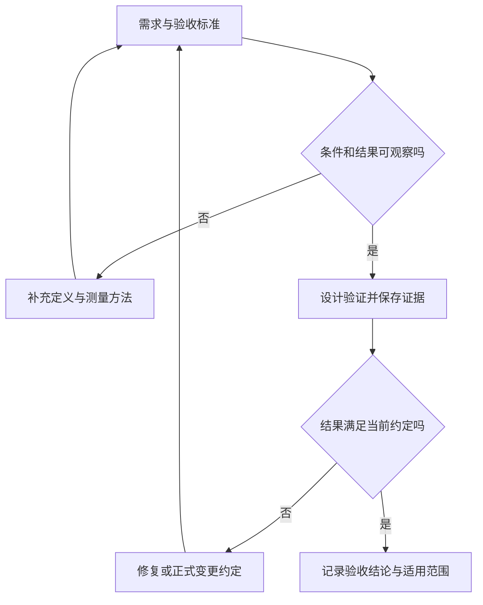

# 可验证的验收标准

> 本文面向需要判断软件是否满足约定的业务、产品、测试和开发人员。读完能把“功能完成”转成可观察的标准，覆盖异常、权限和质量属性，建立需求到证据的追踪，并区分单项验收、整体交付与发布门槛。

## 验收标准回答什么叫满足约定

**验收标准**（acceptance criteria）是相关人员约定的判断条件：在什么前提下，软件必须表现出什么结果，才算满足某项需求。它把模糊的“做好了”转成可以讨论和验证的规则，为设计、测试和交付提供共同依据。

标准宜在实现前讨论，并随需求变化保持一致。“系统能够报名”不足以判断满额后、重复请求或权限不足时的行为；“管理员可以导出名单”还要定义名单范围、导出时点与异常结果。SWEBOK 将基于验收标准的需求表达纳入需求规格说明，并讨论通过具体输入和预期结果澄清需求的方法。[SWEBOK 第 1 章 §4.3](https://ieeecs-media.computer.org/media/education/swebok/swebok-v4.pdf)

标准的详细程度取决于风险。文案修改可以检查文字和呈现；容量与权限规则则要检查最终状态和禁止发生的结果。可验证并不意味着必须写成自动化程序，也可以通过检查、演示、分析或测试取得证据。

## 需求、标准、用例与证据的关系

| 层次 | 回答的问题 | 示例 |
| --- | --- | --- |
| 需求 | 为什么需要这项能力？ | 活动容量必须受控，避免接受超额报名 |
| 验收标准 | 满足需求的条件是什么？ | 多个合规请求同时争抢一个名额时，最终只新增一份有效报名 |
| 测试用例 | 怎样制造条件并检查结果？ | 建立容量为 2、已有 1 份有效报名的活动，让两个不同测试账号同时申请，再读取最终状态 |
| 结果证据 | 哪个版本在什么条件下得到什么结果？ | 请求结果、最终名单与计数、环境配置、版本标识及执行记录 |

表中数字用于构造示例，不是容量建议，也不是已经执行的测试结果。一条标准可以由多个用例验证：余量充足、刚好满额、两个请求竞争、重复申请和取消后再次申请。一个综合用例也可能覆盖多条标准，但必须能指出具体证明了哪些结果。

标准应尽量以业务行为表达，测试用例再补数据、步骤、观察位置和具体断言。把点击路径固定成唯一标准，会让实现换一种交互就被误判不合格；只写业务愿望而没有可观察结果，则会让验收依赖主观印象。

## 怎样写出可以判断的条件

建议用“前提、触发、结果、边界”组织表达。其中**断言**是对预期结果作出的明确检查，既要看用户得到什么，也要看数据最终是什么状态。

```text
给定：活动开放、账号符合报名条件、当前仍有名额
当：该账号提交一次报名申请
那么：账号获得明确的报名结果
并且：成功时只新增一份有效报名，剩余名额相应减少
边界：满额、重复、未授权和结果未知的情况另有明确规则
```

“给定、当、那么”有助于结构化表达，但并非必须采用的语法。重要的是不同参与者能得到相同理解，能够构造验证条件，并能区分符合与不符合。NASA 的需求检查表同样要求清晰、一致和可验证，并提醒避免“快速”“友好”等无法直接判断的词。[需求可验证性检查](https://www.nasa.gov/reference/system-engineering-handbook-appendix/)



失败后若改变需求，应明确变更理由和责任，并重新评估范围；不能为了让已有实现“通过”，事后悄悄删掉原标准。

## 覆盖行为、异常、权限与质量属性

下面以虚构的小型活动报名与管理系统展示标准的几种维度。案例仅使用合成数据和测试账号，不包含支付、多租户或真实个人数据；规则是自拟示例，实际项目要先完成[问题与范围](/software/requirements/problem-scope)的约定。

| 维度 | 示例标准 | 主要观察点 |
| --- | --- | --- |
| 正常行为 | 开放活动接受符合条件的申请，成功后账号能查询到自己的有效报名 | 界面结果与记录状态一致 |
| 容量边界 | 不同账号并发申请时，有效报名总数始终不超过约定容量 | 最后名额竞争及最终计数 |
| 重复请求 | 同一账号对同一活动重复申请，最多保留一份有效报名 | 重复执行不会额外占用名额 |
| 取消行为 | 在允许取消期间，账号能取消自己的有效报名；重复取消不重复释放名额 | 状态转换与容量变化 |
| 异常与恢复 | 响应丢失后，账号能够查询结果或按约定重试，并且不会形成重复报名 | 请求结果未知时的最终状态 |
| 权限 | 普通账号只能管理自己的报名；名单和导出只对授权管理员开放 | 页面、直接接口请求及对象归属 |
| 名单与导出 | 导出对应指定活动和约定时点的有效名单；空名单有明确结果 | 字段、记录范围和生成时点 |
| 质量属性 | 在约定环境与负载下，关键操作满足明确的时间和失败率目标 | 测量口径及负载范围 |

### 异常标准要检查副作用

返回错误不一定代表操作没有发生。服务器可能已经保存报名，返回消息却在途中丢失；此时盲目重新申请可能重复占位。标准应同时描述可见反馈和业务状态，并规定结果未知时如何确认。可以通过模拟响应丢失验证，但模拟了哪段失败、保留了哪些真实依赖，都要写进证据。

重复提交也不能只用“按钮会变灰”验收：请求可能来自双击、页面刷新、客户端重试或直接调用。应检查“重复动作后的有效报名与容量”这一结果。保持同一操作重复执行仍产生相同业务效果，通常称为**幂等性**；具体去重和事务设计属于实现方案。

### 权限标准要同时包含允许与拒绝

**认证**确认请求者是谁，**授权**决定其能对哪些对象做什么。管理员成功导出，只证明允许路径可用；还要检查普通账号无法取得名单，账号 A 不能取消账号 B 的报名，绕过页面直接请求也不能获得额外权限。

OWASP 的授权指导要求在每次请求上校验权限，并设计相应测试。验收时宜覆盖角色、操作和对象归属组合，并检查拒绝后的数据状态与返回信息；隐藏按钮无法单独证明服务端权限边界。[OWASP 授权指导](https://cheatsheetseries.owasp.org/cheatsheets/Authorization_Cheat_Sheet.html)

### 质量属性需要测量口径

**质量属性**描述性能、可靠性、可用性、可维护性等方面的要求。“响应快”应进一步写清：观察哪个操作、从哪里计时、使用什么数据规模、什么请求负载、运行多久、允许什么失败比例，以及采用什么统计量。P95 表示 95% 的观测值不超过该值，不能与平均值互换。

没有依据的性能阈值应标为待确认，并安排代表性负载和容量评估。测试环境达标只能支持该环境与负载范围内的结论；短时演示不能证明长期可靠性。阈值确定后，应把环境、统计方法和合格条件一起版本化保存。

## 分层验收：用不同证据回答不同问题

“按约定实现”与“解决预期问题”需要分别判断。工程中通常把对规格符合性的判断称为**验证**（verification），把产品在预期环境中是否满足使用目的的判断称为**确认**（validation）；不同中文材料用词可能不同，应看其比较对象。NASA 的产品实现指导区分了这两个目标。[产品验证与确认](https://www.nasa.gov/reference/5-0-product-realization/)

| 层次 | 核心问题 | 适合的证据 |
| --- | --- | --- |
| 需求评审 | 标准是否清楚、必要且一致？ | 规则表、场景讨论和决定记录 |
| 局部验证 | 一个规则或组件是否符合约定？ | 边界用例、单元测试或检查记录 |
| 集成验证 | 接口、数据与权限组合后是否正确？ | 真实依赖下的集成与并发验证 |
| 场景验收 | 相关角色能否完成约定工作？ | 代表性角色执行关键旅程及异常恢复 |
| 发布准备 | 指定版本是否适合进入目标环境？ | 配置核对、数据变更计划、监测与恢复证据 |

层次可以合并组织，但观察范围不能消失。大量局部测试通过仍可能遗漏系统权限配置；界面演示成功也可能遗漏并发竞争。因此，不以某种测试数量规定所有项目的完整性，而按关键风险安排能够发现错误的验证。

## 追踪需求到证据，保留结论的边界

**需求追踪**是让需求与设计、变更、测试和证据之间存在可查的关联。它能帮助发现遗漏，并在规则变化时找到需要重查的内容。小项目可以用一张表，无须先采购复杂平台。

| 需求标识 | 对应标准 | 验证方式 | 需保存的证据 | 状态示例 |
| --- | --- | --- | --- | --- |
| R-CAP | 有效报名不突破容量 | 最后名额竞争、整合后的回归 | 版本、负载、最终名单与计数 | 待验证 |
| R-DUP | 重复申请不增加有效记录 | 顺序与并发重复申请 | 请求关联、响应和最终状态 | 待验证 |
| R-AUTH | 普通账号不能取得管理员名单 | 角色与对象权限检查 | 身份角色、请求与拒绝结果 | 待验证 |

表中的状态是示例，不报告真实执行结果。NASA 的验证矩阵要求用唯一标识连接需求、来源与验证方法；在软件交付中，还宜补上当前版本、环境、结果和证据位置。[需求验证矩阵](https://www.nasa.gov/reference/appendix-d-requirements-verification-matrix/)

证据应说明验证对象、条件、实际结果与偏差。截图可展示一个页面状态，数据记录可说明最终状态，执行日志可说明过程；它们分别提供不同信息。需求、代码或环境变化后，应评估旧证据是否仍适用，并补充受影响的回归。

## 发布门槛与覆盖率：辅助指标要回到风险

**发布门槛**是一次版本进入目标环境需要满足的条件，范围通常超出单个功能。例如关键需求已验收，重要缺陷已处理，配置和数据变更已验证，具备发现问题和恢复服务的方法。建议提前明确阻断条件、例外决定者和可接受风险，避免临近发布时临时改标准。

一项需求通过验收，不代表整个版本已经具备发布条件；PR 合并也不能替代目标环境验证。未验证事项应保留为待验证、受阻或有明确边界的条件结论。若存在例外，应记录剩余风险、处理措施与责任，而不能用“基本通过”掩盖重要缺口。

**代码覆盖率**反映测试执行过哪些代码路径。执行一行代码并不意味着测试检查了它的正确结果，也不证明异常输入、并发时序或真实权限配置已覆盖。Google 的测试指导将覆盖率作为发现验证缺口的间接指标，并明确高覆盖率不保证高测试质量。[代码覆盖率的用途与限制](https://testing.googleblog.com/2020/08/code-coverage-best-practices.html?hl=pt_PT)

例如报名测试可以执行所有容量判断分支，却只检查响应状态，没有检查最终报名数量；这样的测试仍可能漏掉超额。验收应回到需求：关键场景是否验证、断言是否有效、证据是否支持结论、残余风险是否可以接受。覆盖率适合帮助定位遗漏，不能成为这些判断的替代品。

## 常见失败模式

| 失败模式 | 后果 | 改进方法 |
| --- | --- | --- |
| 只写“正常使用无问题” | 参与者采用不同判断口径 | 明确条件、结果和异常规则 |
| 只验证成功操作 | 满额、重复和拒绝路径遗漏 | 按状态、角色与边界扩展样本 |
| 只看返回消息 | 操作失败但数据已变，或成功提示与状态不符 | 检查业务终态和副作用 |
| 只看覆盖率和通过数 | 无效断言也被算成验证 | 阅读关键用例实际证明的行为 |
| 证据缺少版本与环境 | 无法支持本次交付结论 | 保存可定位的版本、条件与结果 |
| 实现后随意降低标准 | 原需求被悄悄改变 | 正式记录变更并重新评估影响 |

## 参考资料

<Refs>

- [IEEE Computer Society：SWEBOK Guide v4.0a](https://ieeecs-media.computer.org/media/education/swebok/swebok-v4.pdf)（访问日期 2026-10-03）— 第 1 章 §4.3：基于验收标准的需求表达
- [NASA Systems Engineering Handbook：Appendix C, How to Write a Good Requirement](https://www.nasa.gov/reference/system-engineering-handbook-appendix/)（访问日期 2026-10-03）— 清晰性、一致性与可验证性
- [NASA Systems Engineering Handbook：5.0 Product Realization](https://www.nasa.gov/reference/5-0-product-realization/)（访问日期 2026-10-03）— §5.3、§5.4：产品验证与确认、结果记录
- [NASA Systems Engineering Handbook：Appendix D, Requirements Verification Matrix](https://www.nasa.gov/reference/appendix-d-requirements-verification-matrix/)（访问日期 2026-10-03）— 唯一标识、需求来源与验证方法
- [OWASP Authorization Cheat Sheet](https://cheatsheetseries.owasp.org/cheatsheets/Authorization_Cheat_Sheet.html)（访问日期 2026-10-03）— 请求级授权及权限测试
- [Google Testing Blog：Code Coverage Best Practices](https://testing.googleblog.com/2020/08/code-coverage-best-practices.html?hl=pt_PT)（访问日期 2026-10-03）— 覆盖率作为间接指标的边界
- 站内相关：[问题与范围](/software/requirements/problem-scope) · [需求与验收导览](/software/guide/requirements-and-acceptance) · [PR 工作流](/software/collaboration/pull-request-workflow) · [软件项目全貌](/software/guide/software-project-overview) · [Agent 安全与可靠执行](/ai/agent/security)

- 深入阅读：[质量验证策略](/software/quality/quality-strategy) · [测试层次](/software/quality/test-levels) · [AI 生成代码验证](/software/ai-assisted/generated-code-verification)

</Refs>
