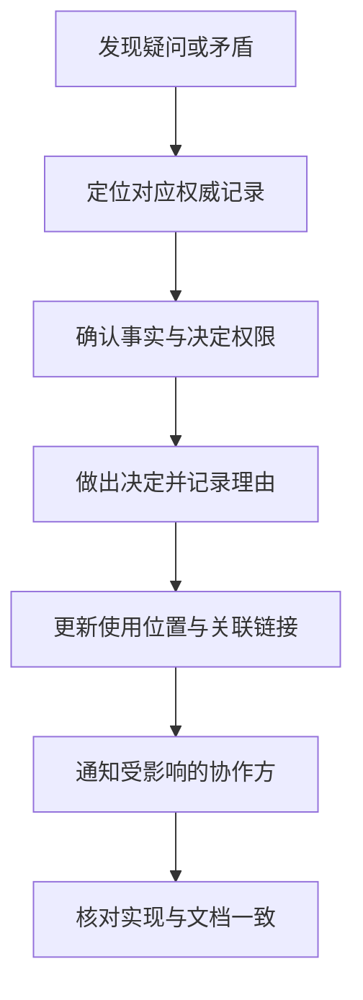

# 文档、沟通与责任分工

> 本文面向跨角色协作、编写项目说明或接管系统的人员。读完能按使用场景组织文档，确定决定和执行责任，并让沟通结果进入可持续维护的项目记录。

## 文档用于减少哪一种不确定性

文档可以帮助新人运行项目、帮助使用者调用接口、解释设计理由或支持故障处理。这些用途需要不同内容。把所有材料堆到一个长文件，可能同时让新人找不到步骤、值班人员找不到恢复动作、审查者找不到决定依据。

**技术文档**是被维护、可供使用的知识记录，不只指正式说明书。需求规则、接口契约、运行手册、架构决定、议题和发布记录都可能承担文档职责。源代码可以表达实际实现，通常不能完整解释业务理由、责任或操作前提。

Diátaxis 根据读者需求区分教程、操作指南、参考和解释。这个分类帮助安排内容，而不要求每个项目建立四个独立网站。[Diátaxis](https://diataxis.fr/)

| 使用需求 | 内容形式 | 宜回答的问题 |
| --- | --- | --- |
| 第一次学会某项工作 | 教程 | 按什么顺序获得一个可见结果？ |
| 已理解背景，完成具体任务 | 操作指南 | 前提、步骤、失败与恢复是什么？ |
| 查询精确信息 | 参考 | 参数、字段、状态和约束是什么？ |
| 理解原因与权衡 | 解释 | 为什么如此设计，其他方案为何未选？ |

虚构的排班工具可以有一份本地启动教程、一份发布指南、一份班次 API 参考和一份冲突处理解释。发布指南应直接引用 API 或配置参考，避免重复整段参数定义。重复内容越多，变更时越难保持一致。

## 为信息确定权威位置

**权威来源**是团队约定在发生矛盾时应以哪个维护记录作为确认入口。它不意味着该记录永远不会错，也不要求所有信息放在同一工具。接口定义可以在仓库，优先级在工作项系统，运行状态在监控系统；各自范围应清楚。

需要区分“当前状态”和“历史理由”。需求正文描述现行规则，决定记录保存为何从旧规则改为新规则；评审讨论可能解释变更，但不应要求每位使用者翻完全部讨论才能知道当前契约。重要讨论结论应更新到使用者实际会查询的位置。

图中通知是团队工作流程的建议，并不表示本文执行了任何对外发送。对读者来说，决定完成的条件应包括受影响者能找到新规则，而不只是会议结束。

文档应标识适用版本、状态、维护责任和更新时间。时间新不一定准确，老文档也不一定失效；关键是能对应当前系统和明确范围。操作指南若只写“执行部署脚本”，还需说明环境、权限、目标版本和失败处置，否则接管者仍需猜测。

## 责任分工要覆盖决定与执行

**责任分工**至少应说明谁完成工作、谁对结果负责、谁提供必要意见、谁需要知道结果。RACI 是表达这些关系的一种方式：Responsible、Accountable、Consulted、Informed。它适合澄清边界，不能代替技能、资源和授权。

本文表格采用四种责任角色，但不把它们当作所有组织必须遵守的固定制度。每个关键决定宜有明确的最终决定者，避免多人都“负责”却无人能解决冲突；实际执行者可以有多个。

| 事项 | 执行 | 最终决定或结果责任 | 必要参与 |
| --- | --- | --- | --- |
| 排班冲突规则 | 产品分析与领域人员整理 | 指定业务规则负责人 | 开发、测试核对可行性和边界 |
| 接口契约变化 | 提供方与调用方协作 | 契约维护负责人 | 受影响使用方确认兼容计划 |
| 发布操作 | 具备权限的发布人员 | 当次发布负责人 | 支持人员了解恢复和观察安排 |
| 故障后续修复 | 指定处理人员 | 问题负责人 | 相关模块维护者与业务确认者 |
| 文档维护 | 各知识对象维护者 | 对应系统或模块负责人 | 实际读者反馈错误与遗漏 |

表格中的角色是虚构安排。小团队可能一人兼任多个角色，仍应说明在此事项上以什么身份做决定；兼任不能消除需要独立核对的高风险部分。大型团队则要避免把每项低影响变化都送到同一个审批人，形成不必要等待。

没有授权的负责人只能协调，无法承担最终决定。没有资源的执行者也无法按时交付。分工时应同时确认权限、可用时间、替代人员和升级通道，尤其是跨团队接口与服务支持。

## 让沟通产生明确结果

异步沟通适合事实、选项和证据清楚的事项，读者可以按自己的时间核对；同步讨论适合高歧义、冲突或需要快速协商的情况。讨论完成后仍要记录结果，避免知识只留在参加者记忆中。

一份决定记录可以简短，但应写清问题、候选方案、约束、决定、理由、行动、负责人和期限。不同意的意见如果代表仍存在的风险，也应记录如何处理。无需逐字保存所有对话，重点是让未参加者理解结论并能行动。

“已讨论”不是状态，“待处理”也不是可执行行动。可以改成“由接口维护者在某日期前确认是否支持分页；在确认前调用方保留现有接口”。这说明责任、结果和等待边界。时间应由项目实际约定，文档示例不应替团队虚构承诺。

收到变更信息的人不一定已经理解。高影响变更需要确认对象、兼容期限和实施计划；普通通知则可以使用明确链接和摘要。避免把“消息发出”作为接口迁移完成的唯一证据。

## 把维护融入变更

文档变更宜与相关代码或操作变更一起审查。接口增加参数时更新参考，运行方式变化时更新启动步骤，决定改变时更新理由及替代关系。对于能从契约生成的内容，可以自动生成，但要验证生成器、输入和产出是否匹配。

NASA 的技术数据管理强调信息识别、访问、保护和生命周期维护，并要求明确谁能改变不同类型的数据。普通项目可以据此确定维护责任与访问范围，不必引入额外审批层级。[技术数据管理](https://www.nasa.gov/reference/6-0-crosscutting-technical-management/)

敏感信息应按使用需要限制访问。运行手册可指明机密获取渠道和所需权限，不能为了“接管方便”复制口令。测试材料尽量使用虚构数据，事故记录保留必要证据时也要控制其可见范围。

验证文档不只检查拼写和链接。对操作指南，应由具备相应前提的人依步骤确认结果；对接口参考，应对照实际契约；对架构解释，应确认边界与当前实现。不能运行时，明确哪些步骤尚未验证，保留待补证事项。

## 常见失效与适度投入

文档失效常见于：没有维护者、同一规则多处复制、决定只在聊天里、过期材料未标记、交接只给代码和账号。责任失效常见于：所有人都被抄送但无人决定、负责人没有权限、紧急事项没有升级通道。

过度文档化也会消耗时间。重复的低价值记录应合并或自动生成，低影响事项可以保留简短上下文。优先维护会影响正确性、运行恢复、跨团队接口和接管的知识，再根据实际查找困难补充。文档的价值可以通过能否完成任务、是否减少反复询问及是否避免错误来观察。

## 实例：接口说明与会议决定相矛盾

假设会议同意批量排班返回逐项结果，接口参考仍写整批原子成功。发现矛盾后，先找决定权限和实际实现，确认哪份描述需要更新；不能仅按文档时间新旧选择。若实现尚未完成，应把新决定标成目标契约，并明确当前仍提供旧行为。

随后更新接口、验收例子和调用方迁移说明，保留会议决定的理由链接。对已依赖旧接口的使用方，还需说明兼容窗口和负责人。这样沟通结果既进入权威说明，又不会把尚未实施的决定误当作已经可用的功能。

## 参考资料

<Refs>

- [Diátaxis](https://diataxis.fr/)、[NASA：Technical Data Management](https://www.nasa.gov/reference/6-0-crosscutting-technical-management/)；访问日期：2026-10-03。
- [AI 上下文与边界](/software/guide/ai-context-boundaries)：为协作工具提供准确且适量的资料。
- [需求分析、领域规则与追踪](/software/requirements/requirements-analysis)：维护规则及其来源。
- [建模与架构描述](/software/architecture/architecture-modeling)、[阅读与接管既有系统](/software/maintenance/system-takeover)：面向设计与接管的知识记录。

</Refs>
