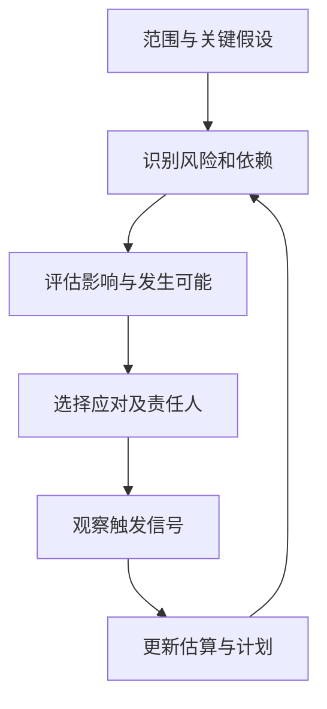

# 估算、风险、成本与自建采购

> 本文面向需要安排资源、评估方案和做采购决定的产品与工程人员。读完能解释估算范围及不确定性，建立可更新的风险记录，并从完整生命周期比较自建、采购和组合方案。

## 估算是有条件的预测

**估算**（estimate）是在给定范围、假设、资源和方法下，对工作量、时间或成本的预测。**计划**说明准备如何安排工作；**承诺**说明接受什么交付责任。三者相关，但把期望日期写入表格，并不会改变实际工作量。

虚构的资料检索工具需要导入历史文档、提供搜索和权限控制。初步预计“数周可完成”，其中可能只考虑新页面，没有计算旧格式转换、权限核对、运维和试用调整。估算失准常来自范围不完整，而非某个程序员写代码速度过慢。

GAO 成本估算指南强调明确目的、范围、技术基线、工作分解、假设、数据和方法，并分析不确定性、用实际成本更新估算。本文采用这些原则，不照搬大型采购项目的全部流程。[GAO 成本估算指南](https://www.gao.gov/products/gao-20-195g)

估算记录至少要说明包含什么、排除什么、采用什么人员和工作条件，以及哪些事实尚未确认。一个区间若没有解释上下界来源，也可能只是换了形式的猜测。没有统计依据时，不应把主观区间标成精确的置信概率。

## 拆分工作同时拆分未知

**工作分解**把交付结果拆成可识别部分。资料检索可分为数据盘点、导入校验、搜索路径、权限验证、运行准备和交接。每部分还应识别关键依赖：没有权限清单，开发能继续做界面，但完整验收仍会等待。

**工作量**不等于**历时**。两人各工作一天，并不保证一天结束；需要串行分析、评审等待或外部服务响应时，历时受依赖限制。增加人员还可能产生沟通、接管和整合成本，因此不能简单按人数反比例压缩工期。

| 方法 | 可利用的依据 | 主要边界 |
| --- | --- | --- |
| 类比估算 | 相似项目的实际工作 | 要解释规模、团队和数据差异 |
| 分解估算 | 各部分范围和依赖 | 容易漏掉集成、等待及运行工作 |
| 参数模型 | 有效历史数据与成本驱动量 | 输入定义和适用范围必须一致 |
| 专家判断 | 相关经验与假设 | 宜记录分歧，避免权威替代证据 |
| 基于交付历史的预测 | 稳定口径下的完成记录 | 工作类型、容量和过程变化会影响结果 |

实践中可以交叉检查两种方法：分解结果明显高于类比项目时，检查是否增加了数据清洗和权限要求；明显低于时，检查是否漏掉维护准备。方法间的差异是分析线索，不应为得到期望结果而调整数字。

故事点等相对量依赖团队自己的尺度，不能直接用于跨团队比较生产率，也不能天然转换成金额。吞吐量记录也需要稳定的完成定义；把大型任务拆成很多小条目，数字变化不一定代表交付能力提升。

## 让风险成为可行动的记录

**风险**（risk）是尚未发生、可能影响目标的不确定事项。已经无法连接测试环境是当前问题；“供应方可能延迟开放环境，导致集成验证推迟”是风险。明确原因、事件和后果，才便于采取措施。

风险应对可以是避免、降低、转移部分责任或接受并准备恢复。采购并不自动转移业务结果责任；供应方提供产品，使用方仍可能负责数据、集成和运行。每项重要应对要有执行者、触发条件和检查时间。

例如历史文档格式未知，影响导入正确性。应对可以先抽样盘点、验证转换可行性，再决定完整导入范围。抽样降低未知，不能证明所有历史数据都一致；后续仍需全量校验和异常处理。风险关闭应有证据，不能因为开发开始了就消失。

“概率乘损失”可帮助比较某些风险，但输入通常不精确，且期望值会掩盖低概率高损失。对不可接受的数据破坏或长期服务中断，应设硬约束、恢复要求或单独审查。多个风险也可能相关：供应方延迟同时引起测试压缩与额外集成成本，不能假定完全独立。

## 比较完整成本

**总拥有成本**（total cost of ownership，TCO）应包含选定观察期内的建设或采购、集成、运行、维护、培训、迁移和退出成本。这里只提供分析维度，没有实际价格和报价。观察期、计量单位和使用量应一致，才便于比较。

自建的显性费用可能较少，人员时间和长期支持仍是成本。采购的订阅费容易看到，适配限制、额外组件、数据导出和供应方变化也需要考虑。还应说明机会成本：投入自建通用搜索的团队，可能无法同时完成更有差异价值的业务规则。

| 比较维度 | 自建需回答 | 采购需回答 |
| --- | --- | --- |
| 核心需求适配 | 有无领域能力和持续维护资源？ | 必需功能能否验证，限制是什么？ |
| 集成与数据 | 接口和迁移由谁完成？ | 能否导入、导出并保持语义？ |
| 运行责任 | 谁值守、升级和恢复？ | 服务边界、支持及中断处置如何约定？ |
| 变更控制 | 能否持续迭代并维持质量？ | 路线、弃用和价格变化如何处理？ |
| 退出能力 | 接管和文档是否充分？ | 替换时数据、接口与许可如何处理？ |

组合方案常有价值：采购通用存储或检索能力，自建领域权限和工作流。但组合也引入接口、版本和责任边界，需要把这部分成本计入，不能把两边的优点直接相加。

## 决定前先验证会改变排序的未知

比较方案时，先设必须满足的条件，再比较弹性指标。必须支持某种数据导出而供应方做不到，即使综合分数很高也不应通过。权重和评分需要有可解释尺度，“性能九分”若没有负载和测量依据，不能视为事实。

NASA 决策分析建议明确标准、候选方案、证据与不确定性，并检查进一步获得信息是否可能改变选择。它提供的是决策思路，本文的项目示例没有执行实际方案实验。[NASA 决策分析](https://www.nasa.gov/reference/6-0-crosscutting-technical-management/)

可以设计一个有限试验：用代表性文档验证导入、权限、检索和导出路径，记录成功条件与失败情况。试验不应只采用最干净的数据，也不应悄悄扩大成完整产品开发。事先确定需要回答的问题、投入上限和结束后的决定。

**敏感性分析**检查关键假设变化是否改变结论。例如使用量增加、历史数据异常率上升、支持期延长，会对不同方案产生不同影响。做情境表有助于发现方案的脆弱点；没有概率依据时，可称为情境分析，避免包装成精确预测。

## 估算如何持续更新

更新时区分范围变化、事实补充和执行偏差。新增全文导出是范围变化；发现旧格式复杂度更高是事实补充；已明确任务因为等待审批延期是执行问题。三者需要不同处理，不能都归为“开发超时”。

定期比较预计与实际，并记录偏差原因。保留旧估算与当时假设，才能从历史学习；覆盖旧数字会丢掉有价值的信息。决定缩减范围时，还需确认被删能力不破坏关键业务路径和支持责任。

估算无法消除未知，采购也无法消除责任。可用的结果应让决策者看见投入范围、关键条件、可接受风险及下一次更新时点，而不是提供一个看似精确却无法复核的日期或金额。

## 实例：导出能力改变方案排序

假设采购候选方案可快速导入，但只能导出部分字段。若资料必须能完整迁出，这是必需条件，不能用更低订阅费抵消。若缺失字段可通过受支持接口补齐，则需要把开发、验证、接口限制和长期支持计入组合方案。

可以先用代表性资料核对完整往返过程，记录导入后哪些内容发生变化、导出能否恢复关系和权限。该试验回答退出可行性，不证明日常查询性能。把不同疑问分开验证，有助于控制探索成本，并避免一次演示成功就宣布方案全面满足要求。

## 参考资料

<Refs>

- [U.S. GAO：Cost Estimating and Assessment Guide，GAO-20-195G](https://www.gao.gov/products/gao-20-195g)、[NASA：Decision Analysis](https://www.nasa.gov/reference/6-0-crosscutting-technical-management/)；访问日期：2026-10-03。
- [需求与验收](/software/guide/requirements-and-acceptance)：先确认交付范围。
- [生命周期、迭代与过程选择](/software/requirements/lifecycle-process)：组织反馈与阶段决定。
- [容量、性能与成本](/software/operations/capacity-performance-cost)、[FinOps](/cloud/architecture/finops)：运行阶段的资源与费用分析。

</Refs>
