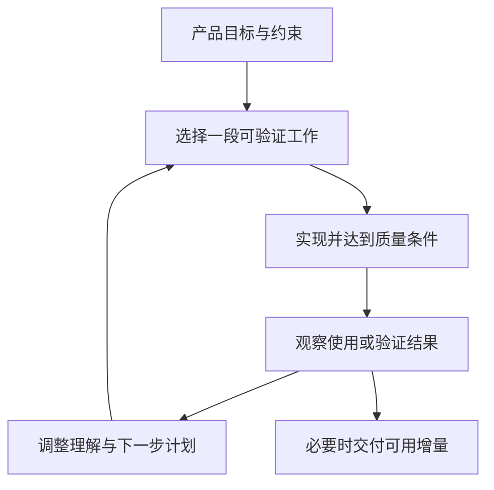

# 生命周期、迭代与过程选择

> 本文面向安排研发节奏、参与交付与维护的团队成员。读完能区分生命周期、迭代和增量，按不确定性与约束选择过程，并识别“按时开会但没有有效反馈”的失效方式。

## 生命周期覆盖产品存在的全过程

**软件生命周期**（software life cycle）涵盖构想、需求、设计、构建、验证、交付、运行、维护和停用。它描述需要处理的活动与状态，不要求所有活动只能各做一次。运行中发现新的限制，可能重新分析需求、修改设计、验证并发布。

**研发过程**描述活动如何组织、决定如何做出、证据如何产生。**方法或框架**提供角色、事件、实践或规则。采用某个名称不自动说明团队已解决交付问题；要看信息能否及时反馈，关键风险能否被控制，结果是否可用。

虚构的维修预约系统需要逐步确认用户如何选择时段，同时受固定外部接口和年度采购窗口约束。用户交互适合早期试用，外部接口需要先确认契约，采购节点需要可核对的范围和预算。一个项目可以对不同约束采取不同安排，但应让它们连接起来。

## 迭代和增量回答不同问题

**迭代**（iteration）通过重复活动修正理解与方案。先做预约原型，观察操作困难，再调整流程，是迭代。**增量**（increment）增加一部分可用能力。先交付预约，再增加改期，是增量。两者经常结合，但不相同。

只有重复开发轮次而没有反馈，不足以构成有效学习。只有把系统按数据库、服务、页面分阶段建设，也未必产生用户可用的增量：如果每阶段都无法完成预约，验证真实操作的时间仍然很晚。

可用增量通常需要贯穿一个薄的业务路径，包含必要权限、数据、错误处理与运行支持。薄意味着控制范围，不意味着把质量留到最后。无法用于生产的原型也有价值，但应明确它用于验证什么、哪些部分必须重做，避免把探索结果误作可支持产品。

## 过程选择先看不确定性与代价

计划驱动的安排强调提前分解、基线、阶段证据和受控变化，适合稳定约束与高昂变更代价。适应性安排强调短反馈和逐步调整，适合需求或方案仍需探索的情况。两者都需要计划、文档、验证和责任，只是决定细度与反馈节奏不同。

| 主要情境 | 更需要的机制 | 常见风险 |
| --- | --- | --- |
| 用户流程不清楚 | 原型、短周期试用、结果反馈 | 过早锁定方案，直到交付才发现无用 |
| 外部接口或安全约束稳定 | 契约确认、设计分析、变更控制 | 为追求速度漏掉跨系统约束 |
| 发布操作代价很高 | 分阶段证据、模拟演练、发布准备 | 把阶段批准当作全部风险已消失 |
| 在线产品持续变化 | 小增量、自动验证、运行观察 | 工作太多并行，质量和反馈积压 |
| 多个供应方共同交付 | 接口责任、集成里程碑、共同验证 | 每方局部完成，整体仍无法使用 |

“需求稳定”也需要证据。文字需求签字后，可能仍有用户理解、数据质量和技术可行性未知。可以保留范围基线，同时通过风险原型验证这些未知；发现冲突时按约定调整，而不是把签字当作拒绝学习的理由。

过程应控制不可逆成本。需要采购专用硬件时，先验证核心兼容性可能比先完善页面更重要；数据迁移难以恢复时，先做校验与恢复演练可能比增加功能更重要。优先顺序来自损失和信息价值，不能只按页面完成数衡量进展。

## 敏捷与 Scrum 的准确边界

敏捷宣言原则重视早期持续交付、合作、技术质量、可持续节奏和定期改进。它没有规定所有团队都采用同一个会议安排，也没有把“欢迎变化”解释为任何新增要求都不需要代价判断。[敏捷宣言原则](https://agilemanifesto.org/principles.html)

Scrum Guide 2020 将 Scrum 定义为应对复杂问题的轻量框架，采用迭代与增量方式，通过透明、检查和适应组织工作。它有明确的责任、事件、工件与承诺；若只借用部分实践，宜准确说明做了什么。[Scrum Guide](https://scrumguides.org/scrum-guide.html)

对实践而言，关键区别包括：日常检查关注向目标推进和调整计划；结果检查关注产品及后续方向；回顾关注团队如何改进工作方式。把所有事件都变为逐人汇报任务百分比，会削弱这些不同用途。

**完成定义**（Definition of Done）说明增量达到产品所需质量条件的状态，帮助团队对“完成”形成共同理解。它与某条需求的验收标准相关，但层次不同：验收标准约束具体行为，完成定义可包括通用验证、文档和集成条件。未达到完成定义的工作不能因代码已写完就算可用增量。

Sprint 结束不必等于统一发布日期。Scrum Guide 允许在结束前交付符合条件的增量，结果检查也不是规定的发布闸门。组织如果另有发布审批，应明确其用途及与研发过程的连接，避免误称为框架固有要求。

## 用证据安排阶段决定

阶段决定可以帮助团队避免在关键未知未解决时继续扩大投入。有效的决定说明需要什么证据、谁有权判断、未知如何处置。例如外部接口接入前确认协议和测试环境；发布前确认运行、恢复与支持准备；停用前确认依赖者和数据去向。

阶段通过只代表在当时范围和条件下接受了证据。后续新事实可能需要重新打开决定。为了守住计划而隐藏失败，会破坏过程的反馈能力。质量检查被不断挪到下一阶段，则会把问题集中到最难修正的时间点。

计划宜采用不同细度：近期工作具体到可验证任务，较远工作保留目标、依赖与区间。维护紧急工作需要可进入的通道，否则团队可能为了“保持迭代承诺”拖延服务修复。通道同时应记录被挤出的工作，避免每次紧急请求都无声扩大负荷。

## 如何判断过程需要调整

可观察的信号包括：需求确认等待很久、变更经常返工、完成项长期不能发布、集成问题晚发现、故障修复挤占全部计划、用户反馈无法影响优先级。应记录原因和等待位置，而不是只增加会议。

团队可以选择一个可检验的改进：限制并行工作、提前接口验证、缩小变更、建立明确完成条件，观察一段时间后再判断。过程指标用于理解瓶颈，不能直接把提交数、故事点或会议出席率当作价值产出。

过程选择也有边界。短周期不能消除长采购周期，自动测试不能替代业务决策，明确流程不能补偿缺少关键技能。将这些限制显性化，并安排相应资源或决定，才有可能持续交付和维护。

## 实例：一个增量怎样包含完整责任

维修预约的首个增量可以只支持管理员预先设置时段、用户选择空闲时段并查看结果。先排除复杂改期和自动推荐，同时保留必要的权限、重复请求处理、错误提示及数据恢复说明。这样范围有限，却能实际验证预约路径。

试用后发现用户最困惑的是“提交成功是否代表确认”，下一轮应调整状态和反馈，可能暂缓原计划的推荐功能。反馈改变优先级时，记录原因和被替换工作，避免把调整变成无声扩大范围。若外部接口尚未就绪，可以用明确标记的替代环境验证交互，同时保留真实集成待验证事项。

回顾则关注为什么状态含义直到试用才暴露：是否缺少例子、责任不清或验收只看页面。改进可以是提前审查状态场景，而不是笼统要求更认真。下一轮检查该实践是否更早发现歧义，才形成过程学习。

这种增量划分应随反馈调整，并保留每轮实际完成与尚未验证事项的区别。

## 参考资料

<Refs>

- [Principles behind the Agile Manifesto](https://agilemanifesto.org/principles.html)、[The 2020 Scrum Guide](https://scrumguides.org/scrum-guide.html)；访问日期：2026-10-03。
- [软件项目全景](/software/guide/software-project-overview)：认识研发到运行的完整链条。
- [估算、风险、成本与自建采购](/software/requirements/estimation-risk-economics)：将过程安排连接到投入与风险。
- [停用、数据迁移与可持续性](/software/maintenance/retirement-sustainability)：生命周期末端的责任。

</Refs>
