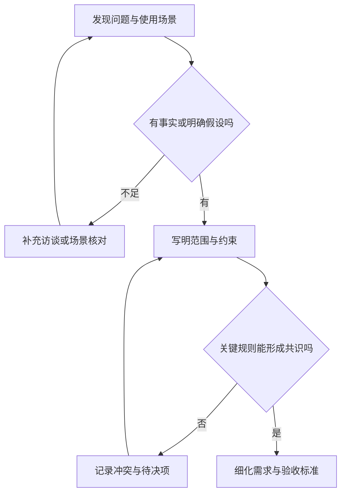

# 问题与范围

> 本文面向提出软件需求、协调研发或借助 AI 编程的业务人员，也适合需要澄清任务的开发者。读完能把一个模糊想法写成问题、用户场景和范围约定，区分假设与约束，并在需求变化时说明影响与取舍。

## 需求工作先确定要解决的问题

“做一个管理系统”只描述了交付物的类型，尚未说明谁遇到了什么困难。“加一个导出按钮”描述了候选功能，也没有说明它为什么值得做。团队如果直接进入实现，往往要在写代码时补决定：哪些人能导出、导出哪些记录、空结果如何处理、数据更新时以哪个时点为准。

**问题定义**描述现实中的不足及其影响；**范围**说明本次承诺处理到哪里。两者共同决定哪些需求应该进入交付，也为后续设计和[验收标准](/software/requirements/acceptance-criteria)提供依据。

SWEBOK 将软件需求与用户解决问题、达成目标所需的条件或能力联系起来，也包括系统或项目必须满足的条件。需求可以来自多个利益相关者，既涉及功能，也涉及约束。[SWEBOK 第 1 章](https://ieeecs-media.computer.org/media/education/swebok/swebok-v4.pdf)

一份可讨论的问题定义至少回答以下问题：

| 要澄清什么 | 可用的表达 | 常见缺口 |
| --- | --- | --- |
| 谁受影响 | 角色、职责、可见信息和操作权限 | 只写笼统的“用户” |
| 在什么情境发生 | 触发事件、已有状态、环境和依赖 | 只描述理想页面 |
| 当前困难是什么 | 可观察的错误、耗时、遗漏或不确定性 | 用“体验不好”概括所有问题 |
| 造成什么影响 | 哪项工作无法完成、哪条规则被破坏 | 只有功能愿望，没有影响 |
| 希望改善什么 | 预期结果及观察方法 | 预先指定一个工具作为成功标准 |

这张表是一种整理建议，项目可按复杂度裁剪。描述应区分事实、推测和愿望：访谈记录只能证明受访者这样表达，不能自动证明所有用户有同样需要；一次演示能发现交互问题，也不能证明真实使用频率。

## 问题、需求、解决方案：保持因果关系

**需求**规定需要具备的能力、行为或条件；**解决方案**决定怎样实现。区分二者的价值，是让团队能够比较不同实现，同时守住真正需要满足的目标。

| 层次 | 示例 | 主要判断 |
| --- | --- | --- |
| 问题 | 管理人员无法判断名单是否与当前有效报名一致 | 问题是否存在，影响谁 |
| 需求 | 有权限的管理员能取得指定活动的有效报名名单 | 能否支持工作，边界是否清楚 |
| 方案 | 提供 CSV 导出，由服务端查询并生成文件 | 能否满足需求，成本与风险如何 |
| 实现任务 | 编写查询、接口和页面入口 | 怎样完成选定方案 |

“必须使用某数据库”可能是既定环境约束，也可能只是偏好。应记录理由：是已有系统接口限制、运维能力限制，还是未经比较的默认选择。确有依据的技术约束应进入约定；偏好可以进入方案讨论，并给其他方案留下评估空间。

NASA 的系统设计指导同样从利益相关者期望和使用场景出发，再推导需求与方案。本文采用其中澄清目标、记录约束、保持追溯的思路，流程规模按软件项目裁剪。[利益相关者与设计过程](https://www.nasa.gov/reference/4-0-system-design-processes/)

## 用场景发现隐藏的规则

**用户场景**是一段有上下文的使用过程：某个角色在某种状态下，由某件事触发，采取行动并得到结果。场景比孤立功能名更容易暴露边界。例如“取消报名”要进一步讨论：谁可以取消、截止后是否允许、重复取消会怎样、取消后名额何时恢复。

可以采用如下简短模板，先记录关键场景，再逐步细化：

```text
角色：谁执行，是否有权限
触发：为什么此刻发起操作
前提：操作前对象和环境是什么状态
行动：用户希望完成什么
结果：成功后能观察到什么
偏离：信息缺失、重复请求、并发或失败时怎么办
```

场景不必列满所有界面点击。对业务方，应优先写角色、状态和结果；对实现方，再补充必要的接口与数据规则。画原型有助于沟通，但应把原型中的事实与待决定项写出来，避免一个画出的按钮被误认为已承诺的功能。



图中“有明确假设”允许项目在不确定性中前进，前提是让假设可见并安排验证。尚未决定的关键规则会影响架构或验收时，应先处理；低影响细节可以在后续迭代确认。

## 范围、非目标、假设、约束各有用途

**范围**是本次要交付的能力与边界；**非目标**是明确不在本次承诺中的事项；**假设**是暂时采用、仍需核实的条件；**约束**是必须遵守的限制。把四者写在一起容易让未验证的前提变成承诺。

| 类型 | 典型表达 | 发生变化后怎样处理 |
| --- | --- | --- |
| 范围 | 本次支持活动列表、详情、报名与取消 | 评估交付和验收范围的变化 |
| 非目标 | 本次不提供候补队列 | 作为新增需求讨论优先级与成本 |
| 假设 | 使用者已有稳定的登录身份 | 核实身份来源；不成立则调整需求 |
| 约束 | 在约定的现有运行环境部署 | 评估方案是否可行或限制是否需要协商 |

非目标要解释边界，但不能拿来排除实现范围内必需的正确性。例如不做高级安全分析，并不意味着普通用户可以读取管理员名单；不做高并发营销活动，也不意味着两个同时到达的报名请求可以突破容量。

假设应带有验证方法和负责人。比如“账号标识可以用于判断同一人重复报名”，需要确认标识来源及其稳定性。它并不保证一个自然人只有一个账号；若产品要防止同人多账号报名，就是另一项需要明确证据和方案的需求。

约束宜注明来源与适用期限。时间、预算、运行环境和必须兼容的接口都会影响范围；“所有能力都必须首期完成”若缺少资源依据，只会把取舍推迟到实施阶段。需求陈述也应记录理由和假设，避免后来只能猜测规则的来源。[需求表达检查原则](https://www.nasa.gov/reference/system-engineering-handbook-appendix/)

## 局部案例：小型活动报名与管理系统

下面是一份虚构的范围草案，用于展示写法。它使用虚构活动、测试账号和合成数据，不包含支付、多租户或真实个人数据；具体规则是示例约定，实际项目需要相关人员确认。

**问题**：活动参与者需要知道能否报名以及自己是否报名成功；管理人员需要获得与系统状态一致的名单。容量竞争和重复提交可能让确认信息与实际结果不一致。

**目标**：参与者能查看活动并完成报名或取消，管理员能取得当前有效名单；有效报名数量受活动容量约束，同一账号在同一活动最多保留一份有效报名。

| 范围维度 | 本次草案约定 | 必须继续澄清的边界 |
| --- | --- | --- |
| 活动查看 | 展示已发布活动列表和详情 | 未发布活动、已结束活动如何呈现 |
| 报名 | 登录账号在开放期内申请名额 | 满额、重复请求、响应丢失后的反馈 |
| 取消 | 账号在允许取消期间取消自己的报名 | 重复取消、恢复名额与同时报名的关系 |
| 管理 | 管理员查看名单并导出 | 有效报名定义、导出时点与失败反馈 |
| 身份 | 使用测试环境提供的稳定账号标识 | 谁授予管理员身份，谁维护测试账号 |

**非目标**：支付、候补队列、跨组织租户管理和真实身份核验不进入本次交付。**假设**：测试身份来源可用，活动规则由管理人员提供。**约束**：只使用合成数据，并在约定测试环境验证。

草案已经能支持讨论，但还不能直接宣称“需求完成”。例如“有效报名”可能指当前未取消记录，而不是历史上所有申请；容量是否可在报名开放后修改，也需要决定。把这些词汇统一后，再形成可验证的[验收标准](/software/requirements/acceptance-criteria)。

## 利益相关者与变更：谁决定，依据什么

**利益相关者**（stakeholder）是受产品或项目影响、对其有利益或责任的人。软件需求通常涉及使用者、业务负责人、开发、测试、运行维护和权限管理人员。一个人可以承担多种角色，但不应让一个角色的意见自动代表所有人的需要。

| 角色关注 | 需要提供的信息 | 常见冲突 |
| --- | --- | --- |
| 使用者 | 真实任务、失败后的恢复路径 | 更方便的操作可能增加误操作风险 |
| 业务负责人 | 目标、优先级、规则与验收责任 | 希望扩大范围，却无法同步资源 |
| 开发与测试 | 可行性、规则缺口、验证成本 | 实现简单的方案未必符合使用场景 |
| 维护与权限管理 | 运行条件、诊断方法、授权边界 | 只关注演示，忽略后续运行与管理 |

收到变化时，先判断它是什么：澄清原有规则、修复偏离约定的行为，还是增加新能力。分类不一定消除争议，但能让讨论聚焦。例如取消后允许再次报名可能是漏写的业务规则，也可能是首期约定外的新能力，要回看问题定义与当时决定。

建议保存一条短变更记录：请求原因、原约定、新约定、受影响需求及验收、交付成本、决定者和结论。结论可以是接受、拒绝或延期；接受后要通知受影响角色，并更新共同使用的需求记录。SWEBOK 的需求管理强调维护约定和控制变化，接受变化也需要处理其范围、资源或进度影响。[需求变更与范围匹配](https://ieeecs-media.computer.org/media/education/swebok/swebok-v4.pdf)

小项目可以用一个版本化文档和简短决定记录实现上述做法；关键是有可找到的当前约定。原型、聊天记录、Issue 和 PR 中出现不同说法时，应将决定归回这份约定，并保留出处。

## 常见失败模式

| 失败模式 | 结果 | 改进方法 |
| --- | --- | --- |
| 从工具或框架开始定义目标 | 做出了功能，却难以证明有用 | 回到用户、问题和期望结果 |
| 范围只有页面列表 | 容量、异常和权限规则缺失 | 补充角色、状态及偏离场景 |
| 把假设写成事实 | 前提失效后方案整体返工 | 显式标记并安排验证 |
| 非目标没有写明 | 每个人对“完整系统”有不同理解 | 记录本次不承诺的能力及理由 |
| 新要求直接插入实现任务 | 原验收与资源安排失效 | 先做影响分析并形成决定 |
| 把代码写完当成问题解决 | 系统符合方案，却不支持真实工作 | 用场景复核并收集使用反馈 |

## 参考资料

<Refs>

- [IEEE Computer Society：SWEBOK Guide v4.0a](https://ieeecs-media.computer.org/media/education/swebok/swebok-v4.pdf)（访问日期 2026-10-03）— 第 1 章 §1.1、§6.2、§6.3：需求定义、变更控制与范围匹配
- [NASA Systems Engineering Handbook：4.0 System Design Processes](https://www.nasa.gov/reference/4-0-system-design-processes/)（访问日期 2026-10-03）— §4.1：利益相关者、目标、场景和约束
- [NASA Systems Engineering Handbook：Appendix C, How to Write a Good Requirement](https://www.nasa.gov/reference/system-engineering-handbook-appendix/)（访问日期 2026-10-03）— 需求表达、理由与假设检查
- 站内相关：[需求与验收导览](/software/guide/requirements-and-acceptance) · [验收标准](/software/requirements/acceptance-criteria) · [软件项目全貌](/software/guide/software-project-overview) · [PR 工作流](/software/collaboration/pull-request-workflow) · [AI 编程责任边界](/software/guide/ai-coding-responsibility)

- 深入阅读：[需求分析与追踪](/software/requirements/requirements-analysis) · [估算、风险与成本](/software/requirements/estimation-risk-economics)

</Refs>
