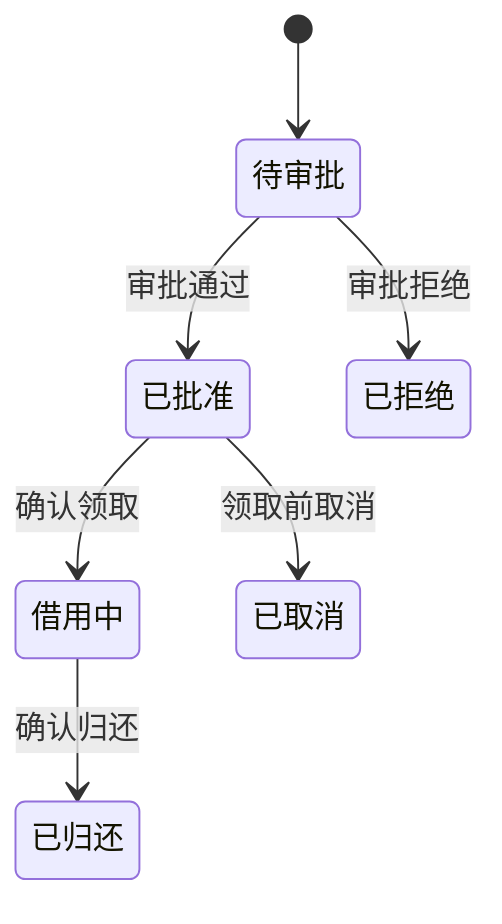

# 需求分析、领域规则与追踪

> 本文面向把业务问题转为软件约束的产品、分析、开发与测试人员。读完能分清事实、规则与设计决定，用模型找出遗漏，并在规则变化时追踪受影响的实现和验证。

## 分析从含义开始

**需求分析**是对已获取的需要进行解释、分解、冲突处理与可验证性检查。访谈得到“借用不能超期”，还不足以直接编码：期限从申请、审批还是领取开始？到期当天是否算超期？节假日是否顺延？系统没有收到归还记录时如何处理？

虚构的设备借用系统提供一个贯穿例子。使用者希望及时拿到设备，管理员希望避免重复分配，维护人员希望故障设备不再被借出。这些目标相关，却不能用一个“支持借用”按钮概括。分析需要把对象、权限、时间和失败条件逐步明确。问题与范围先见 [问题定义与范围](/software/requirements/problem-scope)，可验证结果见 [验收标准](/software/requirements/acceptance-criteria)。

**领域规则**（domain rule）表达业务允许什么、禁止什么以及如何计算。**设计决定**表达软件如何实现规则。例如“同一设备不能同时存在两个有效借用”是规则，“在数据库增加唯一约束”是设计方案之一。分开记录有助于在技术实现改变后保留正确业务含义。

事实、假设和待决定事项也应分开。“现有操作表记录了归还时间”是可核对事实；“归还记录总是即时录入”可能是假设；“离线归还允许延迟多久”需要有权的人决定。把假设写成事实，会让实现和测试共同建立在错误前提上。

## 建立小而精确的领域模型

**术语表**先解决同名异义。“可用”可能指设备没有故障，也可能指当前没有被预留；“借用完成”可能指审批结束，也可能指已经归还。应把每个关键术语写成可区分的状态或条件，并记录来源和决策人。

模型应围绕当前问题。例如可以区分申请、借用记录和设备：申请被批准不意味着设备已领取；设备故障不意味着历史借用记录删除。将它们合并为一个状态字段，容易导致“取消申请后设备自动归还”等错误行为。

**不变量**（invariant）是在规定范围内始终需要成立的条件。它必须说明范围和时间点：事务提交后，同一设备至多存在一个有效占用；未归还记录必须关联一个存在的设备。读副本可能暂时展示旧状态，不能把显示延迟误当作业务不变量失效，也不能因此允许写入破坏约束。

图只描述申请关联的主流程。故障、遗失、超期等事项应根据业务含义选择独立属性、异常流程或状态，不能因为图中没有画就假定不需要处理。每条转换还要明确执行者、前置条件、记录和失败结果。

## 用决策表暴露遗漏

文字需求常把多个条件压在一句话里。决策表将组合拆开，便于发现相互矛盾或没有定义的情况。以下条件仅用于虚构示例，不是现实借用政策。

| 申请状态 | 设备可借 | 操作者有审批权 | 预期结果 |
| --- | --- | --- | --- |
| 待审批 | 是 | 是 | 批准并形成有效预留 |
| 待审批 | 否 | 是 | 拒绝批准，说明设备不可借 |
| 待审批 | 任意 | 否 | 拒绝操作，不改变申请 |
| 已处理 | 任意 | 是 | 按重复请求规则返回，不重复预留 |

表中的“设备可借”需要进一步定义：无故障、无有效占用、满足时间条件等。把复杂条件压成名字后不再展开，会把歧义转移到另一个词中。时间边界也应写清：比较的是哪个时钟，截止时刻是否包含，时区如何处理。

并发需要单独分析。两个管理员同时看到可借，不意味着可以分别批准。需求应描述“并发批准后仍只有一个有效占用”这一结果，具体通过事务、锁或其他方法实现由设计决定。仅写页面禁止重复点击，无法覆盖其他入口和请求重试。

NASA 的逻辑分解强调从上层需要分析功能、输入输出、失败影响与接口，并识别设计引出的派生需求。该思路可用于普通软件分析，但形式和审查深度应按风险裁剪。[逻辑分解](https://www.nasa.gov/reference/4-3-logical-decomposition/)

## 派生需求必须说明理由

**派生需求**是分析或设计过程中产生、并非直接照抄上层表述的约束。例如选择异步通知后，需要定义发送延迟、重试和状态查询；引入离线操作后，需要定义同步冲突处理。它们有工程理由，但仍可能增加范围和成本，需要确认。

可以为每条重要需求记录标识、表述、来源、理由、状态、责任人和验证方式。暂未确认的事项应标为待确认，不宜用实现中的默认值偷偷决定。业务冲突也不应由开发者单方面通过代码顺序解决：如果“管理员可延长借用”和“下一位已预留后禁止延期”矛盾，需要明确优先规则。

质量需求应落到场景。“响应快”应说明操作、负载、测量位置和目标；“可靠”应说明失败条件及恢复要求。具体数值应来自业务容忍度或已有数据，不能为了表格完整凭空设定。未知时可以记录需要收集的证据与决定时间。

## 双向追踪支持变化分析

**追踪性**（traceability）是需求、设计、实现和验证等对象之间可辨认的关联。双向追踪既能从需要找到落实位置，也能从实现追问存在理由。NASA 的需求管理章节将来源、派生关系与变更影响作为持续管理内容。[需求管理](https://www.nasa.gov/reference/6-2-requirements-management/)

| 需求标识 | 规则与来源 | 设计或实现位置 | 验证对象 |
| --- | --- | --- | --- |
| BOR-01 | 单设备单有效占用，管理员确认 | 占用创建边界及数据库约束 | 并发批准用例 |
| BOR-02 | 未领取可取消，业务确认 | 取消转换与预留释放 | 已批准、借用中两种状态用例 |
| BOR-03 | 通知失败不撤销批准，派生待确认 | 通知任务及失败记录 | 通知失败与恢复用例 |

这是追踪表的示意，不是实际测试结果。链接存在也不证明关联正确。例如测试标题写 BOR-01，却只覆盖单请求成功路径，仍没有验证并发不变量。追踪需要检查语义覆盖，尤其要确认多个子需求共同实现了上层目标。

当取消规则改为“领取前十分钟不可取消”，先找到来源与决定，再查看转换逻辑、页面提示、任务、文档和测试。追踪图提供候选范围，代码检索、接口盘点和运行观察仍可发现未登记的依赖。自动生成链接可以降低维护成本，但需验证误连和漏连。

## 控制分析深度与维护成本

高风险、跨团队、长期支持的规则适合更稳定的标识和正式追踪；局部低影响改动可以用清楚的议题、评审和测试关联。追踪到每行代码通常难以维护，宜选择稳定的模块、接口或验证对象，并保留具体版本证据。

分析失败常表现为只记录成功路径、术语没有统一、把界面行为当作全部需求，以及实现变化后没有更新规则。另一类失败是模型过度精细却无法决定实际问题。应优先解决影响合法性、数据正确性、失败恢复和验收的歧义，把暂时无关的领域细节留在范围之外。

分析结果不是一次性冻结的答案。它应随着新事实更新，同时保留重要决定的理由。这样需求改变时，团队可以解释为何调整、影响哪里、如何验证，而无需重新猜测原有代码的含义。

## 实例：延期规则怎样进入追踪

新增“维护时间前必须归还”时，先确认维护时间的权威来源、修改权限和生效范围。再把延期批准拆成时间判断、占用检查和结果提示，关联到状态转换与验证。已有批准是否重新评估，是另一项必须确认的规则，不能由新校验顺带决定。

如果维护时间后来提前，追踪需要找到已批准申请和通知路径，而不只是新增申请接口。验证可以包括新申请被拒绝、旧申请进入待处理，以及管理员获知冲突等场景；实际如何处置由业务确认。这样一次规则变化就能显露历史状态与新输入的不同责任。

## 参考资料

<Refs>

- [NASA：4.3 Logical Decomposition](https://www.nasa.gov/reference/4-3-logical-decomposition/)、[6.2 Requirements Management](https://www.nasa.gov/reference/6-2-requirements-management/)；访问日期：2026-10-03。
- [需求与验收入门](/software/guide/requirements-and-acceptance)：从用户问题建立可验收范围。
- [业务状态机](/software/backend/business-state-machines)：把规则落实到合法状态转换。
- [文档、沟通与责任分工](/software/requirements/documentation-responsibility)：维护规则来源与决定责任。

</Refs>
