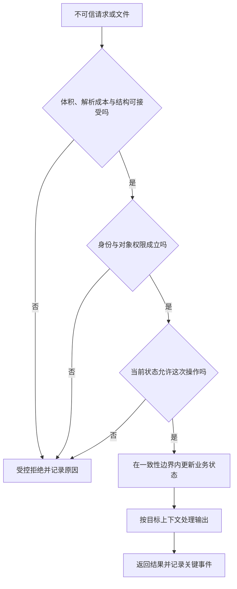

# 输入、输出与业务安全

> 本文面向编写和审查接口、页面与业务流程的开发者。读完能区分格式校验、注入防护、授权与业务不变量，知道控制应该落在哪一层，并为拒绝、重试和并发场景设计验收。文中的报名系统是虚构案例，代码与验证方案未执行。

## 合法输入仍然可能造成损害

**输入校验**（Input Validation）检查数据是否符合应用要求，包括类型、格式、长度、范围和字段之间的关系。整数格式正确，不代表数量允许；活动编号存在，不代表当前用户有权修改；名字里有单引号，也不代表它是攻击。OWASP 明确区分校验与后续的参数化查询、输出编码和授权控制。[输入校验指南](https://cheatsheetseries.owasp.org/cheatsheets/Input_Validation_Cheat_Sheet.html)

**注入**（Injection）发生在不可信数据被解释成指令时。SQL、操作系统命令、模板和网页脚本都可能成为解释器。防护的关键是让数据与指令保持分离，而不是猜测所有“坏字符串”。**业务安全**则关注合法调用怎样破坏目的，例如重复占位、越权导出和绕过活动状态；它往往没有通用恶意载荷特征。

输入来自浏览器、文件、队列、数据库、外部服务和管理员工具。存进数据库的数据不会因此自动可信：它可能最初由用户提交，之后出现在另一个页面、日志或导出文件中。应沿数据流检查每次进入新解释环境的位置，而不是只在入口安装一个过滤器。

## 四道判断各有职责



图表达的是需要成立的判断，不规定所有系统必须按同一顺序执行。认证可在解析部分内容前完成，事务内可能要重新检查权限相关状态。原则是：在资源耗尽前限制成本，在产生副作用前确认权限和状态，在内容进入解释器时采用对应防护。

| 控制 | 回答的问题 | 报名系统中的例子 | 无法替代 |
| --- | --- | --- | --- |
| 结构与语义校验 | 数据能否被合理处理 | 人数是允许范围内的整数 | 对象授权 |
| 参数化或安全 API | 数据会不会变成指令 | 用绑定参数查询活动 | 是否有权报名 |
| 认证与授权 | 谁在访问什么 | 只取消当前用户的报名 | 容量约束 |
| 业务状态与一致性 | 这一步现在能否发生 | 已结束活动不能新增报名 | 输出防护 |
| 上下文输出处理 | 内容如何被目标解释 | 名字作为文本显示 | 敏感字段是否应返回 |

这些控制需要组合。一次请求通过全部判断，只能支持本次输入和状态下的结论；重复调用、状态变化和不同输出目标仍需要独立考虑。

## 输入：先控制解析，再校验意义

在把内容全部读进内存之前限制请求体与文件大小，给复杂格式配置深度、元素数等解析边界。解析后的模式校验无法挽救已经耗尽资源的解析器。结构化对象宜明确允许字段、必需字段、缺失与 `null` 的含义，数组逐项检查并限制数量；直接把整个请求对象写入业务实体，可能让调用者设置本应由服务端决定的字段。

**允许列表**（Allowlist）定义接受的取值或结构，例如活动排序字段只允许“时间”和“名称”。自由文本可允许广泛的 Unicode 字符，同时限制长度，不能为了防注入剥夺正常语言表达。规范化要使用与业务一致的规则：身份标识怎样比较、空白怎样处理、日期在哪个时区解释，都应由契约定义，避免前后端各自转换造成分歧。

文件上传还需要考虑实际格式、存储位置、随机命名、访问权限和后续解析。扩展名与请求声明的媒体类型都由提交者控制，不能单独成为可信证明。若允许用户提供远程地址，还应单独分析服务端发起网络请求的权限与目标范围；“这是一个格式正确的 URL”只回答语法，不回答能否访问该地址。

校验失败反馈应足够定位用户输入问题，避免暴露数据库语句、堆栈和内部路径。对管理员工具，同样保留结构和范围约束；高权限意味着错误影响更大，而不是可以跳过校验。

## 指令边界：优先分离结构与数据

**参数化查询**（Parameterized Query）先定义查询结构，再把值作为参数绑定，让数据库把输入作为数据处理。它是 OWASP 推荐的 SQL 注入防护方式之一。不能绑定的结构，例如列名和排序方向，应映射到固定的允许集合；拼接来自用户的表名，不会因为其他值使用参数就变安全。[SQL 注入防护](https://cheatsheetseries.owasp.org/cheatsheets/SQL_Injection_Prevention_Cheat_Sheet.html)

下面是接口无关的伪代码，不是可直接运行的实现：

```text
activity_id = validate_identifier(request.activity_id)
actor_id = authenticated_identity.id
activity = query_with_parameters(activity_id)
authorize(actor_id, "register", activity)
result = register_atomically(actor_id, activity_id)
respond_with_allowed_fields(result)
```

安全性来自每步的真实实现及共享边界，函数名称本身不构成证明。数据库账号还应限制访问范围，降低某条路径失守后的损害；权限原理见[密钥、最小权限与审计](/software/security/secrets-permissions)。调用外部程序时，优先使用接受独立参数数组的 API，并核对它是否再次经过 Shell 或其他解释器，避免把字符串转义当成万能机制。

## 输出：编码、净化和数据授权分别处理

**跨站脚本**（XSS）是网页把不可信内容当成可执行内容处理的风险。**输出编码**（Output Encoding）针对插入位置把内容安全表示为数据；HTML 文本、属性、URL 和脚本的解析规则不同，所以不存在通用的“一次转义”。默认模板转义有帮助，直接写入 HTML 等绕过入口仍需检查。[XSS 防护指南](https://cheatsheetseries.owasp.org/cheatsheets/Cross_Site_Scripting_Prevention_Cheat_Sheet.html)

用户名字通常应该作为文本节点显示。确实需要富文本时，采用维护中的 **HTML 净化**（Sanitization）机制保留允许结构并移除危险内容；净化后再交给会改写内容的库，可能破坏原来的保证。内容安全策略是额外防线，不能替代正确的输出处理。

输出防护还有授权维度：接口只应返回完成当前功能所需字段。隐藏页面上的电话号码而在 JSON 中返回完整值，仍然泄露；导出文件、错误响应和调试日志也是输出。表格软件可能把某些单元格解释为公式，导出自由文本时需按实际消费工具设计安全表示，不能直接套用 HTML 编码。

## 业务安全：把规则放在可信状态边界

**认证**（Authentication）确认身份，**授权**（Authorization）判断该身份能否对特定对象执行特定动作。普通用户登录成功，不表示能修改任意报名编号。OWASP 建议默认拒绝，并对每次请求检查权限。列表查询、单项访问和导出应共享一致的授权语义，不能只保护最显眼的按钮。[授权指南](https://cheatsheetseries.owasp.org/cheatsheets/Authorization_Cheat_Sheet.html)

活动容量、报名归属和当前状态应从可信数据推导。服务端不能接受浏览器传来的“剩余名额”“我是主办方”或“已审核”作为事实。流程可用明确状态和允许转换表示；取消完成后再重放取消请求，应按约定返回已有结果或拒绝，不能额外释放一个名额。

**幂等性**（Idempotency）意味着重复操作不会产生额外的预期副作用；**竞态条件**（Race Condition）是交错执行破坏原本依赖顺序的判断。两个请求先读取“还剩一个”，再各自写入报名，就可能共同越过容量。应让检查与更新处于适当的一致性边界，并在数据层建立可表达的不变量。OWASP 业务逻辑指南强调服务端推导、显式状态、并发与功能级滥用控制。[业务逻辑安全](https://cheatsheetseries.owasp.org/cheatsheets/Business_Logic_Security_Cheat_Sheet.html)

## 如何验收与定位失败

以下是待执行的工程验证建议。验收应同时查看响应和持久化状态；仅看到拒绝提示，不能排除后台已经产生副作用。

| 验证场景 | 应观察的结果 | 失败说明什么 |
| --- | --- | --- |
| 合法名字含引号和多语言字符 | 正确保存并作为文本展示 | 输入规则或输出处理混淆 |
| 普通用户访问另一人的报名 | 不返回内容，不改变状态 | 缺少对象授权 |
| 请求包含服务端管理字段 | 按契约拒绝或忽略，权限不变化 | 批量赋值边界失效 |
| 最后名额被并发请求 | 有效报名总数不超容量 | 检查与写入之间存在竞态 |
| 超大或深层嵌套输入 | 在可控成本内拒绝 | 限制发生得太晚 |
| 取消成功后重试 | 不重复释放容量 | 终态与幂等处理失效 |
| 导出活动名单 | 只含授权活动与必要字段 | 输出范围未按业务授权过滤 |

常见失败是把这些结果都归为“加一个校验”：注入需要处理解释边界，越权需要处理身份与对象，竞态需要处理共享状态，泄露需要处理字段与目的。修复应沿原因选择机制，再用能触发原失败条件的测试验证，而不是增加一个无关的字符串黑名单。

## 参考资料

<Refs>

- [OWASP：Input Validation Cheat Sheet](https://cheatsheetseries.owasp.org/cheatsheets/Input_Validation_Cheat_Sheet.html)（访问日期 2026-10-03）
- [OWASP：SQL Injection Prevention Cheat Sheet](https://cheatsheetseries.owasp.org/cheatsheets/SQL_Injection_Prevention_Cheat_Sheet.html)（访问日期 2026-10-03）
- [OWASP：Cross Site Scripting Prevention Cheat Sheet](https://cheatsheetseries.owasp.org/cheatsheets/Cross_Site_Scripting_Prevention_Cheat_Sheet.html)（访问日期 2026-10-03）
- [OWASP：Authorization Cheat Sheet](https://cheatsheetseries.owasp.org/cheatsheets/Authorization_Cheat_Sheet.html)（访问日期 2026-10-03）
- [OWASP：Business Logic Security Cheat Sheet](https://cheatsheetseries.owasp.org/cheatsheets/Business_Logic_Security_Cheat_Sheet.html)（访问日期 2026-10-03）
- 站内相关：[威胁建模与安全开发验证](/software/security/threat-modeling) · [密钥、最小权限与审计](/software/security/secrets-permissions) · [隐私与数据生命周期](/software/security/privacy-lifecycle) · [验收标准](/software/requirements/acceptance-criteria)

</Refs>
