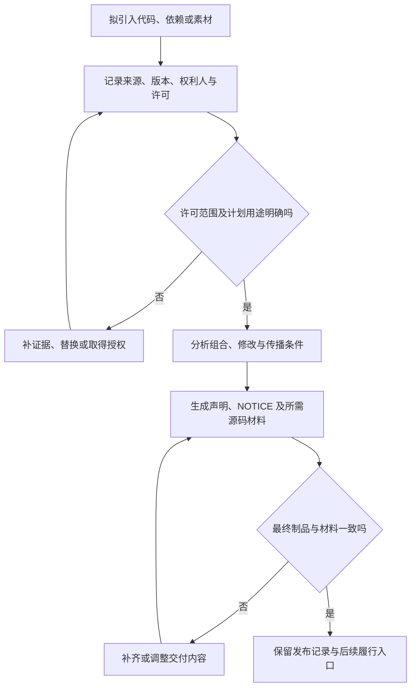

# 许可证、知识产权与职业责任

> 本文面向选择依赖、复制代码、发布软件或使用 AI 生成内容的研发人员。读完能区分“可下载”“许可使用”“具备发布条件”，把来源与许可要求纳入制品交付，并诚实表达能力、证据和剩余风险。本文解释公开许可条款及工程流程，不对具体作品的权属或法律责任下结论。

## 软件可以取得，不等于可以任意使用

**著作权**保护符合法律条件的作品及相应权利；**许可证**（License）表达权利人在特定条件下允许的行为。源码公开可见、搜索能找到代码、别人已经复制，都不能代替适用的许可。依赖可能允许商业使用，但仍要求保留声明、提供许可文本或在特定传播条件下提供相应源码。

**知识产权**还涉及专利、商标等不同权利。代码许可、字体许可、图片许可、模型权重许可和 API 服务条款可能各自独立。软件仓库写了一个许可名称，不代表仓库内所有第三方素材都由同一权利人以相同条款授权；审查需要下沉到实际进入制品的内容。

本篇将许可证原文中的条件与工程建议分开。具体作品是否构成改编、怎样组合、谁拥有权利，以及法律如何解释，需要结合事实、合同与司法管辖判断。不能仅凭“静态链接”“通过网络调用”之类技术标签宣布整个项目必然可以或不可以发布。

## 看清版本、范围与触发条件

**宽松许可证**（Permissive License）通常允许较广泛的使用和再分发，同时保留声明等条件。**著佐权**（Copyleft）通过许可条件维持被覆盖作品的后续自由；义务怎样触发，取决于具体许可、版本和行为。不要把这些分类当成完整许可文本。

| 许可原文示例 | 已核验的条件或特点 | 工程核对重点 |
| --- | --- | --- |
| MIT | 复制或实质部分包含版权和许可声明 | 打包后是否保留实际权利人的声明 |
| Apache-2.0 | 再分发需许可副本、修改标识、相关声明；有 NOTICE 时处理相应归属内容 | 修改文件、NOTICE、许可材料与专利条款 |
| GPL-3.0 | 传播目标码时需按第六条适用方式提供相应源码；普通网络交互本身不等于 convey | 交付对象、被覆盖范围、源码和构建材料 |
| AGPL-3.0 | 第十三条对修改版本的特定远程网络交互规定源码提供机会 | 是否修改、是否支持远程交互及提供方式 |

表是对选定原文的有限摘要，不是兼容性结论。MIT 也有明确条件；Apache-2.0 的专利许可有范围及终止条款，且不授予一般商标使用权限。GPL 和 AGPL 的适用分析要阅读定义与全部相关条款，不可把“使用 GPL 就要公开公司全部源码”当成普遍规则。[MIT 原文](https://opensource.org/license/mit)、[Apache-2.0 原文](https://www.apache.org/licenses/LICENSE-2.0)、[GPL-3.0 原文](https://opensource.org/license/gpl-3.0)、[AGPL-3.0 原文](https://opensource.org/license/agpl-3.0)

**相应源码**（Corresponding Source）在 GPL-3.0 中是一个定义术语，不能简单理解成某个最新仓库链接。若交付内容需要特定构建脚本、接口定义或其他材料，须核对这些是否进入相应范围，以及实际接收者是否能按许可取得。仅把源码放在访问受限的位置，不一定满足选用的提供方式。

## 许可兼容性是组合行为的问题

**许可兼容性**是多个许可条件能否在某种组合与传播方式下同时满足。双重许可可能让使用者在两个方案中选择；多个组件各有许可则可能需要同时满足。表达式中的选择关系与并行关系不同，不能看见两个标识就自行挑较宽松的一个。

版本也影响判断：`GPL-3.0-only` 与允许后续版本的声明并非同一许可范围；额外例外、商业授权或贡献协议也可能改变可用路径。保留原始许可文件、文件头和取得时间，有助于判断该版本到底授权了什么，而不是拿当前网站的声明追溯旧版本。

跨进程调用、插件机制、动态链接与代码复制是应记录的事实，但事实到法律结果之间还需要分析。若无法确认范围，可先减少耦合、选择明确满足需求的替代组件，或在具体证据齐备后寻求专业审查。工程上提前发现歧义，通常比发布后重建整个依赖链更容易处理。

## 把许可材料跟制品一起交付

**第三方声明**记录进入交付对象的组件、权利人和许可要求；它不能用一个模板替所有作品填同一作者。**软件物料清单**（SBOM）提供组件及许可元数据，SPDX 可表达许可标识和组合关系，但 SPDX 明确不负责法律解释或合规动作。[SPDX 概览](https://spdx.dev/learn/overview/)

下面是未执行的发布检查示意：从安装包或镜像确认实际组件，对照源码与构建清单，检查每项许可及修改情况，组装声明和所需材料，再解包最终制品确认这些材料没有被优化步骤删除。许可证扫描有助发现片段与文件头，不保证所有素材已识别，更不能代替触发条件判断。

声明放在哪里要按许可和交付形态选择：安装包文件、随附文档、应用内入口或源码归档可能各有作用。不要在一个网站链接上承担所有交付义务，除非实际条款和选用方式允许。版本下线后，仍需按所承担的要求维护相关提供入口，不能一清理下载目录就丢失履行能力。

## 不同素材与 AI 内容分别审查

| 内容 | 需要记录的事实 | 常见误判 |
| --- | --- | --- |
| 软件依赖 | 版本、许可、修改、分发形态 | 包管理器可安装便无需声明 |
| 复制的代码片段 | 原始位置、权利人、许可范围 | 片段短便必然没有权利问题 |
| 字体、图标与图片 | 素材来源、嵌入与再分发条款 | 网站可下载等于可放进安装包 |
| 模型权重与数据集 | 版本、许可及用途限制 | “开放权重”自动等同开源软件许可 |
| API 服务 | 合同、数据处理与输出使用条款 | API 能调用等于可再销售全部内容 |
| AI 生成代码 | 生成上下文、输出、疑似来源与人工修改 | 工具生成便自动拥有一切权利 |

AI 生成内容需要按实际输出核对，不宜宣称一律原创或一律侵权。高度相似片段、包含版权声明的输出、来自未授权材料的上下文，都应保留来源线索并审查。工具的服务条款与第三方作品权利是不同问题；一个服务允许使用输出，并不能消除可能存在的第三方许可要求。

贡献代码还要确认贡献者有权提交。工作成果、承包材料和学校项目的权属可能受合同或规则影响，不能由技术人员仅凭仓库账号推断。建立贡献说明、来源记录和审查入口，是工程上的治理措施，不是对任何具体合同作法律判定。

## 职业责任体现在可追踪的判断里

ACM 的职业伦理原则强调避免伤害、诚实可信、尊重知识劳动、保护隐私，以及充分评价系统影响和风险。它是职业准则，不等于适用于所有人的法律条文。[ACM 伦理准则入口](https://www.acm.org/code-of-ethics)及[ACM 分会公开原则](https://bw.acm.org/code-of-ethics)

对研发而言，诚实首先是区分事实与预期。示例命令未执行就写未执行，测试没有覆盖并发就不能称“所有场景通过”；性能估计不能伪装成基准，安全扫描不能伪装成业务安全证明。遇到能力边界，应交代适用条件并找到合适的审查责任，而不靠模糊措辞把风险交给下游。

对用户权益，技术团队应考虑错误决策、不可访问界面、数据滥用和不可恢复操作的影响。设计回退、人工介入和清晰反馈，不只服务工程方便，也影响用户能否理解并纠正结果。对维护者，交付可重建材料、说明依赖和已知限制，让接管者能够作出真实判断。

## 失败模式与可执行改进

| 失败模式 | 后果 | 改进方向 |
| --- | --- | --- |
| 只在根目录放一份许可 | 第三方许可和权利人被遗漏 | 审查制品内每类组件和素材 |
| 许可扫描直接输出“合规” | 工具未理解修改与传播行为 | 由人员核对范围与触发条件 |
| 源码归档与二进制不同版本 | 无法重建所交付版本 | 绑定提交、制品和源码材料 |
| 把开放权重当成通用许可 | 忽略模型及数据的独立条款 | 按具体版本阅读原文 |
| AI 结果不留来源与修改线索 | 后续无法审查相似片段 | 保存必要证据并人工复核 |
| 报告写通过却没有执行记录 | 接收者基于错误证据决策 | 明确实际检查、范围与局限 |

许可和责任不是发布末尾的一张表。引入内容时记录来源，构建时核对组成，交付时落实条件，维护时保留入口，才形成完整链路。无法确定的事项应以明确问题与材料移交给负责人员，避免把猜测写成普遍法律结论。

## 参考资料

<Refs>

- [MIT License 原文](https://opensource.org/license/mit)（访问日期 2026-10-03）
- [Apache License 2.0 原文](https://www.apache.org/licenses/LICENSE-2.0)——重点核对第 3、4、6 节（访问日期 2026-10-03）
- [GPL-3.0 原文](https://opensource.org/license/gpl-3.0)——重点核对定义与第 6 节（访问日期 2026-10-03）
- [AGPL-3.0 原文](https://opensource.org/license/agpl-3.0)——重点核对第 13 节（访问日期 2026-10-03）
- [SPDX：Overview](https://spdx.dev/learn/overview/)——元数据与法律解释的边界（访问日期 2026-10-03）
- [ACM：Code of Ethics](https://www.acm.org/code-of-ethics) · [ACM 分会公开原则](https://bw.acm.org/code-of-ethics)——主站索引内容与分会原则可读；主站正文请求受限（访问日期 2026-10-03）
- 站内相关：[依赖供应链与制品信任](/software/security/supply-chain) · [隐私与数据生命周期](/software/security/privacy-lifecycle) · [AI 编程：协作方式与人的责任](/software/guide/ai-coding-responsibility) · [威胁建模与安全开发验证](/software/security/threat-modeling)

</Refs>
