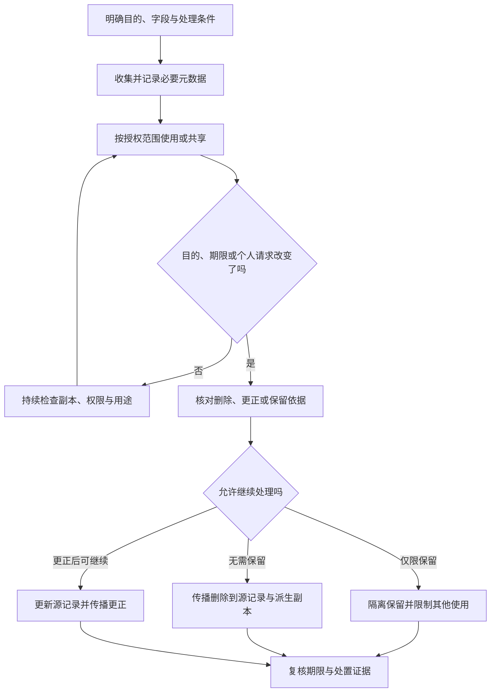

# 隐私与数据生命周期

> 本文面向设计数据功能的产品、开发、测试与维护人员。读完能把处理目的转成字段、权限、保留与删除机制，发现数据库之外的隐私副本，并设计可验证的更正和停用流程。法律内容限于公开原文的适用提示，不能替具体业务完成法律合规判断。

## 隐私不只是阻止泄露

**隐私风险**是数据处理可能对个人造成的损害或不利影响。未经授权读取是其中一类；过度收集、目的改变、错误数据影响决定、用户无法更正，以及已结束用途仍长期保存，也需要分析。NIST Privacy Framework 1.0 将隐私风险管理与网络安全保护区分，并把识别、治理、控制、沟通和保护组织为框架功能。[NIST 隐私框架](https://nvlpubs.nist.gov/nistpubs/CSWP/NIST.CSWP.01162020.pdf)

**数据生命周期**覆盖收集、存储、使用、共享、保留、归档和删除。它并不总是单向：一条报名记录可以同时出现在数据库、缓存、日志、通知队列、导出文件和备份中。删除主表后，其他副本仍可能参与处理；恢复旧备份也可能把已删除内容重新带回服务。

这里沿用虚构活动报名系统，用虚构姓名和联系方式解释工程机制，不处理真实个人信息。云上加密、身份隔离和日志边界见[安全与身份治理](/cloud/architecture/security-governance)；本篇重点是数据目的、血缘、期限与用户请求怎样落入软件设计。

## 法律范围先核对，工程要求再落地

中国《个人信息保护法》第三条规定境内处理活动及特定境外活动的适用范围；第四条定义个人信息并排除匿名化后的信息。第六条涉及明确目的与最小范围，第十九条规定保存期限的一般原则，第十三条列出处理条件，不能把“有勾选框”视为唯一合规判断。第四十七条规定删除情形及特定不能立即删除时的处理限制。[法律原文](https://www.samr.gov.cn/wljys/gzzd/art/2023/art_3ef1e889c1e644d4b65b5f5c7f432386.html)

这些条款不能被扩展成所有国家、所有行业都相同的义务。具体业务还需判断处理角色、敏感信息、法定保留、委托关系和跨境路径，以及适用的现行配套规定。本文不给出统一保留天数、跨境豁免或“全部数据必须本地化”的结论；这些决定必须由项目负责人员依据真实范围形成。

**去标识化**减少直接识别联系，但可能借助额外信息重新关联；**匿名化**在该法定义中要求无法识别且不能复原。用随机用户编号替换名字，若仍保留关联表，就不能直接宣称匿名化。技术团队应说明可关联性、额外信息权限和重识别风险，而不只使用标签。[第七十三条定义](https://www.samr.gov.cn/wljys/gzzd/art/2023/art_3ef1e889c1e644d4b65b5f5c7f432386.html)

## 从目的推导字段与访问路径

**数据最小化**意味着按明确目的选择必要数据，避免先收集再寻找用途。报名需要确认参与者和发送活动通知，不自然意味着需要身份证号、详细住址或设备通讯录。工程上可先列目的，再列字段、来源、访问者、期限与拒绝提供的影响；无法解释用途的字段是需要重新讨论的信号。

| 数据或副本 | 具体用途示例 | 设计选择 | 验证问题 |
| --- | --- | --- | --- |
| 报名身份标识 | 去重及归属判断 | 与活动和账号建立关系 | 是否依赖不必要的直接识别字段 |
| 联系方式 | 活动通知 | 单独访问权限与用途限制 | 名单展示是否可以不返回完整值 |
| 参与记录 | 判断当前报名状态 | 状态与个人资料分离 | 资料更正是否影响业务一致性 |
| 导出文件 | 经授权的现场工作 | 限字段、范围、有效期 | 谁可以下载，何时失效 |
| 应用日志 | 诊断与安全追踪 | 标识和结果摘要 | 是否复制了完整请求和联系方式 |
| 统计结果 | 评估活动规模 | 聚合并控制小群体披露 | 是否可以反推个人活动 |

表是编辑性的设计示例，不能替业务决定必要性。目的变化，例如从活动通知改为营销，需要重新评估数据路径、告知和处理条件，而不是只增加一个定时任务。新增分析 SDK、客服工具或 AI 服务，也会改变实际接收者和处理范围。

**数据血缘**（Data Lineage）记录数据从哪里来、经过什么处理、进入哪些副本。至少让每个敏感字段能追到源记录、派生索引与外部输出。只有数据库表清单，无法发现日志平台、搜索索引和下载文件；这些系统同样需要责任人和生命周期规则。

## 用状态管理目的与期限

图中的判断应由规则和有责任的人员支持，不能由定时清理脚本自行推测法律保留依据。**保留期限**是某类数据允许保存多久；**法律保留**是因具体义务或争议等要求暂缓删除的受控条件。保留不等于继续用于所有原功能，宜在数据状态和访问策略中体现用途限制。

工程元数据可包含目的类别、采集时间、规则版本、截止条件和责任人。期限可以由事件计算，例如活动结束后进入某个经确认的保留阶段，而不必给每条记录写一个永久固定日期。规则变化时要能重算、审查例外并控制批处理，不宜通过全表无记录删除完成迁移。

## 删除要覆盖派生副本和恢复路径

**软删除**仅把记录标记为不可见，通常仍保留字节；**物理删除**移除活跃存储记录，但不自动覆盖备份和已经输出的副本。软删除可支持短期业务恢复，不能未经分析就当成隐私删除已经完成。可以用最小化的删除标记帮助传播与防止旧副本回流，但标记自身也需要期限和权限。

下面是一份未执行的删除流程设计：先验证请求者身份和对象归属，确认应删除或限制处理的范围，创建带追踪编号的处置任务，阻断新的使用与导出，删除主数据及派生索引，通知受控接收者，核对结果并处理失败重试。响应应说明完成范围及例外，不宜在异步任务刚入队时就宣称全部删除完成。

不可逐条改写的备份需要独立策略：限制访问和用途，按确认的备份期限淘汰，并在恢复后重新应用删除或限制记录。这里是工程方向，不是断言“备份只要等到期就符合法律”。期限、技术困难与继续处理限制仍需按适用要求判断。

更正也需要传播。只修改账号资料，旧通知队列和搜索索引仍可能使用错误联系方式；一个清晰的源记录、版本和更新事件有助于识别滞后副本。需要保证重试不会把更早版本覆盖较新更正，失败事件能被检查而不无限积压。

## 共享、日志和 AI 处理改变边界

交给外部服务时，数据目的、字段、存储位置、访问者、保存与删除能力都需要具体核对。服务提供加密或安全认证，不代表它的默认日志和训练使用设置符合项目目的。技术接入清单应记录实际请求体与输出，而不是只登记服务名称。

**脱敏**是针对展示或处理场景隐藏部分信息，不能保证数据永远不可识别。日志中只保留电话号码后四位，若与账号、时间和活动组合，也可能具有关联性。脱敏策略应依据谁能看、为什么看及有哪些额外信息设计；调试临时打开完整日志后，还要处理已经形成的副本。

引入 AI 摘要或问答时，原文、提示、结果、向量索引和评测样本都可能包含个人信息。删除源文档时，需要核对检索索引、缓存、历史会话和供应方保存路径；不能把生成摘要当成天然匿名化。相关检索权限机制见[企业级 RAG 架构设计](/ai/application/rag-architecture)。

## 验证与常见失败模式

隐私验证宜使用虚构样本，检查收集、拒绝、授权、更正、导出、期限、删除与恢复，不把真实名单复制到测试环境。本文未执行这些验证；项目验收需要记录实际范围及未覆盖副本。

| 失败模式 | 原因 | 可验证的修正 |
| --- | --- | --- |
| 删除接口只隐藏页面 | 活跃数据和派生副本继续可读 | 从多个访问入口核对不可再处理 |
| 隐私声明与实现分离 | 新 SDK 或日志未进入清单 | 比对真实流量、接收者与规则 |
| 所有数据永久保存 | 没有目的与到期元数据 | 检查期限任务、例外与失败重试 |
| 用哈希替换编号便称匿名 | 关联和重识别路径仍存在 | 分析额外信息与可复原能力 |
| 恢复备份后重新出现删除记录 | 生命周期没有进入恢复流程 | 恢复后重放限制并验证访问 |
| 数据请求无身份核验 | 权利接口自身可能泄露数据 | 验证请求者与记录归属 |
| 测试直接拷贝生产资料 | 开发环境形成未受控副本 | 使用虚构生成数据并检查工具输出 |

规模增加后，隐私问题主要变成跨系统协作：任务如何追踪、接收者怎样回执、保留例外由谁复核。先建立清晰的数据责任与血缘，再扩展自动化，才能让“删除成功”成为可解释的结果。

## 参考资料

<Refs>

- [《中华人民共和国个人信息保护法》公开全文](https://www.samr.gov.cn/wljys/gzzd/art/2023/art_3ef1e889c1e644d4b65b5f5c7f432386.html)——核对第三、四、六、十三、十九、四十七、七十三条；不包含配套规定的全面复核（访问日期 2026-10-03）
- [NIST：Privacy Framework 1.0](https://nvlpubs.nist.gov/nistpubs/CSWP/NIST.CSWP.01162020.pdf)——风险管理与生命周期工程参考，非法律合规证明（访问日期 2026-10-03）
- 站内相关：[输入、输出与业务安全](/software/security/application-security) · [密钥、最小权限与审计](/software/security/secrets-permissions) · [安全与身份治理](/cloud/architecture/security-governance) · [企业级 RAG 架构设计](/ai/application/rag-architecture) · [AI 应用工程入口](/software/specialized/ai-applications)

</Refs>
