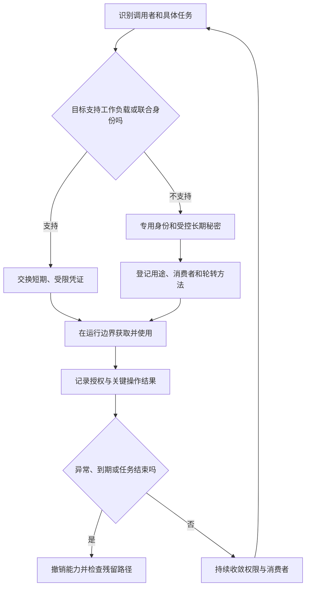

# 密钥、最小权限与审计

> 本文面向开发者、维护者和项目负责人。读完能区分配置与秘密，设计从开发到运行的凭证路径，把最小权限落实到身份、动作和资源，并在轮转与事件处置时保留足够审计证据。案例是虚构报名系统，文中的轮转与撤销步骤仅为设计示例。

## 秘密的风险由可获得的能力决定

**秘密**（Secret）是泄露后能帮助获得受保护能力的信息，例如 API 凭证、数据库口令、会话令牌和私钥。公开服务地址、功能开关通常是配置；凭证不是因为被写进配置文件就变成普通配置。**密码学密钥**承担加密、解密或签名等作用，生命周期与普通访问口令存在差异：撤销数据库口令不会改变已存数据，销毁解密密钥却可能使旧数据无法恢复。

保护秘密的目标有三个：减少实际接触者，限制可执行的动作，泄露后能够终止能力。只把秘密藏进一个文件，仍可能被构建、日志、备份、进程或运维工具读走。OWASP 秘密管理指南强调集中管理、细粒度访问、审计与生命周期，而不是只选择存储位置。[秘密管理指南](https://cheatsheetseries.owasp.org/cheatsheets/Secrets_Management_Cheat_Sheet.html)

**最小权限**（Least Privilege）是只授予完成任务所需的能力，并限制资源和条件。它不是“所有人都没有权限”，也不是一次生成完美策略；需要让正常路径可用，再持续发现多余权限。**审计**是为关键行为留下可追踪记录，回答谁在什么时间、针对什么对象、执行什么动作、结果如何。

云账号、组织策略与联合身份的全局架构见[安全与身份治理](/cloud/architecture/security-governance)。本文聚焦应用凭证怎样进入进程、操作权限怎样分解，以及开发工具和日志怎样避免成为泄露路径。

## 先建立身份，再选择凭证形式

**工作负载身份**（Workload Identity）让运行中的服务以自己的身份获取授权，避免多个程序共享一个人的永久凭证。**临时凭证**有有限有效期；**角色**是一组可由受信主体承担的权限。以 AWS 官方建议为例，人员使用联合身份和临时凭证，工作负载使用角色取得临时凭证；其他平台需核对对应机制。[AWS IAM 最佳实践](https://docs.aws.amazon.com/IAM/latest/UserGuide/best-practices.html)

图中的判断依赖目标服务和运行环境，不能用“短期”标签代替权限设计。一个有效十分钟、但能删除全部数据库的令牌，仍然拥有很大影响范围。长期凭证不可避免时，应使用专用身份、明确消费者、限制资源，并能够独立轮转，避免一个口令同时牵连多个系统。

报名服务只需要处理报名状态；名单导出任务只需要读取某个授权范围；部署流水线只需要发布指定制品。把三者合成一个管理员身份，会让任何一条路径失守后获得其他能力，也无法从记录确定实际使用者。

## 秘密如何穿过开发、构建和运行

**秘密管理服务**统一保存与发放秘密，可帮助授权、版本管理和审计，但自身也有启动身份、可用性与恢复要求。需要回答“服务如何证明自己有权取秘密”，而不是把一个新永久口令嵌在程序中，用它取另一个口令。运行环境提供的身份可以减少这种启动秘密，平台外程序则需设计受信交换或受控引导路径。

| 位置 | 工程选择 | 仍需考虑的泄露路径 |
| --- | --- | --- |
| 代码与示例配置 | 只写键名、公开默认值和虚构样例 | 历史提交、复制片段与生成代码 |
| 开发机 | 专用开发权限，使用受控凭证存储 | 终端历史、进程参数、同步目录 |
| 构建流水线 | 构建与部署身份分离，按任务发放 | 不可信 PR、脚本输出、缓存与制品 |
| 镜像或安装包 | 交付代码及配置契约 | 构建层、打包资源和调试文件 |
| 运行进程 | 在需要时获取，控制缓存和更新 | 调试转储、错误报告、同权限进程 |
| 普通工程、业务备份与日志 | 避免夹带秘密，独立限制读取 | 长期残留副本和广泛分析权限 |

必要的密钥恢复材料和应急凭据不能一律排除备份。应将它们与普通业务备份分开管理，采用加密、受限访问和审计，并验证恢复所需的身份、密钥与凭据确实可取得；否则秘密管理服务自身故障时可能无法恢复。OWASP 的备份与恢复建议同时要求安全保存与定期恢复验证。[秘密服务备份与恢复](https://cheatsheetseries.owasp.org/cheatsheets/Secrets_Management_Cheat_Sheet.html#29-downtime-break-glass-backup-and-restore)

环境变量是一种注入机制，不是秘密保险箱。其可见性取决于系统、进程权限、调试工具与启动方式；命令参数也可能进入历史、进程观测和日志。使用受保护文件、内存挂载或 SDK 直接获取，各有权限与更新成本，应按实际威胁模型选择。

构建步骤通常无需生产数据库凭证，部署步骤也不应运行来自任意贡献者的未审查脚本并同时持有生产权限。秘密扫描可以寻找常见格式，却不能保证识别所有自定义口令；它是防线之一，不能作为允许真实秘密进入仓库的理由。

## 轮转是消费者迁移过程

**轮转**（Rotation）把消费者从旧凭证迁到新凭证；**撤销**（Revocation）使旧凭证不再获得授权；**到期**是按时间终止有效性。三者不等价。发出新口令后旧口令仍可用，不代表风险已经结束。OWASP 将创建、轮转、撤销和到期分别纳入生命周期。

下面是一个未执行的数据库访问凭证迁移设计：登记所有服务和后台任务，创建权限相同或更窄的新凭证，通过受控路径更新消费者，确认新连接成功及错误率，撤销旧凭证，再检查旧连接或缓存是否仍保留能力。若数据库不支持并行凭证，需要安排切换窗口与回退条件，不能直接照搬双凭证方法。

加密密钥轮转还要考虑旧密文。可以按系统支持的机制保留旧密钥解密，使用新密钥写入，或安排重新加密；何时销毁旧密钥取决于数据、备份与保留需求。把访问凭证的“立即撤销”模板用于数据解密密钥，可能同时破坏恢复能力。

发生泄露时，先终止泄露凭证的能力、限制进一步访问并保留事件证据，再处理代码历史、日志和其他副本。删掉最新文件不等于从远端、缓存、分叉和备份删除。需要检查泄露期间实际可访问范围与使用记录，不能只凭“已经换新”宣称没有影响。

## 权限必须同时约束身份、对象与动作

应用授权应默认拒绝，并对每次请求判断。角色可表达“活动编辑者”，对象关系可表达“是该活动负责人”，状态条件可表达“活动尚未结束”；只检查角色往往过宽，只检查对象编号是否存在则根本没有回答授权。[OWASP 授权指南](https://cheatsheetseries.owasp.org/cheatsheets/Authorization_Cheat_Sheet.html)

| 身份 | 允许能力示例 | 刻意限制 | 验证重点 |
| --- | --- | --- | --- |
| 普通报名者 | 查询与取消本人报名 | 无名单导出和活动编辑权 | 跨对象访问是否拒绝 |
| 活动编辑者 | 编辑负责活动的说明 | 无全站用户管理权 | 角色加对象范围是否同时成立 |
| 导出任务 | 读取已授权字段并生成文件 | 无修改报名状态权 | 文件范围与下载权限 |
| 部署流水线 | 发布批准版本到指定环境 | 无用户数据读取权 | 目标环境和制品是否受限 |
| 应急维护者 | 限时处理特定事故 | 不作为日常共享账号 | 启用、结束与操作记录 |

紧急路径要在事故前准备，注明启用条件、保管与恢复方式，并记录每次使用。临时提权如果没有有效期和回收检查，会沉淀为永久权限。离职、转岗、任务结束和第三方合同结束，都应触发相应身份与授权的复核。

## 审计要解释行为，也要保护数据

应用比基础设施更了解业务对象与判断结果，因此网络访问日志不能替代应用审计。OWASP 日志指南建议按风险定义事件，并记录时间、位置、身份和行为；同时强调控制日志访问与完整性。[应用日志指南](https://cheatsheetseries.owasp.org/cheatsheets/Logging_Cheat_Sheet.html)

报名系统可记录名单导出、权限变更、关键授权拒绝和秘密轮转，不必把全部请求内容永久保存。一个导出事件可包含身份标识、活动范围、字段集合、记录数量、结果、追踪编号与策略版本；不应包含完整名单、访问令牌或解密密钥。日志输入仍可能由攻击者控制，应使用结构化字段并限制大小，避免内容伪造新事件。

记录需要可关联、可读取、可保护，也要有保留和删除规则。写日志失败时怎样处理，应按事件风险与可用性要求设计：关键管理操作可能需要拒绝或进入受控队列，普通低风险事件不宜无限阻塞业务。不能笼统宣称“审计日志不可抵赖”，完整性和操作者归属仍取决于身份、采集链和存储权限。

| 失败模式 | 实际后果 | 修正方向 |
| --- | --- | --- |
| 多服务共享管理员凭证 | 泄露影响扩大、归因困难 | 分身份、任务与资源范围 |
| 新凭证上线但旧凭证未撤销 | 旧泄露路径继续有效 | 检查撤销、缓存及存量会话 |
| 日志打印所有请求字段 | 调试系统成为敏感数据副本 | 按目的记录，脱敏与权限控制 |
| 依赖秘密服务却没有恢复方案 | 故障时无法启动或处置事故 | 准备受控缓存、应急与恢复验证 |
| 把拒绝测试全部省略 | 正常路径通过，越权路径仍成功 | 加入跨身份、过期与回收验证 |
| 审计只有请求时间和 URL | 无法判断对象、决策与结果 | 在业务层记录必要的上下文 |

最终验收应包括正常授权、明确拒绝、到期、撤销、轮转与日志故障条件。本文没有执行这些演练；实践时需记录环境、身份、权限策略及实际观察，以便区分“配置了机制”和“验证了机制”。

## 参考资料

<Refs>

- [OWASP：Secrets Management Cheat Sheet](https://cheatsheetseries.owasp.org/cheatsheets/Secrets_Management_Cheat_Sheet.html)（访问日期 2026-10-03）
- [OWASP：Authorization Cheat Sheet](https://cheatsheetseries.owasp.org/cheatsheets/Authorization_Cheat_Sheet.html)（访问日期 2026-10-03）
- [OWASP：Logging Cheat Sheet](https://cheatsheetseries.owasp.org/cheatsheets/Logging_Cheat_Sheet.html)（访问日期 2026-10-03）
- [AWS：Security best practices in IAM](https://docs.aws.amazon.com/IAM/latest/UserGuide/best-practices.html)——仅用于临时身份与权限收敛的具体平台示例（访问日期 2026-10-03）
- 站内相关：[安全与身份治理](/cloud/architecture/security-governance) · [威胁建模与安全开发验证](/software/security/threat-modeling) · [输入、输出与业务安全](/software/security/application-security) · [隐私与数据生命周期](/software/security/privacy-lifecycle) · [依赖供应链与制品信任](/software/security/supply-chain)

</Refs>
