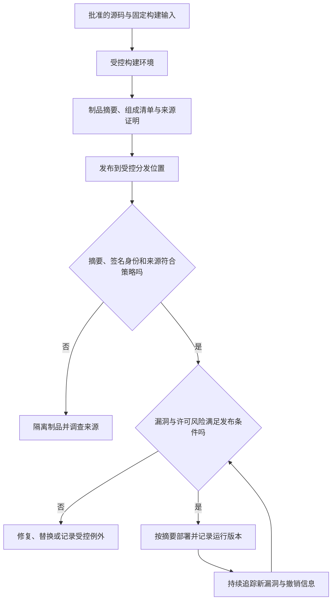

# 依赖供应链与制品信任

> 本文面向维护依赖、构建与发布流程的开发者和平台人员。读完能区分锁版本、漏洞检测、组成清单、签名与来源证明，设计从源码到运行制品的信任判断，并处理升级、撤销和异常来源。文中的发布流程是工程示意，没有执行签名或供应链测试。

## 信任链不止包管理器

**软件供应链**（Software Supply Chain）包含进入软件的源码、依赖、工具、构建环境、仓库和分发过程。程序依赖一个库，库可能再依赖其他库；构建脚本、编译器、基础镜像和流水线插件，也可能影响最终交付内容。应用源码通过审查，不能自动证明运行制品就是由这些源码按预期方式生成。

**制品**（Artifact）是构建或交付产生的对象，例如安装包、可执行文件、镜像或静态资源集合。**传递依赖**是通过其他组件间接引入的依赖。供应链管理要同时回答：组件是什么、为何引入、从哪里取得、怎样构建、谁发布、消费者怎样验证。任一环节存在未记录替换，就会让后续判断失去基础。

风险可能来自已知漏洞，也可能来自恶意包、来源混淆、维护者账号被接管、构建任务被篡改或分发仓库失守。因此不能把“依赖扫描无告警”理解为供应链安全。反过来，有漏洞编号也不意味着当前功能一定可利用，需要结合版本、调用路径与部署条件判断，并记录暂缓修复的依据。

## 五种证据回答五类问题

| 证据 | 主要回答 | 不能单独证明 |
| --- | --- | --- |
| 清单与锁文件 | 解析了哪些依赖版本 | 版本没有恶意行为 |
| 摘要值 | 当前字节是否与预期一致 | 预期摘要来自可信来源 |
| 漏洞分析 | 是否命中已知风险资料 | 没有未知漏洞、所有告警都可利用 |
| 组成清单 | 制品包含哪些组件和关系 | 清单完整准确、许可已经满足 |
| 签名与来源证明 | 谁对什么内容作了什么声明 | 声明者可信、软件功能安全 |

**密码学摘要**（Digest）把对象映射为用于完整性比较的值。若制品和摘要都从同一个被篡改的下载页取得，比较通过只能说明两者一致。**数字签名**绑定内容与签名身份，但验证者还必须决定信任哪些身份；攻击者自己签名的恶意文件，也可以在数学上验证成功。

锁文件的运行机制见[依赖、清单与锁文件](/software/toolchain/dependencies-lockfiles)。它帮助重复解析依赖，却不负责建立包名、发布者和来源的信任，也不保证所有外部下载或安装脚本被覆盖。

## 来源证明把构建输入连到制品

**构建来源证明**（Build Provenance）描述谁以怎样的构建过程、哪些输入生成了一个制品。SLSA 是逐步改善供应链安全的规范，本文按实际查阅的 1.2 版本讨论构建轨道，不把其他版本的等级混用。其构建 L1 提供来源信息，L2 增加由托管构建平台生成并认证的来源信息，L3 强化构建隔离与证明生成保护。[SLSA 构建轨道](https://slsa.dev/spec/v1.2/build-track-basics)

等级表达某组前提下的保障，不能当成通用安全评分。一个来源真实的制品仍可能含有源码中的漏洞；构建平台本身是否值得信任仍需判断。本文也不对任何具体平台宣称已达到某个等级。

这条路径把完整性、来源和风险分别检查。发布时生成证明、消费时从未验证，不会产生预期防护。验证策略至少约束可信构建者、规范源码仓库、构建类型和关键外部参数，并确认声明指向当前制品摘要；SLSA 的验证指南明确要求按期望值检查这些内容。[SLSA 制品验证](https://slsa.dev/spec/v1.2/verifying-artifacts)

以签名工具 Cosign 为例，身份验证可以约束证书身份和身份签发者，并检查制品摘要。不要把“接受任意签名”设置成默认路径，也不要随意关闭声明检查来让发布继续。[Sigstore 验证文档](https://docs.sigstore.dev/cosign/verifying/verify/)

## 组成清单应对应最终交付对象

**软件物料清单**（SBOM）记录软件组件及关系，帮助定位漏洞和许可材料。SPDX 是交换组成、来源与许可元数据的开放标准；格式本身不提供法律解释，也不会替接收者完成合规动作。[SPDX 概览](https://spdx.dev/learn/overview/)

清单宜包含可辨识组件、版本、来源、摘要和依赖关系，并绑定制品版本。源码仓库的依赖清单与最终安装包可能不同：打包工具会去掉开发依赖，也可能加入运行时、复制资源或原生库。仅扫描源码清单，容易遗漏镜像操作系统包和随安装包分发的组件。

可以从构建输入生成一份清单，再从制品检查一份，比较差异并解释未知组件。清单中的“不确定”比凭猜测填一个许可证更可审计。对动态下载、插件、模型和外部资源，需要定义覆盖范围；没有纳入扫描的运行时下载，不应在报告中被默认为已检查。

## 从引入依赖到维护升级

引入依赖前先问是否确有需求、能否缩小功能范围、是否有维护入口及退出方案。核对准确包名、命名空间、官方项目到包仓库的关联和许可文件。热门程度可以是调查线索，不能证明安全；最新版本也不自动代表适合当前工程。

**依赖混淆**（Dependency Confusion）是解析过程选中了与期望来源不同的同名组件；**拼写仿冒**（Typosquatting）利用近似名称诱导安装。工程上应显式控制包源与命名空间，避免内部名称无意回退到公共源，并对新增包和来源变化做审查。摘要固定只能确保继续取得同一内容，不能纠正第一次就选错来源。

| 工程决定 | 适用条件 | 代价与边界 | 验证方式 |
| --- | --- | --- | --- |
| 固定版本和完整性信息 | 需要稳定构建输入 | 必须持续安排升级 | 干净环境安装与解析结果比较 |
| 使用受控镜像或代理 | 需要统一来源与留存 | 代理也成为信任与可用性边界 | 比对上游来源、缓存策略与摘要 |
| 禁止或隔离安装脚本 | 脚本可能执行任意任务 | 部分依赖需要编译，不能盲目禁用 | 审查必要脚本，在受限任务中执行 |
| 自动提出升级 PR | 依赖多、维护节奏稳定 | 自动更新可能引入行为或许可变化 | 审查变更、回归与制品检查 |
| 发布时验证来源证明 | 生产制品有可用证明 | 需要维护信任根与策略 | 错误身份、摘要及参数的拒绝测试 |
| 暂缓某漏洞修复 | 有明确不可达或补偿证据 | 前提变化后可能失效 | 记录范围、期限和再评估触发条件 |

这些是编辑性的工程选择，不是声称某工具已运行。升级应包含接口、默认行为、依赖树、构建产物和许可变化；不能只看版本号。重大升级可先在隔离环境回归，并保留可重建的旧制品和配置，以便定位行为差异。

## 构建与发布权限怎样收敛

流水线能执行代码，构建输入越开放，越不能同时给予高权限。来自未审查分支的测试任务应与生产发布身份隔离；签名与证明生成不应轻易暴露给任意构建脚本。缓存和长寿命执行节点可能把一个任务的影响带到下一个任务，隔离策略需要覆盖文件、进程、凭证与网络。

发布账号应只管理指定包或仓库，生产部署应按不可变摘要选取经过验证的制品，而不是每次重新解析一个可变化的标签。保留源码提交、构建运行、制品摘要、验证策略和部署记录，才能在运行异常时判断是源码问题、构建问题还是拿错对象。

## 事件处置与失败模式

发现包来源异常时，先阻止继续使用可疑制品，列出受影响的构建和部署，检查构建权限是否接触秘密，再选择替换与撤销措施。只有升级依赖但保留旧生产镜像，运行风险并未消失。构建机失守还可能影响多个项目，不能仅处理最先报错的一个仓库。

| 失败模式 | 为什么失效 | 补救方向 |
| --- | --- | --- |
| 只统计漏洞告警数量 | 缺少影响、可达性与组件归属 | 按实际制品和风险优先级处理 |
| 清单跟源码版本走，却不跟制品走 | 无法确定线上实际包含什么 | 清单绑定制品摘要并覆盖打包内容 |
| 签名通过就直接部署 | 身份或来源可能不是期望对象 | 验证信任根与具体来源策略 |
| 例外没有到期时间 | 已过时的前提长期掩盖风险 | 设责任、期限和变化触发复核 |
| 测试任务持有发布凭证 | 未审查代码能取得交付权限 | 分离任务身份和触发条件 |
| 回退只重新下载旧标签 | 标签或下载内容可能已变 | 保留已验证摘要及必要证据 |

供应链能力可以逐步建设：先把来源、版本和制品记录清楚，再建立清单、签名与消费侧策略。每一步都应有拒绝错误输入的证据；覆盖声明必须说明未纳入的依赖与外部资源。

## 参考资料

<Refs>

- [SLSA 1.2：Build Track Basics](https://slsa.dev/spec/v1.2/build-track-basics)（访问日期 2026-10-03）
- [SLSA 1.2：Verifying artifacts](https://slsa.dev/spec/v1.2/verifying-artifacts)（访问日期 2026-10-03）
- [SPDX：Overview](https://spdx.dev/learn/overview/)（访问日期 2026-10-03）
- [Sigstore：Verifying Signatures](https://docs.sigstore.dev/cosign/verifying/verify/)（访问日期 2026-10-03）
- 站内相关：[依赖、清单与锁文件](/software/toolchain/dependencies-lockfiles) · [威胁建模与安全开发验证](/software/security/threat-modeling) · [密钥、最小权限与审计](/software/security/secrets-permissions) · [许可证、知识产权与职业责任](/software/security/licenses-professional-practice)

</Refs>
