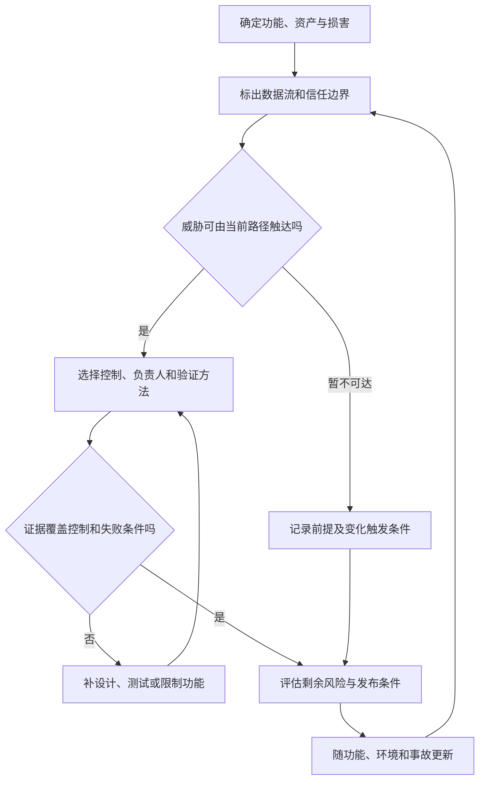

# 威胁建模与安全开发验证

> 本文面向设计、开发、测试与安全人员。读完能把攻击面转成可审查的安全要求，选择恰当的验证方法，并知道一份安全报告究竟覆盖了什么。案例采用虚构的小型活动报名系统，讨论机制，不代表已实施安全测试。

## 安全从“允许发生什么”开始

**威胁建模**（Threat Modeling）是围绕具体系统识别可能的损害、决定控制措施并检查效果的过程。它不要求预测每一种攻击，而是回答：我们在做什么，什么可能出错，准备怎样处理，处理得够不够好。OWASP 用这四问组织工作，并建议在新功能、事故与架构变化后更新模型。[OWASP 威胁建模](https://community.owasp.org/Threat_Modeling)

**威胁**是可能造成损害的行为或条件；**漏洞**是可被利用的弱点；**风险**把发生的可能性与损害后果一起纳入判断；**控制措施**是降低风险的机制。存在漏洞不代表任何环境都能利用，未发现漏洞也不代表系统安全。评估必须写清部署环境、数据敏感性、可达入口与攻击者已有能力。

报名系统的资产不仅是名单。活动容量、主办方发布权、报名状态、通知渠道和管理员会话，都有需要保护的性质。名单可能泄露，容量可能被占用，管理员可能被冒用，服务可能因资源耗尽无法接受合法报名。先写这些损害，再决定需要验证什么，能避免把“用了 HTTPS”误当成整个系统的结论。

云账号隔离、身份联合和组织护栏由[安全与身份治理](/cloud/architecture/security-governance)展开。本文关注软件怎样使用这些边界，以及开发过程怎样提供证据；基础设施合规结果不能替应用证明对象权限和业务状态正确。

## 画数据流，也画信任变化

**信任边界**（Trust Boundary）是输入的来源、权限或可信程度发生变化的位置。浏览器到服务端、服务端到数据库、上传文件到解析器、流水线到生产部署都是候选边界。位于同一网络内的两个服务，仍可能由不同身份控制；“内部”不能自动成为可信理由。

建模先限定一个可审查范围，例如“报名与取消”，而不是一次会议涵盖整个企业。列出入口、身份、存储、外部依赖、输出和管理操作。每条数据流记录谁控制输入、谁验证它、结果去哪、失败能否恢复。假设也必须留下：通知服务只能发到预先验证的地址，还是可由请求任意指定？两者的攻击面不同。

图中的“暂不可达”不是删除问题。例如导出功能当前只在管理员网络可用，将来接入移动端或外部自动化后，原来的前提就需要重新验证。模型的价值在于保留推理链，让后续变更知道哪些结论可能失效。

### 用分类帮助思考，不替代业务分析

**STRIDE** 是按身份冒充、数据篡改、行为抵赖、信息泄露、服务拒绝、权限提升检查威胁的一种分类法。它适合提醒团队检查遗漏，但不能机械地给每个方框填写六行。一次活动占位滥用可能同时影响完整性与可用性，业务规则才决定怎样控制。

**滥用场景**（Abuse Case）描述拥有合法能力的人怎样违反目的，例如普通报名者反复创建占位，活动编辑者导出不属于自己活动的名单。它把“用户已登录”之后的风险带进模型。**安全不变量**是任何合法操作后都应保持成立的条件，例如有效报名数不得超过容量、取消只能影响本人报名、名单导出只能覆盖授权活动。

| 路径与损害 | 需要成立的要求 | 候选控制 | 可审查证据 |
| --- | --- | --- | --- |
| 修改资源编号读取他人报名 | 读取绑定当前身份与对象 | 服务端对象授权 | 两个不同身份交叉访问的拒绝结果 |
| 并发争抢最后名额 | 容量不变量持续成立 | 原子写入或受控事务 | 并发结束后的有效总数及各请求结果 |
| 上传文件耗尽解析资源 | 输入不能无限消耗资源 | 大小、深度与时间限制 | 超限输入被中止，合法请求仍可处理 |
| 编辑者导出全部名单 | 导出范围受权限和目的限制 | 单独导出权限及审计 | 文件范围、授权判断和审计事件 |
| 部署凭证泄露 | 泄露影响受限且能撤销 | 临时身份与环境隔离 | 权限策略、有效期及撤销演练记录 |

表中控制是教学候选，需要按实际技术选择；并发与授权场景不能仅以界面截图验收。威胁记录宜有编号、资产、触发条件、影响、控制、验证、负责人和剩余风险，方便与需求、PR 和发布记录关联。

## 把模型放进开发过程

NIST 的 **安全软件开发框架**（SSDF）把建议实践组织为准备组织、保护软件、生产安全软件、响应漏洞四组。它提供可裁剪的实践框架，不要求每个项目采用同一开发流程，也不等于认证。[NIST SSDF 1.1](https://nvlpubs.nist.gov/nistpubs/SpecialPublications/NIST.SP.800-218.pdf)

小型项目可以从一份边界图和高风险场景表开始。设计阶段先确认身份和数据归属；实现阶段把控制落在不可绕过的位置；审查阶段检查代码是否实现这些要求；交付阶段确认配置没有关闭控制；运行阶段发现新风险后更新模型。把验证推迟到发布前，往往只能获得“发现问题”的报告，来不及重新设计状态或权限边界。

安全要求应可检查，例如“无权限名单导出请求被拒绝，且不产生可下载制品”，比“确保接口安全”更有用。**OWASP 应用安全验证标准**（ASVS）提供技术控制要求，可以辅助选择检查项。引用具体编号时必须附版本，因为标准版本变化可能改变编号。[ASVS 项目说明](https://owasp.org/projects/asvs)

对新功能，不必把全部控制重复验证一遍；先检查资产、入口、身份、权限、状态和依赖有哪些变化，再回归受影响的要求。某个补丁修复了一条路径，也可能让另一条管理接口继续绕过相同规则，因此验证范围应按控制边界组织，而不只按修改文件组织。

## 不同验证方法提供不同证据

**静态应用安全测试**（SAST）从代码或中间表示寻找风险模式；**动态应用安全测试**（DAST）从运行接口观察行为；**软件成分分析**（SCA）识别依赖及已知漏洞；**模糊测试**（Fuzzing）用大量变化输入寻找异常。它们不是互斥选型，更不是四个工具全开就完成安全工作。

| 要回答的问题 | 主要验证方式 | 能发现的线索 | 局限 |
| --- | --- | --- | --- |
| 数据是否拼入危险解释器 | 静态检查与代码审查 | 注入路径、危险 API | 规则和数据流建模可能不完整 |
| 对象权限能否绕过 | 角色与对象组合的接口测试 | 越权读取或修改 | 需要了解业务权限矩阵 |
| 解析器面对异常输入怎样失败 | 模糊测试与资源观测 | 崩溃、超时、耗尽 | 通过不证明所有输入安全 |
| 已知依赖风险是否进入制品 | SCA 与制品清单 | 漏洞版本和依赖路径 | 未知漏洞、不可达性要另评估 |
| 环境是否符合控制前提 | 配置审查与目标环境验证 | 暴露面、错误权限 | 仅证明所查环境和时间点 |
| 多步骤操作能否破坏规则 | 状态、顺序与并发测试 | 重放、跳步骤、竞态 | 扫描器很难自动推导业务规则 |

验证应在获得授权的环境和范围内进行，使用虚构数据，明确中止条件。本文没有扫描任何实际系统，也没有执行上表测试。测试报告应保留版本、配置、身份、输入、预期、实际结果及未覆盖项；只有总数或绿色状态，无法判断控制是否真正被检查。

## 发布判断与常见失败模式

风险排序宜先看可达性、影响、利用前提和现有控制，再参考漏洞评分。相同弱点在匿名公网接口与隔离的离线工具中，处理优先级可能不同；隔离措施也要有证据。不要制造未经数据支持的精确风险分数，用高、中、低标签时必须说明判断依据。

对未修复风险，记录责任人、允许的使用范围、补偿措施、期限与复核触发条件。接受风险需要由有责任的人作出决定，开发者不能把“时间不够”当成默示批准。安全问题修复后，应回归控制及相邻路径，并检查泄露的凭证是否需要撤销、已经生成的数据是否需要处置。

| 失败模式 | 为什么会失效 | 改进方向 |
| --- | --- | --- |
| 模型只有组件图 | 没有资产、损害和信任判断 | 给每条流补输入控制者及安全要求 |
| 只检查未登录攻击者 | 合法账号仍可滥用业务能力 | 加入跨对象、跨角色与重复操作场景 |
| 把扫描零告警当成安全 | 工具未覆盖业务不变量和环境前提 | 按威胁列证据，公开未覆盖项 |
| 所有问题由安全人员负责 | 设计、修复与发布责任悬空 | 明确控制负责人和验收人员 |
| 接受风险没有到期条件 | 临时例外成为永久边界 | 设期限、监测和变化触发复核 |
| 只修报错位置 | 同类入口仍可绕过控制 | 复核共享机制与实际部署配置 |

威胁模型始终是有范围、有假设的工程产物。引入 AI 工具调用、文件解析、新身份来源或外部集成时，需要扩展边界；相关原理可继续阅读[Agent 安全](/ai/agent/security)。安全开发的成果是能够持续解释与验证的控制链，而不是一次会议或一张“安全通过”的标签。

## 参考资料

<Refs>

- [OWASP：Threat Modeling](https://community.owasp.org/Threat_Modeling)——四问、范围与更新触发条件（访问日期 2026-10-03）
- [NIST：SSDF Version 1.1，SP 800-218](https://nvlpubs.nist.gov/nistpubs/SpecialPublications/NIST.SP.800-218.pdf)——安全开发实践框架（访问日期 2026-10-03）
- [OWASP：ASVS](https://owasp.org/projects/asvs)——验证标准定位与版本化引用（访问日期 2026-10-03）
- 站内相关：[输入、输出与业务安全](/software/security/application-security) · [密钥、最小权限与审计](/software/security/secrets-permissions) · [依赖供应链与制品信任](/software/security/supply-chain) · [验收标准](/software/requirements/acceptance-criteria) · [安全与身份治理](/cloud/architecture/security-governance)

</Refs>
