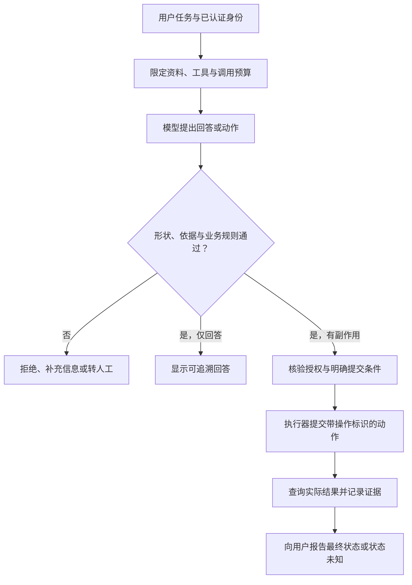

# AI 应用工程入口

> 面向把模型能力接入业务软件的开发者。读完后，你应能选择规则、检索、固定工作流或自主工具调用的适用路径，把模型建议转成可验证的接口契约，并为证据、权限、预算、失败恢复和版本变化建立工程边界。

AI 应用让模型成为运行中的一个组件；AI 辅助编程则让模型帮助人编写、检查或修改软件。两者可以同时存在，责任不同：前者每次用户请求都要处理不确定输出、外部依赖和运行成本，后者的产物仍须通过开发、审查和验收流程。不能因为代码由模型生成，就认为程序必须在运行时继续调用模型。

本篇聚焦生成式语言模型的应用入口，不替代计算机视觉、语音处理或传统预测模型的完整工程方法。检索、Agent 与评测原理复用站内 AI 主文；这里关注模型如何进入普通软件系统，以及模型输出从何时开始产生真实业务影响。

## 先定义模型负责哪一段

模型擅长处理自然语言中的变化，但接口仍应定义稳定任务。以虚构的活动系统为例，“根据公开规则回答报名问题”与“替用户报名”是两个目标：前者需要依据和适当拒答，后者还要求身份、名额、状态、幂等和用户意图。一个自然语言入口不能消除这些业务规则。

| 路径 | 适合的任务特征 | 应保留的确定性部分 | 首先验证的风险 |
| --- | --- | --- | --- |
| 规则或传统代码 | 条件稳定、结果可枚举 | 整个判定与状态转换 | 规则覆盖和维护成本 |
| 单次模型处理 | 摘要、分类、草稿等语言转换 | 输入范围、输出校验、显示与保存 | 信息遗漏、事实改变、格式失败 |
| 检索增强生成 | 回答依赖外部资料与当前内容 | 文档访问控制、来源映射、引用显示 | 检索遗漏、过期或冲突依据 |
| 固定工作流 | 步骤已知，各步有明确职责 | 步骤顺序、失败转移、提交动作 | 局部成功掩盖整体失败 |
| 自适应工具调用 | 下一步依任务和观察变化 | 工具能力、权限、预算与提交边界 | 越权、循环、错误动作和恢复 |

**检索增强生成**（Retrieval-Augmented Generation，RAG）把检索结果作为生成的外部依据。Lewis 等人的原始论文是这一方向的重要来源，论文中的模型、数据与实验结论有具体条件，不等于任何接上向量库的应用都能保证事实正确。实际检索质量、证据使用和文档权限见 [RAG 架构](/ai/application/rag-architecture)。

**智能体**（Agent）通常指根据目标和观察选择后续动作的系统。自主程度增加会扩大搜索空间、调用成本与错误传播路径。若固定步骤已能完成任务，先用可观察工作流建立基线，再依据真实未覆盖场景增加选择能力，比直接追求更多工具更容易判断收益。

## 把模型输出当作外部输入

模型输出可能语法正确却语义错误，也可能包含看似合理的不存在事实。NIST 生成式 AI 风险画像将自信呈现错误或虚假内容的现象列为风险之一。工程处理不能只依靠一句“请不要编造”，而要定义允许生成什么、如何核验、缺少依据时走哪条路径。

**结构化输出**（Structured Output）让结果符合机器可处理的形状。**模式**（Schema）描述字段、类型及约束。无论提供者怎样生成结果，应用仍需校验自己实际收到的内容，并在解析失败、字段缺失、拒绝回答和截断时进入明确状态。

JSON Schema 中，`properties` 声明字段并不自动要求字段存在，必填需要 `required`；额外字段是否允许要单独设定；缺失字段与值为 `null` 也不同。这些语义直接影响业务：没有提取到时间，不能被默认成现在；不知道某个值，不能写成空字符串再触发后续自动动作。

下面是未执行的结果设计示意，字段名称服务于这个例子，不是模型平台通用协议：

```json
{
  "status": "needs_evidence",
  "answer": null,
  "evidence_ids": [],
  "missing_fields": ["registration_deadline"]
}
```

应用可约束状态枚举、字段类型与集合长度，但模式通过只能说明形状符合约定。`evidence_ids` 还必须对应本次检索时由应用分配的真实资料标识，引用位置由服务端映射；如果直接接受模型生成的任意网址，格式有效的假来源仍会进入界面。期限、金额和对象标识也应在业务边界重新校验。

自然语言解释与机器动作应有不同通道。不要让“回答里写了成功”决定数据库状态，也不要从一段展示文本中再次抽取授权动作。工具执行结果和应用状态才是动作是否完成的依据。

## 模型建议与执行能力之间放一个边界

模型不应自行决定用户身份和权限。应用先认证请求者，按对象和操作授权，随后才把必要上下文提供给模型。检索也需要这个顺序：先检索全库，再仅靠生成阶段要求隐藏不该看的内容，仍会把受限资料带入处理链。



**工具调用**（Tool Calling）让模型提出调用某个受定义接口的请求。模型提出“删除记录”只是建议；执行器应重新检查调用者权限、记录当前状态、参数范围和必要提交条件。给模型一个任意 Shell 或任意 SQL 接口，会把可调用范围扩大为整台机器或整个数据库的能力，难以用字段校验控制。

工具宜按明确业务操作设计，并限制每次调用的对象、数量和执行时间。只读查询、预览变更与提交动作可有不同权限和审计要求。收到超时不能直接假定动作没有发生；写操作需具备操作标识、幂等机制或可查询状态，否则模型重试可能产生重复副作用。

**模型上下文协议**（Model Context Protocol，MCP）提供客户端与服务器之间的上下文交换机制。官方架构将宿主、客户端和服务器分开，并描述工具、资源等能力；它不规定应用怎样使用模型和管理上下文。因此连接成功或发现工具，并不意味着业务权限、结果可信和动作确认已经完成。接入任何协议都应保留上述执行边界。

外部文档和工具结果也可能包含恶意指令。**提示注入**（Prompt Injection）利用模型处理数据与指令时的混淆影响行为；权限约束、上下文来源与工具隔离见 [Agent 安全](/ai/agent/security)。这里的关键是权限由执行系统落实，不能把安全控制全写在模型提示里。

## 调用预算与故障恢复是一部分功能

一次用户任务可能经过多轮模型、检索和工具调用。每轮都增加延迟、费用和失败点；只监控单次请求耗时无法反映用户任务何时完成。应用应为整个任务设置截止时间、最大步骤、输入输出规模和资源预算，并说明预算耗尽时是交付部分结果、返回未完成，还是转交人工。

重试需要按失败类别决定。短暂网络错误可在预算内有限重试；同一资料缺失反复生成不会增加事实；无权限的工具调用不能通过换一种参数绕过拒绝。取消也要传播到正在处理的子任务，同时区分“停止继续尝试”与“撤销已经提交的动作”。

流式输出能让用户较早看到内容，但尚未生成完的解释不能代表最终结论。存在后续校验时，可以先显示处理中状态，校验通过再使动作或结果生效。不要把未经验证的半段 JSON 当作可提交命令。

缓存键至少考虑会影响结果的输入、资料版本、提示或工作流版本及权限范围；不同用户的可见数据不能因为问题文字相同而共用答案。保存原始上下文能方便复现，也会扩大隐私与秘密暴露面。应选择目的所需的记录内容，限制保留时间，并让删除传播到缓存、索引和调试记录，衔接[数据生命周期](/software/security/privacy-lifecycle)。

## 评测要检查任务结果

AI 应用需要软件测试，也需要针对模型行为的评测。解析、鉴权、幂等和状态转换可以用确定性测试验证；回答是否遗漏关键条件、引用是否支持结论和行为是否合理则要设计任务样本与判定准则。模型裁判可辅助评估，但裁判自身也需要校准，不能只用流畅度替代业务正确性。

| 样本类别 | 必须观察的结果 | 可能隐藏的失败 |
| --- | --- | --- |
| 有明确、足够的依据 | 答案与依据一致，引用可回到真实内容 | 引用了资料却改变其条件 |
| 缺资料或资料冲突 | 标明缺失或冲突，走规定补充路径 | 生成一个看起来完整的答案 |
| 用户无对象权限 | 不泄露资料、不执行动作 | 界面拒绝但工具已经执行 |
| 外部内容带诱导指令 | 保持任务和工具边界 | 内容进入上下文后改变调用行为 |
| 调用超时或重复提交 | 可查询最终状态，避免重复影响 | 把状态未知报告成确定失败后重做 |
| 模型、资料或提示升级 | 与固定基线比较质量和代价 | 仅凭新版名称认为质量更好 |

完整评测体系见 [AI 应用评测](/ai/application/evaluation)。样本应保留来源、预期行为和适用范围，避免用少量成功演示推断整体可靠性。运行中还需监测用户纠错、拒答异常、预算耗尽和工具失败；这些信号能暴露离线样本未覆盖的分布变化。

## 一个有限的起步实验

以下实验未执行。用一组虚构的公开活动规则构建只读问答，先保存非模型的查找基线，再实现检索与回答。为明确答案、缺失期限、冲突规则、诱导内容和无权限资料各设计样本，检查引用映射与拒答行为，同时记录整个任务的耗时和调用次数。

只读路径通过目标验收后，再增加“生成报名草稿”的固定工作流；最后才考虑调用报名接口。这个动作必须复用原有业务授权与并发约束，并在应用侧验证实际报名状态。每次引入新的自主能力，都重新检查失败范围及可恢复性，而不是一次性接入所有工具。

本文未比较当前模型价格、排名或平台承诺，也未进行真实模型调用、性能测量或部署。NIST 风险画像是风险识别与管理参考，不是对本方案的认证；资料引用和结构化输出同样不能形成事实正确或安全执行的自动保证。工程入口的价值在于把不确定组件放入可限制、可观察、可检验的系统。

## 参考资料

<Refs>

- [Lewis 等：Retrieval-Augmented Generation for Knowledge-Intensive NLP Tasks](https://arxiv.org/abs/2005.11401)：核验原始论文摘要中的研究范围与参数、外部记忆组合；未复现实验，访问日期：2026-10-03。
- [NIST AI 600-1：生成式 AI 风险画像](https://nvlpubs.nist.gov/nistpubs/ai/NIST.AI.600-1.pdf)：核验虚假内容风险、评估和部署后监测相关建议，访问日期：2026-10-03。
- [JSON Schema：Object](https://json-schema.org/understanding-json-schema/reference/object)：核验字段、必填、额外属性与空值语义，访问日期：2026-10-03。
- [MCP 官方架构概览](https://modelcontextprotocol.io/docs/2026-07-28/learn/architecture)：核验宿主、客户端、服务器及协议职责范围，访问日期：2026-10-03。

## 站内相关

- [RAG 架构](/ai/application/rag-architecture)
- [AI 应用评测](/ai/application/evaluation)
- [Agent 技术体系](/ai/agent/index)
- [Agent 安全](/ai/agent/security)
- [输入、输出与业务安全](/software/security/application-security)
- [隐私与数据生命周期](/software/security/privacy-lifecycle)

</Refs>
