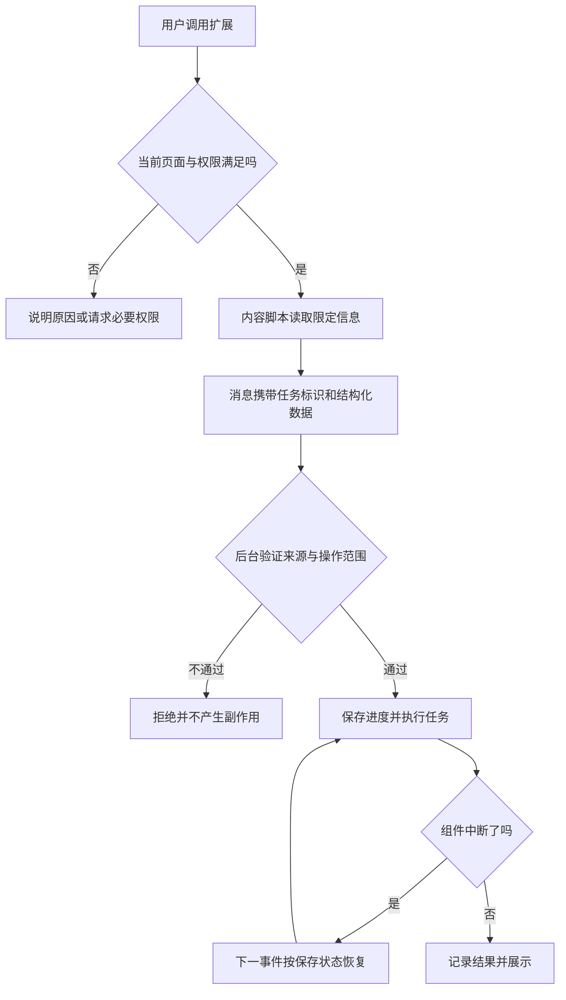

# 浏览器扩展

> 本文面向熟悉网页开发、准备添加浏览器能力的开发者。读完能区分网页、内容脚本、扩展后台与弹窗的边界，选择最小权限并处理短寿命事件。案例为读取当前活动页面公开信息的虚构扩展，本文没有开发、安装或运行扩展。

## 扩展不是一段永远运行的网页脚本

**浏览器扩展**（Browser Extension）是在浏览器提供的扩展平台上安装的软件，可在授权范围内调用浏览器 API、接触页面内容并提供界面。**清单文件**（Manifest）声明组件、资源和权限。普通页面、扩展页面与浏览器管理功能的权限不同，不能因为代码都用 JavaScript 就把它们当成一个全局程序。

扩展适合与用户正在访问的页面紧密结合的任务，例如整理公开活动信息、增强阅读或提供快捷操作。需要任意本地文件、复杂后台服务或独立业务入口时，CLI、桌面或 Web 应用可能更合适；通过原生通信取得本地能力也会新增安装、协议和权限责任，不能视为无成本扩展。

本文以 Chrome 的 Manifest V3 机制为具体说明。其他浏览器的 WebExtensions 有相似概念，但 API、后台形态、版本支持和分发规则可能不同；可通过 Mozilla 的文档进一步核对，不能把一个浏览器验证结果称为所有浏览器兼容。[Mozilla 内容脚本入口](https://developer.mozilla.org/en-US/docs/Mozilla/Add-ons/WebExtensions/Content_scripts)

## 四种执行位置分别管理状态

**内容脚本**（Content Script）运行在指定网页中，可按授权读取或修改 DOM，即页面结构。它通常具有隔离的 JavaScript 执行环境：网页变量与内容脚本变量不是同一份，但页面结构仍是双方可能影响的共享内容。[Chrome 内容脚本](https://developer.chrome.com/docs/extensions/develop/concepts/content-scripts)

**扩展 Service Worker**是接收事件并执行后台逻辑的组件，不能假定它一直存活。**弹窗**是用户点击扩展入口时打开的界面，关闭后该页面的执行和状态也有寿命边界。**选项页**负责较持久的配置入口，但配置应进入明确存储，而不是依赖页面一直打开。

| 执行位置 | 典型职责 | 不能默认拥有的能力 |
| --- | --- | --- |
| 网页脚本 | 站点自身交互 | 任意扩展权限和后台状态 |
| 内容脚本 | 读取页面、标注选定信息 | 全部扩展 API、后台 DOM 或网页变量 |
| 扩展后台 | 协调事件、存储和受控 API | 永久存活或直接操作网页 DOM |
| 弹窗与选项页 | 操作和设置界面 | 窗口关闭后继续持有状态 |

组件间通过 **消息传递**交换数据和请求。消息不是自动可信：页面可修改 DOM，内容脚本从页面取得的数据仍是不可信输入；后台收到“请访问这个 URL”或“请读取这个对象”，要核对来源、结构、范围和目的。

## 权限是能力声明，也影响用户理解

**API 权限**允许调用特定浏览器功能，**主机权限**允许在指定站点范围执行相关访问。Chrome 建议按功能采用可选权限，让用户在需要时作出知情选择。[权限声明](https://developer.chrome.com/docs/extensions/develop/concepts/declare-permissions)

**activeTab**是在用户调用扩展后对当前标签页提供临时访问能力的一种具体权限机制，适合“用户主动操作当前页”的工具；它不等同永久读取所有站点。[activeTab 文档](https://developer.chrome.com/docs/extensions/develop/concepts/activeTab)

| 功能目的 | 先考虑的权限范围 | 需要说明的边界 |
| --- | --- | --- |
| 用户点击后读取当前页 | 临时当前标签访问 | 页面切换和授权寿命 |
| 固定站点增强 | 精确站点匹配 | 路径、子域与框架是否被覆盖 |
| 用户自行加入站点 | 可选主机权限 | 拒绝与回收后的行为 |
| 多站点自动后台工作 | 确有必要的较广范围 | 数据目的、采集和用户控制 |
| 浏览器标签管理 | 对应标签能力 | 实际可读数据与版本差异 |

权限选择是工程决策，不是“越多越方便”。声明所有站点访问会扩大被滥用的范围，也可能增加用户难以理解的提示。已授权并不代表可以任意采集或外发数据；仍要按[隐私与数据生命周期](/software/security/privacy-lifecycle)设计用途、保存和删除。

## 事件寿命决定怎样保存进度

Chrome Service Worker 可以因空闲等条件终止，重启后内存全局变量不再存在；官方建议把需要保留的数据放入合适存储。[Service Worker 生命周期](https://developer.chrome.com/docs/extensions/develop/concepts/service-workers/lifecycle)

不要把“正在执行任务”的唯一状态放在全局数组中，也不要靠不断唤醒组件维持一个假想常驻服务。应让事件能从持久化状态重新取得任务范围，明确消息是否已处理、结果在哪里、重试是否会重复副作用。选择存储还要核对容量、同步范围和敏感数据适用性，不能默认设置同步即适合保存名单或令牌。

图中的任务标识把弹窗关闭、后台重启和消息重试连接起来。若只是读取当前页面并展示结果，可保持简单；若还要上传、保存或触发外部操作，则必须定义中断后的业务语义，不能把技术重试变成再次替用户操作。

## 网页变化与隔离是常见难点

**DOM 选择器**根据结构定位元素。固定类名、按钮文字或节点顺序可能随站点更新而变化，扩展不能把“找到一个元素”直接解释为“找到了正确业务字段”。读取活动标题和日期时，需要识别缺失、多候选、格式变化和隐藏内容，并向用户展示提取范围。

**单页应用**可能在没有整页加载的情况下改变内容；动态列表、延迟加载和 iframe 也改变可见结构。可以监听适当变化，但要限制观察范围、处理频率和重复绑定，避免对每个 DOM 变化重新扫描整页。进入不同框架和来源时，需核对匹配与权限，不能假定顶层授权覆盖所有内容。

隔离环境保护脚本变量，却不能把页面数据变成可信指令。若与网页主世界交换消息，应校验消息类型、来源和载荷，并只开放具体能力；不要让任意网页消息变成后台网络请求或本地操作。内容中的 HTML、URL 和文件名进入新环境时，仍需相应的输入与输出防护。

## 一个可验证的工程路径

先明确功能是“用户主动读取当前页面公开活动信息”，只处理标题、日期和公开链接。定义支持页面结构与缺失反馈，设计弹窗展示和可清除的保存状态，再确定最小权限。以打包的本地资源提供扩展逻辑，第三方依赖按供应链流程核对；分发政策须按实际浏览器商店另行查阅。

最小实验应验证正常页面、缺字段、错误日期、页面导航、动态更新、权限拒绝、弹窗关闭和后台重启。若加入网络上传，还要验证用户选择范围、服务端权限和结果未知。本文未执行这些实验，也未宣称满足任何扩展商店审核标准。

| 验收项 | 应观察的结果 | 不能只凭什么判断 |
| --- | --- | --- |
| 权限拒绝 | 说明可用功能，停止依赖该权限的动作 | 安装时没有报错 |
| 页面结构变化 | 不读取错误对象，明确缺失或歧义 | 选择器仍匹配某个节点 |
| 后台重启 | 进度可恢复或清晰失败 | 全局变量在一次运行中正确 |
| 消息伪造 | 不产生超范围操作 | 消息结构看起来合法 |
| 弹窗关闭后返回 | 状态符合设计，不重复副作用 | 首次点击成功 |
| 扩展升级 | 配置与存储迁移正确 | 新版本可以安装 |

## 失败模式与扩展边界

| 失败模式 | 原因 | 修正方向 |
| --- | --- | --- |
| 背景逻辑随机丢状态 | 假定组件永久存活 | 持久化必要状态并设计恢复 |
| 读取了别的页面字段 | 结构变化却没有语义校验 | 校验范围并展示提取证据 |
| 申请全部站点权限 | 功能与权限没有对应分析 | 使用精确或按需范围 |
| 网页消息触发高权限请求 | 消息边界没有授权判断 | 限定消息来源、类型和能力 |
| 所有数据进入同步存储 | 没区分配置与敏感内容 | 分析接收者、期限和删除 |
| Chrome 可用便报告兼容 | 未测试其他 API 实现与寿命 | 建立具体浏览器版本矩阵 |

扩展下一步可以深入消息协议、动态页面适配、跨浏览器兼容和分发维护。若功能增长为独立后台系统，应重新判断开发形态；浏览器扩展不应承担不符合其生命周期和权限模型的任务。

## 参考资料

<Refs>

- [Chrome：Content scripts](https://developer.chrome.com/docs/extensions/develop/concepts/content-scripts)（访问日期 2026-10-03）
- [Chrome：Extension service worker lifecycle](https://developer.chrome.com/docs/extensions/develop/concepts/service-workers/lifecycle)（访问日期 2026-10-03）
- [Chrome：Declare permissions](https://developer.chrome.com/docs/extensions/develop/concepts/declare-permissions)（访问日期 2026-10-03）
- [Chrome：activeTab](https://developer.chrome.com/docs/extensions/develop/concepts/activeTab)（访问日期 2026-10-03）
- [Mozilla：Content scripts](https://developer.mozilla.org/en-US/docs/Mozilla/Add-ons/WebExtensions/Content_scripts)——跨浏览器差异的进一步入口（访问日期 2026-10-03）
- 站内相关：[输入、输出与业务安全](/software/security/application-security) · [隐私与数据生命周期](/software/security/privacy-lifecycle) · [依赖供应链与制品信任](/software/security/supply-chain) · [桌面应用开发基础](/software/specialized/desktop)

</Refs>
