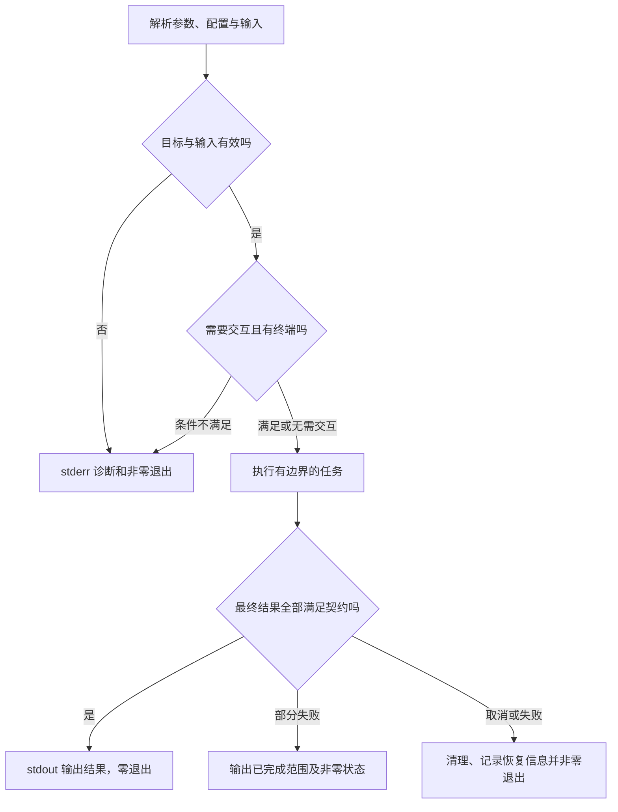

# CLI 与自动化工具

> 本文面向需要编写命令行程序、数据处理脚本和自动化任务的开发者。读完能设计参数、流、退出码与副作用契约，使工具既能由人操作，也能被脚本可靠组合。活动报名数据检查工具为虚构例子，所有命令仅作接口示意，未实际执行。

## CLI 是一个公开接口

**命令行接口**（CLI）通过命令名、参数、输入输出流和退出状态与调用者交互。**Shell**解析用户输入并启动程序，CLI 程序则解释收到的参数并执行任务。二者不是同一层：引号、通配符和管道可能先被 Shell 处理，程序收到的内容不一定与屏幕上输入的字符串完全相同。

一个脚本反复执行成功，并不自动构成可靠工具。交付需要回答参数含义、错误如何返回、输出能否解析、运行目录是否重要、怎样取消、重复执行是否安全，以及凭证从哪里来。被其他程序依赖后，这些行为就成为兼容性契约；改表格列名也可能破坏自动化。

活动工具可以只检查虚构 CSV 是否符合规则，不接触在线服务；另一个子命令负责导出经授权数据。把只读检查和会产生副作用的动作分开，有助表达权限、预览与错误语义，避免一个“万能脚本”根据环境隐式选择目标。

## 参数从语法走向业务意义

**位置参数**按位置表达对象，**选项**以标识表达附加设置，**子命令**把相关操作组织到一个工具下。成熟参数解析库可以管理类型、必需项、帮助与子命令；以 Python 的 `argparse` 为例，它提供这些能力，但不会替应用判断对象授权或业务状态。[argparse 文档](https://docs.python.org/3/library/argparse.html)

下面仅定义一个教学接口：

```text
enrollctl validate ./fictional.csv --format json
enrollctl export --activity demo-event --output ./result.csv --dry-run
```

**试运行**（Dry Run）应明确省略哪些副作用，并说明仍会读取哪些资源。能显示预计写入对象，不代表正式执行时条件不会变化；预览与执行之间仍要重新验证。不要为了让参数简短，把生产环境默认为隐式目标，或从当前目录名称推导权限。

| 输入决定 | 建议契约 | 要避免的歧义 |
| --- | --- | --- |
| 输入文件 | 明确编码、格式和缺失处理 | 空文件被当成成功结果 |
| 目标环境 | 显式配置或可解释的默认值 | 自动从开发切到生产 |
| 配置优先级 | 命令选项、环境、文件的覆盖顺序可查 | 多处值冲突却无法解释 |
| 凭证 | 受控凭证路径或身份机制 | 放进命令参数和帮助样例 |
| 输出位置 | 明确覆盖与目录创建行为 | 默认覆盖已有用户文件 |
| 批处理范围 | 有上限与选择条件 | 通配符展开后影响无关对象 |

参数解析后仍应检查文件类型、大小、对象范围及字段关系。以 `--` 结束选项解析是常见工具约定，但是否支持、短选项能否合并、负数怎样解析，需按具体程序契约判断；不要让调用者靠试错发现规则。

## 三个流与一个退出状态

**标准输入**（stdin）接收输入，**标准输出**（stdout）承载主要结果，**标准错误**（stderr）承载诊断。**退出码**把运行结果传给调用程序。CLIG 原始指南建议成功返回零、失败返回非零，并把机器可读主输出送到 stdout。[CLIG 指南](https://clig.dev/)

面向人的表格可以调整排版，面向机器的 JSON 或逐条记录输出应有稳定字段和模式版本。进度条、提示和日志不要混入 JSON 流；颜色与交互询问也要考虑输出是否连接终端。脚本在没有终端时等待用户输入，可能让持续集成或定时任务永远挂起。

**终端检测**判断流是否连接交互终端，帮助决定颜色、进度和提示方式；它不能证明调用者一定是人，因此关键选择仍应有显式选项。一个可靠工具可同时提供默认的人类反馈和稳定的机器输出，不必要求自动化解析易变化的自然语言。



退出状态应与最终结果一致。把异常记录后继续 `exit 0`，会让上游把失败当成功；遇到一个无效行就丢掉此前所有结果，也可能不符合批处理目的。可定义“完整成功”“校验失败”“执行错误”等少量状态，具体数字由工具规定，不宣称某组自定义数字是通用标准。

## 流式处理、背压与取消

**流式处理**逐步读取和输出数据，减少必须一次放进内存的内容。**背压**（Backpressure）让下游处理能力限制上游发送速度，避免缓冲无限增长。大文件逐行读取仍可能在“把所有结果收集到数组”时失去流式优势，设计要贯穿整个链路。

输出管道下游提前退出时，工具应按平台机制处理写入失败，避免打印不必要的堆栈或继续执行无用任务。stdin、stdout 和 stderr 都有容量边界；调用子进程后只等待退出、不及时处理管道内容，可能因缓冲满而彼此等待。

**取消**是明确请求停止工作的过程，不能简单等同强制杀进程。可在批次之间检查取消，停止发起新副作用，等待或终止必要子进程，清理临时文件，再返回已完成范围。跨平台信号和进程组机制不同，工具应声明支持范围，并验证子进程不会在父进程结束后继续修改目标。

## 外部程序与 Shell 是不同信任边界

启动外部可执行文件时，优先把命令与参数作为独立结构传给进程 API。Python 的 `subprocess` 默认不会隐式选择 Shell；显式启用 Shell 后，调用者要负责相应引用和注入边界。Windows 批处理文件等情况还有特别解析行为，不能把 POSIX 转义规则直接用于所有系统。[subprocess 文档](https://docs.python.org/3/library/subprocess.html)

固定可执行对象、限定工作目录、显式传入必要环境、设置超时并检查退出结果，可以减少环境偶然性。**搜索路径**（PATH）决定未指定完整路径时寻找哪个程序；当前目录、同名程序或运行身份差异可能改变实际执行对象。自动化不宜依赖用户交互 Shell 中恰好定义的别名。

输出文本也可能含凭证和敏感数据。不要把完整子进程环境写进错误报告，也不要把 API 令牌放进进程参数。相关身份与秘密机制见[密钥、最小权限与审计](/software/security/secrets-permissions)。

## 自动化需要幂等与可恢复的副作用

**幂等性**意味着重复执行不会增加额外的预期副作用。定时任务可能重叠、超时重试或重复触发，不能默认“每次只运行一份”。对导出文件，可以用任务标识及安全替换；对外部通知，需要业务去重或可查询的操作标识，不能靠本地日志推断远端一定未执行。

| 场景 | 适合的设计 | 失败后的判断 |
| --- | --- | --- |
| 只读格式检查 | 返回全部问题并限制资源 | 可直接重新执行，但检查数据可能已变 |
| 批量生成文件 | 临时结果、目标检查与完成标记 | 区分未提交与已替换对象 |
| 调用远端变更接口 | 请求标识和结果查询 | 超时可能是结果未知 |
| 长任务分批处理 | 检查点与版本记录 | 确认输入未改变再恢复 |
| 定时执行 | 明确重叠策略及任务身份 | 查上一运行状态与锁失效条件 |

锁用于协调执行，不是持久化业务状态。进程崩溃后锁残留、锁租约到期却任务仍运行，都可能破坏单实例假设。应选择适合环境的协调方式，并以数据不变量作为最后边界，而不把一份 PID 文件当成普遍可靠方案。

## 交付和兼容性需要一起考虑

脚本依赖解释器、库、外部命令和操作系统；独立可执行文件也可能依赖系统库与证书环境。交付应给出支持平台、安装方式、版本查询、帮助和示例虚构输入。配置模式、输出模式和状态码的变化，可能比函数内部变化更影响调用者。

可以先验证最小路径：合法与非法文件、空输入、非终端环境、管道输出、权限拒绝、取消与重复执行。本文未执行任何命令测试；实际记录应注明工作目录、环境、输入、stdout、stderr、退出状态及产生的文件。

| 失败模式 | 后果 | 改进方向 |
| --- | --- | --- |
| 诊断混入 JSON stdout | 下游解析失败 | 分流并稳定输出模式 |
| 捕获异常后零退出 | 自动化报告错误成功 | 让退出码匹配最终契约 |
| 拼接文件名进 Shell | 输入被解释为命令 | 采用参数 API 并核对平台边界 |
| 重试重复发送通知 | 产生重复副作用 | 请求去重与结果查询 |
| 定时任务依赖当前目录 | 找错配置或输出位置 | 明确路径与运行配置 |
| 取消只结束主进程 | 子进程继续修改数据 | 管理任务及子进程生命周期 |

CLI 的下一层深入方向是协议稳定性、进程管理、批处理恢复和安全身份。工具越被自动化依赖，越应把这些行为当作 API 设计，而不是附加到脚本末尾的便利选项。

## 参考资料

<Refs>

- [Python：argparse](https://docs.python.org/3/library/argparse.html)（访问日期 2026-10-03）
- [Python：subprocess](https://docs.python.org/3/library/subprocess.html)——参数、管道与 Shell 安全边界（访问日期 2026-10-03）
- [Command Line Interface Guidelines](https://clig.dev/)——原始工程建议，非平台强制标准（访问日期 2026-10-03）
- 站内相关：[终端、Shell 与命令行](/software/foundations/terminal-shell) · [文件、路径与权限](/software/foundations/files-paths-permissions) · [输入、输出与业务安全](/software/security/application-security) · [密钥、最小权限与审计](/software/security/secrets-permissions)

</Refs>
