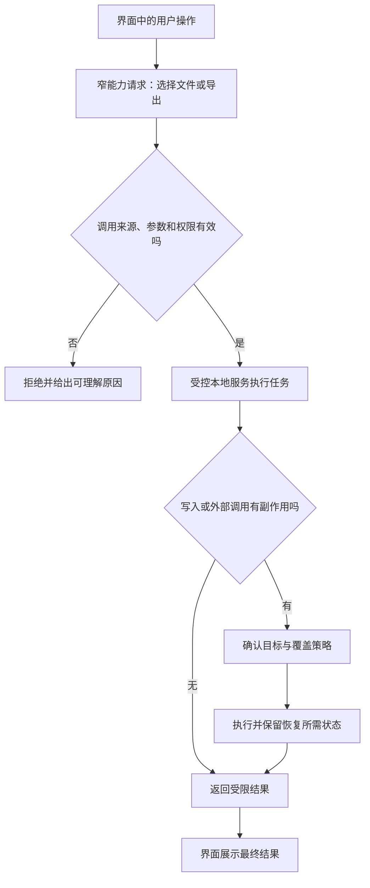

# 桌面应用开发基础

> 本文面向从网页或服务端开发进入桌面应用的读者。读完能判断本地文件、窗口和系统集成带来的架构变化，设计受控权限桥接，并把安装、升级和恢复纳入交付。案例采用虚构的活动管理工具，本文没有构建或安装实际桌面应用。

## 桌面应用把交付边界带到用户电脑

**桌面应用**是面向个人电脑操作系统分发和运行的软件，通常管理窗口、文件、输入、通知及其他系统能力。网页主要由浏览器提供宿主边界，桌面应用则还要处理本地运行依赖、用户权限、安装路径和更新过程。窗口看起来像网页，不代表它受普通网页完全相同的权限限制。

活动管理工具可能读取本地 CSV、整理报名名单、导出文件并调用打印。每条功能都把业务数据接到用户电脑上的资源；应用失守可能影响本地文件，误操作也可能覆盖数据。需要明确哪些能力来自系统、哪些由应用自身授予、哪些仍须服务端批准。

**宿主**是为程序提供外部能力的运行环境；**原生界面**使用平台或原生工具包建立控件；**Web 界面容器**使用浏览器引擎呈现页面，并通过桥接访问桌面能力。选择改变打包、资源与权限路径，不能只根据熟悉的编程语言决定。

## 界面与本地权限之间需要窄接口

以 Electron 为例，**主进程**管理窗口与应用生命周期，**渲染进程**负责网页界面；**预加载脚本**可通过受控桥接向界面提供能力。不同进程之间通过 **进程间通信**（IPC）交换消息，而不是自然共享全部程序对象。[Electron 进程模型](https://www.electronjs.org/docs/latest/tutorial/process-model)

这只是一个具体实现，不是所有桌面框架的统一架构。其通用启示是：让显示不可信内容的一侧拥有较少能力，把文件和系统操作放在受控边界后。IPC 通道名是协议入口，需要校验调用者、参数、资源范围和结果，不能暴露“执行任意命令”“读取任意路径”作为万能桥接。

活动工具的“导出本次活动名单”可以接收活动标识、格式和用户选择的目标，而不允许页面指定任意 Shell 命令。服务端对象权限仍要检查；本地有写文件权限，不等于有权取得全站名单。来源验证也不应只靠一个可由网页控制的字段。

### Web 内容与桌面能力叠加的风险

**上下文隔离**（Context Isolation）让特权预加载脚本与网页脚本的 JavaScript 环境分离；**进程沙箱**限制进程对系统资源的访问。Electron 官方建议不为远程内容启用 Node.js 集成，启用隔离与沙箱，并检查导航、新窗口和外部链接等入口。[Electron 安全指南](https://www.electronjs.org/docs/latest/tutorial/security)

隔离不是授权逻辑：如果桥接提供任意文件读取，网页仍可能通过这个“合法接口”取得过多能力。不要为修复开发中的跨域或模块报错关闭安全机制；应明确内容来源、允许路径和接口契约。应用加载 Markdown、HTML、插件或在线帮助时，也应按不可信内容分析，而不只检查主页。

## 线程、任务与界面响应

**事件循环**组织界面事件、回调和绘制任务。长时间解析名单、压缩文件或同步网络操作，会阻塞需要及时响应的一侧。把工作移到线程或独立进程可以减少阻塞，但增加消息、取消、错误和生命周期管理，不能保证任务从此自动正确并行。

可把任务抽象为开始、进度、取消、成功和失败状态。任务编号关联多次消息，关闭窗口时明确任务是否停止或继续，避免用户再次打开窗口后重复执行。不要把主窗口关闭、进程结束和后台任务结束混为一件事；不同平台的窗口习惯和应用生命周期需要实际验证。

如果多个窗口同时修改同一份活动文件，必须定义状态拥有者与并发规则。由一个受控服务协调修改，或采用文件锁和版本检查，各有成本。共享内存变量只解决同一进程内的部分问题，不能替代跨进程和外部文件变更的判断。

## 本地数据需要明确位置与恢复契约

**应用数据目录**是保存配置、缓存和数据库的专用位置，安装目录用于程序文件，两者的权限和升级行为可能不同。不要默认把可变数据写到安装包旁边，也不要把当前工作目录当成固定资源目录；启动方式改变后，路径可能不同。

| 内容 | 建议分工 | 需要验证的边界 |
| --- | --- | --- |
| 可执行文件与只读资源 | 由安装和更新流程管理 | 不同系统、架构与依赖是否齐备 |
| 用户配置 | 放在约定数据位置并设模式版本 | 旧配置读取与升级兼容 |
| 临时导入结果 | 独立临时目录，任务后清理 | 崩溃或取消后的残留 |
| 用户文档 | 按用户选择路径读写 | 覆盖、权限和外部修改 |
| 本地凭证 | 使用目标系统适当的受保护存储 | 退出、撤销和调试泄露 |
| 数据库与备份 | 版本化迁移及恢复入口 | 升级中断、降级及损坏恢复 |

写文件可先写到同目录临时对象，校验后再按平台支持方式替换，减少半份文件覆盖原数据的风险。但跨文件系统、权限或目标正在使用时，替换语义可能变化，不能笼统保证“写入总是原子”。恢复需要记录旧数据是否仍可用，以及重复操作怎样避免二次副作用。

应用导入 CSV 等格式时，大小、编码、行数和内容校验仍然必要。离线运行只减少网络依赖，不会让文件天然可信；公式、嵌入对象与后续输出的解释环境也应分别分析。

## 工程路线按系统能力与维护成本选择

| 路线 | 更适合的条件 | 主要维护代价 | 最小验证路径 |
| --- | --- | --- | --- |
| 平台原生工具链 | 深入系统功能及平台体验 | 多平台实现和发布差异 | 核心文件、窗口与辅助功能 |
| 跨平台原生工具包 | 多平台且有原生性能需求 | 工具包依赖、插件与平台适配 | 打包后的真实运行依赖 |
| Web 引擎容器 | 团队熟悉 Web、界面复用多 | 引擎维护与权限桥接 | 隔离、IPC、启动与资源开销 |
| 系统 WebView 容器 | 需要复用系统浏览能力 | 各平台 WebView 行为与版本差异 | 关键渲染及系统调用兼容 |
| 纯网页或 PWA | 主要是在线信息与表单 | 浏览器能力和安装体验边界 | 所需系统能力是否已满足 |

这是工程取舍，不是性能排行。安装体积、启动时间和内存应在目标设备上测量；本文没有运行基准，也不提供未经测量的倍数。若需求只需要网页已有能力，先验证浏览器路径是否满足，再决定是否承担桌面更新和权限责任。

## 可运行文件不等于可分发安装包

动态库、插件、资源和运行时可能在开发机已经存在，换到干净设备后却缺失。Qt 官方部署文档要求按平台处理库、插件和必要编译器依赖，说明部署是完整依赖集合的问题。[Qt 部署指南](https://doc.qt.io/qt-6/deployment.html)

**代码签名**把发布者身份与制品内容关联，但不证明程序没有漏洞。签名、打包形式、分发渠道和运行时部署是不同决定；Windows 官方部署入口也将这些选择分开。[Windows 打包与分发](https://learn.microsoft.com/en-us/windows/apps/package-and-deploy/)

更新流程应验证来源与完整性、保留受控回退路径，并协调运行进程和数据迁移。下载完成后立刻覆盖正在运行文件，可能破坏安装状态；旧程序回退后也可能无法读取新版数据库。兼容计划要覆盖程序和数据，不能只保留旧安装包。

## 验收与失败模式

可用虚构名单做一次导入、编辑、导出与重新打开，再检查干净安装、普通用户权限、路径含空格或多语言字符、窗口关闭、任务取消和升级中断。本文未执行这些实验；测试报告需注明操作系统、处理器架构、制品版本与数据模式。

| 失败模式 | 原因 | 定位方向 |
| --- | --- | --- |
| 开发机运行，用户机缺库 | 打包遗漏隐含依赖 | 干净设备安装与依赖检查 |
| 导入时窗口无响应 | 重任务占用界面执行路径 | 剖析任务、消息与绘制等待 |
| 远程内容能读本地文件 | 权限桥接过宽或隔离关闭 | 审查内容来源及 IPC 允许能力 |
| 升级后用户数据丢失 | 安装文件与可变数据混放 | 数据目录和迁移契约 |
| 取消后仍覆盖目标文件 | 取消没有进入副作用边界 | 任务状态和最终提交检查 |
| 回退旧版本仍无法启动 | 数据模式已不可逆升级 | 程序与数据一起设计恢复 |

桌面工程的扩展入口通常是权限桥接、文件协作、性能、平台集成和分发维护。对高权限本地功能，先建立窄接口与可恢复写入，再扩展插件和自动化能力。

## 参考资料

<Refs>

- [Electron：Process Model](https://www.electronjs.org/docs/latest/tutorial/process-model)（访问日期 2026-10-03）
- [Electron：Security](https://www.electronjs.org/docs/latest/tutorial/security)（访问日期 2026-10-03）
- [Qt：Deploying Qt Applications](https://doc.qt.io/qt-6/deployment.html)——核验部署机制，未采用页面版本作兼容性承诺（访问日期 2026-10-03）
- [Microsoft：Package and deploy Windows apps](https://learn.microsoft.com/en-us/windows/apps/package-and-deploy/)（访问日期 2026-10-03）
- 站内相关：[输入、输出与业务安全](/software/security/application-security) · [密钥、最小权限与审计](/software/security/secrets-permissions) · [依赖供应链与制品信任](/software/security/supply-chain) · [CLI 与自动化工具](/software/specialized/cli-automation)

</Refs>
