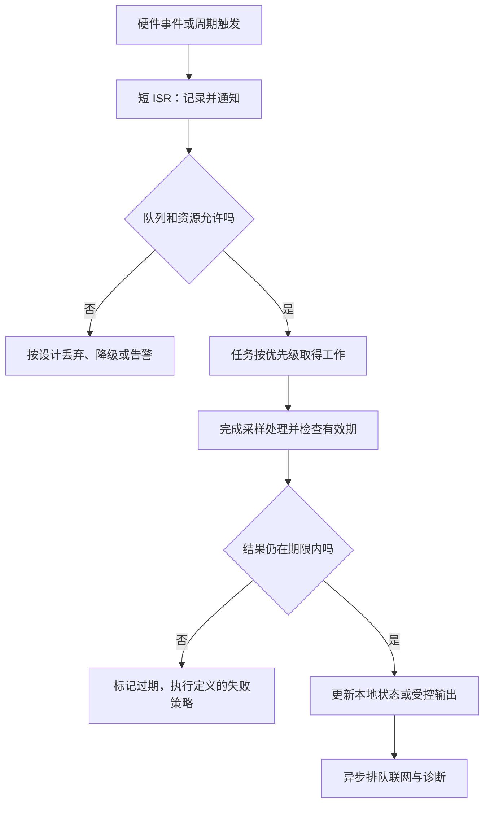

# 嵌入式、物联网与实时约束

> 本文面向进入设备软件的开发者与技术选型人员。读完能区分嵌入式、联网与实时需求，理解中断、调度、资源和设备生命周期的工程边界，并设计可验证的最小实验。示例是虚构活动场地的环境传感器，不涉及实际设备控制或安全认证。

## 三个概念分别回答不同问题

**嵌入式软件**运行在具有特定用途的设备中，与硬件、输入输出和资源约束紧密协作。**物联网**（IoT）把设备接到网络，与管理和数据服务交换信息。**实时系统**（Real-time System）的正确性还取决于结果能否在规定时间内产生，而不只看结果值。

一个离线电子计时器可以是嵌入式设备而非物联网；联网传感器上报数据，不一定有严格控制截止期限；高速计算也不自然等于实时保证。**截止期限**（Deadline）定义某项结果最晚何时有效，**抖动**（Jitter）表达时间间隔或响应的变化。需求必须说明超时后是质量下降、结果无用，还是可能造成严重后果。

本篇介绍工程入口，不据此宣称任何设备满足医疗、交通或工业功能安全要求。实际安全相关设备还需按具体用途、硬件和适用标准开展专门分析与验证；网络安全基线也不能代替功能安全证明。

## 从硬件边界选择软件组织方式

**微控制器**（MCU）通常把处理器、内存和外设接口集成在芯片上；**板级支持**（BSP）连接目标板、驱动和系统配置；**交叉编译**在开发机生成另一目标环境的程序。源码编译成功，不证明目标引脚、时钟、内存布局或驱动配置正确。

| 软件形态 | 更适合的条件 | 主要代价 | 先核对什么 |
| --- | --- | --- | --- |
| 主循环加中断 | 任务较少、时序可清晰组织 | 扩展后共享状态与长任务协调 | 最长循环和中断延迟 |
| 实时操作系统 | 多任务、优先级和同步需求明确 | 调度、栈和资源共享复杂性 | 任务期限、阻塞与调度配置 |
| 通用操作系统 | 资源较充足、需要复杂网络与用户空间 | 启动、资源和调度边界 | 实际时延及隔离要求 |
| 设备与网关分工 | 设备资源受限、联网逻辑较复杂 | 协议、断连和两端版本协作 | 本地功能能否独立运行 |

**实时操作系统**（RTOS）提供任务调度、同步和时间机制，但不会自动让任意程序满足期限。某个驱动长期关闭中断、某个任务持锁等待网络，仍可破坏时间要求。选型要根据任务集合与最坏条件，不根据名称中的“实时”。

## 中断快速响应，耗时工作交给受控任务

**中断**让硬件事件打断当前执行，**中断服务例程**（ISR）处理必要的即时工作。以 Zephyr 文档为例，ISR 应尽快完成，可通过队列、信号量或工作队列把耗时处理移到线程；后续何时执行仍受调度影响。[Zephyr 中断文档](https://docs.zephyrproject.org/latest/kernel/services/interrupts.html)

传感器数据就绪时，可以记录时间和必要数据并通知采样任务；格式转换、网络发送和日志写入不宜全部放在中断中。队列长度和满队列策略要明确：丢弃旧样本、拒绝新样本、降采样或告警，各自代表不同数据与实时取舍。无限缓冲只是把过载延后到内存耗尽。

图把关键本地路径与网络上报分开。虚构环境传感器可以在离线时继续采样，再按容量缓存；若某个控制结果依赖云端响应，就必须把网络不确定性纳入期限，不能用平均网络延迟替代最坏条件。

## 调度、阻塞与优先级反转

**抢占式调度**允许更高优先级的就绪任务取代当前任务；**协作式调度**依赖任务主动让出。Zephyr 支持不同调度行为，时间片也有配置与优先级边界。高优先级任务不代表立即完成，它仍可能被中断、资源锁和自身等待限制。[Zephyr 调度文档](https://docs.zephyrproject.org/latest/kernel/services/scheduling/index.html)

**优先级反转**是高优先级任务因等待低优先级任务持有的资源而受阻，中间优先级任务还可能延长等待。**优先级继承**临时提高资源持有者的优先级，帮助其释放锁；Zephyr 互斥量提供相应机制，并明确互斥量不适合 ISR 使用。[Zephyr 互斥文档](https://docs.zephyrproject.org/latest/kernel/services/synchronization/mutexes.html)

继承不解决全部问题：循环等待仍会死锁，持锁等待外部响应仍会造成不可控阻塞。缩短临界区、统一加锁顺序、用消息传递分离任务职责，都是可选择的工程方法。**最坏执行时间**（WCET）估计一项工作的执行上界；响应时间还要考虑调度等待、阻塞和中断干扰，不能只测函数在空闲系统中一次运行的时间。

对时间要求，记录周期、期限、执行范围、共享资源和超时策略。测试可以提供观察结果，但没有覆盖所有硬件状态和负载时，不宜把测得最大值写成严格上界。本文未进行任何时序测量或可调度性证明。

## 内存、电量与持久化都是预算

设备可能只有有限内存，任务栈、网络缓冲、驱动和业务状态共同消耗它。栈不足、越界和对象寿命错误可能破坏其他任务；动态分配是否适合关键路径，需要根据分配器、碎片、失败和时间可预测性判断。不能把“禁止动态分配”或“用某语言就没有内存风险”当成全部设备的统一答案。

**非易失存储**断电后保留数据，但写入也有时间、擦除和寿命成本。重要配置可用版本、校验和完整提交状态管理，断电恢复需要识别旧有效值、写入中值和新有效值。并不是每次修改都立即写闪存；批量、日志式或双副本策略各有资源代价。

低功耗模式改变唤醒延迟、外设状态和时间来源。联网重试可能比采样更耗电，因此应设计唤醒条件、退避和缓存范围，并在真实设备上观察。日志不能为了诊断无限写入存储，也不能在异常时掩盖关键实时工作。

## 物联网协议提供传递机制，业务仍需确认

**发布订阅**让设备向主题发布消息，由中介转发给订阅者。MQTT 5.0 定义 QoS 0 的至多一次、QoS 1 的至少一次和 QoS 2 的恰好一次投递机制；更高等级增加协议开销。[MQTT 5.0 规范](https://docs.oasis-open.org/mqtt/mqtt/v5.0/os/mqtt-v5.0-os.html)

QoS 作用于单个发送方与接收方之间的协议交互。发布者到 Broker 的入站投递与 Broker 到订阅者的出站投递分别处理，等级可能不同；发布端使用 QoS 2 不自动保证订阅端也以 QoS 2 接收，应核对订阅及实际授予的等级。

这些是协议投递语义。工程推论是：消息到达不能证明传感器采样正确，也不能证明物理动作完成；重新发布一个新的业务命令、设备重启或应用写入失败仍需业务标识、状态和确认。不能仅因为选择 QoS 2 就删除应用层幂等与结果查询。

| 消息类型 | 应包含的上下文 | 应用层判断 |
| --- | --- | --- |
| 遥测样本 | 设备标识、采样时间、序号和质量状态 | 重复、过期、缺口与时钟偏差 |
| 配置更新 | 目标设备、配置版本与适用条件 | 是否授权、是否兼容、应用成功否 |
| 操作命令 | 操作标识、有效期和目标状态 | 幂等、当前状态与执行结果 |
| 在线状态 | 观测时间与会话信息 | 网络失联不等于设备停止工作 |

设备标识不能代替身份凭证；知道一个序列号的人，不应自动获得管理权。主题、设备组和远程操作需要最小权限，敏感采样数据需要目的、期限和接收者控制。

## 安全更新与设备停用是长期任务

NISTIR 8259A 提供设备安全能力基线，包含设备识别、配置、数据保护、接口访问限制、软件更新与安全状态感知等方向；它是按风险裁剪的起点，而非所有设备的强制认证清单。[NIST IoT 基线](https://nvlpubs.nist.gov/nistpubs/ir/2020/NIST.IR.8259A.pdf)

**空中更新**（OTA）通过网络交付固件或软件。更新应验证来源、目标型号、版本和完整性，并设计下载中断、断电、安装失败与恢复。安全回退与防止降级到已知危险版本可能相互约束，需要明确允许回到哪些版本，而非笼统支持“任意回退”。

出厂、注册、凭证轮转、转移所有权和停用，都需要生命周期设计。共享默认口令扩大泄露范围；停用时只从管理页面删除记录，却不撤销设备凭证或清理本地敏感数据，仍保留能力与副本。更新支持期和停用入口也影响长期维护成本。

## 验证从仿真走向真实硬件

可先在主机验证协议与纯业务逻辑，再在开发板验证驱动、中断、计时和资源，最后做断网、断电、满队列和更新失败实验。**硬件在环**（HIL）用真实硬件与可控输入检查系统行为；逻辑分析或其他仪器可以观察软件日志未覆盖的时序。具体设备还需相应硬件知识，不能把模拟器通过当成电气与时序验收。

| 失败模式 | 原因 | 验证方向 |
| --- | --- | --- |
| 平均快却偶尔超时 | 阻塞和突发干扰未分析 | 压力与最坏条件的响应链 |
| 中断里长时间发网络 | 关键事件无法及时响应 | ISR 时长与工作转移 |
| 联网成功但数据重复 | 协议与业务语义混淆 | 序号、幂等与重启恢复 |
| 断电后配置损坏 | 写入没有完整提交状态 | 在写入各阶段中断并恢复 |
| OTA 后无法启动 | 型号、资源或恢复路径错误 | 兼容、断电和失败回退 |
| 设备下线凭证仍有效 | 停用未进入授权生命周期 | 撤销和残留访问验证 |

本文未进行硬件实验。进入专项后，应继续查目标芯片、驱动、RTOS 配置与行业要求，把软件版本、板版本和测试条件一起记录，才能解释测得行为的适用范围。

## 参考资料

<Refs>

- [Zephyr：Scheduling](https://docs.zephyrproject.org/latest/kernel/services/scheduling/index.html)（访问日期 2026-10-03）
- [Zephyr：Interrupts](https://docs.zephyrproject.org/latest/kernel/services/interrupts.html)（访问日期 2026-10-03）
- [Zephyr：Mutexes](https://docs.zephyrproject.org/latest/kernel/services/synchronization/mutexes.html)（访问日期 2026-10-03）
- [OASIS：MQTT Version 5.0](https://docs.oasis-open.org/mqtt/mqtt/v5.0/os/mqtt-v5.0-os.html)（访问日期 2026-10-03）
- [NISTIR 8259A：IoT Device Cybersecurity Capability Core Baseline](https://nvlpubs.nist.gov/nistpubs/ir/2020/NIST.IR.8259A.pdf)（访问日期 2026-10-03）
- 站内相关：[异步、并发同步与取消](/software/programming/async-concurrency) · [威胁建模与安全开发验证](/software/security/threat-modeling) · [密钥、最小权限与审计](/software/security/secrets-permissions) · [依赖供应链与制品信任](/software/security/supply-chain) · [音视频与实时通信](/software/specialized/realtime-media)

</Refs>
