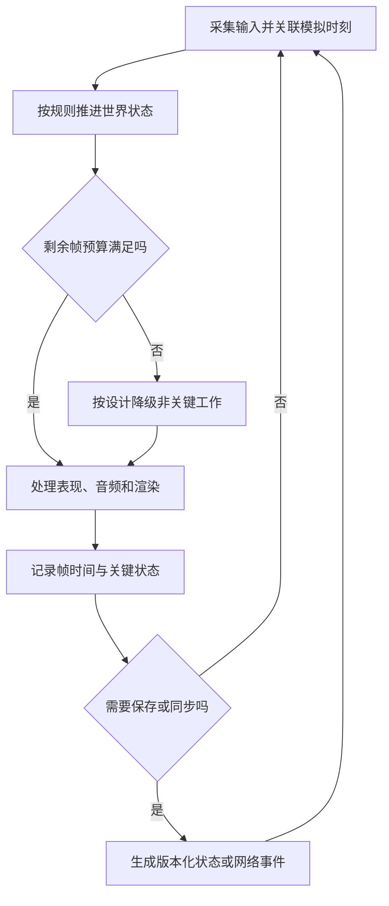

# 游戏软件工程基础

> 本文面向从通用应用开发进入游戏工程的读者。读完能理解时间推进、资源流水线、存档和网络同步的核心边界，用可验证的最小玩法选择工程路线。示例是一款虚构的单人场地调度小游戏，本文没有制作游戏、测试帧率或运行联网实验。

## 游戏围绕持续变化的世界运行

**游戏循环**（Game Loop）不断接收输入、更新世界并生成画面与声音。普通表单可等待一次用户提交，游戏往往需要每帧根据时间和状态作出响应。**游戏引擎**提供渲染、物理、音频、资源、输入和编辑器等协作能力，业务玩法仍需开发者实现。

**帧**是一次画面更新的单位，**帧时间**是完成相应工作所用的时间；平均帧率不能解释所有卡顿。某一帧发生资源加载、内存回收或大量物理计算，即使长时间平均值好看，也可能打断交互。需要同时关心峰值、波动和输入到呈现的延迟，而不是只显示一个 FPS 数字。

游戏工程的约束由玩法决定：回合制可把状态转换做得明确，动作游戏更敏感于时间和输入；单人离线存档与多人权威状态不同；二维、小场景与大型三维内容的资源成本也不同。先定义交互目标、目标设备与失败后果，再选择引擎和同步机制。

## 渲染时间和模拟时间不能混淆

**可变时间步长**按每次更新实际经过的时间推进状态；**固定时间步长**按约定的模拟间隔推进。以 Godot 为例，普通处理跟随实际帧率，物理处理以固定频率尽量推进，文档要求用经过时间处理相应运动计算。[Godot 更新机制](https://docs.godotengine.org/en/stable/tutorials/scripting/idle_and_physics_processing.html)

若“每帧向前移动一单位”，更高帧率设备就会跑得更快。按速度乘时间推进可减少这种依赖，但碰撞、积分和网络恢复仍有各自问题。固定步长有助稳定模拟节奏，却不保证不同处理器、浮点路径、随机数和并行调度产生逐位相同的结果。

**确定性**（Determinism）是相同初始状态和输入在约定环境下产生相同结果。它需要控制时间、随机种子、输入顺序和计算差异；固定更新只是其中一个条件。**插值**在已知模拟状态之间生成平滑显示，**预测**根据当前信息估计未来状态，两者不能作为权威业务结果。

图中降级不应随意跳过决定胜负的规则。可以降低某些表现效果或延后非关键资源工作，但模拟落后时怎样追赶、暂停或提示，需要按玩法明确。无限补跑固定步骤可能让过载不断积累，应通过负载分析与限制避免系统失去响应。

## 状态、场景与资源分别负责什么

**场景**组织可实例化的对象及关系；**资源**保存图像、网格、音频、配置等数据。Godot 将节点行为与资源数据区分，资源可能在多个实例间共享。[Godot 资源文档](https://docs.godotengine.org/en/stable/tutorials/scripting/resources.html)

共享资源能减少重复加载，但修改共享数据可能影响所有引用者。敌人类型配置可以共享，单个敌人的当前生命值通常应属于实例状态。把实例变化直接写回公共配置，会造成“一个对象受伤，全部对象一起变化”的错误。

**实体组件系统**（ECS）以实体标识、数据组件和处理系统组织世界；场景对象方式则常把行为与对象层级结合。它们各有组合、查询和性能特点，不能把一种范式宣称为所有玩法必选。对小型游戏，清楚区分世界状态、表现和持久化，通常比提前设计复杂架构更有帮助。

### 内容流水线决定可交付成本

**资源流水线**（Asset Pipeline）把美术、音频和关卡源文件转换成可由目标设备读取的运行资源。转换格式、压缩、导入设置和平台差异会影响画质、体积、内存与加载。原始文件体积小，不代表运行时解压后也小；编辑器中能显示，不代表最终包包含所需资源。

资源需要命名、来源、许可、依赖与版本记录。修改纹理或关卡也可能造成玩法变化，应与代码一起审查。大型二进制文件需要适合的协作方式，生成缓存与源素材分开，避免在仓库中堆积无法解释的导入产物。字体、音乐和模型的许可应独立核对，见[许可证、知识产权与职业责任](/software/security/licenses-professional-practice)。

## 存档保存的是可解释的业务状态

**序列化**把内存状态转换成可保存的表示。存档应记录可恢复世界所需的数据、模式版本和必要校验信息，而不是机械保存整个引擎对象树。临时动画状态、渲染句柄和系统资源未必适合持久化；关卡更新后也可能无法识别旧对象编号。

虚构调度小游戏可以保存场地布局、关卡进度和随机种子。保存中断时，应避免覆盖唯一有效存档；载入要处理格式损坏、版本不兼容和缺失资源。**存档迁移**解释旧数据怎样映射到新规则，若无法无损恢复，应明确反馈并提供安全退出路径，不能悄悄重置用户进度。

| 存档决定 | 适用条件 | 验证重点 |
| --- | --- | --- |
| 直接保存结构化状态 | 世界规模可控、规则清楚 | 模式版本与损坏处理 |
| 保存操作日志及快照 | 需要回放或细粒度恢复 | 输入顺序、随机和快照一致性 |
| 本地存档 | 单人离线功能 | 中断写入、设备差异与迁移 |
| 服务端持久化 | 多人或跨设备权威状态 | 身份、幂等与客户端篡改 |

可重复回放有助诊断，但不能在未控制计算环境时承诺完全确定性。对关卡和数值变化，应先验证旧存档语义，再决定是否允许回退软件版本。

## 多人游戏把时间与信任连接起来

**权威状态**（Authoritative State）由被指定的可信节点裁决；**客户端预测**先在本地响应输入，收到权威结果后再修正；**状态插值**缓和网络更新间隔带来的跳动。这些机制需要在交互及时性、带宽、服务器成本和公平性之间取舍。

客户端可发送动作意图，服务端检查是否允许，再更新关键状态。让客户端直接上报“我赢了”或“我移动到这里”，会把结果裁决交给不可信方。网络 API 的调用权限与游戏业务授权不同，合法消息仍可能要求不可能的动作。Godot 多人文档强调联网引入作弊和系统安全风险。[Godot 多人机制](https://docs.godotengine.org/en/stable/tutorials/networking/high_level_multiplayer.html)

| 网络形态 | 更适合的条件 | 需要付出的代价 |
| --- | --- | --- |
| 轮流提交行动 | 回合制、状态变化较离散 | 处理重复行动、超时与断线 |
| 服务端权威实时模拟 | 公平性和一致性要求较高 | 服务器负载、预测与修正 |
| 主机主持会话 | 小规模、用户可接受主机依赖 | 主机退出、信任和迁移 |
| 确定性输入同步 | 可控制模拟与输入顺序 | 环境一致性与漂移诊断 |

不要把 TCP 和 UDP 简化为永久的快慢排名。协议提供的可靠性、顺序和拥塞机制只是条件，实际延迟取决于实现与网络；选择要基于消息是否允许过期、丢失或重排。网络断开与重连还需身份和会话状态，不能只重建连接便继续套用旧对象。

## 性能优化依靠剖析和代表负载

**性能剖析**（Profiling）把执行时间、调用次数和资源使用归到具体路径。Godot 官方建议用剖析和计时指导优化，因为改动可能反而降低性能。[Godot 优化指南](https://docs.godotengine.org/en/stable/tutorials/performance/general_optimization.html)

先分辨 CPU、GPU、内存、资源加载与网络等待。减少对象数量不一定解决 GPU 填充开销，换一套渲染技术也不一定解决每帧读取文件。采用对象池、批处理、裁剪或异步加载前，应有瓶颈证据，并检查这些机制新增的生命周期和同步成本。

目标帧率可以换算成理论帧预算：目标为 `f` 帧每秒时，一帧约有 `1000 / f` 毫秒。这是时间单位换算，不是本游戏的测量结果；CPU 与 GPU 流水、同步等待和突发工作还要实际分析。不能仅在空场景或高性能开发机上验收目标设备表现。

## 最小玩法与验收边界

可先做一个完整但狭小的循环：选择场地、放置对象、触发规则、呈现结果、保存并恢复。再用不同输入节奏、帧率、暂停、存档损坏和资源缺失验证机制；若需要联网，单独检查延迟、丢包、重连和超范围操作。本文没有执行这些验证，也没有帧率或规模结论。

| 失败模式 | 机制原因 | 改进方向 |
| --- | --- | --- |
| 高帧率设备动作更快 | 用帧数代替时间 | 明确模拟时间和移动计算 |
| 偶发长卡顿 | 主循环出现突发加载或计算 | 查看帧时间分布与调用路径 |
| 多实例共享变化 | 公共资源混入实例状态 | 分离配置与运行状态 |
| 升级后存档无法读取 | 模式与资源编号无迁移计划 | 版本化存档并验证旧样本 |
| 客户端任意修改胜负 | 信任客户端结果 | 在权威边界验证动作与规则 |
| 引擎升级后行为漂移 | 物理、导入或默认设置变化 | 固定环境并回归代表场景 |

进一步学习应按玩法深入：渲染、物理、动画、关卡工具、音频、联网或平台发布。基础工程先让时间、状态、资源和恢复可解释，后续复杂系统才有可靠的扩展入口。

## 参考资料

<Refs>

- [Godot：Idle and Physics Processing](https://docs.godotengine.org/en/stable/tutorials/scripting/idle_and_physics_processing.html)（访问日期 2026-10-03）
- [Godot：Resources](https://docs.godotengine.org/en/stable/tutorials/scripting/resources.html)（访问日期 2026-10-03）
- [Godot：High-level multiplayer](https://docs.godotengine.org/en/stable/tutorials/networking/high_level_multiplayer.html)（访问日期 2026-10-03）
- [Godot：General optimization tips](https://docs.godotengine.org/en/stable/tutorials/performance/general_optimization.html)（访问日期 2026-10-03）
- 站内相关：[时间与空间复杂度](/software/algorithms/complexity) · [输入、输出与业务安全](/software/security/application-security) · [音视频与实时通信](/software/specialized/realtime-media) · [许可证、知识产权与职业责任](/software/security/licenses-professional-practice)

</Refs>
