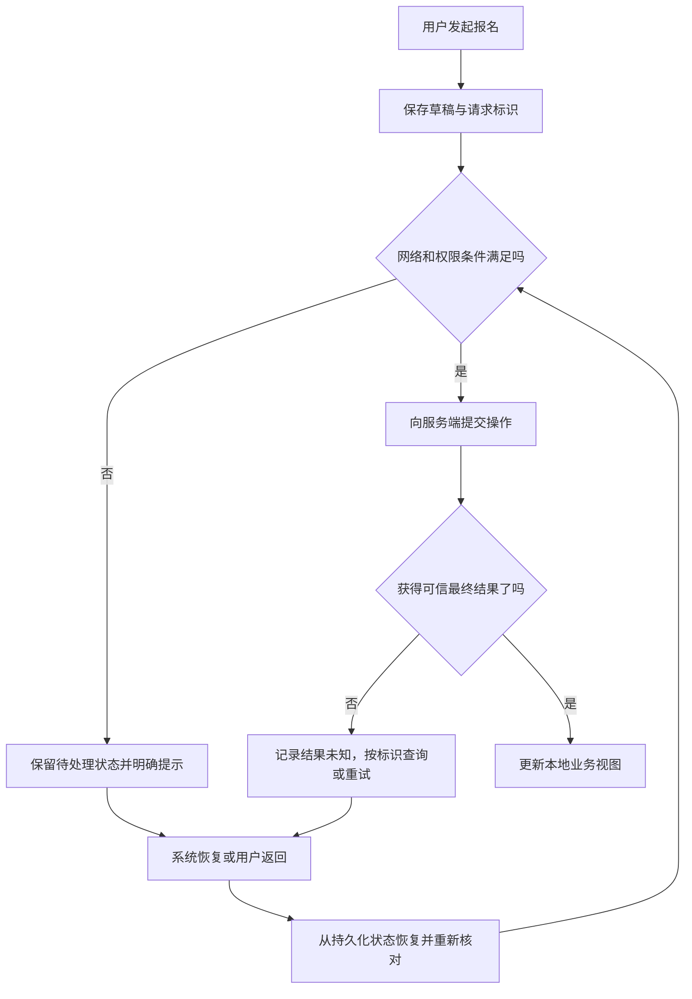

# 移动应用开发基础

> 本文面向准备从 Web 或通用编程进入移动开发的读者。读完能理解生命周期、离线状态、权限和分发怎样改变应用设计，选择一条可验证的工程路径。以虚构活动报名客户端为例，文中的实验方案未执行，不提供完整移动项目教程。

## 移动应用受操作系统调度

**移动应用**是在手机、平板等移动设备上运行并通过平台机制获得界面、存储、传感器和网络能力的软件。它与服务端程序共享接口、数据和测试原理，但执行环境不同：屏幕可变化，用户会随时切换任务，网络可能中断，设备受电量、内存和温度约束。

**生命周期**（Lifecycle）描述组件从创建、可见、活跃到暂停或结束的状态变化。界面存在、进程存在、任务完成和数据已持久化，是四个不同事实。Android 官方架构指南说明应用组件可能被系统销毁或重建，不能把重要数据只放在短寿命界面组件中。[Android 架构指南](https://developer.android.com/topic/architecture)

报名页面已显示“提交中”，不代表请求未被服务端处理；用户切到其他应用后返回，也不能假定原来的页面对象还在。移动开发的核心之一，是让界面可以根据可信状态恢复，而不是依赖一串从未中断的回调。

## 状态分层比堆放页面变量重要

**界面状态**包含输入草稿、当前筛选和滚动位置；**业务状态**包含报名是否有效、活动是否满额；**持久化状态**是退出或进程重建后仍可取得的数据。不同状态的寿命和权威来源不同。草稿可以本地保存，活动容量仍由服务端判断，本地“剩余名额”只是某次观察。

**单一事实来源**（Single Source of Truth）为某类数据指定一个负责修改的来源；**单向数据流**（Unidirectional Data Flow）让状态向界面传播，操作事件向状态拥有者传播。它们有助减少页面、缓存和网络响应各自改同一状态造成的分歧，但不能让服务端与本地自动达成一致。

可把工程拆成界面层、状态协调层与数据访问层。Android 的具体分层建议提供一个参考，其他平台需要按各自组件和状态机制实现。共享层宜保存可独立测试的业务规则，平台层负责权限、导航和系统调用，不必为简单应用强行增加所有抽象层。

图中的“结果未知”避免把网络超时直接当成报名失败。服务端可能已写入，客户端只是没收到响应。请求标识、幂等规则和结果查询需要与服务端契约一起设计；界面重建不应自动发出第二个不同的报名操作。

## 生命周期与后台工作是两类机制

Android 的 `Activity` 有创建、启动、恢复、暂停、停止与销毁等回调。应根据界面是否可见管理资源，并处理配置变化和进程被移除的情况。不是每个应用都需要实现所有回调，但需要明确在状态变化时怎样释放资源和恢复进度。[Activity 生命周期](https://developer.android.com/guide/components/activities/activity-lifecycle)

**后台任务**是在界面不活跃时仍可能需要执行的工作，例如延后同步。它不等于开一个线程：线程仍属于进程，进程结束后不会继续。系统提供不同任务机制，限制与适用条件不同，应按是否需要立即执行、能否延后、是否与用户可见操作相关来选择。[Android 后台任务概览](https://developer.android.com/develop/background-work/background-tasks)

报名系统可以在离线时保存表单草稿，但“恢复网络后自动提交报名”涉及时效、用户意图和容量变化，需要产品规则。缓存同步可以延后，用户要求立即确认的操作不能假装后台队列已经完成。推送通知也只是提醒机制，不能替代服务端状态查询。

后台下载、定位或持续媒体任务需要进一步查阅目标系统和版本的专门规则。本文没有核验所有 Android 与其他移动系统版本的政策，不能把某平台机制、后台额度或商店规则推广为所有移动端的一致行为。

## 离线能力来自冲突策略

**离线优先**（Offline-first）是在网络不可用时仍让部分功能依靠本地数据完成，并明确恢复后的同步方式。它不是“所有功能都能离线”，也不是给每个请求加缓存。活动详情可以离线阅读，最后名额是否仍可报名却必须由在线权威状态确认。

| 数据或操作 | 本地可做什么 | 恢复后怎样核对 | 边界 |
| --- | --- | --- | --- |
| 活动详情 | 显示缓存和更新时间 | 获取较新版本 | 旧规则不能冒充当前规则 |
| 报名草稿 | 保存输入并允许编辑 | 提交前重新校验 | 草稿不占用名额 |
| 报名操作 | 保存用户意图和操作标识 | 查询或幂等提交 | 超时可能结果未知 |
| 取消操作 | 可显示待处理状态 | 核对允许状态和最终结果 | 本地点击不能立即释放服务端名额 |
| 管理名单 | 保存受控范围的工作数据 | 更新与权限撤销同步 | 敏感副本需要期限和删除策略 |

**冲突解决**定义多个来源对同一记录给出不同变化时如何处理。简单“最后写入覆盖”可能丢失业务操作；适合追加记录、服务端裁决或人工处理的场景不同。同步事件需要记录版本和顺序，重试必须避免重复副作用。数据库、网络和 UI 各层都应表达“陈旧”“待同步”“失败”和“已确认”，避免用户误解。

## 权限和本地数据是显式边界

**运行时权限**是在执行敏感能力前由系统向用户申请的授权。Android 指南要求在使用时检查权限，并在用户拒绝时合理降低功能；曾经获得权限不等于以后一直有效。[运行时权限指南](https://developer.android.com/training/permissions/requesting)

请求应对应当前任务和可说明的用途。报名功能若能通过文本完成，不应为打开首页先申请相机、位置和通讯录。拒绝扫码权限后仍提供手动输入，是一种可检查的降级路径。系统权限只允许访问设备能力，不代表服务端业务授权成立，也不替应用决定数据是否可以上传或保存。

本地凭证应通过目标平台适合的受保护机制管理，避免长期服务端秘密进入客户端。客户端包可以被分析，本机也可能存在恶意软件或被用户调试；不能把硬编码密钥、简单混淆或隐藏文件当成永久秘密。退出账号和撤销权限时，需要处理缓存、下载文件与后台任务。

## 按平台能力选择工程路线

**原生开发**直接使用目标平台的语言、界面和系统 SDK；**跨平台框架**共享一部分界面或业务代码，通过平台适配调用系统能力；**Web 容器**在移动应用内展示网页并按需桥接。共享代码比例不是唯一成本指标，平台差异、发布节奏和测试矩阵同样重要。

| 路线 | 更适合的条件 | 主要代价 | 先验证什么 |
| --- | --- | --- | --- |
| 分平台原生实现 | 深入设备能力和平台交互 | 多套实现与协作成本 | 核心系统接口及生命周期 |
| 共享界面与业务框架 | 多平台流程相近 | 插件、桥接和版本适配 | 关键插件、性能与辅助技术 |
| 共享业务、原生界面 | 业务规则较重、交互差异较大 | 边界设计与平台接口维护 | 数据模型和错误语义能否共享 |
| Web 容器或移动网页 | 内容与表单为主 | 设备能力与容器兼容限制 | 离线、导航、登录与桥接安全 |

这是工程决策框架，不是框架排名。不要凭演示页面的加载速度决定架构；选一个最依赖设备能力的核心路径先验证，再估算完整维护成本。地图、媒体、蓝牙等专项能力应各自查文档与许可。

## 从最小路径到分发验收

一个合理的最小实验是：使用虚构数据完成活动查看、草稿保存、提交与结果恢复，再测试切换应用、改变布局、断网和权限拒绝。模拟器可以帮助快速验证逻辑，真机仍用于观察输入方式、性能、资源与硬件差异。本文未创建或运行这一实验。

分发还包括包标识、签名、安装、升级与数据迁移。客户端不会随服务端更新同步完成升级，因此接口需考虑旧客户端存活、版本能力与退出支持的策略。应用商店与企业分发规则应按所选渠道核验，不宜在基础文章写成永久统一条件。

| 失败模式 | 原因 | 验收方向 |
| --- | --- | --- |
| 转屏或重建后草稿丢失 | 状态寿命绑定页面对象 | 检查状态恢复与持久化 |
| 超时重试产生重复报名 | 没有操作标识与幂等契约 | 核对结果未知和重复请求 |
| 退到后台任务便丢失 | 把线程当作系统后台机制 | 在中断与重启后检查任务状态 |
| 拒绝权限导致整页不可用 | 功能没有降级路径 | 验证非敏感替代操作 |
| 旧客户端显示成功但服务端拒绝 | 协议与规则已变化 | 检查兼容和版本反馈 |
| 退出账号仍保留名单 | 只清登录状态未清副本 | 核对数据生命周期和撤销路径 |

进入移动开发后，下一步应按核心约束深化：状态恢复、离线同步、性能剖析、辅助功能或发布管理。先把中断和恢复设计完整，再扩展功能，才能让应用从连续演示走向真实设备使用。

## 参考资料

<Refs>

- [Android：Guide to app architecture](https://developer.android.com/topic/architecture)（访问日期 2026-10-03）
- [Android：The activity lifecycle](https://developer.android.com/guide/components/activities/activity-lifecycle)（访问日期 2026-10-03）
- [Android：Background tasks overview](https://developer.android.com/develop/background-work/background-tasks)（访问日期 2026-10-03）
- [Android：Request runtime permissions](https://developer.android.com/training/permissions/requesting)（访问日期 2026-10-03）
- 站内相关：[程序从源码到运行](/software/foundations/source-to-runtime) · [输入、输出与业务安全](/software/security/application-security) · [隐私与数据生命周期](/software/security/privacy-lifecycle) · [桌面应用开发基础](/software/specialized/desktop)

</Refs>
