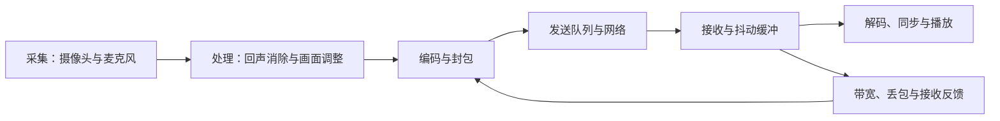

# 音视频与实时通信

> 面向准备开发语音通话、视频会议或互动直播的工程师。读完后，你应能解释采集到播放的延迟从哪里产生，区分信令、媒体与业务权限，依据规模和终端能力选择拓扑，并用分层证据定位“连上了却听不见”的故障。

实时通信的目标是让人持续交流。文件下载可以等待重传后再交付完整内容，通话中的一句话若很晚才到达，数据完整也可能失去交流价值。因此设计同时受到时间、质量、带宽、设备功耗和隐私约束。画面分辨率只是其中一个变量，首次接通时间、语音连续性和退出后是否停止采集同样属于产品行为。

本文以浏览器中的 **WebRTC**（Web Real-Time Communication）为工程入口。它包含媒体连接相关的 API 与协议组合，应用仍须实现用户身份、房间、邀请、信令交换和运维。原生终端可以采用不同接口，但采集、编码、网络、缓冲与播放的因果链仍适用。这里不提供完整会议服务，也不声称完成跨浏览器或弱网实测。

## 一帧画面要经过哪些阶段

摄像头产生原始画面，麦克风产生音频样本。**编码器**（Encoder）将原始信号压缩成媒体数据，网络层发送数据包，接收侧整理、解码并输出。**编解码器**（Codec）指对应的编码与解码规则及实现；双方必须协商出可共同处理的媒体格式，不能只凭文件后缀判断互通。

端到端延迟可以按采集等待、编码、发送排队、传输、接收缓冲、解码和播放等待分解。这是一种诊断模型，各阶段可能流水并行，不能把互相重叠的测量窗口机械相加。若发送速率持续高于可用吞吐，队列增长会让延迟不断累积；把编码清晰度继续调高可能让用户看到更清晰的旧画面。

**抖动**（Jitter）是数据到达间隔的变化。**抖动缓冲**（Jitter Buffer）用短暂等待平滑这种变化；缓冲增大通常能容忍更大的到达波动，也增加等待。丢包恢复、视频关键帧请求、码率调整都在争夺时间与带宽。实时语音、屏幕文字和快速运动画面对这些损失的敏感程度不同，质量策略应从使用场景定义。

音频与视频还需要共同的时间关系。采集时钟、网络接收时间和显示刷新不是同一时钟；仅按包到达先后播放可能破坏嘴型同步。回声消除也不是简单“减去扬声器音量”：麦克风采集到房间传播后的声音，设备切换、音量和处理链都会影响效果。不要同时叠加多套不清楚职责的音频处理，而应记录当前设备与实际生效的约束，再定位问题。

## 信令通了，媒体仍可能不通

**信令**（Signaling）是建立、管理和控制通信路径的信息交换。应用常通过既有服务器传递会话描述和连接候选。RFC 8825 明确将客户端到服务器的具体信令协议选择留在 WebRTC 协议组合之外；使用 WebSocket 是一种实现选择，并不是通话媒体必须走的唯一路径。

**会话描述**（Session Description）表达媒体与传输协商信息。`RTCPeerConnection` 管理连接和媒体协商，应用负责把本地描述与远端描述送到对应参与者。此处的“对应”必须包含房间与用户校验，否则能交换描述的攻击者可能混入通信。协商还会随加入轨道、共享屏幕或重新连接变化，需要明确状态和冲突处理。

**交互式连接建立**（Interactive Connectivity Establishment，ICE）收集候选地址、配对并检查可达路径。候选可来自本地接口、通过 STUN 发现的映射地址，以及 TURN 提供的中继地址。**STUN** 用于相关地址发现和连接检查机制；**TURN** 提供流量中继。仅配置一个地址发现服务，不能保证所有网络都能直连；中继能力、认证与可用容量应纳入产品路径。

这种连接检查解决的是网络可达性。它不能判断用户有没有参加某个房间的业务权利。媒体传输保护也不能代替邀请有效期、主持人权限、录制告知和成员踢出。若媒体经过服务器，是否具有让服务器无法读取内容的端到端保护，要依据具体媒体处理与密钥设计判断，不能由“用了 WebRTC”直接推出。

一次连接的状态至少应区分：加入房间授权通过、设备采集成功、信令协商完成、传输连通、远端轨道到达、媒体实际播放。界面若在信令连接成功时就显示“通话正常”，会掩盖黑屏、设备权限失败或播放问题。

## 采集权限也是运行状态

**媒体轨道**（MediaStreamTrack）表示一个音频或视频来源；**媒体流**（MediaStream）组织轨道。`getUserMedia()` 用于请求设备媒体，约束表达希望获得的能力，但设备和用户代理决定可满足的结果。申请高分辨率不等于实际一定获得，产品需要读取结果并适配。

权限拒绝与设备故障要分别提示。媒体采集规范规定权限未获允许时存在 `NotAllowedError` 等失败路径；没有设备、设备正在异常状态、约束无法满足又是其他诊断方向。应用应在用户发起通话或测试设备的上下文中解释用途，允许不打开摄像头的参与方式，并在离开时释放不再需要的轨道。

静音、停用轨道、停止设备与移除发送关系也有不同语义。工程上应先定义按钮想实现什么：暂时不发送声音，还是彻底结束这次采集。界面状态必须与实际状态同步，设备被拔出、操作系统撤销访问或用户切换输出设备后，不能继续展示旧设备名称和旧成功状态。

## 拓扑决定资源放在哪里

多方会议不能只把双人示例复制多次。**网状连接**（Mesh）让终端之间建立多条连接；**选择性转发单元**（Selective Forwarding Unit，SFU）是工程中对选择媒体流并转发的服务常见称呼；**多点控制单元**（Multipoint Control Unit，MCU）则涵盖多点通信处理架构，常见实现会混合媒体。RFC 7667 给出比这些简写更细的 RTP 拓扑分类，具体实现仍需检查。

| 方案 | 适合先验证的需求 | 资源与机制代价 | 需要确认的边界 |
| --- | --- | --- | --- |
| 双人直连，必要时中继 | 点对点通话 | 终端编解码，中继承担转发流量 | 不同网络可达性与中继容量 |
| 多人 Mesh | 小规模原型、参与者较少 | 终端上行、连接数和解码负担随人数增加 | 目标设备和真实并发下是否可承受 |
| SFU | 多人会议、选择订阅画面 | 服务器选择转发，终端处理收到的多路流 | 订阅策略、带宽适配、服务器成本 |
| 混合媒体的 MCU | 接收端能力受限、需要合成输出 | 服务器解码、混合和重新编码 | 运算、延迟、画质与内容可见性 |

选择性转发并不意味着所有终端收到相同画质。服务可依据窗口大小和网络状态选择层或流，但发送端编码组合、接收端解码能力及控制反馈必须配合。屏幕共享通常有清晰文字与变化局部的需求，应独立定义策略。拓扑选择还改变隐私与审计边界：谁能处理原始媒体、录制发生在哪里、成员退出后哪些资源仍存在，都需要明确。

## 用指标构造故障证据

`getStats()` 返回连接相关的统计对象；规范允许通过对象标识关联多次采样。它是观测入口，字段含义和浏览器支持应按所用规范及实现确认。累计计数需要比较采样差值，不能把启动以来的总丢包数直接当作最近一分钟的丢包率；轨道或连接变化时还要处理对象身份变化。

| 用户现象 | 先检查的证据 | 常见错误推断 |
| --- | --- | --- |
| 本地也没有声音或画面 | 权限、设备、轨道状态、实际采集参数 | 一律归因于网络 |
| 信令在线却无法接通 | 协商状态、ICE 检查、中继认证与可达性 | 服务器 WebSocket 正常便认为媒体正常 |
| 声音断续、视频延迟增长 | 发送排队、速率、丢包、到达波动、设备负载 | 只提升码率或只增大缓冲 |
| 远端有轨道但播放失败 | 播放状态、输出设备、页面交互及轨道变化 | 已收到轨道便算用户听到了 |
| 多人时手机发热或卡顿 | 编解码负载、订阅数量、后台与热状态 | 将 SFU 的存在视为终端负载保证 |

日志可记录连接阶段、匿名化的关联标识和故障类别，便于将客户端、信令与媒体服务事件对应起来。采集完整会话描述、地址、录音或画面会扩大敏感信息范围，应按排障目的限制内容、访问和保留时间。安全与隐私措施可衔接[威胁建模](/software/security/threat-modeling)和[数据生命周期](/software/security/privacy-lifecycle)，无需在这里重建一套身份治理。

## 从双人实验建立工程路径

以下是未执行的学习实验。先在目标浏览器做本地采集预览，记录实际轨道与设备状态；再实现两个受控参与者的信令交换，逐阶段展示连接状态；最后加入中继和故障场景。每一步保留可说明因果的证据，而不是只截取成功画面。

实验场景应覆盖权限拒绝、没有摄像头、通话中拔出设备、切换网络、一个人关闭页面、重连和重复加入房间。多人扩展前，验证退出会释放采集与服务端资源，重连不会留下旧成员和重复音轨。测试弱网时分别改变延迟、丢包和带宽，记录场景及设备，避免把一次观察写成适用于所有网络的指标。

正式交付还需要容量验证、协议与浏览器兼容矩阵、录制策略、可访问性和服务恢复方案。广播直播、离线转码和专业音频制作有不同延迟及质量目标，不能直接照搬会议拓扑。本文提供进入工程的职责划分和诊断方式，最终体验仍要在目标设备、网络与用户任务下验证。

## 参考资料

<Refs>

- [RFC 8825：WebRTC 协议组合概览](https://www.rfc-editor.org/rfc/rfc8825)：核验信令与媒体路径、职责划分及信令协议范围，访问日期：2026-10-03。
- [RFC 8445：ICE](https://www.rfc-editor.org/rfc/rfc8445)：核验候选类型、STUN/TURN 与连接检查机制，访问日期：2026-10-03。
- [RFC 7667：RTP Topologies](https://www.rfc-editor.org/rfc/rfc7667)：核验网状、多点混合与选择转发的拓扑分类，访问日期：2026-10-03。
- [W3C：WebRTC](https://www.w3.org/TR/webrtc/)：核验连接 API、媒体协商与统计对象的观测方式，访问日期：2026-10-03。
- [W3C：Media Capture and Streams](https://www.w3.org/TR/mediacapture-streams/)：核验流、轨道、采集约束与权限失败路径，访问日期：2026-10-03。

## 站内相关

- [异步、并发同步与取消](/software/programming/async-concurrency)
- [性能分析、容量、弹性与成本](/software/operations/capacity-performance-cost)
- [威胁建模与安全开发验证](/software/security/threat-modeling)
- [隐私与数据生命周期](/software/security/privacy-lifecycle)

</Refs>
