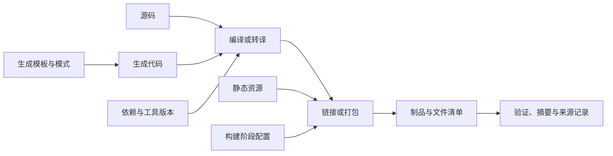

# 构建工具链与制品

> 面向需要解释构建流程、排查产物差异并准备交付的开发者。读完能识别构建输入和依赖图，区分增量与干净构建，说明制品如何对应源码、目标环境和验证记录。

## 构建把工程输入转换成可交付的结果

**构建**（Build）按照规则，把源码、资源、依赖和配置转换为目标结果。**工具链**（Toolchain）是完成这些转换的一组工具；**制品**（Artifact）是需要保存或交付的输出，例如可执行文件、库、网页资源包或容器镜像。

有些程序直接由运行时读取源码，构建步骤可能主要是检查、资源生成和打包；有些程序需要编译与链接。前端工具也可能转译、打包和压缩代码。不能把所有构建都等同于“生成一个原生可执行文件”，具体执行机制见[从源码到运行中的程序](/software/foundations/source-to-runtime)。

| 阶段 | 典型输入与输出 | 应关注的条件 |
| --- | --- | --- |
| 代码生成 | 模式或模板 → 源码、接口定义 | 生成器版本和模板是否被追踪 |
| 编译或转译 | 源码 → 目标代码或另一种源码 | 语言版本、目标平台、优化选项 |
| 链接或打包 | 目标文件、模块 → 可执行结果或模块包 | 依赖是否纳入、哪些保持外部引用 |
| 资源处理 | 图片、样式、静态文件 → 发布目录 | 路径、命名和遗漏资源 |
| 归档与发布准备 | 多项输出 → 可保存的制品 | 文件清单、权限、元数据与摘要 |

“构建通过”只表示实际配置的动作完成。某个转译器能输出文件，不意味着同时做了类型检查；某个构建任务没有调用测试，成功也不会证明测试通过。团队应写清每个任务验证什么，让结果名称与实际动作一致。

## 构建图决定哪些输入影响哪些输出

**构建图**用依赖关系描述顺序：某项输出需要另一项输入，工具先准备输入，再执行生成输出的规则。互不依赖的节点可以并行；循环依赖或遗漏依赖会阻碍正确调度。

Ninja 的构建规则明确区分输出与输入，并支持隐式依赖：即使脚本内部硬编码读取一个文件，那个文件仍应进入依赖关系，否则改变它可能没有触发需要的重建。Ninja 的仅顺序依赖主要约束先后，其变化本身不会触发相同的重建行为。[Ninja 构建图](https://ninja-build.org/manual.html)

这提供了一个通用排障思路：若修改模板后输出不变，应检查模板有没有被声明为真实输入；若并行构建偶发缺文件，应检查生产者与消费者之间是否缺边。把所有任务改成串行可能暂时隐藏问题，但真正的依赖关系仍需表达。

构建脚本还可能读取当前时间、网络响应、机器路径或未声明的环境变量。它们也是实际输入，即使图中没有列出。工具只能依据已知信息决定是否重建，不能自动发现任意脚本的所有外部影响。

## 增量构建与缓存需要完整的输入描述

**增量构建**只执行工具判定需要更新的部分，**缓存**则复用已生成的结果。两者都依赖一种判定：当前输入是否足以对应旧输出。不同工具可能使用文件状态、内容摘要、命令记录或组合策略，具体规则应按工具核对。

可把缓存键理解为一份输入身份：源码、依赖、工具版本、目标平台及影响输出的配置，凡是会改变结果的因素都应被纳入。如果前端 API 地址会在构建时写入包，却没有进入缓存键，换环境仍复用旧缓存，就可能发布错误地址。

| 观察结果 | 可能的解释 | 有效检查 |
| --- | --- | --- |
| 增量正确，干净构建失败 | 旧生成文件补齐了缺失步骤 | 从空输出目录检查完整生成链 |
| 干净正确，增量错误 | 依赖或失效规则遗漏 | 修改各类输入，确认影响范围 |
| 换机器结果不同 | 工具、平台或隐藏输入不同 | 对照实际版本和构建记录 |
| 每次都完整重建 | 输入始终变化或键过宽 | 查波动因素及不必要依赖 |
| 缓存命中却得到错产物 | 键遗漏配置或缓存使用范围错误 | 核对键、输出关联与缓存权限 |

**干净构建**可以暴露对旧文件的依赖，但不自动保证可复现。若每次打包都写入当前时间，两次从空目录构建仍会不同。删除缓存后成功也只是线索，应继续查为什么旧结果被错误复用。

共享缓存还需要可信写入来源和合理隔离。一个可以运行不受信任构建并写入共用缓存的主体，可能影响后续取用结果。性能优化与产物信任需要一起设计，供应链边界见[软件供应链安全](/software/security/supply-chain)。

## 构建目标与构建机器不是同一概念

开发者在一台机器上执行工具，并不表示输出能运行在所有机器上。**构建宿主**是执行构建工具的环境，**目标环境**是制品需要支持的环境；交叉编译时二者明确不同。

原生制品需要考虑 CPU 架构、操作系统、ABI 和系统库；服务端模块可能依赖运行时版本和原生扩展；浏览器产物需要满足目标浏览器的语法与运行能力。Vite 的 `build.target` 用于指定构建的浏览器兼容目标，但目标语法转换不能替代对所有运行时 API 能力的验证。[Vite 构建目标](https://vite.dev/config/build-options)

目标选择应从实际使用者和部署平台推导。支持更旧目标可能增加转换成本或需要兼容策略，选择较新目标则可能排除一部分用户。应把支持范围写成可验证条件，而非只记录构建机器型号。

调试信息也是制品策略的一部分。Vite 提供独立、内联和隐藏引用的源码映射形式；`hidden` 会省略对应注释，并不意味着映射文件不存在。是否发布映射需要结合调试需求和托管访问规则决定，文件存在时隐藏链接不能代替访问控制。[Vite source map 选项](https://vite.dev/config/build-options#build-sourcemap)

## 可复现构建需要定义要比较的结果

Reproducible Builds 把可复现构建定义为：给定相同源码、构建环境与指令，任何一方能重新生成指定的、逐字节一致的制品。目标是指定输出，未必要求每行日志相同。[可复现构建定义](https://reproducible-builds.org/docs/definition/)

这比“我也能构建成功”更严格。应先列出要比较的制品，再说明工具版本、依赖、环境和构建配置，最后通过字节或内容摘要比较实际结果。摘要相同支持内容一致，不能单独证明内容满足业务要求。

常见差异包括写入当前时间、机器路径、归档元数据和文件顺序。Reproducible Builds 文档说明，时间戳会进入多类输出；目录枚举顺序及区域设置也可能影响归档中的顺序。[时间戳因素](https://reproducible-builds.org/docs/timestamps/)、[输入顺序因素](https://reproducible-builds.org/docs/stable-inputs/)

修复时应追踪第一处不同的输入或生成步骤，选择工具支持的规范化方案。只在最后删除随机文件，可能破坏有效信息；只固定依赖而放任外部下载地址变化，也没有约束完整构建输入。锁文件的作用和边界见[依赖、清单与锁文件](/software/toolchain/dependencies-lockfiles)。

## 制品应能追溯到产生它的过程

交付应保存明确的制品身份，而非只依赖可重复使用的名称。文件名 `latest.zip` 或可更新标签并不能唯一识别某次内容。版本用于交流，内容摘要用于核对实际字节，二者可以同时存在。

以下是虚构制品记录的字段设计，未生成制品，也没有实际摘要或测试结果。

| 记录项 | 用途 |
| --- | --- |
| 源码提交与依赖锁版本 | 定位工程输入 |
| 构建工具、配置与目标平台 | 解释生成条件 |
| 制品文件清单及实际摘要 | 确认交付内容与完整性 |
| 构建任务及验证报告关联 | 说明执行过哪些检查 |
| 构建身份与授权信息 | 判断记录和输出来自谁 |
| 对应符号或源码映射 | 支持后续定位运行故障 |

**来源证明**（Provenance）记录制品如何、从何处生成。SLSA v1.2 的构建来源模型区分构建定义、外部参数、已解析依赖及运行信息等内容；记录的完整性与可信度仍取决于生成方和验证方式，不能假定一份手写 JSON 就满足某个等级。[SLSA 来源证明](https://slsa.dev/spec/v1.2/provenance)、[构建来源模型](https://slsa.dev/spec/v1.2/build-provenance)

来源证明支持追溯与验证，不能证明没有漏洞或业务缺陷。检查通过与否需要相应报告和判断，不能靠“有签名”代替。

## 构建一次并推广，要满足配置边界

同一制品从测试推广到生产，可以减少重新构建引入的差异，前提是部署差异能在运行阶段提供，并且制品支持这些配置。如果生产地址已经写入前端脚本，改变部署变量不会改写脚本；若需要不同构建输入，就应识别为不同制品并分别验证。

对虚构报名系统，可以分别验证页面资源完整、服务能够启动、数据库连接正确、重复报名不扣额，以及目标平台兼容。只有文件生成并不足以交付，只有功能验证也无法解释制品来源。

团队可以从三个问题审查构建流程：完整输入能否列出；从空状态能否生成目标结果；交付内容能否对应到该次构建和验证。持续集成负责把这些动作稳定执行，相关工作见[构建与持续集成](/software/delivery/build-ci)。

## 参考资料

<Refs>

- [Ninja：Manual](https://ninja-build.org/manual.html)——构建边、隐式依赖和仅顺序依赖（访问日期 2026-10-03）
- [Vite：Build Options](https://vite.dev/config/build-options)——浏览器目标与源码映射输出（访问日期 2026-10-03）
- [Reproducible Builds：Definitions](https://reproducible-builds.org/docs/definition/)——指定制品的逐字节复现定义（访问日期 2026-10-03）
- [Reproducible Builds：Timestamps](https://reproducible-builds.org/docs/timestamps/) · [Stable order for inputs](https://reproducible-builds.org/docs/stable-inputs/)——时间和顺序造成的输出差异（访问日期 2026-10-03）
- [SLSA v1.2：Provenance](https://slsa.dev/spec/v1.2/provenance) · [Build provenance](https://slsa.dev/spec/v1.2/build-provenance)——构建来源记录的含义与模型（访问日期 2026-10-03）
- 站内相关：[从源码到运行中的程序](/software/foundations/source-to-runtime) · [依赖、清单与锁文件](/software/toolchain/dependencies-lockfiles) · [开发环境、环境变量与配置注入](/software/toolchain/environment-configuration) · [构建与持续集成](/software/delivery/build-ci)

</Refs>
