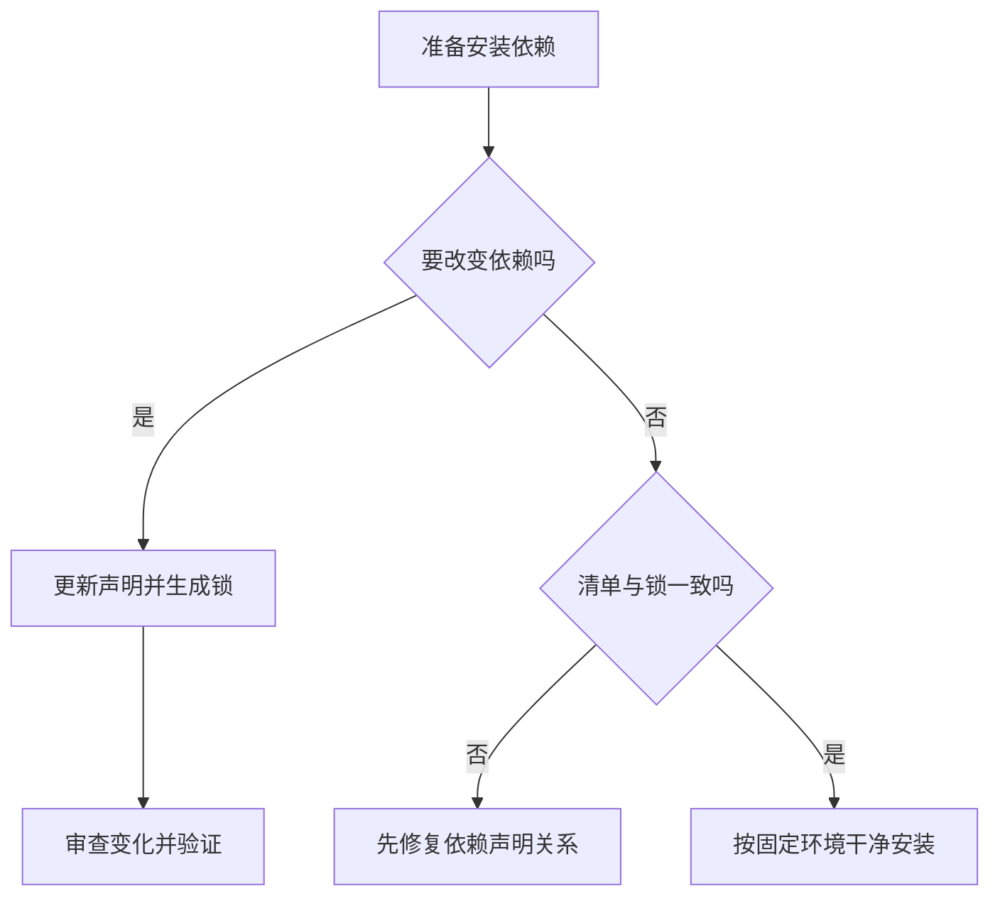

# 依赖、清单与锁文件

> 面向需要安装、交付或升级工程依赖的初学者和开发者。读完能区分依赖声明与解析结果，解释锁文件为何需要协作维护，并判断安装成功、可复现和安全各自还缺哪些条件。具体命令规则以 npm CLI v11 官方文档为例，其他工具应按各自规则核对。

## 依赖让项目复用能力，也引入外部变化

依赖是项目借用的外部代码或工具，例如解析文件的库、界面组件、编译器或测试框架。项目使用包 A，A 又使用包 B，B 继续使用其他包，就形成**依赖图**：节点是包，连接表示谁需要谁。

依赖数量不能仅从清单的几行判断。一个直接依赖可能带入许多传递依赖，同一个包也可能以多个版本出现在安装结果中。升级、许可和漏洞影响，需要沿真实依赖关系分析。

### 两个分类维度

“直接或传递”描述引入关系，“开发或运行”描述使用阶段；它们不是四个互斥类别。

| 分类维度 | 类型 | 判断方法 |
| --- | --- | --- |
| 引入关系 | 直接依赖 | 项目自己声明并需要的包 |
| 引入关系 | 传递依赖 | 由其他依赖继续引入的包 |
| 使用阶段 | 开发依赖 | 编译、检查、测试、生成文档等阶段所需 |
| 使用阶段 | 运行依赖 | 交付后的程序执行所需 |

在 npm 清单中，`dependencies` 和 `devDependencies` 分别表达常规依赖与开发工具依赖。构建工具常放在后者，但这不意味着它们只能在开发者电脑上安装：构建服务器同样可能需要它们。[npm 依赖声明](https://docs.npmjs.com/cli/v11/configuring-npm/package-json#devdependencies)

运行依赖是否需要在目标服务器单独安装，要看交付形态。浏览器库可能已经进入前端包；服务端代码可能保留外部模块引用。分类应依据实际产物与启动方式，不能仅凭“上线环境”决定全部省略开发依赖。

npm 还提供 `peerDependencies` 表达与宿主库的兼容关系，`optionalDependencies` 表达可以允许安装失败的依赖。后者缺失时仍需要程序自己处理降级，包管理器不会替业务保证功能。[npm 包清单](https://docs.npmjs.com/cli/v11/configuring-npm/package-json)

## 清单、锁文件与安装目录分工不同

**依赖清单**记录项目希望使用什么，以及允许的版本范围。例如 `^1.2.3` 表达一种版本范围，不表示永远取得同一版本。语义化版本用主、次、补丁版本传达兼容性意图，但发布者的声明不能代替项目回归验证。[npm 语义化版本说明](https://docs.npmjs.com/about-semantic-versioning)

**锁文件**记录包管理器解析出的具体依赖结果。npm 的根项目 `package-lock.json` 描述生成的依赖树，包含包位置及版本、来源、完整性等相关信息。它的用途是保存和审查解析结果，让后续安装不因依赖的新发布而无意改变版本。[npm 锁文件机制](https://docs.npmjs.com/cli/v11/configuring-npm/package-lock-json)

**安装目录**如 `node_modules/`，是当前机器上的实际文件结果，可能经历过安装、脚本加工或人工修改。仅复制某个人的安装目录，难以说明它如何生成，也容易混入平台差异。

| 对象 | 应保存的含义 | 它不能单独保证什么 |
| --- | --- | --- |
| `package.json` | 依赖意图、版本范围、工程动作 | 完整传递依赖永远保持相同 |
| `package-lock.json` | 一次确定的依赖解析结果 | 任意平台产生完全相同的文件和行为 |
| `node_modules/` | 当前环境已安装的包 | 来源清晰、内容未被改动、换机器可用 |
| 工具与环境说明 | Node.js、npm、安装配置等条件 | 外部资源始终可取得、业务自动正确 |

npm 官方建议将根锁文件提交到源码仓库，用于协作、部署和持续集成。`node_modules/.package-lock.json` 是 npm 优化本地树读取的隐藏记录，不能替代根锁文件。普通 `package-lock.json` 也不会随发布的库包传播给消费者；若讨论库的下游解析，应区分它与可发布的 `npm-shrinkwrap.json` 的规则。[npm 锁文件范围](https://docs.npmjs.com/cli/v11/configuring-npm/package-lock-json)

## npm install 与 npm ci 的实际机制

在 npm v11 文档所描述的规则下，无参数的 `npm install` 会比较清单与锁文件：锁中的版本满足清单范围时使用锁定版本；范围不匹配时重新解析满足范围的版本，并更新锁文件。因此“每次 install 都自动升级全部依赖”不准确，“有锁就绝不会改变”也不准确。[npm install](https://docs.npmjs.com/cli/v11/commands/npm-install)

`npm ci` 用于需要干净安装的场景。它要求已有锁文件；清单与锁不匹配时退出报错；已有 `node_modules` 会先被删除；它不修改清单或锁文件，也不能用来单独添加一个包。[npm ci](https://docs.npmjs.com/cli/v11/commands/npm-ci)

| 当前目的 | 更合适的做法 | 评审关注点 |
| --- | --- | --- |
| 新增或有意升级依赖 | 更新清单并让包管理器生成锁结果 | 新增来源、传递变化、兼容性 |
| 按已提交结果安装 | 使用匹配工具和配置的 `npm ci` | 清单与锁一致、环境可满足 |
| 安装报版本或兼容冲突 | 查冲突链和配置差异 | 不以删除锁或强制忽略冲突作为默认修复 |
| 合并后锁文件冲突 | 确认双方依赖意图，重新生成并审查 | 两边改动保留、无无意升级 |

这是一条协作决策路径，不能把“重新生成锁”理解为删除现有锁后任意重算。冲突解决应保留已确认的版本意图，并解释最终变更。[拉取请求流程](/software/collaboration/pull-request-workflow)可用于组织这类审查。

## 安装、构建与运行是三类动作

安装把依赖解析并准备到环境中；构建把工程输入转换为交付产物；运行启动或执行产物。三者有联系，但成功条件各不相同。

安装也可能执行生命周期脚本，例如 `install`、`postinstall`、`prepare`，具体受版本与配置影响；有些包还会编译原生模块或准备资源。由此，安装不是纯粹“下载文件”，也不是项目的完整构建与功能验收。[npm 生命周期脚本](https://docs.npmjs.com/cli/v11/using-npm/scripts)

虚构报名系统可能在构建时使用 TypeScript 编译器，在运行时使用服务端库，在管理员导出时才调用文件格式处理库。若先省略开发依赖、再要求现场编译，就可能缺少编译器；若某个运行库没有打包进产物，却被误放在开发依赖中，启动或某个功能分支可能失败。

`npm ci --omit=dev` 会省略开发依赖在磁盘上的安装，但相关依赖仍被解析并记录在锁文件中。因此锁文件中出现一个包，并不能证明它已实际安装。[npm ci 安装范围](https://docs.npmjs.com/cli/v11/commands/npm-ci#omit)

## 可复现需要固定哪些条件

可复现应先定义目标：相同依赖版本、相同产物字节，还是相同业务行为。锁文件主要减少依赖解析漂移，后两种目标需要额外验证。

| 条件 | 为什么影响结果 | 工程记录建议 |
| --- | --- | --- |
| 源码与清单、锁版本 | 工程输入不同会产生不同结果 | 关联同一提交中的文件 |
| Node.js 与 npm 版本 | 运行能力、锁格式与解析规则可能不同 | 固定并记录实际工具版本 |
| 安装配置 | 安装策略、peer 处理、链接和省略选项影响树 | 保存可共享的非敏感配置 |
| 操作系统、CPU 与原生环境 | 平台包、原生编译与系统库不同 | 明确支持平台及构建条件 |
| 包来源与可用性 | 锁指向的资源仍需可取得 | 记录仓库与访问方式，凭据另行管理 |
| 脚本、配置与外部输入 | 构建可能取用环境变量、远程资源或时间 | 限定输入，保留构建记录 |

npm 特别提示：若生成锁时使用了影响依赖树的选项，例如 `--legacy-peer-deps` 或 `--install-links`，执行 `npm ci` 时也需保持对应配置，否则可能报错。这是“同一个锁为什么仍装不上”的具体原因之一。[npm ci 配置要求](https://docs.npmjs.com/cli/v11/commands/npm-ci)

本地链接依赖还需要对应源码与目录存在。锁定一个链接位置，不会自动把被链接的全部文件变成不可变快照。跨机器交付应核对完整输入，而非只拷贝清单和锁。

## 安全与升级要覆盖整个使用链

完整性字段用于核对取得的包内容，不能证明该内容安全、许可适用或业务正确。锁住一个有漏洞的版本，只会稳定地保留那个版本。开发依赖同样可能在安装或构建时执行代码，也可能影响最终产物，不能因为不在生产启动时加载就忽略。

`npm audit` 根据提交给配置仓库的依赖描述获取已知漏洞报告；“没有报告”不等于不存在漏洞或恶意代码。应结合依赖来源、安装脚本、漏洞适用条件和真实使用路径判断影响。[npm audit](https://docs.npmjs.com/cli/v11/commands/npm-audit)

升级建议一次围绕一个明确原因：修补漏洞、支持目标环境或获得必要能力。先阅读上游变更和兼容说明，再审查清单与锁的差异，确认新增、删除和传递升级；随后完成干净安装、构建及关键功能回归，并保留可恢复的旧产物。

对报名系统，升级验证可以覆盖：满额拒绝、同一用户重复提交、取消后的状态变化、非管理员访问名单被拒绝、导出字段与格式不变。安装成功或普通页面能打开，都无法替代这些验收。

`npm audit fix` 会执行安装和修改依赖；带 `--force` 还可能应用超出声明范围的主版本更新。它是一次需要审查与回归的工程变更，不宜只看漏洞计数下降。[npm audit 修复规则](https://docs.npmjs.com/cli/v11/commands/npm-audit)

## 常见失败模式

| 现象 | 原因或误解 | 处理方向 |
| --- | --- | --- |
| 同事安装后出现不同版本 | 缺锁、清单变化或工具与配置不同 | 对照工程输入和解析条件 |
| 本机可用，干净环境缺包 | 代码直接使用了未声明的传递依赖 | 把真正使用的包声明为直接依赖 |
| `ci` 报清单与锁不一致 | 只修改或只提交了其中一份 | 恢复明确意图并生成匹配锁 |
| 安装成功，某个功能才失败 | 按需加载包缺失、可选依赖无降级 | 验证实际安装与功能分支 |
| 重装后补丁丢失 | 直接修改了安装目录中的第三方文件 | 使用可追踪的补丁或上游修复 |
| 强制安全修复后构建失败 | 引入不兼容版本或安装行为变化 | 审查更新范围并完成迁移 |

其他包管理器有各自的锁格式、布局、冻结安装和脚本策略。迁移工具应作为独立工程变更，核对官方机制及产物行为，不能把 npm 的命令规则当成所有生态的共同保证。

## 参考资料

<Refs>

- [npm CLI v11：package.json](https://docs.npmjs.com/cli/v11/configuring-npm/package-json)——依赖类型、版本声明、平台条件与本地路径（访问日期 2026-10-03）
- [npm：About semantic versioning](https://docs.npmjs.com/about-semantic-versioning)——版本与兼容性声明约定（访问日期 2026-10-03）
- [npm CLI v11：package-lock.json](https://docs.npmjs.com/cli/v11/configuring-npm/package-lock-json)——根锁范围、精确依赖树、来源、完整性及隐藏锁（访问日期 2026-10-03）
- [npm CLI v11：npm install](https://docs.npmjs.com/cli/v11/commands/npm-install) · [npm ci](https://docs.npmjs.com/cli/v11/commands/npm-ci)——清单与锁比较、干净安装与配置条件（访问日期 2026-10-03）
- [npm CLI v11：Scripts](https://docs.npmjs.com/cli/v11/using-npm/scripts)——生命周期脚本与安装阶段动作（访问日期 2026-10-03）
- [npm CLI v11：npm audit](https://docs.npmjs.com/cli/v11/commands/npm-audit)——已知漏洞报告与自动修复边界（访问日期 2026-10-03）
- 站内相关：[从源码到运行中的程序](/software/foundations/source-to-runtime) · [工程目录与配置](/software/toolchain/project-structure) · [拉取请求流程](/software/collaboration/pull-request-workflow) · [验收标准](/software/requirements/acceptance-criteria)

- 深入阅读：[可复现开发](/software/toolchain/reproducible-development) · [依赖供应链](/software/security/supply-chain) · [升级与兼容](/software/maintenance/upgrades-compatibility)

</Refs>
