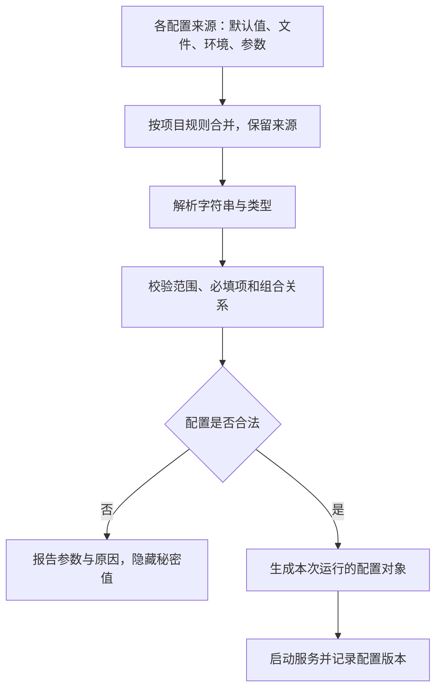

# 开发环境、环境变量与配置注入

> 面向需要让程序在本地、测试和交付环境正确运行的开发者。读完能区分开发环境与应用配置，解释环境变量如何进入进程，明确配置的覆盖顺序、读取时机和敏感信息边界。

## 环境提供执行条件，配置选择运行行为

**开发环境**包含操作系统、运行时、工具版本、依赖、外部服务和文件权限等条件。**应用配置**则描述程序在特定条件下如何运行，例如监听端口、服务地址、功能开关与连接超时。工具版本不兼容和配置值错误，都可能表现为“启动失败”，但解决方法不同。

Twelve-Factor 的 Config 原则把会随部署变化的数据库连接、凭据和公开主机名等参数与代码分离。它是适用于服务应用的设计原则，不意味着程序内部的路由关系、算法常量等都应改成环境变量。[Twelve-Factor Config](https://12factor.net/config)

设计配置时，应先说明变量对应哪项行为、由谁提供、何时生效和如何验证。把任意实现细节暴露为开关，会增加组合数量和维护负担；真正需要按部署变化的参数若写死在源码中，又会迫使每次换环境都修改代码。

| 对象 | 例子 | 管理重点 |
| --- | --- | --- |
| 开发工具条件 | 运行时、包管理器、编译器版本 | 固定支持范围与安装方法 |
| 非敏感应用配置 | 端口、超时、公开服务地址 | 类型、范围、默认值、覆盖规则 |
| 敏感配置 | 数据库密码、服务令牌 | 授权注入、隐藏输出与轮换 |
| 业务数据 | 报名记录、用户资料 | 数据生命周期、访问权限与备份 |
| 配置示例 | 参数名称与虚构值 | 说明契约，不包含真实凭据 |

业务数据通常不适合装进环境变量；复杂结构也可能更适合有明确模式的配置文件。选择载体要考虑大小、更新方式、审查和权限，不应仅凭“统一放一个地方”决定。

## 环境变量属于进程的启动条件

**环境变量**（Environment Variable）通常通过名称和值向进程传递信息。在 Linux 的进程环境机制中，新程序启动时取得环境，子进程继承父进程环境的副本。因此父进程之后修改自身环境，已运行子进程不会自动获得同步更新。[Linux environ](https://man7.org/linux/man-pages/man7/environ.7.html)

这能解释一个常见现象：在终端设置变量后启动程序有效，从早已打开的 IDE 启动却没有效果。两次启动来自不同父进程，继承链和工具的显式配置可能不同。应检查目标进程实际收到的非敏感值及来源，避免只检查当前终端。

`.env` 文件本身不会被所有程序自动读取。需要运行时、框架或加载器按自己的规则解析。Node.js 文档明确说明 `.env` 没有跨工具统一的正式规范，并为 Node.js 定义自己的规则；不能假设所有加载器都支持相同引号、插值和覆盖行为。[Node.js 环境变量](https://nodejs.org/api/environment_variables.html)

在 Node.js 的 `.env` 解析中，值作为字符串提供，`true`、`0` 或 JSON 形状的内容不会自动变成布尔值、数字或对象。`"false"` 是非空字符串，在某些语言的真值判断中会被视为真，这与“关闭开关”的业务意图不同。[Node.js 值的解释](https://nodejs.org/api/environment_variables.html)

环境变量也不是秘密保险箱。拥有相应权限的进程、管理工具或调试设施可能读取它们；日志和错误报告更可能意外展开配置。秘密是否安全取决于获取、传递、使用和输出的整个路径，详见[密钥、权限与身份](/software/security/secrets-permissions)。

## 覆盖顺序必须可解释

项目可能同时使用默认值、通用文件、环境专用文件、系统环境和命令参数。**配置优先级**应是明确的项目契约，而非依赖开发者记住工具的隐含行为。

例如 Node.js 的 `--env-file` 从相对当前工作目录的路径读取文件，已有进程环境中的同名值优先于文件；传入多个文件时，后面的文件覆盖前面文件中的同名值。这是 Node.js 该选项的规则，不能直接推广到其他加载器。[Node.js --env-file](https://nodejs.org/api/cli.html#--env-filefile)

以下是一个虚构服务的设计规则，并非通用标准：应用默认值 → 基础配置文件 → 部署环境变量 → 明确允许的启动参数。每一步仅覆盖自己声明的参数，最终输出非敏感参数的有效值及来源。若工具先做了一轮加载，再由应用做第二轮合并，应把两层规则一起记录。



覆盖能带来灵活性，也可能让旧变量悄悄遮住新文件中的值。配置排障应追踪“最终值从哪里来”，而不是不停修改某份未被采用的文件。记录来源比打印所有变量更有效，也更容易避免敏感信息泄露。

## 把文本输入转成经过验证的配置

在应用入口集中完成解析与校验，再向业务模块传递类型明确的配置对象，能避免每个模块各自解释同一个变量。业务模块无需到处读取全局环境，也便于测试提供独立配置。

| 参数类型 | 必要校验 | 常见错误 |
| --- | --- | --- |
| 布尔值 | 允许的文字集合与大小写规则 | 用非空字符串判断，导致 `false` 开启功能 |
| 整数 | 完整解析、上下界、单位 | 宽松解析接受 `3000abc`，或把秒当毫秒 |
| 地址 | 协议、主机、必要路径和使用场景 | 把浏览器公开地址当作服务监听地址 |
| 枚举 | 明确允许值 | 拼写错误悄悄进入默认分支 |
| 必填秘密 | 是否存在及可取得 | 回退到写死凭据或输出原值诊断 |
| 组合参数 | 跨字段约束 | 开启功能但缺少所需后端配置 |

缺失、空字符串和显式零值要分别处理。超时 `0` 可能代表禁用超时，也可能不合法，必须由契约决定。不能用简单的“值为空就默认”同时处理所有情况。

下面是虚构的本地参数样例，未执行，未包含凭据。它只演示名称、单位和解析约定，实际项目应自行定义合法范围。

```dotenv
APP_PORT=3000
REQUEST_TIMEOUT_MS=5000
FEATURE_EXPORT=false
PUBLIC_ORIGIN=http://localhost:3000
```

应用可以规定：端口为合法整数；超时为正整数毫秒；功能开关只接受 `true` 或 `false`；公开地址必须带协议。启动失败信息可以写“REQUEST_TIMEOUT_MS 应为正整数毫秒，来源为部署环境”，无需打印全部环境，更无需展开密码。

对关键配置采用启动时失败，通常比运行数小时后才在某条路径发现错误更容易修复。可选能力则可明确降级并告知状态。不能把缺少测试数据库配置自动解释为连接生产数据库。

## 注入时机决定何时能改变行为

同名变量在不同阶段出现，含义可能完全不同。**构建时配置**进入生成产物，**启动时配置**由新进程读取，**请求时配置**在处理请求时取用，**动态配置**则通过明确的刷新机制改变运行状态。

| 时机 | 示例 | 更新后怎样生效 |
| --- | --- | --- |
| 构建时 | 前端公开 API 地址被写入脚本 | 通常重新构建并发布产物 |
| 启动时 | 服务监听端口、初始连接配置 | 通常重新启动或部署进程 |
| 请求时 | 从租户配置中读取功能规则 | 下一次读取是否更新取决于缓存 |
| 动态刷新 | 运行中替换限流配置快照 | 依刷新、校验和传播规则 |

Vite 会把暴露给客户端的环境变量用于前端代码，其中 `VITE_*` 不应包含敏感信息，因为它们会进入客户端包。这类变量即使放在本地 `.env` 文件中，也不会因文件未提交就保持秘密。[Vite 环境变量与模式](https://vite.dev/guide/env-and-mode)

浏览器无法直接读取服务器进程的任意环境变量。若希望同一前端产物适配不同部署，可以设计运行时读取的公开配置文件或接口，并明确缓存、加载失败与版本兼容规则。仅修改服务器环境，再期待已构建脚本中的地址改变，缺少了实际读取路径。

动态配置还需要处理一致性。逐字段更新可能出现“新开关搭配旧地址”的中间组合；较稳妥的设计是校验完整新配置，再切换带版本的快照，并规定一次请求是否保持同一版本。数据库连接、监听地址等资源也可能需要重新创建，不能把任意变量都宣传为支持热更新。

## 用配置来源定位环境差异

假设报名服务本地能访问，测试环境请求却超时。先区分是否已成功启动，再核对监听地址、端口、请求目标和超时单位；随后检查网络与依赖服务，而不是立即调大超时。配置错误和网络故障可以同时存在。

| 现象 | 可检查的因果链 | 修复方向 |
| --- | --- | --- |
| 改文件后行为没变 | 文件未加载、被覆盖或值已写入产物 | 确认来源与注入阶段 |
| IDE 与终端结果不同 | 父进程环境、工作目录或参数不同 | 对齐启动条件并记录 |
| 关闭开关后仍生效 | 字符串未按布尔规则解析 | 集中解析并验证允许值 |
| 多个测试互相干扰 | 共享端口、目录、数据库或全局环境 | 提供独立资源和显式配置 |
| 配置刷新后偶发失败 | 部分字段更新、旧资源未切换 | 校验快照并设计资源生命周期 |
| 错误报告带出令牌 | 日志打印了完整配置 | 按参数分类隐藏输出并处置泄露 |

团队应保存可公开的配置样例、字段契约和获取授权的方法。真实秘密在授权渠道注入；有效配置记录保留来源与版本，敏感字段只保留必要状态。这样，新开发者能解释环境差异，运维人员也能追踪一次配置变更为什么改变了程序行为。

## 参考资料

<Refs>

- [Linux man-pages：environ(7)](https://man7.org/linux/man-pages/man7/environ.7.html)——进程环境与继承机制（访问日期 2026-10-03）
- [Node.js：Environment Variables](https://nodejs.org/api/environment_variables.html)——Node.js 的 `.env` 规则及字符串值（访问日期 2026-10-03）
- [Node.js CLI：--env-file](https://nodejs.org/api/cli.html#--env-filefile)——文件路径、覆盖顺序与启动环境（访问日期 2026-10-03）
- [Vite：Env Variables and Modes](https://vite.dev/guide/env-and-mode)——客户端暴露与构建阶段的环境变量（访问日期 2026-10-03）
- [The Twelve-Factor App：Config](https://12factor.net/config)——随部署变化的配置与代码分离（访问日期 2026-10-03）
- 站内相关：[工程目录与配置](/software/toolchain/project-structure) · [网络地址、端口与连接](/software/foundations/network-addresses-ports) · [密钥、权限与身份](/software/security/secrets-permissions) · [可复现开发与团队约定](/software/toolchain/reproducible-development)

</Refs>
