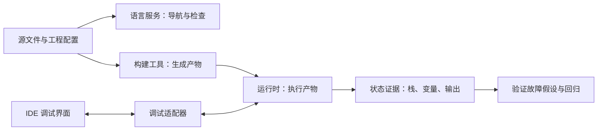

# IDE、调试与开发工具

> 面向开始独立开发、需要解释程序实际行为的学习者和开发者。读完能区分编辑、检查、构建与调试工具，建立正确的调试目标，并用断点、调用栈和变量证据验证故障假设。

## IDE 把工具连接起来，程序仍有自己的执行环境

**集成开发环境**（Integrated Development Environment，IDE）把编辑、导航、检查、运行和调试等能力放在同一个工作界面。看到补全提示，不代表程序已经执行；点击运行，也不代表一定执行当前打开的文件。

编辑器可以通过语言服务识别符号、类型和引用，通过任务调用编译器或测试工具，通过调试适配器连接运行时。每一环都有独立的配置和成功条件。理解这条链，才能判断错误提示究竟来自哪里。

| 能力 | 它回答的问题 | 结果的边界 |
| --- | --- | --- |
| 搜索与代码导航 | 定义在哪、哪些地方引用它 | 动态加载和生成代码可能无法完整解析 |
| 语言与静态检查 | 源码是否符合可检查的规则 | 不能覆盖所有实际输入与业务要求 |
| 构建任务 | 是否生成目标产物 | 成功不等于关键功能已验证 |
| 调试器 | 这次执行到了哪里、当时状态是什么 | 观察的是特定执行与环境 |
| 测试工具 | 给定输入下是否满足断言 | 有效性取决于用例与断言 |
| 性能分析工具 | 时间或资源主要花在哪里 | 需要代表性负载与可信采样 |

调试器并非由编辑器单独实现。**调试适配协议**（Debug Adapter Protocol，DAP）把开发界面与适配器的交互标准化，适配器再与具体运行时通信。不同适配器声明不同能力，协议中存在某种操作，并不表示每种语言都支持它。[DAP 工作机制](https://microsoft.github.io/debug-adapter-protocol/overview)

选择工具时，先看它能否覆盖项目语言、目标运行环境、团队维护方式和所需调试能力。扩展数量或界面复杂程度都不能直接代表适合程度。扩展与工程任务还可能运行代码，应审查来源和工作区配置，尤其在接手陌生项目时。

## 第一个调试问题是“正在执行哪个程序”

一个仓库可能包含网页、服务端、后台任务和测试。浏览器中加载的是生成的 JavaScript，服务端可能运行另一份目录下的产物；编辑器当前文件与实际执行入口之间必须建立明确关系。

调试通常有两种启动方式：**启动**（launch）由调试流程启动目标；**附加**（attach）连接已运行的目标。DAP 对这两种关系作了区分，但入口、参数和环境的具体字段由适配器规定。[DAP 启动与附加](https://microsoft.github.io/debug-adapter-protocol/overview)

建立目标时，应核对入口或进程身份、工作目录、启动参数、配置来源、运行时版本，以及执行的是源码还是编译产物。对多服务项目，还要确认请求真正到达哪个实例。否则断点没有命中，可能只是请求走向了另一份程序。

VS Code 的简单程序可以直接开始调试；需要自定义入口、参数和环境时，通常使用 `launch.json`。这些是 VS Code 的具体机制，其他 IDE 应核对自己的配置规则。[VS Code 调试配置](https://code.visualstudio.com/docs/debugtest/debugging)

“终端能启动，调试器启动失败”常与工作目录、参数或环境继承不同有关。先对比两次启动的有效条件，再调整配置。反复重装编辑器往往无法改变程序读取了错误配置这一事实。配置来源的定位方法见[开发环境、环境变量与配置注入](/software/toolchain/environment-configuration)。

## 断点、调用栈与变量共同解释状态

**断点**（Breakpoint）请求目标在特定位置或条件下暂停。源码上的标记不一定已绑定到可执行位置：目标尚未加载文件、路径不匹配或源码映射有误，都可能导致断点未验证。DAP 允许适配器先返回 `verified: false`，后续再更新状态，不能把界面有标记当作绑定成功。[DAP 断点状态](https://microsoft.github.io/debug-adapter-protocol/overview)

暂停后，先确认当前线程或执行目标，再读**调用栈**（Call Stack）：当前帧说明正在执行的函数，上层帧帮助解释调用来源。切换栈帧后显示的局部变量属于那个帧，不能把不同帧中的同名变量混作同一对象。

| 操作 | 典型目的 | 需要注意 |
| --- | --- | --- |
| 继续执行 | 前往下一个停止事件 | 下一次停止可能来自异常或其他断点 |
| 单步跳过 | 执行当前语句，观察前后状态 | 被调用函数通常仍然执行，只是不逐步进入 |
| 单步进入 | 追踪调用内部的变化 | 可能进入库代码、生成代码或异步调度 |
| 单步跳出 | 完成当前函数后观察调用方 | 返回前的副作用仍然可能发生 |
| 条件断点 | 在特定输入或状态下停止 | 表达式能力与求值开销依适配器而异 |
| 日志断点 | 记录经过某位置时的信息 | 能力依工具而异，输出也可能泄露敏感字段 |

VS Code 文档描述了上述单步操作和不暂停执行的日志断点；具体可用项仍取决于调试器。[VS Code 调试操作](https://code.visualstudio.com/docs/debugtest/debugging)

观察变量也有边界。展开属性或执行监视表达式，可能触发访问器、函数求值或其他副作用；在调试控制台执行修改操作更会直接改变目标状态。优先读取简单值，记录取证动作，避免把人为改出的成功状态当作程序已经修复。

异步执行、多线程和多进程不会天然形成一条完整的同步调用栈。某些运行时提供异步栈关联，仍需结合任务标识、请求日志与时间关系理解因果。DAP 中的栈帧与变量引用也依赖暂停状态，恢复执行后不能继续假定它们有效。[DAP 暂停状态](https://microsoft.github.io/debug-adapter-protocol/overview)

## 源码映射必须对应实际运行产物

**源码映射**（Source Map）把生成代码的位置关联到原始源码。它帮助调试器把产物中的执行位置映射回 TypeScript 等源文件，但不会让过期产物自动变成新代码。

在 VS Code 的 Node.js 调试中，编译器需要生成映射；`outFiles` 用来指定生成的 JavaScript 文件范围，而非 `.map` 文件范围。多步转换还需要各环节保留可衔接的映射，否则可能只能定位到中间产物。[VS Code Node.js 源码映射](https://code.visualstudio.com/docs/nodejs/nodejs-debugging)

例如源文件修改后没有重建，运行时仍执行昨天的产物，IDE 却打开今天的源码。此时行号与变量变化可能看似矛盾。应核对运行文件路径、生成时间或版本关联、对应映射文件及映射中的源路径，再判断是代码故障还是调试关联故障。

优化、压缩、内联和原生编译也可能改变可观察的位置或变量。一次单步不必然对应一行原始源码。需要精确定位时，应按工具支持采用合适的调试构建，并保留与故障产物对应的符号或映射。

## 用一次具体故障串起调试流程

假设一个虚构报名系统在同一用户重复提交时占用了两个名额。以下是分析示例，未运行程序，也没有真实调试结果。

先把期望写成可验证条件：“已有有效报名的用户再次提交，返回已有结果，名额不再减少。”固定一个已报名用户、一场活动和一个请求，记录数据初始状态。若原问题只在并发请求下出现，则顺序重复与并发重复是两个不同用例。

接着提出可区分的假设：请求中的用户标识不同；查询条件遗漏活动标识；查重发生在名额更新之后；两个并发请求都读到旧状态。先在入口读取规范化后的标识，再在查重结果和名额变更附近观察，减少无目的的单步。

若看到查询返回已有报名，但代码仍进入名额变更分支，就有了控制流证据；若顺序请求正确、并发请求出错，暂停某个请求可能改变竞争窗口，需转向并发用例、事务日志和同步机制分析。断点观察到的单次状态不能证明全部并发情况。

确认原因后修改实现，再把期望转成稳定的回归用例，同时验证首次报名与满额拒绝等相邻行为。调试用于形成并检验解释，测试用于持续检查修复效果，二者分工见[调试与缺陷定位](/software/quality/debugging-defects)。

## 调试会改变时序，也需要访问边界

暂停线程可能改变超时、锁竞争、心跳和调用方重试。评估延迟或复现偶发竞争时，应使用合适的日志、跟踪或性能采样，并记录观测成本。带断点的运行时间不能直接作为正常性能结果。

调试接口还具有高权限。Node.js 官方说明 Inspector 客户端可以访问执行环境并运行任意代码；默认监听回环地址，将它绑定到公开地址需要严格控制访问。[Node.js 调试安全](https://nodejs.org/learn/getting-started/debugging)

| 现象 | 优先核对 | 后续动作 |
| --- | --- | --- |
| 断点一直未绑定 | 目标、加载文件、产物与映射 | 修正关联后再次确认绑定 |
| 只在 IDE 中失败 | 工作目录、参数、环境、运行时 | 对齐可解释的启动条件 |
| 暂停后错误消失 | 竞争、超时和观测扰动 | 用可重复负载及非暂停证据调查 |
| 修改变量后功能正常 | 人为状态改变了哪条路径 | 修复源码并从初始条件回归 |
| 跨服务栈无法连起来 | 目标实例与请求关联标识 | 联合日志和调用跟踪分析 |

保留最小复现输入、有效启动条件、关键状态与回归依据，比保存大量没有上下文的截图更利于协作。交接时也应说明哪些条件已验证、哪些仅是假设，帮助下一位开发者继续推理。

## 参考资料

<Refs>

- [VS Code：Debugging](https://code.visualstudio.com/docs/debugtest/debugging)——启动配置、断点、单步与日志断点（访问日期 2026-10-03）
- [VS Code：Node.js debugging](https://code.visualstudio.com/docs/nodejs/nodejs-debugging)——源码映射、生成文件定位与 Node.js 调试配置（访问日期 2026-10-03）
- [Microsoft：Debug Adapter Protocol overview](https://microsoft.github.io/debug-adapter-protocol/overview)——界面、适配器与运行时关系，能力协商及暂停状态（访问日期 2026-10-03）
- [Node.js：Debugging](https://nodejs.org/learn/getting-started/debugging)——Inspector 的执行权限与监听地址安全边界（访问日期 2026-10-03）
- 站内相关：[从源码到运行中的程序](/software/foundations/source-to-runtime) · [工程目录与配置](/software/toolchain/project-structure) · [构建工具链与制品](/software/toolchain/build-artifacts) · [调试与缺陷定位](/software/quality/debugging-defects)

</Refs>
