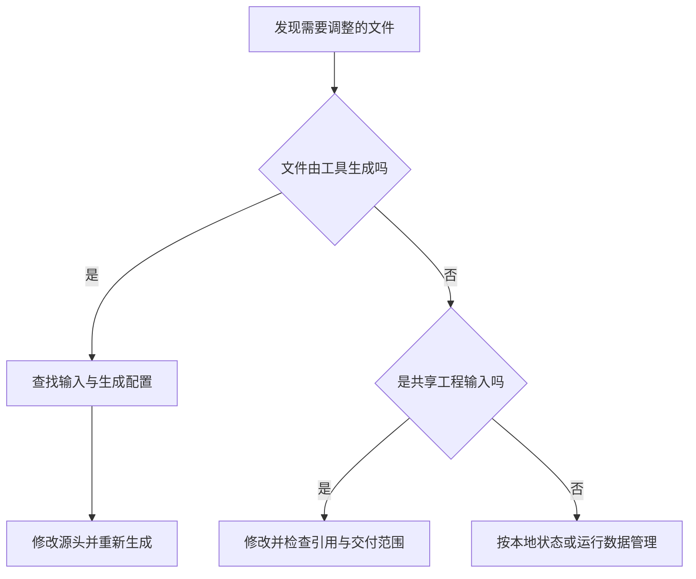

# 工程目录与配置

> 面向第一次接手代码库的开发者，以及需要判断改动范围的产品与协作人员。读完能通过文档、配置和入口读懂一个工程，区分源码、测试、资源与生成物，并判断目录布局是否真正表达了职责和交付边界。

## 目录树是地图，配置决定实际路线

软件工程包含可执行逻辑，也包含依赖说明、工具配置、测试、资源与协作说明。目录帮助人定位这些内容，配置告诉工具从哪里读取、怎样处理、输出什么。

`src/`、`tests/`、`dist/` 都是常见名称，但单凭名称不能认定它们一定参与构建、测试或部署。一个文件是否会被使用，还要看入口、模块引用、工具扫描规则和发布范围。某些框架约定目录具有特殊意义，另一些工程允许自由指定。

因此，读工程需要同时看两张地图：**物理地图**描述文件放在哪里，**执行地图**描述工具和程序实际读取了哪些文件。二者不一致时，才会出现“文件明明在这里，却没有生效”或者“以为不会发布，却进入了产物”的问题。

## 先分辨文件的角色

| 内容 | 作用与典型位置 | 修改与协作原则 |
| --- | --- | --- |
| 源码 | 业务逻辑、页面、接口，常放 `src/` | 修改源头，并检查受影响的调用与验证 |
| 测试与样本 | 验证规则、准备输入，可独立或贴近源码 | 保留与被测功能的对应关系，样本使用虚构数据 |
| 静态资源 | 图片、样式、下载模板等 | 核对构建处理与公开访问范围 |
| 配置 | 编译、测试、打包、启动与工具选项 | 说明适用范围，避免互相覆盖却无人知晓 |
| 脚本 | 代码生成、检查、打包等工程动作 | 看清输入、输出、工作目录和副作用 |
| 文档 | 目标、使用方法、结构与决策理由 | 随行为变化同步，说明例外与边界 |
| 生成物 | 构建产物、覆盖率报告、生成代码等 | 查明生成来源，通常避免直接修改 |
| 本地状态 | 缓存、已安装依赖、临时导出等 | 与长期维护的工程输入分开 |

“生成物通常不直接改”是工程建议，不意味着生成物永远不能入库。发布包、生成的接口客户端或离线交付资料，可能需要受版本管理；此时应写清生成工具、源输入和更新方式。决定是否提交，要看协作与交付要求，而不是按扩展名一刀切。

下图用于接手未知文件时判断修改位置。



## 一个可解释的示意布局

下面以虚构的小型活动报名系统为例。它包含活动列表与详情、报名与取消、管理员名单与导出。示意采用浏览器端与服务端共用一个仓库，语言与文件名仅用于表达关系，不是一套可直接运行的应用。

```text
registration/
├── README.md                 # 目标、启动与验证入口
├── docs/
│   ├── architecture.md       # 边界与依赖方向
│   └── acceptance.md         # 容量、重复提交与权限条件
├── src/
│   ├── client/               # 浏览器页面与交互
│   │   └── main.ts
│   ├── server/               # 服务端入口与业务模块
│   │   ├── main.ts
│   │   ├── registrations/    # 报名与取消规则
│   │   └── admin/            # 名单查询与导出入口
│   └── shared/               # 明确允许共享的类型或规则
├── tests/                    # 功能与边界验证
├── public/                   # 明确可公开的静态资源
├── scripts/                  # 工程辅助动作
├── package.json              # 依赖声明与工程脚本
├── package-lock.json         # npm 依赖解析记录
├── tsconfig.json             # TypeScript 配置入口
├── .env.example              # 配置项示例，不含真实密钥
├── .gitignore
├── node_modules/             # 本地安装生成
└── dist/                     # 构建生成，不在此手改业务
```

前后端可以使用各自配置，由总脚本编排；规模增长后也可以改为多个包。此目录树不规定固定分层：小模块把相关文件放在一起，常比为每个功能复制大量空目录更容易理解。

`shared/` 应有明确准入条件。例如请求和响应的数据结构可以共享；数据库凭据、仅服务端可执行的导出逻辑不应因为“复用方便”进入浏览器构建。前端显示的剩余容量不能代替服务端的权威容量校验，管理员页面目录也不能代替接口授权。

## 四种边界不能只靠文件夹判断

| 边界 | 它回答的问题 | 可以检查的依据 |
| --- | --- | --- |
| 模块边界 | 谁可以调用谁，哪些接口公开 | 模块引用、公开接口、依赖方向 |
| 包边界 | 哪些代码作为一个可安装单元 | 包清单、包入口、工作区配置 |
| 构建边界 | 哪些输入一起产生什么产物 | 构建脚本、入口、配置与资源规则 |
| 部署边界 | 哪些产物一起启动、发布或回滚 | 启动与发布配置、运行环境 |

在 Node.js 中，包的 `exports` 可以限定通过包名导入的公开入口，减少对内部文件的依赖；官方也说明它不是强安全隔离，直接使用绝对路径仍可能装载内部文件。不要把接口封装当成文件权限控制。[Node.js 包接口](https://nodejs.org/api/packages.html#package-entry-points)

npm 工作区可以在同一工程中识别和连接多个本地包，但“多个包”本身并不保证独立部署，也不要求必须拆成微服务。[npm 工作区配置](https://docs.npmjs.com/cli/v11/configuring-npm/package-json#workspaces) 从进程内调用演进到服务间调用的成本，可另读[微服务治理](/cloud/native/microservice)。

按技术层组织适合统一处理基础机制，按功能组织适合围绕一次业务变更定位相关代码。二者可以组合。判断布局的工程依据是：一次报名规则变更能否找到完整影响范围，关键约束是否存在清晰归属，调用关系是否允许独立理解；目录是否整齐只是辅助信号。

## 配置如何改变工程行为

### 脚本名称需要读实际定义

`build`、`dev`、`test` 是常见脚本名称，含义仍由项目定义决定。npm 的 `scripts` 支持自定义动作及对应前后钩子，例如一个构建动作可能在执行前生成接口文件、执行后复制资源。现代 npm 的脚本从对应包根目录执行，多包工程中也要识别是哪个包的根目录。[npm 脚本文档](https://docs.npmjs.com/cli/v11/using-npm/scripts)

读配置时应把脚本展开为“输入 → 动作 → 输出”，特别核对是否访问网络、清空目录或依赖本地状态。测试命令存在不意味着构建一定调用了它；目录名为 `tests` 也不意味着全部测试都会被发现。

### 编译范围、输出位置与模块映射各有规则

TypeScript 的 `tsconfig.json` 指定项目的根文件与编译选项，可以从其他配置继承。读取当前文件时，还需追踪被继承的设置。[TypeScript 项目配置](https://www.typescriptlang.org/docs/handbook/tsconfig-json.html)

其中有三个容易误解的边界：`rootDir` 影响输出目录组织，不决定全部编译输入；`exclude` 影响 `include` 的扫描，文件仍可能因导入进入编译；`paths` 辅助解析模块映射，不自动改写输出中的引用。编辑器能识别别名，运行环境仍可能找不到它。[TSConfig 选项说明](https://www.typescriptlang.org/tsconfig/)

### 资源与环境配置可能进入公开产物

资源的归属由工具规则决定。例如 Vite 处理通过源码引用的资源，通常纳入构建资源图；`public` 中的资源按原样复制到产物根目录。放入 `public` 应意味着准备让它公开，而非仅仅“代码里暂时用不上”。[Vite 资源处理](https://vite.dev/guide/assets.html)

同样，环境变量不天然保密。Vite 的 `VITE_*` 变量会在构建时进入客户端代码，不能承载服务端密钥。工程应区分可公开的客户端配置、仅服务端读取的配置及本地示例。[Vite 环境变量](https://vite.dev/guide/env-and-mode)

`.gitignore` 控制未跟踪文件的忽略，不决定构建或发布范围，也不会让已跟踪的文件自动退出版本管理。因此“被 Git 忽略”不能用来证明“不会公开”。[Git 忽略规则](https://git-scm.com/docs/gitignore)

## 用文档与一条功能链读懂项目

建议先读 README 中的目标、环境和命令，再对照包清单与工具配置定位入口。随后选择一条功能链，例如“报名提交”，沿页面、请求处理、规则与写入位置追踪，最后阅读对应验收条件和测试。这样可以发现目录表面没有显示的耦合。

维护文档时至少交代：项目边界与非目标、目录角色、启动和构建入口、配置来源、关键业务约束、验证方法以及产物交付方式。文档应允许新协作者辨认源输入和生成结果，无需依赖某个人口头解释。

以下检查表是阅读与评审建议，不代表示意工程已通过验证。

| 检查点 | 可接受的证据 | 常见失败模式 |
| --- | --- | --- |
| 新协作者能定位报名规则 | 文档与引用指向明确模块 | 规则散落在页面、工具函数和管理员入口 |
| 生成结果可更新 | 已记录生成来源与步骤 | 手改 `dist`，下一次构建覆盖修复 |
| 测试范围明确 | 测试发现规则与关键验收对应 | 测试文件存在，实际命令没有运行它 |
| 浏览器与服务端边界明确 | 构建入口和共享内容可检查 | 服务端库或秘密误进入前端产物 |
| 配置变更可预测 | 继承、环境优先级与作用阶段有说明 | 修改一个根配置意外影响所有包 |
| 交付内容可追踪 | 源码版本、构建记录与发布范围关联 | 工作目录、仓库与发布目录混用 |

目录调整也会改变引用路径、配置扫描和脚本输入。重命名完成后应按影响范围核对这些关系，不能仅以编辑器里“移动成功”作为变更完成的证据。

## 参考资料

<Refs>

- [npm：Scripts](https://docs.npmjs.com/cli/v11/using-npm/scripts) · [package.json Workspaces](https://docs.npmjs.com/cli/v11/configuring-npm/package-json#workspaces)——脚本执行规则与多包识别（访问日期 2026-10-03）
- [TypeScript：What is a tsconfig.json](https://www.typescriptlang.org/docs/handbook/tsconfig-json.html) · [TSConfig Reference](https://www.typescriptlang.org/tsconfig/)——项目输入、输出与模块解析规则（访问日期 2026-10-03）
- [Node.js：Modules: Packages](https://nodejs.org/api/packages.html)——包入口、公开接口与封装边界（访问日期 2026-10-03）
- [Vite：Static Asset Handling](https://vite.dev/guide/assets.html) · [Env Variables and Modes](https://vite.dev/guide/env-and-mode)——资源交付与客户端变量公开范围（访问日期 2026-10-03）
- [Git：gitignore](https://git-scm.com/docs/gitignore)——忽略规则与已跟踪文件的区别（访问日期 2026-10-03）
- 站内相关：[软件项目总览](/software/guide/software-project-overview) · [文件、路径与权限](/software/foundations/files-paths-permissions) · [依赖与锁文件](/software/toolchain/dependencies-lockfiles) · [Git 仓库模型](/software/collaboration/git-repository-model)

- 深入阅读：[模块与接口边界](/software/architecture/modules-interfaces) · [构建工具链与制品](/software/toolchain/build-artifacts)

</Refs>
