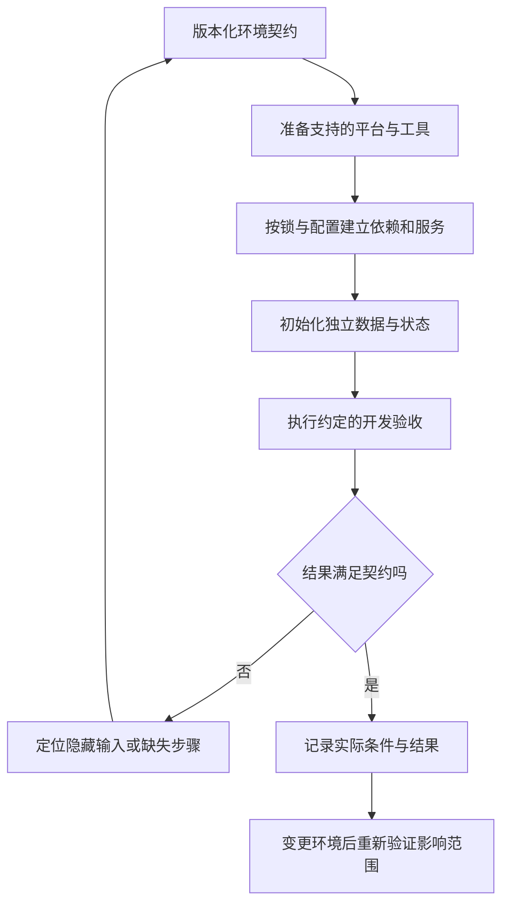

# 可复现开发与团队约定

> 面向需要让多人稳定接手、开发和验证同一工程的团队。读完能定义复现目标，选择合适的环境管理方式，建立版本化约定，并通过新环境验收发现对个人机器状态的依赖。

## 先定义团队需要复现什么

**可复现开发**不是复制一台电脑的所有文件，而是让另一位开发者在已声明条件下完成必要的工程动作，并获得可解释的结果。复现目标不同，需要控制的条件也不同。

| 目标 | 希望保持一致的内容 | 还需要验证什么 |
| --- | --- | --- |
| 依赖复现 | 解析到同一组依赖版本 | 工具、平台和安装配置 |
| 开发环境复现 | 具备约定工具与服务条件 | 初始化、权限、路径和资源 |
| 行为复现 | 代表性用例产生约定结果 | 输入数据、时间、外部服务和断言 |
| 制品复现 | 指定输出逐字节一致 | 完整构建输入与实际比较 |

能启动程序，说明一条运行路径已经可用；并不能证明所有开发任务、测试或交付动作都可完成。锁文件和容器能约束一部分条件，复现效果仍应通过目标动作验收。制品的严格定义见[构建工具链与制品](/software/toolchain/build-artifacts)。

团队约定的价值在于减少不可见差异，让人能解释“为什么同一操作在两台机器上得到不同结果”。若没有说明支持的平台和验收范围，“任何电脑都能完全一样”难以成为可检查的承诺。

## 环境契约要描述输入与动作

**环境契约**是一份可以被审查和版本化的条件说明：工程需要什么，由什么方式准备，如何启动和验证，失败时检查哪里。README、版本文件、配置样例与初始化脚本可以共同承担它，不必把所有内容挤进一份长文档。

| 契约项 | 应记录的信息 | 遗漏后的典型问题 |
| --- | --- | --- |
| 源码与依赖 | 提交、清单、锁文件与安装策略 | 各人得到不同解析结果 |
| 工具 | 运行时、包管理器、编译器支持范围 | 同名命令实际行为不同 |
| 平台 | 操作系统、架构及必要系统库 | 原生依赖或脚本不兼容 |
| 外部服务 | 所需服务版本、地址与准备方法 | 本机暗中连接旧服务 |
| 配置 | 字段、单位、默认值与授权注入方式 | 同名参数被不同来源覆盖 |
| 数据与状态 | 模式、迁移、虚构种子数据与清理范围 | 空库无法运行，旧库掩盖缺陷 |
| 工程动作 | 安装、启动、检查、测试、构建的入口 | IDE 私有任务成为唯一入口 |
| 验收 | 预期输出、通过条件和已知限制 | “没报错”成为唯一成功标准 |

版本约定应区分精确值与支持范围。例如某工具允许一段版本范围，团队仍需记录实际验收版本；若要求精确版本，应同时说明如何取得和更新。需要授权的包或服务应记录获取渠道，不把个人令牌写入共享文件。

初始化最好明确区分“准备工具”“创建本地数据”“执行迁移”和“启动服务”。重复运行初始化时，是跳过已完成动作、校验状态还是重建数据，应提前约定；不能把清空目录或数据库隐藏在看似普通的启动步骤中。

## 选择环境方式，要匹配差异来源

版本管理工具适合在宿主环境切换语言运行时；开发容器适合把用户空间工具和依赖集中管理；虚拟机可以提供另一套操作系统环境。三者覆盖的边界不同。

| 方式 | 常见适用情况 | 仍需单独管理 |
| --- | --- | --- |
| 宿主工具与版本管理 | 工具较少、与本机界面结合紧密 | 系统库、路径、多个项目的配置差异 |
| 开发容器 | Linux 工具链、多项目隔离、统一服务组合 | 宿主资源、挂载目录、网络与架构 |
| 虚拟机 | 需要指定操作系统或更完整系统条件 | 镜像更新、资源成本和数据共享 |
| 远程开发环境 | 工程资源集中、终端能力有限 | 网络、授权、服务状态与费用管理 |

先找影响项目的实际差异，再选择成本合适的方式。仅为统一缩进引入整套虚拟机，或仅固定运行时就期待所有原生库一致，都会使方案与问题错位。环境管理方式也需要团队能维护，而非依赖一个人记住特殊步骤。

VS Code 的 Dev Containers 使用 `.devcontainer/devcontainer.json` 或根目录 `.devcontainer.json` 描述开发容器，可基于镜像、Dockerfile 或 Compose，并配置扩展和创建后的准备命令。这些文件描述如何构建或进入开发环境，仍需配合项目的运行与验收契约。[VS Code 开发容器](https://code.visualstudio.com/docs/devcontainers/containers)

## 容器减少差异，输入仍需约束

开发容器配置可能在创建时下载工具、安装依赖或执行脚本。若脚本总是取远端最新版本，或在已有卷中保留旧状态，同一配置文件仍可能得到不同结果。应记录镜像、安装来源、版本、挂载和数据卷生命周期。

镜像标签可以被更新；按摘要固定镜像能约束实际镜像内容。Docker 官方同时说明，固定摘要会阻止自动取得基础镜像更新，需要有审查和更新流程。[Docker 固定镜像版本](https://docs.docker.com/build/building/best-practices/)

固定镜像也不会固定挂载进来的源码、外部数据库和网络响应。不同 CPU 架构可能采用不同的平台镜像或原生依赖，应分别声明与验收。开发镜像里包含编辑和调试工具，也不意味着它就是应发布到生产的镜像。



复现工具的执行权限也需要审查。容器挂载宿主目录后，可以按授予的权限修改其中的文件；控制 Docker 守护进程具有很强的能力。容器配置中的安装脚本、宿主挂载、管理套接字和凭据传递都应与用途相符，不能只因用了容器就假定完全隔离。[Docker Engine 安全边界](https://docs.docker.com/engine/security/)

## 文件与代码约定应让工具执行

团队协作中的常见差异包括缩进、换行、编码、格式化和静态检查。把它们写成工具可读取的规则，能减少评审中与逻辑无关的变化。

**EditorConfig**提供按文件类型设置缩进、换行和编码等属性的方式。配置沿目录层级查找，`root = true` 停止向上查找；更近或后出现的匹配设置可以覆盖之前的设置。工具支持情况仍需核对，未指定属性可能保留编辑器默认值。[EditorConfig 官方说明](https://editorconfig.org/)

下面是示意配置，未写入或应用到实际工程。缩进宽度只是例子，项目应沿用自己的语言与现有约定。

```ini
root = true

[*.{js,ts,json}]
charset = utf-8
end_of_line = lf
indent_style = space
indent_size = 2
insert_final_newline = true
```

Git 的 `.gitattributes` 则可按路径规定文本和换行转换。设置 `text` 会让对应文本在索引中规范为 LF，检出到工作区的换行还受 `eol` 等规则影响；二进制文件不能随意按文本转换。[Git gitattributes](https://git-scm.com/docs/gitattributes)

| 工具约定 | 解决的问题 | 不能代替的工作 |
| --- | --- | --- |
| EditorConfig | 编辑时的基础文件属性 | 完整语言格式与语义检查 |
| `.gitattributes` | 仓库文本与工作区转换规则 | 业务逻辑、编码迁移验收 |
| 格式化器 | 自动统一语言格式 | 所有静态错误与业务正确性 |
| 静态检查器 | 规则可发现的问题 | 运行时输入和集成行为 |
| 测试与构建入口 | 执行明确的验证动作 | 没有包含的用例和目标平台 |

首次引入规则时，应检查现有文件影响，避免把大范围机械变化与功能修改混在一起。统一格式的收益来自持续执行与小步维护，并非一次改遍仓库就能长期稳定。

## 用新环境验收寻找隐藏状态

一个有效验收是让不依赖某位开发者旧安装目录与历史数据的新环境，按契约完成约定动作。以下为虚构报名服务的验收设计，未实际安装、启动或执行测试。

新开发者从指定源码开始，准备约定工具，按锁安装依赖，取得非敏感配置样例与所需授权，创建独立本地数据库，执行迁移并导入虚构活动数据。随后启动服务，检查首次报名、重复报名和满额拒绝，再运行约定的检查与构建。

验收记录需要说明所用平台、工具版本、配置来源、数据初始状态和具体通过条件。若必须从某个人电脑复制一个未说明文件才能继续，这就是契约遗漏；若借助缓存才成功，应检查无该缓存时的获取或生成路径。

本地与持续集成应尽量调用同一套工程入口，减少相同名称实际执行不同动作的情况。仍存在的平台或服务差异，要写明并安排相应验证，不能仅用“本地过了”替代交付环境检查。

## 团队约定需要持续更新与责任人

复现不是永久冻结版本。语言运行时、系统库、基础镜像与服务都会更新；长期不变可能保留已知问题，随时浮动则可能带来意外变化。合理做法是固定已验收输入，有计划地更新，并验证影响范围。

| 变化 | 应同步更新 | 验证重点 |
| --- | --- | --- |
| 运行时或依赖升级 | 版本约定、锁、兼容说明 | 干净安装、关键功能、目标平台 |
| 增加配置字段 | 样例、字段契约、授权步骤 | 缺失、默认值及部署覆盖 |
| 数据模式变更 | 迁移、种子数据、初始化说明 | 新环境与旧数据升级两条路径 |
| 调整开发容器 | 镜像、脚本、挂载与扩展 | 新建环境和已有环境更新 |
| 替换工程命令 | 文档、IDE 任务、持续集成 | 所有入口执行相同意图 |

每项公共约定应有维护人和变更审查方式。遇到本地例外时，先说明原因、适用范围和恢复方法；反复出现的例外应转成共享规则或明确的不支持条件。接手与维护相关工作见[系统接手与维护](/software/maintenance/system-takeover)及[升级与兼容性管理](/software/maintenance/upgrades-compatibility)。

## 参考资料

<Refs>

- [VS Code：Developing inside a Container](https://code.visualstudio.com/docs/devcontainers/containers)——开发容器配置、准备命令、挂载与工作区信任（访问日期 2026-10-03）
- [Docker：Building best practices](https://docs.docker.com/build/building/best-practices/)——镜像标签、摘要固定与更新取舍（访问日期 2026-10-03）
- [Docker：Engine security](https://docs.docker.com/engine/security/)——宿主目录共享与守护进程控制权限（访问日期 2026-10-03）
- [EditorConfig](https://editorconfig.org/)——属性、目录查找与配置覆盖机制（访问日期 2026-10-03）
- [Git：gitattributes](https://git-scm.com/docs/gitattributes)——文本规范化与检出换行规则（访问日期 2026-10-03）
- 站内相关：[依赖、清单与锁文件](/software/toolchain/dependencies-lockfiles) · [开发环境、环境变量与配置注入](/software/toolchain/environment-configuration) · [构建工具链与制品](/software/toolchain/build-artifacts) · [构建与持续集成](/software/delivery/build-ci)

</Refs>
