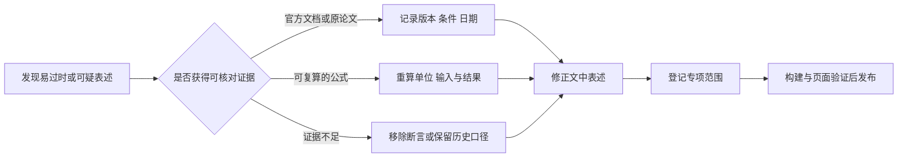

# 核验与更新记录

> 这里说明哪些知识被修正、依据是什么，以及哪些内容仍保留历史资料口径。复核日期只覆盖列出的范围；网页能访问、文章结构完整或刚刚发布，都不等于其中每一个事实已重新验证。

## 2026-09-26：准确性与新鲜度更新

本轮对原有 **56 页**进行目录、日期、引用与高风险表述筛查，再对价格、模型路由、容量计算、数据一致性及执行安全等重点内容做官方来源核对或算术复算。**这不是对全部历史细节、外链和性能数字的逐条认证**。逐页处理范围见下表；没有专项记录的页面不刷新历史复核日期。

### 修正了什么

| 主题 | 原问题 | 本轮处理 |
| --- | --- | --- |
| [Token 经济学](/ai/infra/inference/token-economics) | 旧模型价格、计费档位混用；算例被当作实际成本 | 更新 GPT-6、Opus 5.5、Gemini 3.8、DeepSeek V4.1 的条件快照；补齐缓存写、长度、峰谷与优惠截止；移除无证据的毛利和行业涨跌结论 |
| [GPU 选型](/ai/infra/inference/gpu-sizing) / [LLM 架构](/ai/models/llm) | KB/GB 与 KiB/GiB 混用；80GB 误作八卡整机；671GB 被认为可放入 640GB | 统一单位、复算 KV 与 MoE 容量；把理论带宽下限和可交付吞吐分开 |
| [语音生成](/ai/models/speech-gen) | 具体类名、版本与配图无法和所引 CosyVoice 来源对应 | 按 CosyVoice 2、F5-TTS、HiFi-GAN、BigVGAN 的公开资料重写，撤下无法确认来源的实现细节和配图 |
| [存储](/cloud/infra/storage) | 误称必须保留 EBS 快照链头；将随机 key 前缀推广到所有桶 | 依据 AWS 规则修正，补充 S3 条件写与目录桶的差异 |
| [数据库](/cloud/data/database) / [数据导读](/cloud/data/) | 半同步确认顺序错误、DynamoDB 被简单归为最终一致 | 修正提交与 ACK 顺序，补充 MREC/MRSC；明确 PostgreSQL 19 于 9 月 24 日仍为 Beta 4 |
| [Agent 框架](/ai/agent/frameworks) | 无统一依据的成熟度排序、比较表缺列 | 修复表格并移除排名推断；旧版本号明确标为原快照 |
| [大数据](/cloud/data/bigdata) / [Kubernetes](/cloud/native/kubernetes) | 端到端精确一次与延迟保证过度概括；弃用与移除混用 | 补齐 source/sink 条件和延迟边界；按官方规则区分活动分支、弃用与计划移除 |
| [直播编年](/chronicle/livestream) | IBM 收购 Ustream 的年份错误 | 按 IBM 年报改为 2016-01-21 |

其他专项纠错包括：CNN 等变性、CTC 时间戳、视觉 token、扩散模型的能力边界、视频 MoE 显存、vCPU 计量、安全组差异、RAG 索引与权限撤销，以及评测复现口径。

### 追加知识的判断

需要追加的重点是跨模块的执行与维护方法。本轮新增 **[Agent 安全与可靠执行](/ai/agent/security)**，连接 MCP 授权、提示注入、租户隔离、批准范围、幂等键和未知执行结果的对账流程；同时在 RAG 和评测篇补充知识更新、撤权失效及模型升级回归。

现有领域划分可以容纳这些知识，因此没有另建重复的“最新模型大全”或新的一级目录。价格集中到成本篇，版本与机制在对应文章说明。

## 如何理解复核状态

- **专项复核**：只覆盖本次列出的公式、功能、版本或表述，不表示整篇重审。
- **重写复核**：文章按本轮明确的来源和假设重新组织，不表示覆盖该领域所有最新产品。
- **筛查，未做专项复核**：检查了结构与高风险线索，尚未逐项向外部来源重新求证；原日期保留。
- **页面修订**：代码或文字修改时间，与事实核验是两个维度。

<!-- audit-table:start -->
## 逐页处理范围

| 页面 | 本轮状态 | 本轮范围 |
| --- | --- | --- |
| [关于](/about) | 专项修正与复核 | 内容复核范围与日期规则、更新记录入口 |
| [Agent 开发框架对比](/ai/agent/frameworks) | 专项修正与复核 | 框架比较表结构与无依据排名、MCP 授权和副作用恢复；版本号保留旧快照 |
| [Agent 编年史：从符号智能体到 OpenClaw 的七十年](/ai/agent/history) | 筛查，未做专项复核 | 历史事实与产品数字保留原日期，未宣称全部重新核验 |
| [智能体技术全景](/ai/agent/) | 专项修正与复核 | 补充 Agent 安全入口，移除无来源的 80% 覆盖率 |
| [Agent 安全与可靠执行](/ai/agent/security) | 本轮重写 / 新增 | MCP 2026-07-28 授权要求与安全边界；其余为明确标注的工程设计建议 |
| [大模型评测：从基准到生产监控](/ai/application/evaluation) | 专项修正与复核 | 移除无来源工具收益倍数，补充模型升级与安全回归口径 |
| [应用与评测](/ai/application/) | 筛查，未做专项复核 | 历史事实与产品数字保留原日期，未宣称全部重新核验 |
| [多模态应用](/ai/application/multimodal) | 筛查，未做专项复核 | 历史事实与产品数字保留原日期，未宣称全部重新核验 |
| [企业级 RAG 架构设计](/ai/application/rag-architecture) | 专项修正与复核 | 向量降维的存储口径、知识更新与权限撤销链路 |
| [人工智能：知识全景](/ai/) | 筛查，未做专项复核 | 历史事实与产品数字保留原日期，未宣称全部重新核验 |
| [GPU 集群与高速网络](/ai/infra/cluster) | 筛查，未做专项复核 | 历史事实与产品数字保留原日期，未宣称全部重新核验 |
| [AI 基础设施：总览](/ai/infra/) | 筛查，未做专项复核 | 历史事实与产品数字保留原日期，未宣称全部重新核验 |
| [GPU 选型与推理成本测算](/ai/infra/inference/gpu-sizing) | 专项修正与复核 | KV 单位与容量复算、A100 精度口径、MoE 与 TP 适用边界 |
| [推理与算力](/ai/infra/inference/) | 筛查，未做专项复核 | 历史事实与产品数字保留原日期，未宣称全部重新核验 |
| [大模型推理部署实战](/ai/infra/inference/llm-inference) | 专项修正与复核 | KV 单位、分页容量及 PD 分离传输算例 |
| [Token 经济学：定价与成本的数学](/ai/infra/inference/token-economics) | 本轮重写 / 新增 | API 计费快照、缓存算例、成本公式与适用边界 |
| [训练工程：从预训练到强化学习](/ai/infra/training) | 筛查，未做专项复核 | 历史事实与产品数字保留原日期，未宣称全部重新核验 |
| [语音识别与理解](/ai/models/audio) | 专项修正与复核 | CTC 时间戳适用边界与 TTS 互链说明 |
| [图像生成：从 Stable Diffusion 到 DiT 时代](/ai/models/image-gen) | 专项修正与复核 | 移除扩散多样性保证、唯一工业路线与可控性排他结论 |
| [模型与算法：总览](/ai/models/) | 筛查，未做专项复核 | 历史事实与产品数字保留原日期，未宣称全部重新核验 |
| [大语言模型架构解析](/ai/models/llm) | 专项修正与复核 | KV 与 MoE 容量算例、当前 OpenAI/Claude/Qwen/DeepSeek API 目录；其他历史参数未全量重核 |
| [机器学习与深度学习经典架构](/ai/models/ml-dl) | 专项修正与复核 | CNN 等变性与逻辑回归系数解释边界 |
| [语音生成](/ai/models/speech-gen) | 本轮重写 / 新增 | CosyVoice 2、F5-TTS、HiFi-GAN 与 BigVGAN 的公开架构；服务与评测为工程建议 |
| [视频生成：时空建模的技术线](/ai/models/video-gen) | 专项修正与复核 | 去噪阶段 MoE 的激活计算与权重显存分离 |
| [视觉理解：从 CLIP 到原生多模态](/ai/models/vision) | 专项修正与复核 | ViT 归纳偏置、视觉 token 路线和训练成本边界 |
| [AI 大模型时代](/chronicle/ai-era) | 筛查，未做专项复核 | 历史事实与产品数字保留原日期，未宣称全部重新核验 |
| [区块链时代](/chronicle/blockchain) | 筛查，未做专项复核 | 历史事实与产品数字保留原日期，未宣称全部重新核验 |
| [十年六浪：从移动互联网到 AI 大模型](/chronicle/) | 筛查，未做专项复核 | 历史事实与产品数字保留原日期，未宣称全部重新核验 |
| [直播时代](/chronicle/livestream) | 专项修正与复核 | IBM 收购 Ustream 的日期；其他行业数字保留原统计期 |
| [元宇宙时代](/chronicle/metaverse) | 筛查，未做专项复核 | 历史事实与产品数字保留原日期，未宣称全部重新核验 |
| [移动互联网时代](/chronicle/mobile-internet) | 筛查，未做专项复核 | 历史事实与产品数字保留原日期，未宣称全部重新核验 |
| [短视频时代](/chronicle/short-video) | 筛查，未做专项复核 | 历史事实与产品数字保留原日期，未宣称全部重新核验 |
| [暗流：信创与国产化](/chronicle/xinchuang) | 筛查，未做专项复核 | 历史事实与产品数字保留原日期，未宣称全部重新核验 |
| [FinOps：云成本治理](/cloud/architecture/finops) | 筛查，未做专项复核 | 历史事实与产品数字保留原日期，未宣称全部重新核验 |
| [导读：架构与治理知识框架](/cloud/architecture/) | 筛查，未做专项复核 | 历史事实与产品数字保留原日期，未宣称全部重新核验 |
| [云迁移与现代化](/cloud/architecture/migration) | 筛查，未做专项复核 | 历史事实与产品数字保留原日期，未宣称全部重新核验 |
| [可靠性与灾备](/cloud/architecture/reliability-dr) | 筛查，未做专项复核 | 历史事实与产品数字保留原日期，未宣称全部重新核验 |
| [安全与身份治理](/cloud/architecture/security-governance) | 筛查，未做专项复核 | 历史事实与产品数字保留原日期，未宣称全部重新核验 |
| [卓越架构：从原则到持续评审](/cloud/architecture/well-architected) | 筛查，未做专项复核 | 历史事实与产品数字保留原日期，未宣称全部重新核验 |
| [大数据体系](/cloud/data/bigdata) | 专项修正与复核 | 流处理端到端精确一次与可见延迟边界 |
| [数据库选型](/cloud/data/database) | 专项修正与复核 | 半同步提交顺序、副本与备份、DynamoDB 一致性与 CAP 边界 |
| [导读：数据库·大数据知识框架](/cloud/data/) | 专项修正与复核 | PostgreSQL 19 Beta 4 状态、一致性与湖格式兼容边界 |
| [OLAP 引擎：谱系机制拆解与选型工程](/cloud/data/olap) | 专项修正与复核 | 收窄湖格式互操作结论，移除未经验证的通用兼容推断 |
| [导读：云计算基座知识框架](/cloud/foundation/) | 筛查，未做专项复核 | 历史事实与产品数字保留原日期，未宣称全部重新核验 |
| [OpenStack 架构与十年演进](/cloud/foundation/openstack) | 筛查，未做专项复核 | 历史事实与产品数字保留原日期，未宣称全部重新核验 |
| [SDN / NFV：云网络的软件化](/cloud/foundation/sdn-nfv) | 筛查，未做专项复核 | 历史事实与产品数字保留原日期，未宣称全部重新核验 |
| [虚拟化与 KVM](/cloud/foundation/virtualization) | 专项修正与复核 | 纠正虚拟机逃逸必须突破两层的错误保证 |
| [云计算：知识全景](/cloud/) | 筛查，未做专项复核 | 历史事实与产品数字保留原日期，未宣称全部重新核验 |
| [弹性计算](/cloud/infra/compute) | 专项修正与复核 | vCPU 计量边界与无证据的固定节省比例 |
| [导读：计算·存储·网络知识框架](/cloud/infra/) | 筛查，未做专项复核 | 历史事实与产品数字保留原日期，未宣称全部重新核验 |
| [云网络](/cloud/infra/network) | 专项修正与复核 | 区分阿里云与 AWS 安全组的规则模型 |
| [云存储](/cloud/infra/storage) | 专项修正与复核 | EBS 快照删除、S3 前缀与条件写语义；其余报价保留原快照日期 |
| [导读：云原生知识框架](/cloud/native/) | 筛查，未做专项复核 | 历史事实与产品数字保留原日期，未宣称全部重新核验 |
| [Kubernetes 核心机制与企业级落地](/cloud/native/kubernetes) | 专项修正与复核 | 受支持分支、计划与已发布的区别、IPVS 弃用时间线 |
| [微服务治理](/cloud/native/microservice) | 筛查，未做专项复核 | 历史事实与产品数字保留原日期，未宣称全部重新核验 |
| [可观测体系](/cloud/native/observability) | 筛查，未做专项复核 | 历史事实与产品数字保留原日期，未宣称全部重新核验 |
| [云与 AI 知识体系](/) | 筛查，未做专项复核 | 历史事实与产品数字保留原日期，未宣称全部重新核验 |
| [核验与更新记录](/updates) | 核验记录 | 本轮修正清单、资料范围与逐页处理状态 |
<!-- audit-table:end -->

## 仍需怎样使用历史资料

框架小版本、GPU 现货与租金、基准榜单、产品功能矩阵和政策统计是持续变化的。本文未标为已重核的数字仍按原资料日期使用；进入采购、迁移或生产决策前，应再次核对具体版本与地区。历史编年不因今天发布而改成今天的统计值。

## 主要核验来源

<Refs>

访问日期：2026-09-26。正文的具体修正旁同时保留来源链接。

- [OpenAI API 价格](https://developers.openai.com/api/docs/pricing) · [Claude 价格](https://platform.claude.com/docs/en/about-claude/pricing) · [Gemini 价格](https://ai.google.dev/gemini-api/docs/pricing) · [DeepSeek 模型与价格](https://api-docs.deepseek.com/quick_start/pricing/)
- [百炼 Qwen3.8-Max 模型说明](https://help.aliyun.com/en/model-studio/qwen3-8-max)
- [NVIDIA A100 规格](https://www.nvidia.com/en-us/data-center/a100/) · [推理优化说明](https://developer.nvidia.com/blog/mastering-llm-techniques-inference-optimization/)
- [EBS 删除快照](https://docs.aws.amazon.com/ebs/latest/userguide/ebs-deleting-snapshot.html) · [S3 条件写](https://docs.aws.amazon.com/us_en/AmazonS3/latest/userguide/conditional-writes.html) · [DynamoDB 一致性](https://docs.aws.amazon.com/amazondynamodb/latest/developerguide/HowItWorks.ReadConsistency.html)
- [MySQL 半同步等待点](https://dev.mysql.com/doc/refman/8.0/en/replication-options-source.html) · [PostgreSQL 19 Beta 4 公告](https://www.postgresql.org/about/news/postgresql-19-beta-4-released-3386/)
- [Kubernetes 发布](https://kubernetes.io/releases/) · [代理模式](https://kubernetes.io/docs/reference/networking/virtual-ips/) · [Flink 容错](https://nightlies.apache.org/flink/flink-docs-stable/docs/learn-flink/fault_tolerance/)
- [MCP 授权](https://modelcontextprotocol.io/specification/2026-07-28/basic/authorization) · [OWASP 提示注入](https://genai.owasp.org/llmrisk/llm01-prompt-injection/)
- [CosyVoice 2](https://arxiv.org/abs/2412.10117) · [F5-TTS](https://arxiv.org/abs/2410.06885) · [HiFi-GAN](https://arxiv.org/abs/2010.05646) · [BigVGAN](https://arxiv.org/abs/2206.04658)
- [IBM 年报中的 Ustream 收购记录](https://www.ibm.com/investor/att/pdf/IBM_Annual_Report_2015.pdf)

</Refs>
