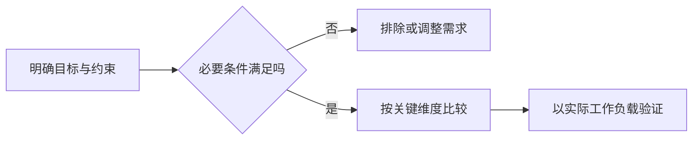

<!-- 用途：从本模板复制并按主题修改；不要保留占位文字。完整正文需实际来源、互链与有判断意义的 Mermaid。日期只在对应内容实际核验后填写；实践必须区分示例步骤与真实执行结果。文章标题后直接进入正文，不添加导读卡。 -->

# 比较标题

> 说明谁需要决策、哪些候选可比，以及比较所采用的目标和边界。

## 选择问题与比较口径

明确工作负载、团队约束、部署环境和适用时间。不同层次的技术不强行放入同一排名。

## 机制差异与选择路径

先解释产生差异的机制，再提出编辑建议；区分公开事实、来源观点和待验证假设。

## 对照与取舍

| 维度 | 方案 A | 方案 B | 对决策的影响 |
| --- | --- | --- | --- |
| 比较条件 | 有依据的说明 | 相同口径说明 | 适用边界与验证方法 |

价格、版本与功能矩阵标注实际核验时间、地区和口径；无依据的星级或“最好”结论删除。

## 如何验证与何时重选

给出需要采集的证据和验证范围，解释条件变化时怎样重新决策。

## 参考资料

<Refs>

- [方案 A 官方资料](https://)（实际访问日期）
- [方案 B 官方资料](https://)（实际访问日期）
- 站内相关：[原理主文](/domain/page)

</Refs>
