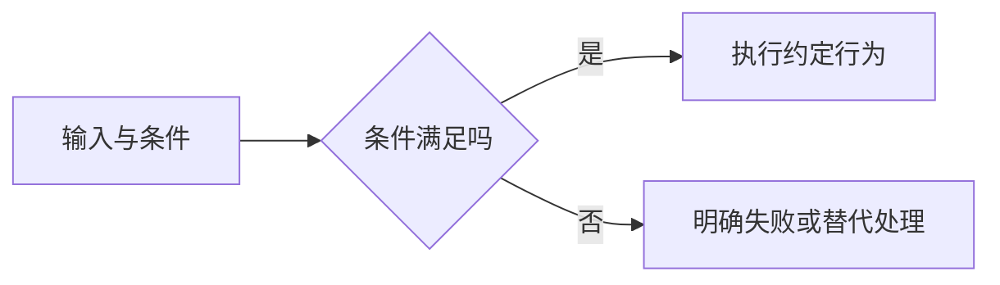

<!-- 用途：从本模板复制并按主题修改；不要保留占位文字。完整正文需实际来源、互链与有判断意义的 Mermaid。日期只在对应内容实际核验后填写；实践必须区分示例步骤与真实执行结果。不要重复 PageGuide。 -->

# 概念标题

> 说明读者、要解决的困惑与读后能作出的判断。

## 定义与边界

先解释准确含义和易混概念；类比后补充真实机制与适用边界。

## 机制与判断

用输入、状态、输出及关键约束解释行为，图中的条件必须对应正文。

## 实践选择

| 情况 | 判断依据 | 选择及边界 |
| --- | --- | --- |
| 示例情况 | 可检查的证据 | 解释为何适用 |

## 失败模式与排查

用现象、原因与验证动作组织，避免只有“注意”而没有方法。

## 参考资料

<Refs>

- [实际一手来源](https://)（实际访问日期）
- 站内相关：[对应主文](/domain/page)

</Refs>
