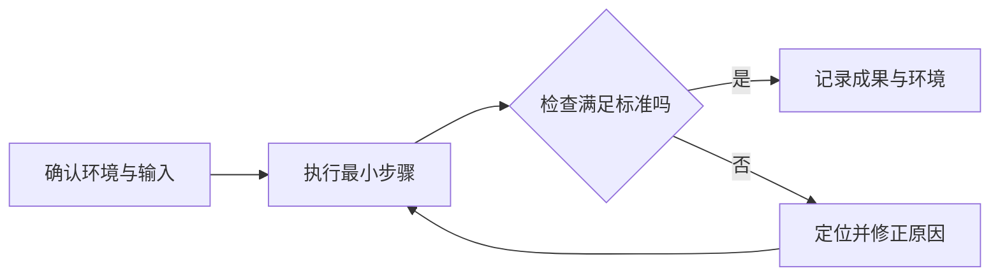

<!-- 用途：从本模板复制并按主题修改；不要保留占位文字。完整正文需实际来源、互链与有判断意义的 Mermaid。日期只在对应内容实际核验后填写；实践必须区分示例步骤与真实执行结果。不要重复 PageGuide。 -->

# 实践标题

> 说明目标读者、完成后的成果及必要环境；指出步骤是教学示例还是已实际执行的验证。

## 目标与准备条件

列出输入、环境、权限、版本范围和成功标准；示例数据应公开或虚构。

## 执行与检查

每步连接操作目的、预期观察与失败后的判断。命令注明工作目录和适用平台。

## 验收记录

| 验证项 | 方法与预期 | 实际结果 | 局限 |
| --- | --- | --- | --- |
| 示例项 | 可复现条件 | 未执行时明确写“未验证” | 说明未覆盖范围 |

不要把示例输出或预期结果写成实际测试结果。

## 失败处理与恢复

说明怎样收集证据、限制影响、重试或回退；涉及不可逆动作时解释后果。

## 参考资料

<Refs>

- [对应版本的官方资料](https://)（实际访问日期）
- 站内相关：[机制主文](/domain/page)

</Refs>
