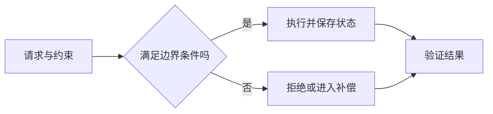

<!-- 用途：从本模板复制并按主题修改；不要保留占位文字。完整正文需实际来源、互链与有判断意义的 Mermaid。日期只在对应内容实际核验后填写；实践必须区分示例步骤与真实执行结果。不要重复 PageGuide。 -->

# 专题标题

> 说明适用读者、专题问题、必要前置知识和可带走的判断框架。

## 问题、约束与范围

说明需要优化什么、不可牺牲什么，以及相邻领域由哪些主文承担。

## 架构与关键机制

围绕边界、状态和失败解释机制，图上呈现决策后果。

## 工程实践与选择

| 决策 | 适用条件 | 代价 | 验证方法 |
| --- | --- | --- | --- |
| 候选方案 | 明确前提 | 资源与维护成本 | 可核查证据 |

## 失败模式与演进边界

解释故障、迁移、兼容或规模变化怎样影响选择；产品和版本差异须实际核验。

## 参考资料

<Refs>

- [官方文档、规范或原始论文](https://)（实际访问日期）
- 站内相关：[相邻专题](/domain/page)

</Refs>
